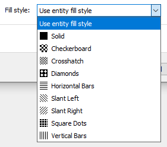
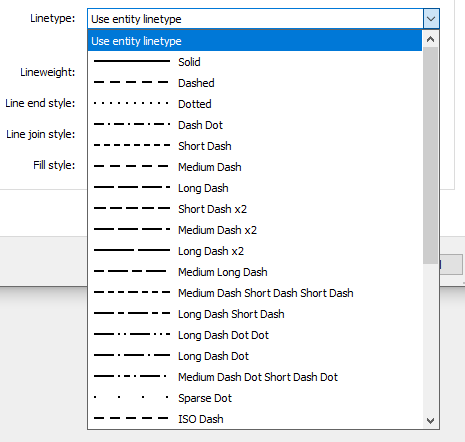
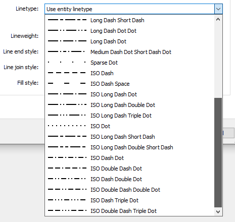

.. _plot_style_files:

Plot Style Files (CTB/STB)
==========================

CTB and STB files store plot styles used by AutoCAD and BricsCAD for printing and plotting.

If the plot style table is attached to a :class:`~ezdxf.layouts.Paperspace` or the :class:`~ezdxf.layouts.Modelspace`,
a change of a plot style affects any object that uses that plot style. CTB files contain color dependent plot
style tables, STB files contain named plot style tables.

.. seealso::

    - `Using plot style tables in AutoCAD`_
    - `AutoCAD Plot Style Table Editor`_
    - `BricsCAD Plot Style Table Editor`_
    - AUTODESK KNOWLEDGE NETWORK: How to `install`_ CTB files in AutoCAD

.. module:: ezdxf.addons.acadctb

.. autofunction:: load

.. autofunction:: new_ctb

.. autofunction:: new_stb

ColorDependentPlotStyles
------------------------

Color dependent plot style table (CTB file), table entries are :class:`PlotStyle` objects.

.. class:: ColorDependentPlotStyles

    .. attribute:: description

        Custom description of plot style file.

    .. attribute:: scale_factor

        Specifies the factor by which to scale non-ISO linetypes and fill patterns.

    .. attribute:: apply_factor

        Specifies whether or not you want to apply the :attr:`scale_factor`.

    .. attribute:: custom_lineweight_display_units

        Set ``1`` for showing lineweight in inch in AutoCAD CTB editor window, but lineweights are always defined in
        millimeters.

    .. attribute:: lineweights

        Lineweights table as :class:`array.array`

    .. automethod:: __getitem__

    .. automethod:: __iter__

    .. automethod:: new_style

    .. automethod:: get_lineweight

    .. automethod:: get_lineweight_index

    .. automethod:: get_table_lineweight

    .. automethod:: set_table_lineweight

    .. method:: save

        Save CTB file as `filename` to the file system.

    .. method:: write(stream: BinaryIO) -> None

        Compress and write CTB file to binary `stream`.

NamedPlotStyles
---------------

Named plot style table (STB file), table entries are :class:`PlotStyle` objects.

.. class:: NamedPlotStyles

    .. attribute:: description

        Custom description of plot style file.

    .. attribute:: scale_factor

        Specifies the factor by which to scale non-ISO linetypes and fill patterns.

    .. attribute:: apply_factor

        Specifies whether or not you want to apply the :attr:`scale_factor`.

    .. attribute:: custom_lineweight_display_units

        Set ``1`` for showing lineweight in inch in AutoCAD CTB editor window, but lineweights are always defined in
        millimeters.

    .. attribute:: lineweights

        Lineweights table as :class:`array.array`

    .. automethod:: __getitem__

    .. automethod:: __delitem__

    .. automethod:: __iter__

    .. automethod:: new_style

    .. automethod:: get_lineweight

    .. automethod:: get_lineweight_index

    .. automethod:: get_table_lineweight

    .. automethod:: set_table_lineweight

    .. method:: save

        Save STB file as `filename` to the file system.

    .. method:: write

        Compress and write STB file to binary `stream`.

PlotStyle
---------

.. class:: PlotStyle

    .. attribute:: index

        Table index (0-based). (int)

    .. autoattribute:: aci

    .. attribute:: description

        Custom description of plot style. (str)

    .. attribute:: physical_pen_number

        Specifies physical plotter pen, valid range from ``1`` to ``32`` or :attr:`AUTOMATIC`. (int)

    .. attribute:: virtual_pen_number

        Only used by non-pen plotters and only if they are configured for virtual pens. valid range from ``1`` to
        ``255`` or :attr:`AUTOMATIC`. (int)

    .. attribute:: screen

        Specifies the color intensity of the plot on the paper, valid range is from ``0`` to ``100``. (int)

        If you select ``100`` the drawing will plotted with its full color intensity. In order for screening to work,
        the :attr:`dithering` option must be active.

    .. attribute:: linetype

        Overrides the entity linetype, default value is :attr:`OBJECT_LINETYPE`. (bool)

    .. attribute:: adaptive_linetype

        ``True`` if a complete linetype pattern is more important than a correct linetype scaling,
        default is ``True``. (bool)

    .. attribute:: linepattern_size

        Line pattern size, default = ``0.5``. (float)

    .. attribute:: lineweight

        Overrides the entity lineWEIGHT, default value is :attr:`OBJECT_LINEWEIGHT`. This is an index into the
        :attr:`UserStyles.lineweights` table. (int)

    .. attribute:: end_style

        Line end cap style, see table below, default is :attr:`END_STYLE_OBJECT` (int)

    .. attribute:: join_style

        Line join style, see table below, default is :attr:`JOIN_STYLE_OBJECT` (int)

    .. attribute:: fill_style

        Line fill style, see table below, default is :attr:`FILL_STYLE_OBJECT` (int)

    .. autoattribute:: dithering

    .. autoattribute:: grayscale

Default Line Weights
--------------------

=== ======
#   [mm]
=== ======
0   0.00
1   0.05
2   0.09
3   0.10
4   0.13
5   0.15
6   0.18
7   0.20
8   0.25
9   0.30
10  0.35
11  0.40
12  0.45
13  0.50
14  0.53
15  0.60
16  0.65
17  0.70
18  0.80
19  0.90
20  1.00
21  1.06
22  1.20
23  1.40
24  1.58
25  2.00
26  2.11
=== ======

Predefined Values
-----------------

.. attribute:: AUTOMATIC

.. attribute:: OBJECT_LINEWEIGHT

.. attribute:: OBJECT_LINETYPE

.. attribute:: OBJECT_COLOR

.. attribute:: OBJECT_COLOR2

Line End Style
--------------

.. image:: gfx/ctb_line_end_style.png
   :align: center

=========================== =================================
END_STYLE_BUTT               ``0``
END_STYLE_SQUARE             ``1``
END_STYLE_ROUND              ``2``
END_STYLE_DIAMOND            ``3``
END_STYLE_OBJECT             ``4``
=========================== =================================

Line Join Style
---------------

.. image:: gfx/ctb_line_join_style.png
   :align: center

=========================== =================================
JOIN_STYLE_MITER             ``0``
JOIN_STYLE_BEVEL             ``1``
JOIN_STYLE_ROUND             ``2``
JOIN_STYLE_DIAMOND           ``3``
JOIN_STYLE_OBJECT            ``5``
=========================== =================================

Fill Style
----------

=========================== =================================
FILL_STYLE_SOLID            ``64``
FILL_STYLE_CHECKERBOARD     ``65``
FILL_STYLE_CROSSHATCH       ``66``
FILL_STYLE_DIAMONDS         ``67``
FILL_STYLE_HORIZONTAL_BARS  ``68``
FILL_STYLE_SLANT_LEFT       ``69``
FILL_STYLE_SLANT_RIGHT      ``70``
FILL_STYLE_SQUARE_DOTS      ``71``
FILL_STYLE_VERICAL_BARS     ``72``
FILL_STYLE_OBJECT           ``73``
=========================== =================================

Linetypes
---------

=================================== ====================
Linetype name                       Value
=================================== ====================
Solid                               0
Dashed                              1
Dotted                              2
Dash Dot                            3
Short Dash                          4
Medium Dash                         5
Long Dash                           6
Short Dash x2                       7
Medium Dash x2                      8
Long Dash x2                        9
Medium Lang Dash                    10
Medium Dash Short Dash Short Dash   11
Long Dash Short Dash                12
Long Dash Dot Dot                   13
Long Dash Dot                       14
Medium Dash Dot Short Dash Dot      15
Sparse Dot                          16
ISO Dash                            17
ISO Dash Space                      18
ISO Long Dash Dot                   19
ISO Long Dash Double Dot            20
ISO Long Dash Triple Dot            21
ISO Dot                             22
ISO Long Dash Short Dash            23
ISO Long Dash Double Short Dash     24
ISO Dash Dot                        25
ISO Double Dash Dot                 26
ISO Dash Double Dot                 27
ISO Double Dash Double Dot          28
ISO Dash Triple Dot                 29
ISO Double Dash Triple Dot          30
Use entity linetype                 31
=================================== ====================

.. _install: https://knowledge.autodesk.com/support/autocad/learn-explore/caas/sfdcarticles/sfdcarticles/How-to-insert-a-CTB-or-STB-file-from-another-end-user-in-your-DWG-file.html

.. _AutoCAD Plot Style Table Editor: https://knowledge.autodesk.com/support/autocad-lt/learn-explore/caas/CloudHelp/cloudhelp/2019/ENU/AutoCAD-LT/files/GUID-56184373-FC19-49A0-9E67-181C4F5C19B7-htm.html

.. _BricsCAD Plot Style Table Editor: https://help.bricsys.com/hc/en-us/articles/360006617933-The-Plot-Style-Table-editor

.. _Using plot style tables in AutoCAD: https://knowledge.autodesk.com/support/autocad-lt/learn-explore/caas/sfdcarticles/sfdcarticles/Use-plot-style-tables.html

