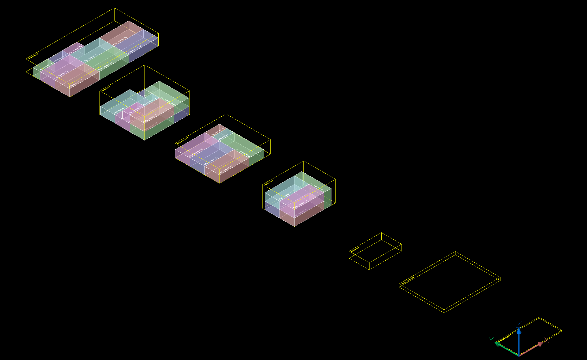

.. _bin_packing:

Bin-Packing Add-on
==================

.. module:: ezdxf.addons.binpacking

This add-on is based on the 3D bin packing module `py3dbp`_ hosted on `PyPI`_.
Both sources of this package are MIT licensed like `ezdxf` itself.

The Bin Packing Problem
-----------------------

Quote from the `Wikipedia`_ article:

    The bin packing problem is an optimization problem, in which items of different
    sizes must be packed into a finite number of bins or containers, each of a fixed
    given capacity, in a way that minimizes the number of bins used.

Example
-------

This code replicates the example used by the `py3dbp`_ package:

.. code-block:: python

    from typing import List
    import ezdxf
    from ezdxf import colors
    from ezdxf.addons import binpacking as bp

    SMALL_ENVELOPE = ("small-envelope", 11.5, 6.125, 0.25, 10)
    LARGE_ENVELOPE = ("large-envelope", 15.0, 12.0, 0.75, 15)
    SMALL_BOX = ("small-box", 8.625, 5.375, 1.625, 70.0)
    MEDIUM_BOX = ("medium-box", 11.0, 8.5, 5.5, 70.0)
    MEDIUM_BOX2 = ("medium-box-2", 13.625, 11.875, 3.375, 70.0)
    LARGE_BOX = ("large-box", 12.0, 12.0, 5.5, 70.0)
    LARGE_BOX2 = ("large-box-2", 23.6875, 11.75, 3.0, 70.0)

    ALL_BINS = [
        SMALL_ENVELOPE,
        LARGE_ENVELOPE,
        SMALL_BOX,
        MEDIUM_BOX,
        MEDIUM_BOX2,
        LARGE_BOX,
        LARGE_BOX2,
    ]

    def build_packer():
        packer = bp.Packer()
        packer.add_item("50g [powder 1]", 3.9370, 1.9685, 1.9685, 1)
        packer.add_item("50g [powder 2]", 3.9370, 1.9685, 1.9685, 2)
        packer.add_item("50g [powder 3]", 3.9370, 1.9685, 1.9685, 3)
        packer.add_item("250g [powder 4]", 7.8740, 3.9370, 1.9685, 4)
        packer.add_item("250g [powder 5]", 7.8740, 3.9370, 1.9685, 5)
        packer.add_item("250g [powder 6]", 7.8740, 3.9370, 1.9685, 6)
        packer.add_item("250g [powder 7]", 7.8740, 3.9370, 1.9685, 7)
        packer.add_item("250g [powder 8]", 7.8740, 3.9370, 1.9685, 8)
        packer.add_item("250g [powder 9]", 7.8740, 3.9370, 1.9685, 9)
        return packer

    def make_doc():
        doc = ezdxf.new()
        doc.layers.add("FRAME", color=colors.YELLOW)
        doc.layers.add("ITEMS")
        doc.layers.add("TEXT")
        return doc

    def main(filename):
        bins: List[bp.Bin] = []
        for box in ALL_BINS:
            packer = build_packer()
            packer.add_bin(*box)
            packer.pack(bp.PickStrategy.BIGGER_FIRST)
            bins.extend(packer.bins)
        doc = make_doc()
        bp.export_dxf(doc.modelspace(), bins, offset=(0, 20, 0))
        doc.saveas(filename)

    if __name__ == "__main__":
        main("py3dbp_example.dxf")

.. seealso::

    - `example1`_ script
    - `example2`_ script

Packer Classes
--------------

.. autoclass:: AbstractPacker

    .. attribute:: bins

        List of containers to fill.

    .. attribute:: items

        List of items to pack into the :attr:`bins`.

    .. autoproperty:: is_packed

    .. autoproperty:: unfitted_items

    .. automethod:: __str__

    .. automethod:: append_bin

    .. automethod:: append_item

    .. automethod:: get_fill_ratio

    .. automethod:: get_capacity

    .. automethod:: get_total_weight

    .. automethod:: get_total_volume

    .. automethod:: pack

Packer
~~~~~~

.. autoclass:: Packer

    .. automethod:: add_bin

    .. automethod:: add_item

FlatPacker
~~~~~~~~~~

.. autoclass:: FlatPacker

    .. automethod:: add_bin

    .. automethod:: add_item

Bin Classes
-----------

.. autoclass:: Bin

    .. attribute:: name

        Name of then container as string.

    .. attribute:: width

    .. attribute:: height

    .. attribute:: depth

    .. attribute:: max_weight

    .. autoproperty:: is_empty

    .. automethod:: __str__

    .. automethod:: copy

    .. automethod:: reset

    .. automethod:: put_item

    .. automethod:: get_capacity

    .. automethod:: get_total_weight

    .. automethod:: get_total_volume

    .. automethod:: get_fill_ratio

Box Class
~~~~~~~~~

.. autoclass:: Box

Envelope Class
~~~~~~~~~~~~~~

.. autoclass:: Envelope

Item Class
~~~~~~~~~~

.. autoclass:: Item

    .. attribute:: payload

        Arbitrary Python object.

    .. attribute:: width

    .. attribute:: height

    .. attribute:: depth

    .. attribute:: weight

    .. autoproperty:: bbox

    .. autoproperty:: rotation_type

    .. autoproperty:: position

    .. automethod:: copy

    .. automethod:: __str__

    .. automethod:: get_volume

    .. automethod:: get_dimension

    .. automethod:: get_transformation

FlatItem Class
~~~~~~~~~~~~~~

.. autoclass:: FlatItem

Functions
---------

.. autofunction:: shuffle_pack

Enums
-----

RotationType
~~~~~~~~~~~~

.. autoclass:: RotationType

    .. attribute:: WHD

    .. attribute:: HWD

    .. attribute:: HDW

    .. attribute:: DHW

    .. attribute:: DWH

    .. attribute:: WDH

PickStrategy
~~~~~~~~~~~~

.. autoclass:: PickStrategy

    .. attribute:: BIGGER_FIRST

    .. attribute:: SMALLER_FIRST

    .. attribute:: SHUFFLE

Credits
-------

    - `py3dbp`_ package by Enzo Ruiz Pelaez
    - `bp3d`_ by `gedex` - github repository on which `py3dbp`_ is based, written in Go
    - Optimizing three-dimensional bin packing through simulation (`PDF`_)

.. _py3dbp: https://github.com/enzoruiz/3dbinpacking
.. _bp3d: https://github.com/gedex/bp3d
.. _PyPI: https://pypi.org/project/py3dbp/
.. _Wikipedia: https://en.wikipedia.org/wiki/Bin_packing_problem
.. _example1: https://github.com/mozman/ezdxf/blob/master/examples/addons/binpacking.py
.. _example2: https://github.com/mozman/ezdxf/blob/master/examples/addons/binpacking2.py
.. _PDF: https://github.com/enzoruiz/3dbinpacking/blob/master/erick_dube_507-034.pdf