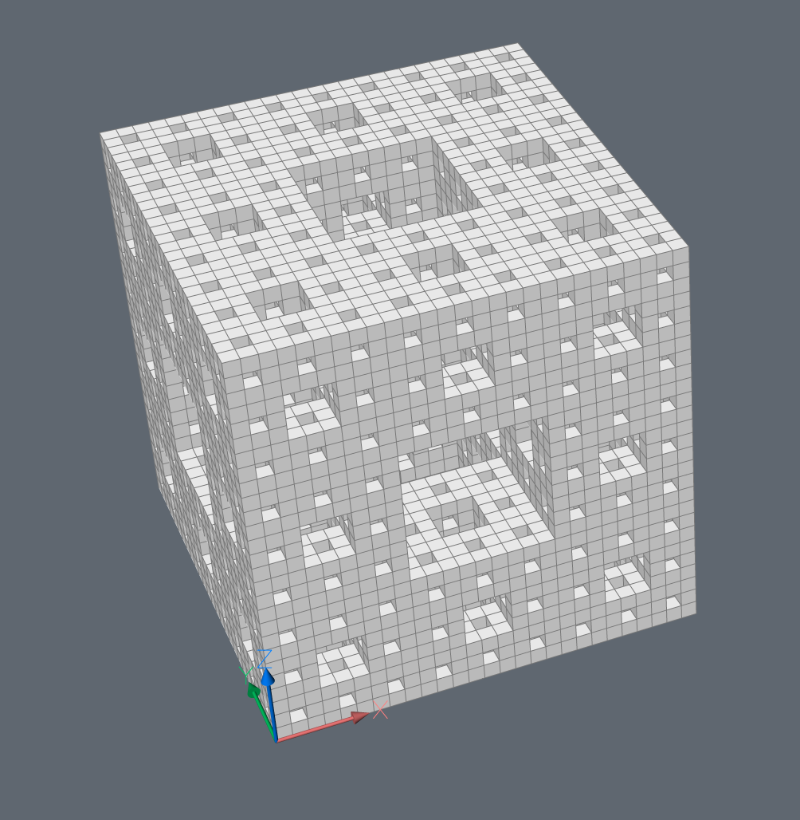
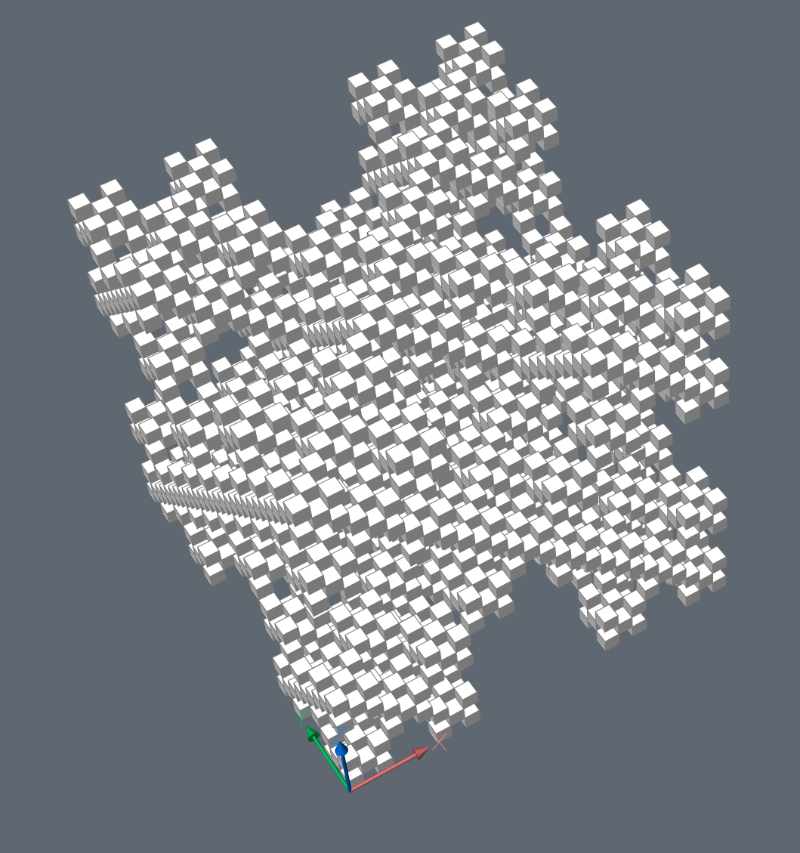
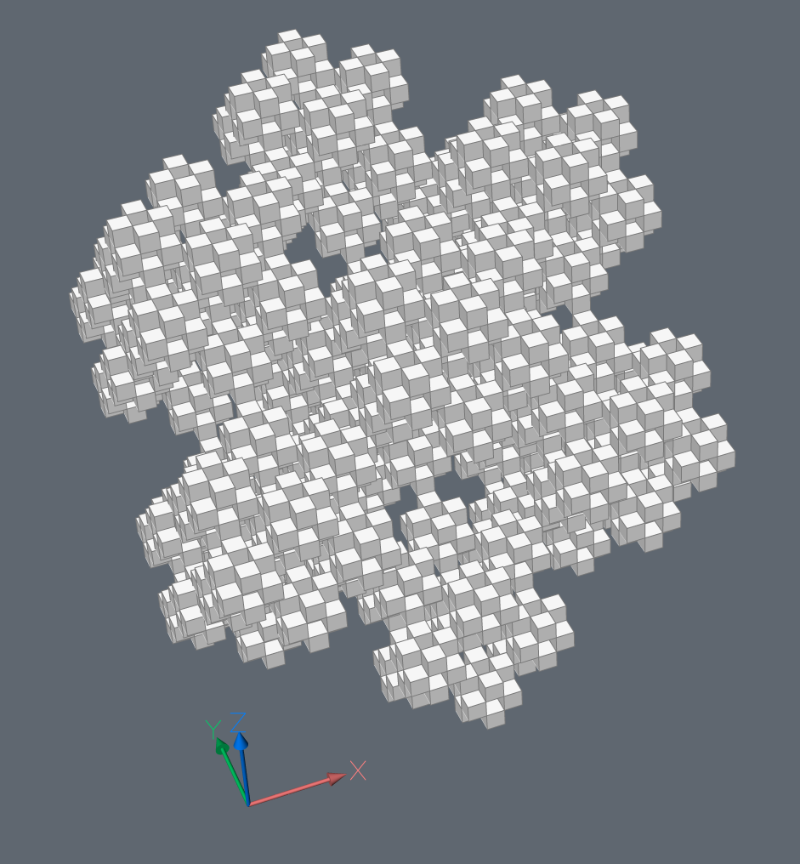
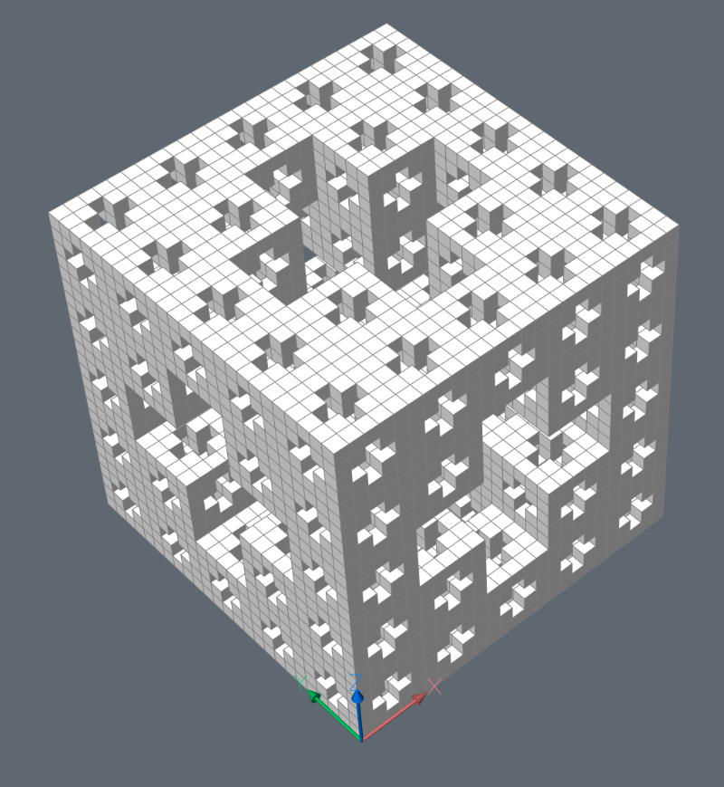
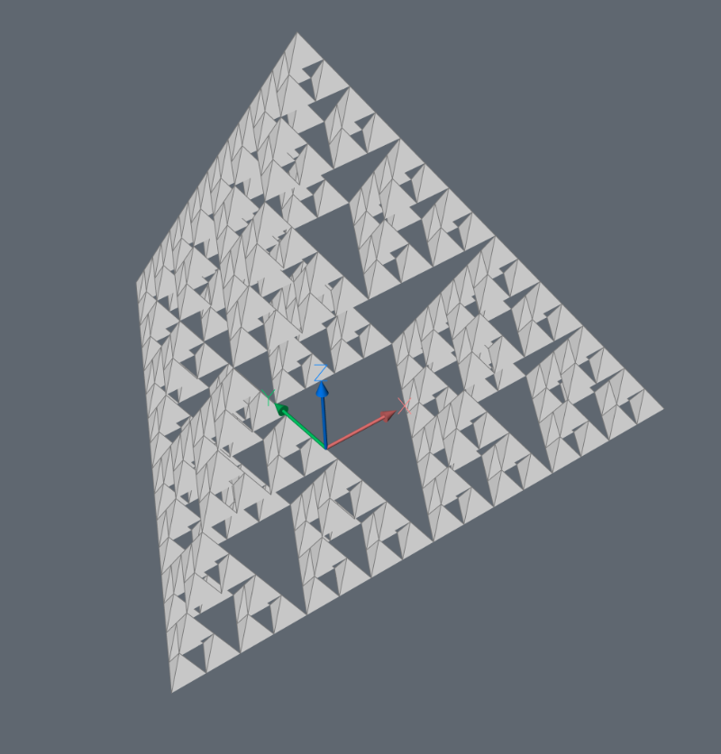
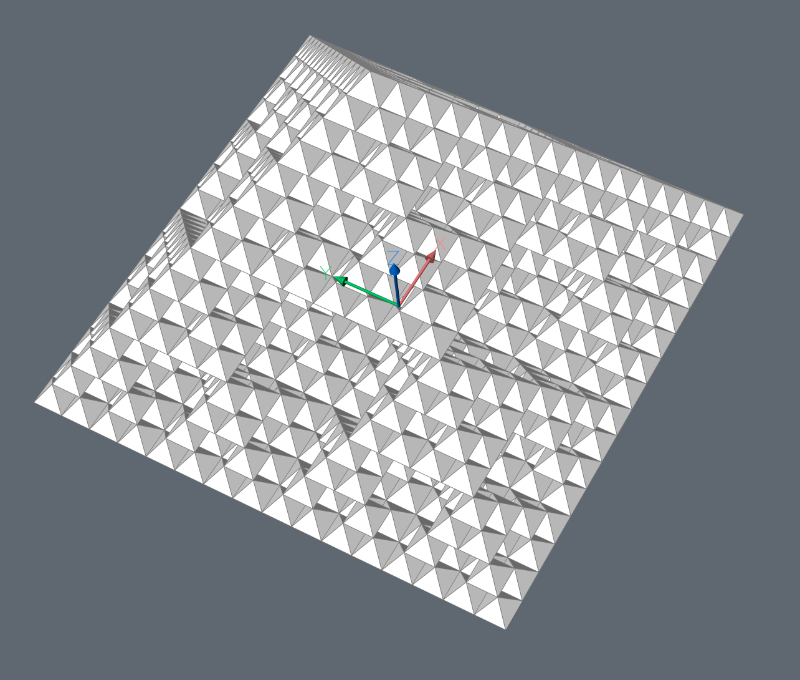

.. module:: ezdxf.addons
    :noindex:

Showcase Forms
==============

MengerSponge
------------

Build a 3D `Menger sponge <https://en.wikipedia.org/wiki/Menger_sponge>`_.

.. autoclass:: MengerSponge

    .. automethod:: MengerSponge.render

    .. automethod:: MengerSponge.cubes

    .. automethod:: MengerSponge.mesh

Menger Sponge ``kind=0``:

Menger Sponge ``kind=1``:

Menger Sponge ``kind=2``:

Jerusalem Cube ``kind=3``:

SierpinskyPyramid
-----------------

Build a 3D `Sierpinsky Pyramid <https://en.wikipedia.org/wiki/Sierpinski_triangle>`_.

.. autoclass:: SierpinskyPyramid

    .. automethod:: SierpinskyPyramid.render

    .. automethod:: SierpinskyPyramid.pyramids

    .. automethod:: SierpinskyPyramid.mesh

Sierpinsky Pyramid with triangle base:

Sierpinsky Pyramid with square base:

