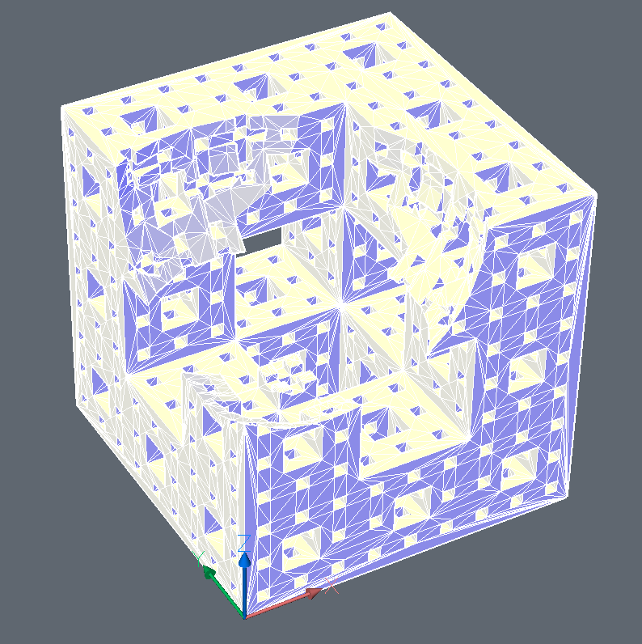

.. module:: ezdxf.addons.openscad

OpenSCAD
========

.. versionadded:: 0.18

Interface to the `OpenSCAD`_ application to apply boolean operations to
:class:`~ezdxf.render.MeshBuilder` objects. For more information about boolean
operations read the documentation of `OpenSCAD`_. The `OpenSCAD`_ application is
not bundled with `ezdxf`, you need to install the application yourself.

Example:

.. code-block:: Python

    import ezdxf
    from ezdxf.render import forms
    from ezdxf.addons import MengerSponge, openscad

    doc = ezdxf.new()
    msp = doc.modelspace()

    # 1. create the meshes:
    sponge = MengerSponge(level=3).mesh()
    sponge.flip_normals()  # important for OpenSCAD
    sphere = forms.sphere(
        count=32, stacks=16, radius=0.5, quads=True
    ).translate(0.25, 0.25, 1)
    sphere.flip_normals()  # important for OpenSCAD

    # 2. create the script:
    script = openscad.boolean_operation(openscad.DIFFERENCE, sponge, sphere)

    # 3. execute the script by OpenSCAD:
    result = openscad.run(script)

    # 4. render the MESH entity:
    result.render_mesh(msp)

    doc.set_modelspace_vport(6, center=(5, 0))
    doc.saveas("OpenSCAD.dxf")

Functions
---------

.. autofunction:: run

.. autofunction:: boolean_operation

.. autofunction:: is_installed

.. class:: Script

    Helper class to build OpenSCAD scripts.

    .. automethod:: add

    .. automethod:: add_mirror

    .. automethod:: add_multmatrix

    .. automethod:: add_polyhedron

    .. automethod:: add_resize

    .. automethod:: add_rotate

    .. automethod:: add_rotate_about_axis

    .. automethod:: add_scale

    .. automethod:: add_translate

    .. automethod:: get_string

Boolean Operation Constants
---------------------------

.. attribute:: UNION

.. attribute:: DIFFERENCE

.. attribute:: INTERSECTION

openpyscad
----------

This add-on is not a complete wrapper around `OpenSCAD`_, if you need such a
tool look at the `openpyscad`_ or `pysolid`_ packages at PyPI.

Not sure if the `openpyscad`_ package is still maintained, the last commit at
`github <https://github.com/taxpon/openpyscad>`_ is more than a year old and
did not pass CI process! (state June 2022)

This code snippet shows how to get the :class:`~ezdxf.render.MeshTransformer`
object from the basic `openpyscad`_ example:

.. code-block:: Python

    from ezdxf.addons import openscad
    import openpyscad as ops

    c1 = ops.Cube([10, 20, 10])
    c2 = ops.Cube([20, 10, 10])

    # dump OpenSCAD script as string:
    script = (c1 + c2).dumps()

    # execute script and load the result as MeshTransformer instance:
    mesh = openscad.run(script)

Create an `openpyscad`_ :class:`Polyhedron` object from an `ezdxf`
:class:`~ezdxf.render.MeshBuilder` object:

.. code-block:: Python

    from ezdxf.render import forms
    import openpyscad as ops

    # create an ezdxf MeshBuilder() object
    sphere = forms.sphere()
    sphere.flip_normals()  # required for OpenSCAD

    # create an openpyscad Polyhedron() object
    polyhedron = ops.Polyhedron(
        points=[list(p) for p in sphere.vertices],  # convert Vec3 objects to lists!
        faces=[list(f) for f in sphere.faces],  # convert face tuples to face lists!
    )

    # create the OpenSCAD script:
    script = polyhedron.dumps()

The type conversion is needed to get valid `OpenSCAD`_ code from `openpyscad`_!

pysolid
-------

The `pysolid`_ package seems to be better maintained than the `openpyscad`_ package,
but this is just an opinion based on newer commits at github
(`link <https://github.com/SolidCode/SolidPython>`_) for the `pysolid`_ package.

Same example for `pysolid`_:

.. code-block:: Python

    from ezdxf.addons import openscad
    from solid import cube, render_scad

    c1 = cube([10, 20, 10])
    c2 = cube([20, 10, 10])

    # dump OpenSCAD script as string:
    script = render_scad(c1 + c2)

    # execute script and load the result as MeshTransformer instance:
    mesh = openscad.run(script)

Create a `pysolid`_ :class:`polyhedron` object from an `ezdxf`
:class:`~ezdxf.render.MeshBuilder` object:

.. code-block:: Python

    from ezdxf.render import forms
    from solid import polyhedron, scad_render

    # create an ezdxf MeshBuilder() object
    sphere = forms.sphere()
    sphere.flip_normals()  # required for OpenSCAD

    # create an pysolid polyhedron() object
    ph = polyhedron(
        points=[v.xyz for v in sphere.vertices],  # convert Vec3 objects to tuples!
        faces=sphere.faces,  # types are compatible
    )

    # create the OpenSCAD script:
    script = scad_render(ph)

.. _OpenSCAD: https://openscad.org
.. _openpyscad: https://pypi.org/project/openpyscad/
.. _pysolid:  https://pypi.org/project/pysolid/