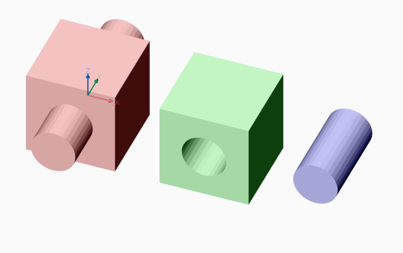
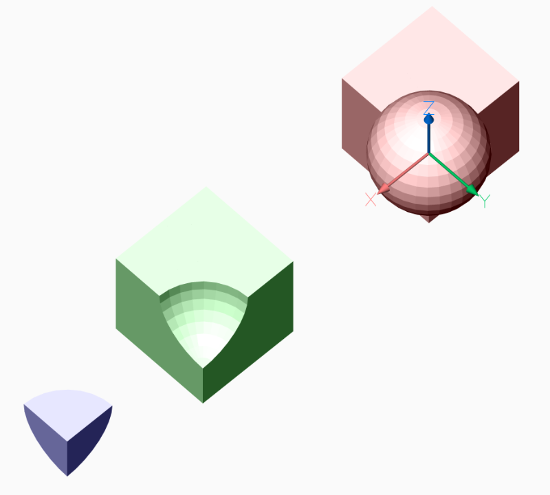
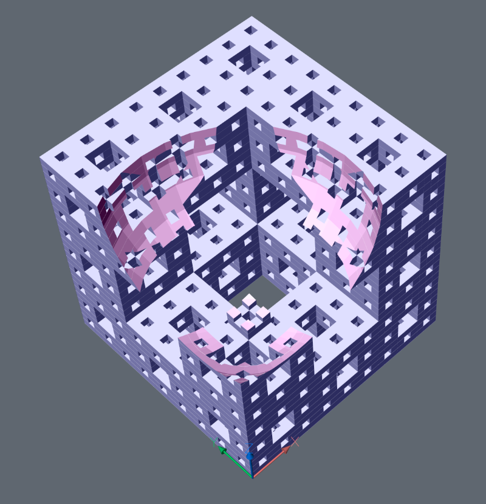

.. automodule:: ezdxf.addons.pycsg

.. _pycsg2:

PyCSG
=====

Constructive Solid Geometry (CSG) is a modeling technique that uses Boolean
operations like union and intersection to combine 3D solids. This library
implements CSG operations on meshes elegantly and concisely using BSP trees,
and is meant to serve as an easily understandable implementation of the
algorithm. All edge cases involving overlapping coplanar polygons in both
solids are correctly handled.

Example for usage:

.. code-block:: Python

    import ezdxf
    from ezdxf.render.forms import cube, cylinder_2p
    from ezdxf.addons.pycsg import CSG

    # create new DXF document
    doc = ezdxf.new()
    msp = doc.modelspace()

    # create same geometric primitives as MeshTransformer() objects
    cube1 = cube()
    cylinder1 = cylinder_2p(count=32, base_center=(0, -1, 0), top_center=(0, 1, 0), radius=.25)

    # build solid union
    union = CSG(cube1) + CSG(cylinder1)
    # convert to mesh and render mesh to modelspace
    union.mesh().render(msp, dxfattribs={'color': 1})

    # build solid difference
    difference = CSG(cube1) - CSG(cylinder1)
    # convert to mesh, translate mesh and render mesh to modelspace
    difference.mesh().translate(1.5).render(msp, dxfattribs={'color': 3})

    # build solid intersection
    intersection = CSG(cube1) * CSG(cylinder1)
    # convert to mesh, translate mesh and render mesh to modelspace
    intersection.mesh().translate(2.75).render(msp, dxfattribs={'color': 5})

    doc.saveas('csg.dxf')

This CSG kernel supports only meshes as :class:`~ezdxf.render.MeshBuilder` objects, which can be created from and
converted to DXF :class:`~ezdxf.entities.Mesh` entities.

This CSG kernel is **not** compatible with ACIS objects like :class:`~ezdxf.entities.Solid3d`,
:class:`~ezdxf.entities.Body`, :class:`~ezdxf.entities.Surface` or :class:`~ezdxf.entities.Region`.

.. note::

    This is a pure Python implementation, don't expect great performance and the implementation is based on an
    unbalanced `BSP tree`_, so in the case of :class:`RecursionError`, increase the recursion limit:

    .. code-block:: Python

         import sys

         actual_limit = sys.getrecursionlimit()
         # default is 1000, increasing too much may cause a seg fault
         sys.setrecursionlimit(10000)

         ...  # do the CSG stuff

         sys.setrecursionlimit(actual_limit)

CSG works also with spheres, but with really bad runtime behavior and most likely :class:`RecursionError`
exceptions, and use `quadrilaterals`_ as body faces to reduce face count by setting
argument `quads` to ``True``.

.. code-block:: Python

    import ezdxf

    from ezdxf.render.forms import sphere, cube
    from ezdxf.addons.pycsg import CSG

    doc = ezdxf.new()
    doc.set_modelspace_vport(6, center=(5, 0))
    msp = doc.modelspace()

    cube1 = cube().translate(-.5, -.5, -.5)
    sphere1 = sphere(count=32, stacks=16, radius=.5, quads=True)

    union = (CSG(cube1) + CSG(sphere1)).mesh()
    union.render(msp, dxfattribs={'color': 1})

    subtract = (CSG(cube1) - CSG(sphere1)).mesh().translate(2.5)
    subtract.render(msp, dxfattribs={'color': 3})

    intersection = (CSG(cube1) * CSG(sphere1)).mesh().translate(4)
    intersection.render(msp, dxfattribs={'color': 5})

Hard Core CSG - Menger Sponge Level 3 vs Sphere

Required runtime on an old Xeon E5-1620 Workstation @ 3.60GHz, with default recursion limit of 1000 on Windows 10:

    - CPython 3.8.1 64bit: ~60 seconds,
    - pypy3 [PyPy 7.2.0] 32bit: ~6 seconds, and using ``__slots__`` reduced runtime below 5 seconds, yes - pypy is
      worth a look for long running scripts!

.. code-block:: Python

    from ezdxf.render.forms import sphere
    from ezdxf.addons import MengerSponge
    from ezdxf.addons.pycsg import CSG

    doc = ezdxf.new()
    doc.layers.new('sponge', dxfattribs={'color': 5})
    doc.layers.new('sphere', dxfattribs={'color': 6})

    doc.set_modelspace_vport(6, center=(5, 0))
    msp = doc.modelspace()

    sponge1 = MengerSponge(level=3).mesh()
    sphere1 = sphere(count=32, stacks=16, radius=.5, quads=True).translate(.25, .25, 1)

    subtract = (CSG(sponge1, meshid=1) - CSG(sphere1, meshid=2))
    # get mesh result by id
    subtract.mesh(1).render(msp, dxfattribs={'layer': 'sponge'})
    subtract.mesh(2).render(msp, dxfattribs={'layer': 'sphere'})

CSG Class
---------

.. autoclass:: CSG(mesh: MeshBuilder, meshid: int = 0)

    .. automethod:: mesh

    .. automethod:: union

    .. method:: __add__

       .. code-block:: Python

            union = A + B

    .. automethod:: subtract

    .. method:: __sub__

       .. code-block:: Python

            difference = A - B

    .. automethod:: intersect

    .. method:: __mul__

       .. code-block:: Python

            intersection = A * B

    .. automethod:: inverse

License
-------

- Original implementation `csg.js`_, Copyright (c) 2011 Evan Wallace (http://madebyevan.com/), under the MIT license.
- Python port `pycsg`_, Copyright (c) 2012 Tim Knip (http://www.floorplanner.com), under the MIT license.
- Additions by Alex Pletzer (Pennsylvania State University)
- Integration as `ezdxf` add-on, Copyright (c) 2020, Manfred Moitzi, MIT License.

.. _csg.js: https://github.com/evanw/csg.js
.. _pycsg: https://github.com/timknip/pycsg
.. _BSP tree: https://en.wikipedia.org/wiki/Binary_space_partitioning
.. _quadrilaterals: https://en.wikipedia.org/wiki/Quadrilateral