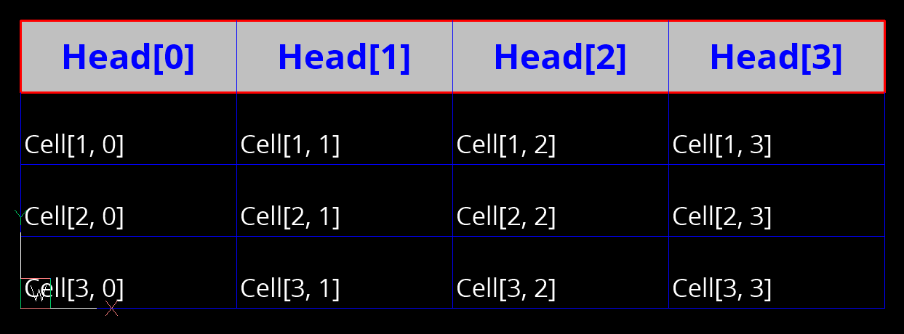

.. _table_painter:

.. module:: ezdxf.addons.tablepainter

TablePainter
============

This is an add-on for drawing tables build from DXF primitives.

This add-on was created for porting :mod:`dxfwrite` projects to :mod:`ezdxf` and
was not officially documented for :mod:`ezdxf` versions prior the 1.0 release.
For the 1.0 version of :mod:`ezdxf`, this class was added as an officially
documented add-on because full support for the ACAD_TABLE entity
is very unlikely due to the enormous complexity for both the entity itself,
as well as for the required infrastructure and also the lack of an usable
documentation to implement all that features.

.. important::

    This add-on is not related to the ACAD_TABLE entity at all and and does not
    create ACAD_TABLE entities!

The table cells can contain multi-line text or BLOCK references. You can
create your own cell types by extending the :class:`CustomCell` class.
The cells are addressed by zero-based row and column indices. A table cell can
span over multiple columns and/or rows.

A :class:`TextCell` can contain multi-line text with an arbitrary rotation angle
or letters stacked from top to bottom. The :class:`~ezdxf.addons.MTextSurrogate`
add-on is used to create multi-line text compatible to DXF version R12.

A :class:`BlockCell` contains block references (INSERT entities), if the block
definition contains attribute definitions as ATTDEF entities, these attributes
can be added automatically to the block reference as ATTRIB entities.

.. note::

    The DXF format does not support clipping boxes ot paths, therefore the
    render method of any cell can render beyond the borders of the cell!

Tutorial
--------

Set up a new DXF document:

.. code-block:: Python

    import ezdxf
    from ezdxf.enums import MTextEntityAlignment
    from ezdxf.addons import TablePainter

    doc = ezdxf.new("R2000")  # required for lineweight support
    doc.header["$LWDISPLAY"] = 1  # show lineweights
    doc.styles.add("HEAD", font="OpenSans-ExtraBold.ttf")
    doc.styles.add("CELL", font="OpenSans-Regular.ttf")

Create a new :class:`TablePainter` object with four rows and four columns, the
insert location is the default render location but can be overriden in the
:meth:`render` method:

.. code-block:: Python

    table = TablePainter(
        insert=(0, 0), nrows=4, ncols=4, cell_width=6.0, cell_height=2.0
    )

Create a new :class:`CellStyle` object for the table-header called "head":

.. code-block:: Python

    table.new_cell_style(
        "head",
        text_style="HEAD",
        text_color=ezdxf.colors.BLUE,
        char_height=0.7,
        bg_color=ezdxf.colors.LIGHT_GRAY,
        align=MTextEntityAlignment.MIDDLE_CENTER,
    )

Redefine the default :class:`CellStyle` for the content cells:

.. code-block:: Python

    # reset default cell style
    default_style = table.get_cell_style("default")
    default_style.text_style = "CELL"
    default_style.char_height = 0.5
    default_style.align = MTextEntityAlignment.BOTTOM_LEFT

Set the table-header content:

.. code-block:: Python

    for col in range(4):
        table.text_cell(0, col, f"Head[{col}]", style="head")

Set the cell content:

.. code-block:: Python

    for row in range(1, 4):
        for col in range(4):
            # cell style is "default"
            table.text_cell(row, col, f"Cell[{row}, {col}]")

Add a red frame around the table-header:

.. code-block:: Python

    # new cell style is required
    red_frame = table.new_cell_style("red-frame")
    red_borderline = table.new_border_style(color=ezdxf.colors.RED, lineweight=35)
    # set the red borderline style for all cell borders
    red_frame.set_border_style(red_borderline)
    # create the frame object
    table.frame(0, 0, 4, style="red-frame")

Render the table into the modelspace and export the DXF file:

.. code-block:: Python

    # render the table, shifting the left-bottom of the table to the origin:
    table.render(doc.modelspace(), insert=(0, table.table_height))

    th = table.table_height
    tw = table.table_width
    doc.set_modelspace_vport(height=th * 1.5, center=(tw/2, th/2))
    doc.saveas("table_tutorial.dxf")

.. seealso::

    - Example script: `table_painter_addon.py`_

TablePainter
------------

.. autoclass:: TablePainter

    .. attribute:: bg_layer_name: str

        background layer name, layer for the background SOLID entities,
        default is "TABLEBACKGROUND"

    .. attribute:: fg_layer_name: str

        foreground layer name, layer for the cell content, default is
        "TABLECONTENT"

    .. attribute:: grid_layer_name: str

        table grid layer name, layer for the cell border lines, default is
        "TABLEGRID"

    .. autoproperty:: table_width

    .. autoproperty:: table_height

    .. automethod:: set_col_width

    .. automethod:: set_row_height

    .. automethod:: text_cell

    .. automethod:: block_cell

    .. automethod:: set_cell

    .. automethod:: get_cell

    .. automethod:: new_cell_style

    .. automethod:: get_cell_style

    .. automethod:: new_border_style

    .. automethod:: frame

    .. automethod:: render

Cell
----

.. class:: Cell

    Abstract base class for table cells.

TextCell
--------

.. class:: TextCell

    Implements a cell type containing a multi-line text. Uses the
    :class:`~ezdxf.addons.MTextSurrogate` add-on to render the multi-line
    text, therefore the content of these cells is compatible to DXF R12.

    .. important::

        Use the factory method :meth:`TablePainter.text_cell` to
        instantiate text cells.

BlockCell
---------

.. autoclass:: BlockCell

    Implements a cell type containing a block reference.

    .. important::

        Use the factory method :meth:`TablePainter.block_cell` to
        instantiate block cells.

CustomCell
----------

.. class:: CustomCell

    Base class to implement custom cells. Overwrite the :meth:`render` method
    to render the cell. The custom cell type has to be instantiated by the
    user and added to the table by the :meth:`TablePainter.set_cell` method.

    .. automethod:: render

        The render space is defined by the argument `coords` which is a tuple of
        4 float values in the order: left, right, top, bottom. These values are
        layout coordinates in drawing units.
        The DXF format does not support clipping boxes, therefore the render method
        can render beyond these borders!

CellStyle
---------

.. autoclass:: CellStyle

    .. attribute:: text_style: str

        :class:`~ezdxf.entities.Textstyle` name as string, ignored by :class:`BlockCell`

    .. attribute:: char_height: float

        text height in drawing units, ignored by :class:`BlockCell`

    .. attribute:: line_spacing: float

        line spacing in percent, distance of line base points = :attr:`char_height`
        * :attr:`line_spacing`, ignored by :class:`BlockCell`

    .. attribute:: scale_x: float

        text stretching factor (width factor) or block reference x-scaling factor

    .. attribute:: scale_y: float

        block reference y-scaling factor, ignored by :class:`TextCell`

    .. attribute:: text_color: int

        :ref:`ACI` for text, ignored by :class:`BlockCell`

    .. attribute:: rotation: float

        text or block rotation in degrees

    .. attribute:: stacked: bool

        Stacks letters of :class:`TextCell` instances from top to bottom without
        rotating the characters if ``True``, ignored by :class:`BlockCell`

    .. attribute:: align: MTextEntityAlignment

        text and block alignment, see :class:`ezdxf.enums.MTextEntityAlignment`

    .. attribute:: margin_x: float

        left and right cell margin in drawing units

    .. attribute:: margin_y: float

        top and bottom cell margin in drawing units

    .. attribute:: bg_color: int

         cell background color as :ref:`ACI`, ignored by :class:`BlockCell`

    .. attribute:: left: BorderStyle

        left cell border style

    .. attribute:: top: BorderStyle

        top cell border style

    .. attribute:: right: BorderStyle

        right cell border style

    .. attribute:: bottom: BorderStyle

        bottom cell border style

    .. automethod:: set_border_status

    .. automethod:: set_border_style

    .. automethod:: get_default_border_style

BorderStyle
-----------

.. autoclass:: BorderStyle

    .. attribute:: status: bool

        border status, ``True``  for visible, ``False`` for hidden

    .. attribute:: color: int

        :ref:`ACI`

    .. attribute:: linetype: str

        linetype name as string, default is "BYLAYER"

    .. attribute:: lineweight: int

        lineweight as int, default is by layer

    .. attribute:: priority: int

        drawing priority, higher values cover lower values

.. _table_painter_addon.py: https://github.com/mozman/ezdxf/blob/master/examples/addons/table_painter_addon.py