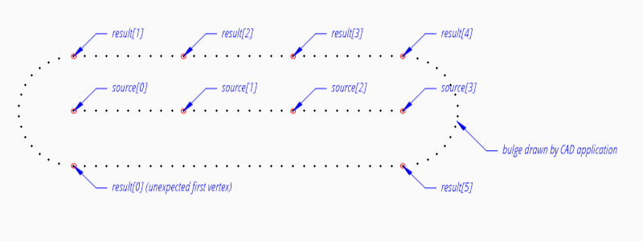

.. module:: ezdxf.addons.workbench
    :noindex:

Workbench
=========

.. automodule:: ezdxf.addons.workbench

.. autofunction:: offset_vertices_2d

.. code-block:: Python

    source = [(0, 0), (3, 0), (3, 3), (0, 3)]
    result = list(offset_vertices_2d(source, offset=0.5, closed=True))

.. image:: offset_vertices_2d_1.png

Example for a closed collinear shape, which creates 2 additional vertices and the first one has an unexpected location:

.. code-block:: Python

    source = [(0, 0), (0, 1), (0, 2), (0, 3)]
    result = list(offset_vertices_2d(source, offset=0.5, closed=True))

