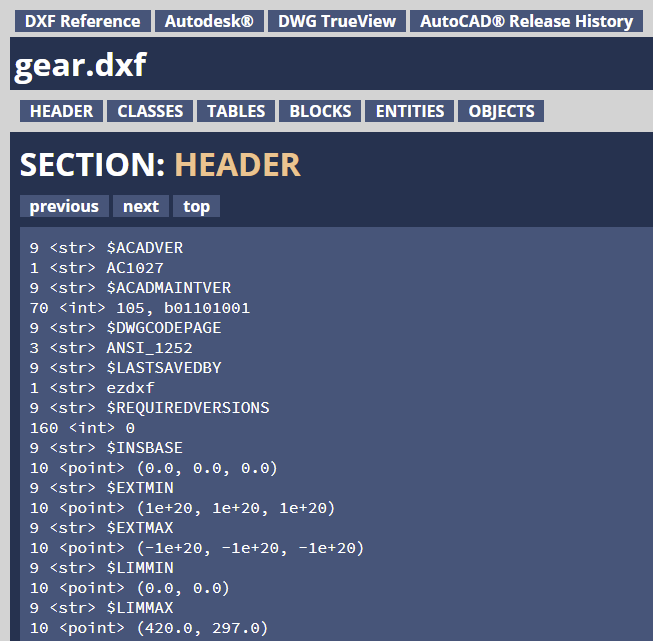
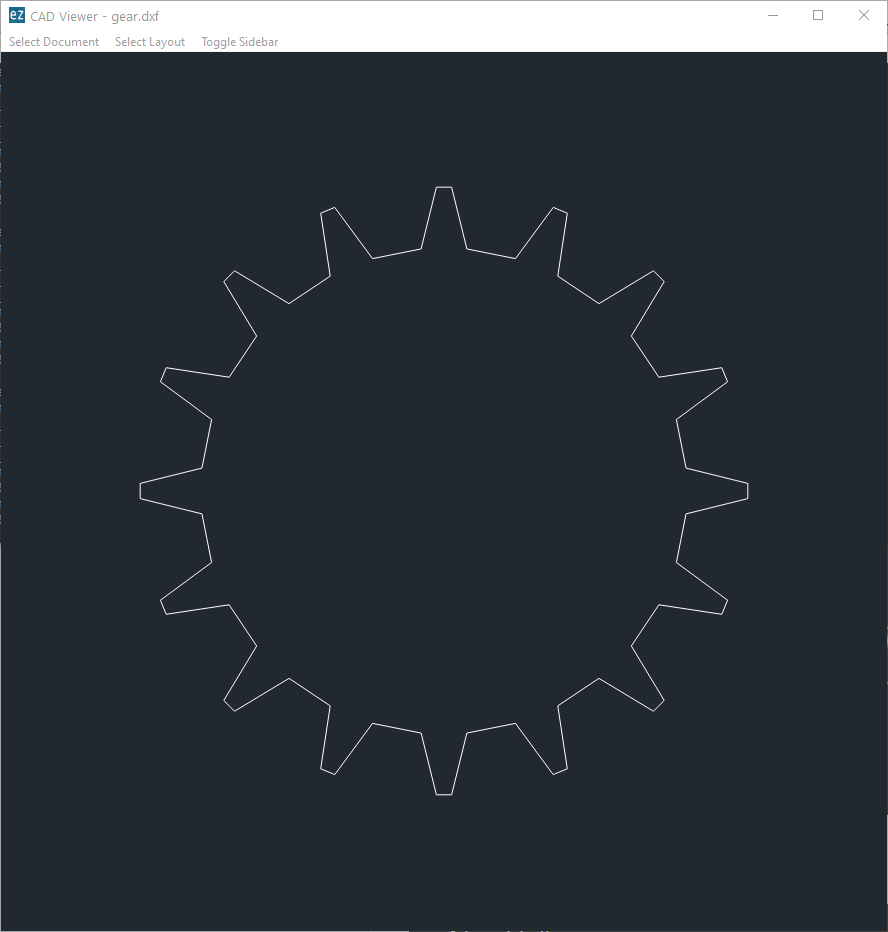
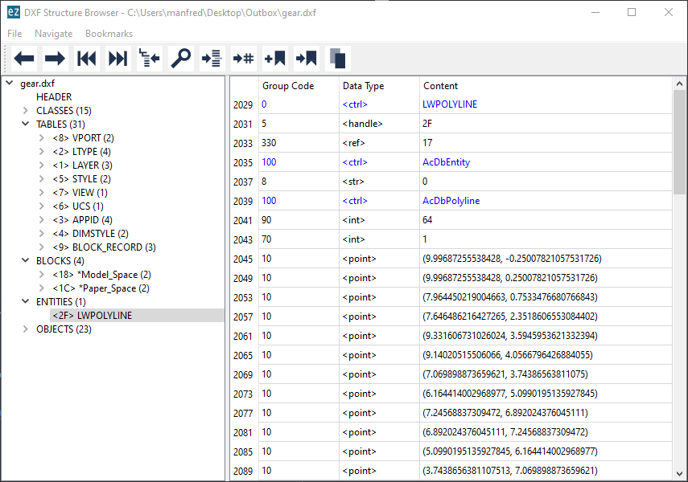

Launcher
========

The command line script `ezdxf` launches various sub-commands:

=========== ====================================================================
``pp``      DXF pretty printer, replacement for the previous `dxfpp` command
``audit``   Audit and repair DXF files
``draw``    Draw and convert DXF files by the Matplotlib backend
``view``    PyQt DXF file viewer
``browse``  PyQt DXF structure browser for DXF debugging and curious people
``strip``   Strip comments and THUMBNAILIMAGE section from DXF files
``config``  Manage config files
=========== ====================================================================

The help option ``-h`` is supported by the main script and all sub-commands:

.. code-block:: Text

    C:\> ezdxf -h
    usage: ezdxf [-h] [-V] [-v] [--config CONFIG] [--log LOG]
                 {pp,audit,draw,view,browse,strip,config} ...

    Command launcher for the Python package "ezdxf":
    https://pypi.org/project/ezdxf/

    positional arguments:
      {pp,audit,draw,view,browse,strip}
        pp                  pretty print DXF files as HTML file
        audit               audit and repair DXF files
        draw                draw and convert DXF files by Matplotlib
        view                view DXF files by the PyQt viewer
        browse              browse DXF file structure
        strip               strip comments from DXF files
        config              manage config files

    optional arguments:
      -h, --help            show this help message and exit
      -V, --version         show version and exit
      -v, --verbose         give more output
      --config CONFIG       path to a config file
      --log LOG             path to a verbose appending log

.. note::

    The ``ezdxf`` script  is the only executable script installed on the user
    system, if installed by ``pip``, the ``dxfpp`` script is not included anymore.

Pretty Printer
--------------

Pretty print the DXF text content as HTML file and open the file in the
default web browser:

.. code-block:: Text

    C:\> ezdxf pp -o gear.dxf

Print help:

.. code-block:: Text

    C:\> ezdxf pp -h
    usage: ezdxf pp [-h] [-o] [-r] [-x] [-l] [-s SECTIONS] FILE [FILE ...]

    positional arguments:
      FILE                  DXF files pretty print

    optional arguments:
      -h, --help            show this help message and exit
      -o, --open            open generated HTML file by the default web browser
      -r, --raw             raw mode, no DXF structure interpretation
      -x, --nocompile       don't compile points coordinates into single tags (only in raw mode)
      -l, --legacy          legacy mode, reorder DXF point coordinates
      -s SECTIONS, --sections SECTIONS
                            choose sections to include and their order, h=HEADER, c=CLASSES,
                            t=TABLES, b=BLOCKS, e=ENTITIES, o=OBJECTS

Auditor
-------

Audit and recover the DXF file "gear.dxf" and save the recovered version
as "gear.rec.dxf":

.. code-block:: Text

    C:\> ezdxf audit -s gear.dxf

    auditing file: gear.dxf
    No errors found.
    Saved recovered file as: gear.rec.dxf

Print help:

.. code-block:: Text

    C:\> ezdxf audit -h
    usage: ezdxf audit [-h] [-s] FILE [FILE ...]

    positional arguments:
      FILE        audit DXF files

    optional arguments:
      -h, --help  show this help message and exit
      -s, --save  save recovered files with extension ".rec.dxf"

Draw
----

Convert the DXF file "gear.dxf" into a SVG file by the *Matplotlib* backend:

.. code-block:: Text

    C:\> ezdxf draw -o gear.svg gear.dxf

The "gear.svg" created by the *Matplotlib* backend:

Show all output formats supported by the *Matplotlib* backend
on your system. This output may vary:

.. code-block:: Text

    C:\> ezdxf draw --formats
    eps: Encapsulated Postscript
    jpg: Joint Photographic Experts Group
    jpeg: Joint Photographic Experts Group
    pdf: Portable Document Format
    pgf: PGF code for LaTeX
    png: Portable Network Graphics
    ps: Postscript
    raw: Raw RGBA bitmap
    rgba: Raw RGBA bitmap
    svg: Scalable Vector Graphics
    svgz: Scalable Vector Graphics
    tif: Tagged Image File Format
    tiff: Tagged Image File Format

Print help:

.. code-block:: Text

    C:\> ezdxf draw -h
    usage: ezdxf draw [-h] [--formats] [--layout LAYOUT] [--all-layers-visible]
                      [--all-entities-visible] [-o OUT] [--dpi DPI]
                      [--ltype {internal,ezdxf}]
                      [FILE]

    positional arguments:
      FILE                  DXF file to view or convert

    optional arguments:
      -h, --help            show this help message and exit
      --formats             show all supported export formats and exit
      --layout LAYOUT       select the layout to draw
      --all-layers-visible  draw all layers including the ones marked as invisible
      --all-entities-visible
                            draw all entities including the ones marked as invisible (some
                            entities are individually marked as invisible even if the layer
                            is visible)
      -o OUT, --out OUT     output filename for export
      --dpi DPI             target render resolution, default is 300
      --ltype {internal,ezdxf}
                            select the line type rendering engine, default is internal

View
----

View the DXF file "gear.dxf" by the *PyQt* backend:

.. code-block:: Text

    C:\> ezdxf view gear.dxf

Print help:

.. code-block:: Text

    C:\> ezdxf view -h
    usage: ezdxf view [-h] [--ltype {internal,ezdxf}] [--lwscale LWSCALE] [FILE]

    positional arguments:
      FILE                  DXF file to view

    optional arguments:
      -h, --help            show this help message and exit
      --ltype {internal,ezdxf}
                            select the line type rendering engine, default is internal
      --lwscale LWSCALE     set custom line weight scaling, default is 0 to disable line
                            weights at all

Browse
------

Browse the internal structure of a DXF file like a file system:

.. code-block:: Text

    C:\> ezdxf browse gear.dxf

.. code-block:: Text

    C:\> ezdxf browse -h
    usage: ezdxf browse [-h] [-l LINE] [-g HANDLE] [FILE]

    positional arguments:
      FILE                  DXF file to browse

    optional arguments:
      -h, --help            show this help message and exit
      -l LINE, --line LINE  go to line number
      -g HANDLE, --handle HANDLE
                            go to entity by HANDLE, HANDLE has to be a hex value without
                            any prefix like 'fefe'

The `browse` command stores options in the config file,
e.g. for the `Notepad++` on Windows:

.. code-block:: ini

    [browse-command]

    text_editor = C:\Program Files\Notepad++\notepad++.exe
    goto_line_argument = -n{num}

The ``goto_line_argument`` is a simple format string:
:code:`goto_line_argument.format(num=100)`

For `gedit` on Linux use (untested):

.. code-block:: ini

    [browse-command]

    text_editor = gedit
    goto_line_argument = +{num}

Strip
-----

Strip comment tags (group code 999) from ASCII DXF files and can remove the
THUMBNAILIMAGE section. Binary DXF files are not supported.

.. code-block:: Text

    C:\> ezdxf strip -h
    usage: ezdxf strip [-h] [-b] [-v] FILE [FILE ...]

    positional arguments:
      FILE           DXF file to process, wildcards "*" and "?" are supported

    optional arguments:
      -h, --help       show this help message and exit
      -b, --backup     make a backup copy with extension ".bak" from the DXF file,
                       overwrites existing backup files
      -t, --thumbnail  strip THUMBNAILIMAGE section
      -v, --verbose    give more output

Config
------

Manage config files.

.. code-block:: Text

    C:\> ezdxf config -h
    usage: ezdxf config [-h] [-p] [--home] [--reset]

    optional arguments:
      -h, --help   show this help message and exit
      -p, --print  print configuration, to store the configuration use:
                   "ezdxf config -p > my.ini"
      --home       create config file 'ezdxf.ini' in user home directory
                   '~/.ezdxf'
      --reset      factory reset, delete config files './ezdxf.ini' and
                   '~/.ezdxf/ezdxf.ini'

To create a new config file "my.ini" by printing the configuration into a file:

.. code-block:: Text

    C:\> ezdxf config -p > my.ini

Show Version & Configuration
----------------------------

Show the *ezdxf* version and configuration:

.. code-block:: Text

    C:\> ezdxf -Vv

    ezdxf v0.16.5b0 @ d:\source\ezdxf.git\src\ezdxf
    Python version: 3.9.2 (tags/v3.9.2:1a79785, Feb 19 2021, 13:44:55) [MSC v.1928 64 bit (AMD64)]
    using C-extensions: yes
    using Matplotlib: yes

    Configuration:
    [core]
    test_files = D:\Source\dxftest
    font_cache_directory =
    auto_load_fonts = true
    load_proxy_graphics = true
    store_proxy_graphics = true
    log_unprocessed_tags = true
    filter_invalid_xdata_group_codes = true
    write_fixed_meta_data_for_testing = false
    default_text_style = OpenSans
    default_dimension_text_style = OpenSansCondensed-Light

    [browse-command]
    text_editor = C:\Program Files\Notepad++\notepad++.exe
    goto_line_argument = -n{num}

    Environment Variables:
    EZDXF_DISABLE_C_EXT=
    EZDXF_TEST_FILES=D:\Source\dxftest
    EZDXF_CONFIG_FILE=

    Existing Configuration Files:
    C:\Users\manfred\.ezdxf\ezdxf.ini

.. seealso::

    Documentation of the :mod:`ezdxf.options` module and the
    :ref:`environment_variables`.
