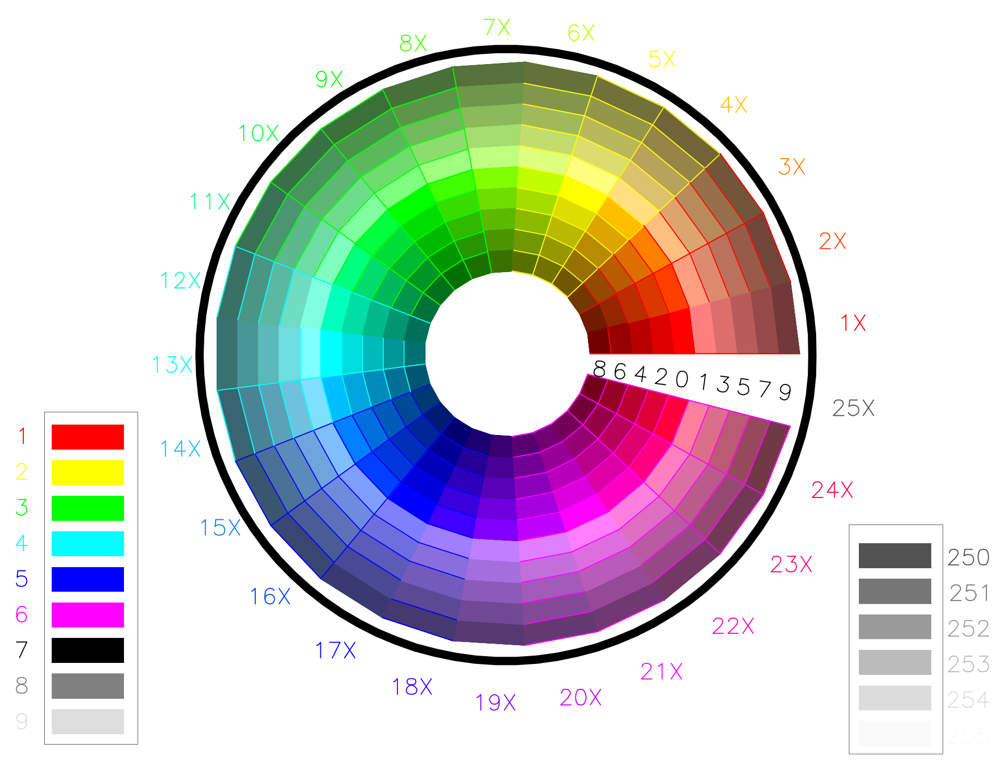

.. _aci:

AutoCAD Color Index (ACI)
=========================

The :attr:`~ezdxf.entities.DXFGraphic.dxf.color` attribute represents an `ACI`
(AutoCAD Color Index).
AutoCAD and many other :term:`CAD` application provides a default color table,
but pen table would be the more correct term.
Each ACI entry defines the color value, the line weight and some other
attributes to use for the pen. This pen table can be edited by the user or
loaded from an :term:`CTB` or :term:`STB` file.
`Ezdxf` provides functions to create (:func:`~ezdxf.acadctb.new`) or modify
(:func:`ezdxf.acadctb.load`) plot styles files.

DXF R12 and prior do not preserve the layout of a drawing very well, because
of the lack of a standard color table and missing DXF structures to define
these color tables in the DXF file.
If a CAD user redefines an ACI color entry in a CAD application and does not
provide this :term:`CTB` or :term:`STB` file, you can not know what color
or lineweight was used intentionally.
This got better in later DXF versions by supporting additional DXF
attributes like :attr:`~ezdxf.entities.DXFGraphic.dxf.lineweight` and
:attr:`~ezdxf.entities.DXFGraphic.dxf.true_color` which can define these
attributes by distinct values.

.. seealso::

    - :ref:`plot_style_files`
    - :mod:`ezdxf.colors`
    - :ref:`tut_common_graphical_attributes`
    - Autodesk Knowledge Network: `About Setting the Color of Objects`_
    - BricsCAD Help Center: `Entity Color`_

.. _About Setting the Color of Objects: https://knowledge.autodesk.com/support/autocad/learn-explore/caas/CloudHelp/cloudhelp/2019/ENU/AutoCAD-Core/files/GUID-14BC039D-238D-4D9E-921B-F4015F96CB54-htm.html
.. _Entity Color: https://help.bricsys.com/document/_guides--BCAD_2D_drafting--GD_entitycolor/V22/EN_US?id=165079136935