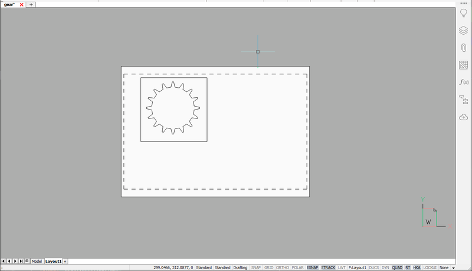
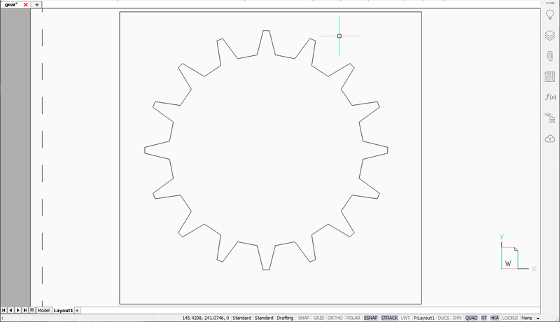
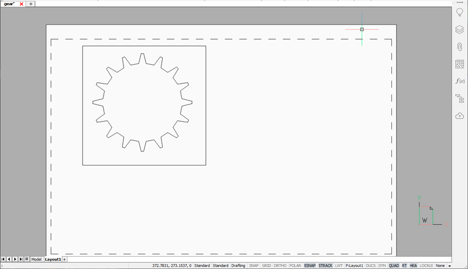

.. _Layout extents and limits:

Layout Extents and Limits
=========================

The `extents` and `limits` of an layout represents borders which can be
referenced by the ZOOM command or read from some header variables from the
:class:`~ezdxf.sections.header.HeaderSection`, if the creator application
maintains these values -- `ezdxf` does it not automatically.

Extents
-------

The `extents` of an layout are determined by the maximum extents of all  DXF
entities that are in this layout. The command::

    ZOOM extents

sets the current viewport to the extents of the currently selected layout.

A paper space layout in an arbitrary zoom state:

The same layout after the :code:`ZOOM extents` command:

Limits
------

Sets an invisible rectangular boundary in the drawing area that can limit the
grid display and limit clicking or entering point locations. The default limits
for paper space layouts is defined by the paper size.

The layout from above after the :code:`ZOOM all` command:

.. seealso::

    The AutoCAD online reference for the `ZOOM`_ and the `LIMITS`_ command.

Read Stored Values
------------------

The extents of the model space (the tab called "Model") are stored in
the header variable ``$EXTMIN`` and ``$EXTMAX``. The default values
of ``$EXTMIN`` is (+1e20, +1e20, +1e20) and ``$EXTMAX`` is
(-1e20, -1e20, -1e20), which do not describe real borders. These values are
copies of the extents attributes of the :class:`~ezdxf.layouts.Layout`
object as :attr:`Layout.dxf.extmin` and :attr:`Layout.dxf.extmax`.

The limits of the modelspace are stored in the header variables ``$LIMMIN`` and
``$LIMMAX`` and have default values of (0, 0) and (420, 297), the default paper
size of `ezdxf` in drawing units. These are copies of the :class:`~ezdxf.layouts.Layout`
attributes :attr:`Layout.dxf.extmin` and :attr:`Layout.dxf.extmax`.

The extents and the limits of the `actual` paper space layout, which is the last
activated paper space layout tab, stored in the header variable ``$PEXTMIN``,
``$PEXTMAX``, ``$PLIMMIN`` and ``$PLIMMAX``.

Each paper space layout has its own values stored in the :class:`~ezdxf.layouts.Layout`
attributes :attr:`Layout.dxf.extmin`, :attr:`Layout.dxf.extmax`, :attr:`Layout.dxf.limmin`
and :attr:`Layout.dxf.limmax`.

Setting Extents and Limits
--------------------------

Since v0.16 `ezdxf` it is sufficient to define the attributes for `extents` and
`limits` (:attr:`Layout.dxf.extmax`, :attr:`Layout.dxf.limmin` and
:attr:`Layout.dxf.limmax`) of :class:`~ezdxf.layouts.Layout` object.
The header variables are synchronized when the document is saved.

The extents of a layout are not calculated automatically by `ezdxf`, as this
can take a long time for large documents and correct values are not required
to create a valid DXF document.

.. seealso::

    How to: :ref:`calc msp extents`

.. _zoom: https://knowledge.autodesk.com/support/autocad/learn-explore/caas/CloudHelp/cloudhelp/2020/ENU/AutoCAD-Core/files/GUID-66E7DB72-B2A7-4166-9970-9E19CC06F739-htm.html

.. _limits: https://knowledge.autodesk.com/support/autocad/learn-explore/caas/CloudHelp/cloudhelp/2021/ENU/AutoCAD-Core/files/GUID-6CF82FC7-E1BC-4A8C-A23D-4396E3D99632-htm.html?us_oa=akn-us&us_si=e9cbb4f4-03c5-4af9-aa76-b58263233f35&us_st=LIMITS%20(Command)