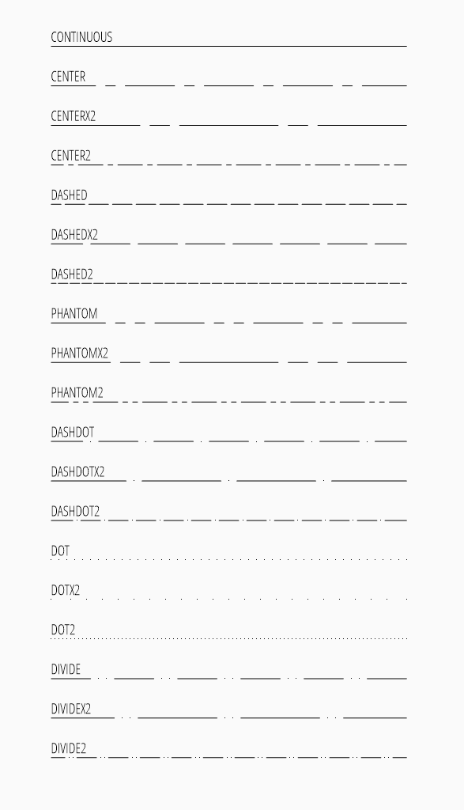

.. _linetypes:

Linetypes
=========

The :attr:`~ezdxf.entities.DXFGraphic.dxf.linetype` defines the rendering pattern
of linear graphical entities like LINE, ARC, CIRCLE and so on.
The linetype of an entity can be specified by the DXF attribute :attr:`linetype`,
this can be an explicit named linetype or the entity can inherit its linetype
from the assigned layer by setting :attr:`linetype` to ``'BYLAYER'``,
which is also the default value. ``CONTINUOUS`` is the default linetype for
layers with an unspecified linetype.

`Ezdxf` creates several standard linetypes, if the argument `setup` is ``True``
when calling :func:`~ezdxf.new`, this simple linetypes are supported by all
DXF versions:

.. code-block:: Python

    doc = ezdxf.new('R2007', setup=True)

In DXF R13 Autodesk introduced complex linetypes which can contain text or
shapes.

.. seealso::

    - :ref:`tut_linetypes`
    - Autodesk Knowledge Network: `About Linetypes`_

Linetype Scaling
-----------------

Global linetype scaling can be changed by setting the header variable
:code:`doc.header['$LTSCALE'] = 2`, which stretches the line pattern by factor 2.

The linetype scaling for a single entity can be set by the DXF attribute
:attr:`~ezdxf.entities.DXFGraphic.dxf.ltscale`, which is supported since
DXF R2000.

.. _about linetypes: https://knowledge.autodesk.com/support/autocad/learn-explore/caas/CloudHelp/cloudhelp/2019/ENU/AutoCAD-Core/files/GUID-20B4D4B3-1220-426A-847B-5BBE36EC6FDF-htm.html#GUID-20B4D4B3-1220-426A-847B-5BBE36EC6FDF__SECTION_C298CAFE7CDF42A1AF937862BDA04F1C