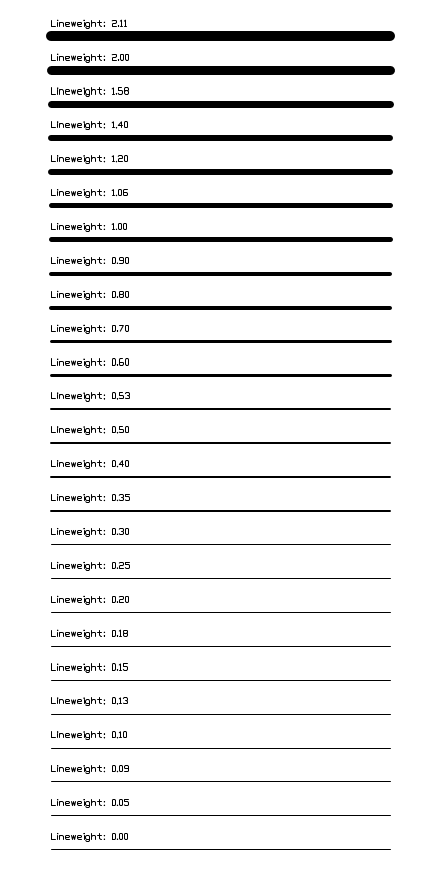

.. _lineweights:

Lineweights
===========

The :attr:`~ezdxf.entities.DXFGraphic.dxf.lineweight` attribute represents the
lineweight as integer value in millimeters * 100, e.g. 0.25mm = 25,
independently from the unit system used in the DXF document.
The :attr:`lineweight` attribute is supported by DXF R2000 and newer.

Only certain values are valid, they are stored in
:attr:`ezdxf.lldxf.const.VALID_DXF_LINEWEIGHTS`: 0, 5, 9, 13, 15, 18, 20, 25,
30, 35, 40, 50, 53, 60, 70, 80, 90, 100, 106, 120, 140, 158, 200, 211.

Values < 0 have a special meaning and can be imported as constants from
:mod:`ezdxf.lldxf.const`

=== ==================
-1  LINEWEIGHT_BYLAYER
-2  LINEWEIGHT_BYBLOCK
-3  LINEWEIGHT_DEFAULT
=== ==================

The validator function: :func:`ezdxf.lldxf.validator.is_valid_lineweight`
returns ``True`` for valid lineweight values otherwise ``False``.

Sample script which shows all valid lineweights: `valid_lineweights.dxf`_

You have to enable the option to show lineweights in your CAD application or
viewer to see the effect on screen, which is disabled by default, the same
has to be done in the page setup options for plotting lineweights.

Setting the HEADER variable ``$LWDISPLAY`` to 1, activates support for
displaying lineweights on screen::

    # activate on screen lineweight display
    doc.header["$LWDISPLAY"] = 1

The lineweight value can be overridden by :term:`CTB` or :term:`STB` files.

.. seealso::

    - Autodesk Knowledge Network: `about lineweights`_

.. _valid_lineweights.dxf: https://raw.githubusercontent.com/mozman/ezdxf/master/examples_dxf/valid_lineweights.dxf
.. _about lineweights: https://knowledge.autodesk.com/support/autocad/learn-explore/caas/CloudHelp/cloudhelp/2019/ENU/AutoCAD-Core/files/GUID-4B33ACD3-F6DD-4CB5-8C55-D6D0D7130905-htm.html