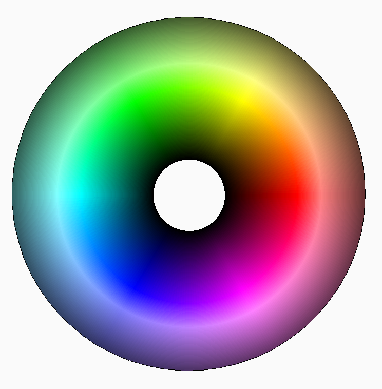

.. _true color:

True Color
==========

The support for true color was added to the DXF file format in revision R2004.
The true color value has three components red, green and blue in the range from
0 to 255 and is stored as a 24-bit value in the DXF namespace as :attr:`true_color`
attribute and looks like this ``0xRRGGBB`` as hex value.
For a more easy usage all graphical entities support the
:attr:`~ezdxf.entities.DXFGraphic.rgb` property to get and set the true color as
(r, g, b) tuples where the components must be in the range from 0 to 255.

.. code-block:: Python

    import ezdxf

    doc = ezdxf.new()
    msp = doc.modelspace()
    line = msp.add_line((0, 0), (10, 0))
    line.rgb = (255, 128, 32)

The true color value has higher precedence than the :ref:`aci` value, if the
attributes :attr:`color` and the :attr:`true_color` are present the entity will
be rendered with the true color value.

The true color value has the advantage that it defines the color absolutely and
unambiguously, no unexpected overwriting is possible.
The representation of the color is fixed and only depends on the calibration of
the output medium:

.. seealso::

    - :mod:`ezdxf.colors`
    - :ref:`tut_common_graphical_attributes`
    - Autodesk Knowledge Network: `About Setting the Color of Objects`_
    - BricsCAD Help Center: `Entity Color`_

.. _About Setting the Color of Objects: https://knowledge.autodesk.com/support/autocad/learn-explore/caas/CloudHelp/cloudhelp/2019/ENU/AutoCAD-Core/files/GUID-14BC039D-238D-4D9E-921B-F4015F96CB54-htm.html
.. _Entity Color: https://help.bricsys.com/document/_guides--BCAD_2D_drafting--GD_entitycolor/V22/EN_US?id=165079136935