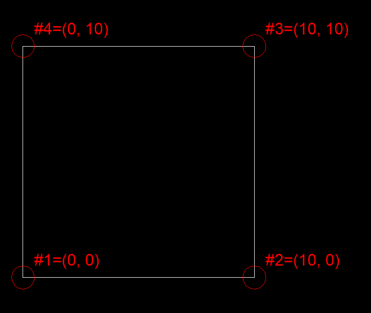

Face3d
======

.. module:: ezdxf.entities
    :noindex:

The 3DFACE entity (`DXF Reference`_) is real 3D solid filled triangle or quadrilateral.
Access vertices by name (:code:`entity.dxf.vtx0 = (1.7, 2.3)`) or by index
(:code:`entity[0] = (1.7, 2.3)`).

Unlike the entities :class:`Solid` and :class:`Trace`, the vertices of
:class:`Face3d` have the expected vertex order:

.. code-block:: Python

    msp.add_3dface([(0, 0), (10, 0), (10, 10), (0, 10)])

======================== ==========================================
Subclass of              :class:`ezdxf.entities.DXFGraphic`
DXF type                 ``'3DFACE'``
Factory function         :meth:`ezdxf.layouts.BaseLayout.add_3dface`
Inherited DXF attributes :ref:`Common graphical DXF attributes`
======================== ==========================================

.. warning::

    Do not instantiate entity classes by yourself - always use the provided
    factory functions!

.. class:: Face3d

    The class name is :class:`Face3d` because :class:`3dface` is not a valid
    Python class name.

    .. attribute:: dxf.vtx0

        Location of 1. vertex (3D Point in :ref:`WCS`)

    .. attribute:: dxf.vtx1

        Location of 2. vertex (3D Point in :ref:`WCS`)

    .. attribute:: dxf.vtx2

        Location of 3. vertex (3D Point in :ref:`WCS`)

    .. attribute:: dxf.vtx3

        Location of 4. vertex (3D Point in :ref:`WCS`)

    .. attribute:: dxf.invisible_edges

        invisible edge flag (int, default=0)

        === ==============================
        1   first edge is invisible
        2   second edge is invisible
        4   third edge is invisible
        8   fourth edge is invisible
        === ==============================

        Combine values by adding them, e.g. 1+4 = first and third edge is invisible.

    .. automethod:: transform

    .. automethod:: wcs_vertices(close: bool = False) -> list[Vec3]

.. _DXF Reference: http://help.autodesk.com/view/OARX/2018/ENU/?guid=GUID-747865D5-51F0-45F2-BEFE-9572DBC5B151