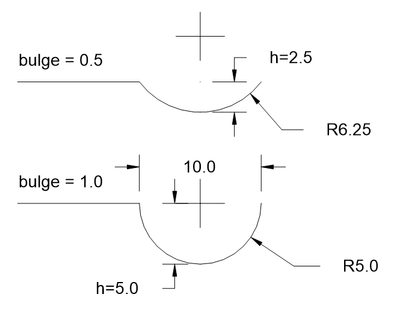

LWPolyline
==========

.. module:: ezdxf.entities
    :noindex:

The LWPOLYLINE entity (Lightweight POLYLINE, `DXF Reference`_) is defined as 
a single graphic entity, which differs from the old-style :class:`Polyline` 
entity, which is defined as a group of sub-entities. :class:`LWPolyline` 
display faster (in AutoCAD) and consume less disk space, it is a planar 
element, therefore all points are located in the :ref:`OCS` as (x, y)-tuples
(:attr:`LWPolyline.dxf.elevation` is the z-axis value).

.. versionchanged:: 0.8.9

    :class:`LWPolyline` stores point data as packed data (:class:`array.array`).

======================== ==========================================
Subclass of              :class:`ezdxf.entities.DXFGraphic`
DXF type                 ``'LWPOLYLINE'``
factory function         :meth:`~ezdxf.layouts.BaseLayout.add_lwpolyline`
Inherited DXF attributes :ref:`Common graphical DXF attributes`
Required DXF version     DXF R2000 (``'AC1015'``)
======================== ==========================================

.. _DXF Reference: http://help.autodesk.com/view/OARX/2018/ENU/?guid=GUID-748FC305-F3F2-4F74-825A-61F04D757A50

.. _bulge value:

.. rubric:: Bulge value

The bulge value is used to create arc shaped line segments for :class:`Polyline`
and :class:`LWPolyline` entities. The arc starts at the vertex which includes
the bulge value and ends at the following vertex. The bulge value defines the
ratio of the arc sagitta (versine) to half line segment length, a bulge value
of 1 defines a semicircle.

The sign of the bulge value defines the side of the bulge:

    - positive value (> 0): bulge is right of line (counter clockwise)
    - negative value (< 0): bulge is left of line (clockwise)
    - 0 = no bulge

.. rubric:: Start- and end width

The start width and end width values defines the width in drawing units for the
following line segment. To use the default width value for a line segment set
value to 0.

.. rubric:: Width and bulge values at last point

The width and bulge values of the last point has only a meaning if the polyline
is closed, and they apply to the last line segment from the last to the first
point.

.. seealso::

    :ref:`tut_lwpolyline` and :ref:`bulge_related_functions`

.. _format codes:

User Defined Point Format Codes
-------------------------------

    ==== =====================
    Code Point Component
    ==== =====================
       x x-coordinate
       y y-coordinate
       s start width
       e end width
       b bulge value
       v (x, y [, z]) as tuple
    ==== =====================

.. class:: LWPolyline

    .. attribute:: dxf.elevation

        :ref:`OCS` z-axis value for all polyline points, default=0

    .. attribute:: dxf.flags

        Constants defined in :mod:`ezdxf.lldxf.const`:

        ============================== ======= ===========
        dxf.flags                      Value   Description
        ============================== ======= ===========
        LWPOLYLINE_CLOSED              1       polyline is closed
        LWPOLYLINE_PLINEGEN            128     linetype is generated across the points
        ============================== ======= ===========

    .. attribute:: dxf.const_width

        Constant line width (float), default value is ``0``.

    .. attribute:: dxf.count

        Count of polyline points (read only), same as :code:`len(polyline)`

    .. autoproperty:: closed

    .. autoproperty:: is_closed

    .. automethod:: close

    .. autoproperty:: has_arc

    .. autoproperty:: has_width

    .. automethod:: __len__

    .. automethod:: __getitem__

    .. automethod:: __setitem__

    .. automethod:: __delitem__

    .. automethod:: __iter__

    .. automethod:: vertices

    .. automethod:: vertices_in_wcs

    .. automethod:: append

    .. automethod:: append_points

    .. automethod:: insert

    .. automethod:: clear

    .. automethod:: get_points

    .. automethod:: set_points

    .. automethod:: points

    .. automethod:: transform

    .. automethod:: virtual_entities

    .. automethod:: explode
