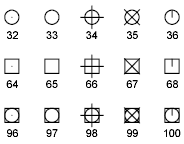

Point
=====

.. module:: ezdxf.entities
    :noindex:

POINT (`DXF Reference`_) at location :attr:`dxf.location`.

The POINT styling is a global setting, stored as header variable `$PDMODE`_,
this also means **all** POINT entities in a DXF document have the same styling:

=== ==============
0   center dot (.)
1   none ( )
2   cross (+)
3   x-cross (x)
4   tick (')
=== ==============

Combined with these bit values

=== ==============
32  circle
64  Square
=== ==============

e.g. circle + square + center dot = 32 + 64 + 0 = 96

The size of the points is defined by the header variable `$PDSIZE`_:

=== ==============
0   5% of draw area height
<0  Specifies a percentage of the viewport size
>0  Specifies an absolute size
=== ==============

======================== ==========================================
Subclass of              :class:`ezdxf.entities.DXFGraphic`
DXF type                 ``'POINT'``
Factory function         :meth:`ezdxf.layouts.BaseLayout.add_point`
Inherited DXF attributes :ref:`Common graphical DXF attributes`
======================== ==========================================

.. warning::

    Do not instantiate entity classes by yourself - always use the provided factory functions!

.. class:: Point

    .. attribute:: dxf.location

        Location of the point (2D/3D Point in :ref:`WCS`)

    .. attribute:: dxf.angle

        Angle in degrees of the x-axis for the UCS in effect when POINT was drawn (float); used when PDMODE is nonzero.

    .. automethod:: transform(m: Matrix44) -> Point

    .. automethod:: translate(dx: float, dy: float, dz: float) -> Point

    .. automethod:: virtual_entities(pdsize: float = 1, pdmode: int = 0) -> List[DXFEntity]

.. _DXF Reference: http://help.autodesk.com/view/OARX/2018/ENU/?guid=GUID-9C6AD32D-769D-4213-85A4-CA9CCB5C5317
.. _$PDMODE: https://knowledge.autodesk.com/support/autocad/learn-explore/caas/CloudHelp/cloudhelp/2019/ENU/AutoCAD-Core/files/GUID-82F9BB52-D026-4D6A-ABA6-BF29641F459B-htm.html
.. _$PDSIZE: https://knowledge.autodesk.com/support/autocad/learn-explore/caas/CloudHelp/cloudhelp/2021/ENU/AutoCAD-Core/files/GUID-826CA91D-704B-400B-B784-7FCC9619AFB9-htm.html?st=$PDSIZE