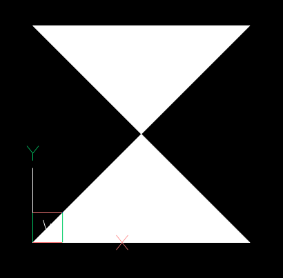
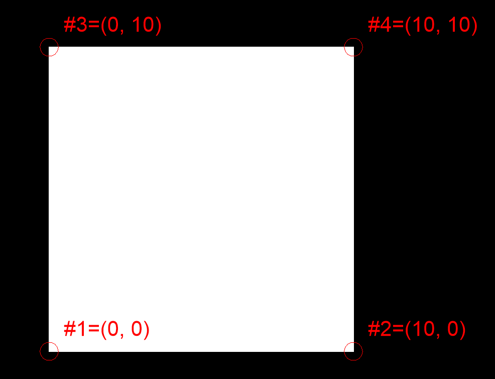

Trace
=====

.. module:: ezdxf.entities
    :noindex:

TRACE entity (`DXF Reference`_) is solid filled triangle or quadrilateral.
Access vertices by name (:code:`entity.dxf.vtx0 = (1.7, 2.3)`) or by
index (:code:`entity[0] = (1.7, 2.3)`). If only 3 vertices are provided the
last (3rd) vertex will be repeated in the DXF file.

The TRACE entity stores the vertices in an unusual way, the last two vertices
are reversed:

.. code-block:: Python

    msp.add_solid([(0, 0), (10, 0), (10, 10), (0, 10)])

Reverse the last two vertices to get the `expected` square:

.. code-block:: Python

    msp.add_solid([(0, 0), (10, 0), (0, 10), (10, 10)])

.. note::

    The quirky vertex order is preserved at the lowest access level because
    `ezdxf` is intended as a DXF file format interface and presents the content
    of the DXF document to the package user as natively as possible.

    The :meth:`Trace.vertices` and :meth:`Trace.wcs_vertices` methods return the
    vertices in the `expected` (reversed) order.

======================== ==========================================
Subclass of              :class:`ezdxf.entities.DXFGraphic`
DXF type                 ``'TRACE'``
Factory function         :meth:`ezdxf.layouts.BaseLayout.add_trace`
Inherited DXF attributes :ref:`Common graphical DXF attributes`
======================== ==========================================

.. warning::

    Do not instantiate entity classes by yourself - always use the provided
    factory functions!

.. class:: Trace

    .. attribute:: dxf.vtx0

        Location of 1. vertex (2D/3D Point in :ref:`OCS`)

    .. attribute:: dxf.vtx1

        Location of 2. vertex (2D/3D Point in :ref:`OCS`)

    .. attribute:: dxf.vtx2

        Location of 3. vertex (2D/3D Point in :ref:`OCS`)

    .. attribute:: dxf.vtx3

        Location of 4. vertex (2D/3D Point in :ref:`OCS`)

    .. automethod:: transform

    .. automethod:: vertices

    .. automethod:: wcs_vertices

.. _DXF Reference: http://help.autodesk.com/view/OARX/2018/ENU/?guid=GUID-EA6FBCA8-1AD6-4FB2-B149-770313E93511