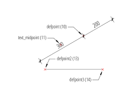

.. _DIMENSION Entity:

DIMENSION Entity
================

.. seealso::

    - DXF Reference: `DIMENSION`_
    - DXFInternals: :ref:`DIMSTYLE Table`

.. _DIMENSION: http://help.autodesk.com/view/OARX/2018/ENU/?guid=GUID-239A1BDD-7459-4BB9-8DD7-08EC79BF1EB0
