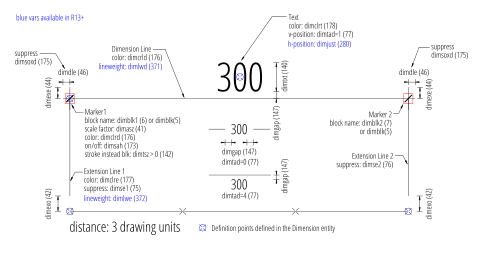
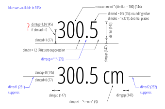
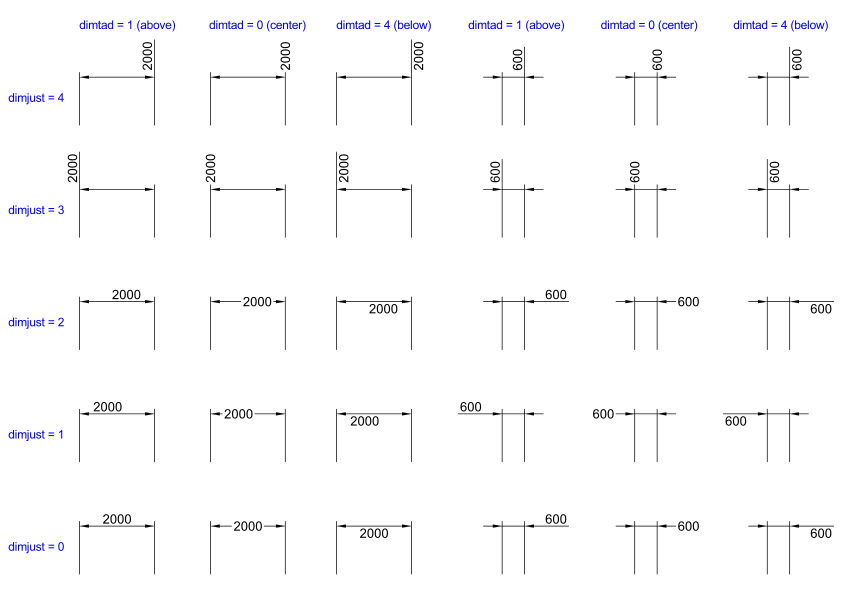

.. _DIMSTYLE Table:

DIMSTYLE Table
==============

The `DIMSTYLE`_ table stores all dimension style definitions of a DXF drawing.

You have access to the dimension styles table by the attribute :attr:`Drawing.dimstyles`.

.. seealso::

    - DXF Reference: `TABLES Section`_
    - DXF Reference: `DIMSTYLE`_ Table

Table Structure DXF R12
-----------------------

.. code-block:: none

    0           <<< start of table
    TABLE
    2           <<< set table type
    DIMSTYLE
    70          <<< count of line types defined in this table, AutoCAD ignores this value
    9
    0           <<< 1. DIMSTYLE table entry
    DIMSTYLE
                <<< DIMSTYLE data tags
    0           <<< 2. DIMSTYLE table entry
    DIMSTYLE
                <<< DIMSTYLE data tags and so on
    0           <<< end of DIMSTYLE table
    ENDTAB

DIMSTYLE Entry DXF R12
----------------------

DIMSTYLE Variables DXF R12
--------------------------

Source: `CADDManger Blog`_

=================== ======= ==============================================================================================
DIMVAR              Code     Description
=================== ======= ==============================================================================================
DIMALT              170     Controls the display of alternate units in dimensions.

DIMALTD             171     Controls the number of decimal places in alternate units. If DIMALT is turned on, DIMALTD sets
                            the number of digits displayed to the right of the decimal point in the alternate measurement.

DIMALTF             143     Controls the multiplier for alternate units. If DIMALT is turned on, DIMALTF multiplies linear
                            dimensions by a factor to produce a value in an alternate system of measurement. The initial
                            value represents the number of millimeters in an inch.

DIMAPOST            4       Specifies a text prefix or suffix (or both) to the alternate dimension measurement for all
                            types of dimensions except angular. For instance, if the current units are Architectural,
                            DIMALT is on, DIMALTF is 25.4 (the number of millimeters per inch), DIMALTD is 2, and DIMPOST
                            is set to "mm", a distance of 10 units would be displayed as 10"[254.00mm].

DIMASZ              41      Controls the size of dimension line and leader line arrowheads. Also controls the size of hook
                            lines. Multiples of the arrowhead size determine whether dimension lines and text should fit
                            between the extension lines. DIMASZ is also used to scale arrowhead blocks if set by DIMBLK.
                            DIMASZ has no effect when DIMTSZ is other than zero.

DIMBLK              5       Sets the arrowhead block displayed at the ends of dimension lines.

DIMBLK1             6       Sets the arrowhead for the first end of the dimension line when DIMSAH is 1.

DIMBLK2             7       Sets the arrowhead for the second end of the dimension line when DIMSAH is 1.

DIMCEN              141     Controls drawing of circle or arc center marks and centerlines by the DIMCENTER, DIMDIAMETER,
                            and DIMRADIUS commands.  For DIMDIAMETER and DIMRADIUS, the center mark is drawn only if you
                            place the dimension line outside the circle or arc.

                            - 0 =  No center marks or lines are drawn
                            - <0 = Centerlines are drawn
                            - >0 = Center marks are drawn

DIMCLRD             176     Assigns colors to dimension lines, arrowheads, and dimension leader lines.

                            - 0 =  BYBLOCK
                            - 1-255 = ACI AutoCAD Color Index
                            - 256 =  BYLAYER

DIMCLRE             177     Assigns colors to dimension extension lines, values like DIMCLRD

DIMCLRT             178     Assigns colors to dimension text, values like DIMCLRD

DIMDLE              46      Sets the distance the dimension line extends beyond the extension line when oblique strokes
                            are drawn instead of arrowheads.

DIMDLI              43      Controls the spacing of the dimension lines in baseline dimensions. Each dimension line is
                            offset from the previous one by this amount, if necessary, to avoid drawing over it. Changes
                            made with DIMDLI are not applied to existing dimensions.

DIMEXE              44      Specifies how far to extend the extension line beyond the dimension line.

DIMEXO              42      Specifies how far extension lines are offset from origin points. With fixed-length extension
                            lines, this value determines the minimum offset.

DIMGAP              147     Sets the distance around the dimension text when the dimension line breaks to accommodate
                            dimension text. Also sets the gap between annotation and a hook line created with the LEADER
                            command. If you enter a negative value, DIMGAP places a box around the dimension text.

                            DIMGAP is also used as the minimum length for pieces of the dimension line. When the default
                            position for the dimension text is calculated, text is positioned inside the extension lines
                            only if doing so breaks the dimension lines into two segments at least as long as DIMGAP.
                            Text placed above or below the dimension line is moved inside only if there is room for the
                            arrowheads, dimension text, and a margin between them at least as large as
                            DIMGAP: 2 * (DIMASZ + DIMGAP).

DIMLFAC             144     Sets a scale factor for linear dimension measurements. All linear dimension distances,
                            including radii, diameters, and coordinates, are multiplied by DIMLFAC before being
                            converted to dimension text. Positive values of DIMLFAC are applied to dimensions in both
                            model space and paper space; negative values are applied to paper space only.

                            DIMLFAC applies primarily to nonassociative dimensions (DIMASSOC set 0 or 1). For
                            nonassociative dimensions in paper space, DIMLFAC must be set individually for each layout
                            viewport to accommodate viewport scaling.

                            DIMLFAC has no effect on angular dimensions, and is not applied to the values held in
                            DIMRND, DIMTM, or DIMTP.

DIMLIM              72      Generates dimension limits as the default text. Setting DIMLIM to On turns DIMTOL off.

                            - 0 = Dimension limits are not generated as default text
                            - 1 = Dimension limits are generated as default text

DIMPOST             3       Specifies a text prefix or suffix (or both) to the dimension measurement.

                            For example, to establish a suffix for millimeters, set DIMPOST to mm; a distance of 19.2
                            units would be displayed as 19.2 mm. If tolerances are turned on, the suffix is applied to
                            the tolerances as well as to the main dimension.

                            Use "<>" to indicate placement of the text in relation to the dimension value. For example,
                            enter "<>mm" to display a 5.0 millimeter radial dimension as "5.0mm". If you entered mm
                            "<>", the dimension would be displayed as "mm 5.0".

DIMRND              45      Rounds all dimensioning distances to the specified value.

                            For instance, if DIMRND is set to 0.25, all distances round to the nearest 0.25 unit. If you
                            set DIMRND to 1.0, all distances round to the nearest integer. Note that the number of
                            digits edited after the decimal point depends on the precision set by DIMDEC. DIMRND does
                            not apply to angular dimensions.

DIMSAH              173     Controls the display of dimension line arrowhead blocks.

                            - 0 = Use arrowhead blocks set by DIMBLK
                            - 1 = Use arrowhead blocks set by DIMBLK1 and DIMBLK2

DIMSCALE            40      Sets the overall scale factor applied to dimensioning variables that specify sizes,
                            distances, or offsets. Also affects the leader objects with the LEADER command.

                            Use MLEADERSCALE to scale multileader objects created with the MLEADER command.

                            * 0.0 = A reasonable default value is computed based on the scaling between the current model
                              space viewport and paper space. If you are in paper space or model space and not using the
                              paper space feature, the scale factor is 1.0.
                            * >0 = A scale factor is computed that leads text sizes, arrowhead sizes, and other scaled
                              distances to plot at their face values.

                            DIMSCALE does not affect measured lengths, coordinates, or angles.

                            Use DIMSCALE to control the overall scale of dimensions. However, if the current dimension
                            style is annotative, DIMSCALE is automatically set to zero and the dimension scale is
                            controlled by the CANNOSCALE system variable. DIMSCALE cannot be set to a non-zero value
                            when using annotative dimensions.

DIMSE1              75      Suppresses display of the first extension line.

                            - 0 = Extension line is not suppressed
                            - 1 = Extension line is suppressed

DIMSE2              76      Suppresses display of the second extension line.

                            - 0 = Extension line is not suppressed
                            - 1 = Extension line is suppressed

DIMSOXD             175     Suppresses arrowheads if not enough space is available inside the extension lines.

                            - 0 = Arrowheads are not suppressed
                            - 1 = Arrowheads are suppressed

                            If not enough space is available inside the extension lines and DIMTIX is on, setting
                            DIMSOXD to On suppresses the arrowheads. If DIMTIX is off, DIMSOXD has no effect.

DIMTAD              77      Controls the vertical position of text in relation to the dimension line.

                            - 0 = Centers the dimension text between the extension lines.
                            - 1 = Places the dimension text above the dimension line except when the dimension line is not
                              horizontal and text inside the extension lines is forced horizontal (DIMTIH = 1). The
                              distance from the dimension line to the baseline of the lowest line of text is the current
                              DIMGAP value.
                            - 2 = Places the dimension text on the side of the dimension line farthest away from the
                              defining points.
                            - 3 = Places the dimension text to conform to Japanese Industrial Standards (JIS).
                            - 4 = Places the dimension text below the dimension line.

DIMTFAC             146     Specifies a scale factor for the text height of fractions and tolerance values relative to
                            the dimension text height, as set by DIMTXT.

                            For example, if DIMTFAC is set to 1.0, the text height of fractions and tolerances is the
                            same height as the dimension text. If DIMTFAC is set to 0.7500, the text height of fractions
                            and tolerances is three-quarters the size of dimension text.

DIMTIH              73      Controls the position of dimension text inside the extension lines for all dimension types
                            except Ordinate.

                            - 0 = Aligns text with the dimension line
                            - 1 = Draws text horizontally

DIMTIX              174     Draws text between extension lines.

                            - 0 = Varies with the type of dimension. For linear and angular dimensions, text is placed
                              inside the extension lines if there is sufficient room. For radius and diameter dimensions
                              hat don’t fit inside the circle or arc, DIMTIX has no effect and always forces the text
                              outside the circle or arc.
                            - 1 = Draws dimension text between the extension lines even if it would ordinarily be placed
                              outside those lines

DIMTM               48      Sets the minimum (or lower) tolerance limit for dimension text when DIMTOL or DIMLIM is on.
                            DIMTM accepts signed values. If DIMTOL is on and DIMTP and DIMTM are set to the same value,
                            a tolerance value is drawn. If DIMTM and DIMTP values differ, the upper tolerance is drawn
                            above the lower, and a plus sign is added to the DIMTP value if it is positive. For DIMTM,
                            the program uses the negative of the value you enter (adding a minus sign if you specify a
                            positive number and a plus sign if you specify a negative number).

DIMTOFL             172     Controls whether a dimension line is drawn between the extension lines even when the text
                            is placed outside. For radius and diameter dimensions (when DIMTIX is off), draws a
                            dimension line inside the circle or arc and places the text, arrowheads, and leader outside.

                            - 0 = Does not draw dimension lines between the measured points when arrowheads are placed
                              outside the measured points
                            - 1 = Draws dimension lines between the measured points even when arrowheads are placed
                              outside the measured points

DIMTOH              74      Controls the position of dimension text outside the extension lines.

                            - 0 = Aligns text with the dimension line
                            - 1 = Draws text horizontally

DIMTOL              71      Appends tolerances to dimension text. Setting DIMTOL to on turns DIMLIM off.

DIMTP               47      Sets the maximum (or upper) tolerance limit for dimension text when DIMTOL or DIMLIM is on.
                            DIMTP accepts signed values. If DIMTOL is on and DIMTP and DIMTM are set to the same value,
                            a tolerance value is drawn. If DIMTM and DIMTP values differ, the upper tolerance is drawn
                            above the lower and a plus sign is added to the DIMTP value if it is positive.

DIMTSZ              142     Specifies the size of oblique strokes drawn instead of arrowheads for linear, radius, and
                            diameter dimensioning.

                            - 0 = Draws arrowheads.
                            - >0 = Draws oblique strokes instead of arrowheads. The size of the oblique strokes is
                              determined by this value multiplied by the DIMSCALE value

DIMTVP              145     Controls the vertical position of dimension text above or below the dimension line. The
                            DIMTVP value is used when DIMTAD = 0. The magnitude of the vertical offset of text is
                            the product of the text height and DIMTVP. Setting DIMTVP to 1.0 is equivalent to setting
                            DIMTAD = 1. The dimension line splits to accommodate the text only if the absolute value
                            of DIMTVP is less than 0.7.

DIMTXT              140     Specifies the height of dimension text, unless the current text style has a fixed height.

DIMZIN              78      Controls the suppression of zeros in the primary unit value. Values 0-3 affect
                            feet-and-inch dimensions only:

                            - 0 = Suppresses zero feet and precisely zero inches
                            - 1 = Includes zero feet and precisely zero inches
                            - 2 = Includes zero feet and suppresses zero inches
                            - 3 = Includes zero inches and suppresses zero feet
                            - 4 (Bit 3) = Suppresses leading zeros in decimal dimensions (for example, 0.5000 becomes .5000)
                            - 8 (Bit 4) = Suppresses trailing zeros in decimal dimensions (for example, 12.5000 becomes 12.5)
                            - 12 (Bit 3+4) = Suppresses both leading and trailing zeros (for example, 0.5000 becomes .5)
=================== ======= ==============================================================================================

Table Structure DXF R2000+
--------------------------

.. code-block:: none

    0           <<< start of table
    TABLE
    2           <<< set table type
    DIMSTYLE
    5           <<< DIMSTYLE table handle
    5F
    330         <<< owner tag, tables has no owner
    0
    100         <<< subclass marker
    AcDbSymbolTable
    70          <<< count of dimension styles defined in this table, AutoCAD ignores this value
    9
    0           <<< 1. DIMSTYLE table entry
    DIMSTYLE
                <<< DIMSTYLE data tags
    0           <<< 2. DIMSTYLE table entry
    DIMSTYLE
                <<< DIMSTYLE data tags and so on
    0           <<< end of DIMSTYLE table
    ENDTAB

Additional DIMSTYLE Variables DXF R13/14
----------------------------------------

Source: `CADDManger Blog`_

=================== ======= ==============================================================================================
DIMVAR              code    Description
=================== ======= ==============================================================================================
DIMADEC             179     Controls the number of precision places displayed in angular dimensions.

DIMALTTD            274     Sets the number of decimal places for the tolerance values in the alternate units of a
                            dimension.

DIMALTTZ            286     Controls suppression of zeros in tolerance values.

DIMALTU             273     Sets the units format for alternate units of all dimension substyles except Angular.

DIMALTZ             285     Controls the suppression of zeros for alternate unit dimension values. DIMALTZ values 0-3
                            affect feet-and-inch dimensions only.

DIMAUNIT            275     Sets the units format for angular dimensions.

                            - 0 = Decimal degrees
                            - 1 = Degrees/minutes/seconds
                            - 2 = Grad
                            - 3 = Radians

DIMBLK_HANDLE       342     defines DIMBLK as handle to the BLOCK RECORD entry

DIMBLK1_HANDLE      343     defines DIMBLK1 as handle to the BLOCK RECORD entry

DIMBLK2_HANDLE      344     defines DIMBLK2 as handle to the BLOCK RECORD entry

DIMDEC              271     Sets the number of decimal places displayed for the primary units of a dimension. The
                            precision is based on the units or angle format you have selected.

DIMDSEP             278     Specifies a single-character decimal separator to use when creating dimensions whose unit
                            format is decimal. When prompted, enter a single character at the Command prompt. If
                            dimension units is set to Decimal, the DIMDSEP character is used instead of the default
                            decimal point. If DIMDSEP is set to NULL (default value, reset by entering a period), the
                            decimal point is used as the dimension separator.

DIMJUST             280     Controls the horizontal positioning of dimension text.

                            - 0 = Positions the text above the dimension line and center-justifies it between the extension lines
                            - 1 = Positions the text next to the first extension line
                            - 2 = Positions the text next to the second extension line
                            - 3 = Positions the text above and aligned with the first extension line
                            - 4 =  =Positions the text above and aligned with the second extension line

DIMSD1              281     Controls suppression of the first dimension line and arrowhead. When turned on, suppresses
                            the display of the dimension line and arrowhead between the first extension line and the
                            text.

                            - 0 = First dimension line is not suppressed
                            - 1 = First dimension line is suppressed

DIMSD2              282     Controls suppression of the second dimension line and arrowhead. When turned on, suppresses
                            the display of the dimension line and arrowhead between the second extension line and the text.

                            - 0 = Second dimension line is not suppressed
                            - 1 = Second dimension line is suppressed

DIMTDEC             272     Sets the number of decimal places to display in tolerance values for the primary units in a
                            dimension. This system variable has no effect unless DIMTOL is set to On. The default for
                            DIMTOL is Off.

DIMTOLJ             283     Sets the vertical justification for tolerance values relative to the nominal dimension text.
                            This system variable has no effect unless DIMTOL is set to On. The default for DIMTOL is Off.

                            - 0 = Bottom
                            - 1 = Middle
                            - 2 = Top

DIMTXSTY_HANDLE     340     Specifies the text style of the dimension as handle to STYLE table entry

DIMTZIN             284     Controls the suppression of zeros in tolerance values.

                            Values 0-3 affect feet-and-inch dimensions only.

                            - 0 = Suppresses zero feet and precisely zero inches
                            - 1 = Includes zero feet and precisely zero inches
                            - 2 = Includes zero feet and suppresses zero inches
                            - 3 = Includes zero inches and suppresses zero feet
                            - 4 = Suppresses leading zeros in decimal dimensions (for example, 0.5000 becomes .5000)
                            - 8 = Suppresses trailing zeros in decimal dimensions (for example, 12.5000 becomes 12.5)
                            - 12 = Suppresses both leading and trailing zeros (for example, 0.5000 becomes .5)

DIMUPT              288     Controls options for user-positioned text.

                            - 0 = Cursor controls only the dimension line location
                            - 1 = Cursor controls both the text position and the dimension line location
=================== ======= ==============================================================================================

Additional DIMSTYLE Variables DXF R2000
---------------------------------------

Source: `CADDManger Blog`_

=================== ======= ==============================================================================================
DIMVAR              Code    Description
=================== ======= ==============================================================================================
DIMALTRND           148     Rounds off the alternate dimension units.

DIMATFIT            289     Determines how dimension text and arrows are arranged when space is not sufficient to place
                            both within the extension lines.

                            - 0 = Places both text and arrows outside extension lines
                            - 1 = Moves arrows first, then text
                            - 2 = Moves text first, then arrows
                            - 3 = Moves either text or arrows, whichever fits best

                            A leader is added to moved dimension text when DIMTMOVE is set to 1.

DIMAZIN             79      Suppresses zeros for angular dimensions.

                            - 0 = Displays all leading and trailing zeros
                            - 1 = Suppresses leading zeros in decimal dimensions (for example, 0.5000 becomes .5000)
                            - 2 = Suppresses trailing zeros in decimal dimensions (for example, 12.5000 becomes 12.5)
                            - 3 = Suppresses leading and trailing zeros (for example, 0.5000 becomes .5)

DIMFRAC             276     Sets the fraction format when DIMLUNIT is set to 4 (Architectural) or 5 (Fractional).

                            - 0 = Horizontal stacking
                            - 1 = Diagonal stacking
                            - 2 = Not stacked (for example, 1/2)

DIMLDRBLK_HANDLE    341     Specifies the arrow type for leaders. Handle to BLOCK RECORD

DIMLUNIT            277     Sets units for all dimension types except Angular.

                            - 1 = Scientific
                            - 2 = Decimal
                            - 3 = Engineering
                            - 4 = Architectural (always displayed stacked)
                            - 5 = Fractional (always displayed stacked)
                            - 6 = Microsoft Windows Desktop (decimal format using Control Panel settings for decimal
                              separator and number grouping symbols)

DIMLWD              371     Assigns lineweight to dimension lines.

                            * -3 = Default (the LWDEFAULT value)
                            * -2 = BYBLOCK
                            * -1 = BYLAYER

DIMLWE              372     Assigns lineweight to extension lines.

                            * -3 = Default (the LWDEFAULT value)
                            * -2 = BYBLOCK
                            * -1 = BYLAYER

DIMTMOVE            279     Sets dimension text movement rules.

                            - 0 = Moves the dimension line with dimension text
                            - 1 = Adds a leader when dimension text is moved
                            - 2 = Allows text to be moved freely without a leader
=================== ======= ==============================================================================================

Text Location
-------------

This image shows the default text locations created by `BricsCAD`_ for dimension variables ``dimtad`` and ``dimjust``:

Unofficial DIMSTYLE Variables for DXF R2007 and later
-----------------------------------------------------

The following DIMVARS are **not documented** in the `DXF Reference`_ by Autodesk.

=================== ======= ============================================================================================
DIMVAR              Code    Description
=================== ======= ============================================================================================
DIMEXFIX            290     Extension line has fixed length if set to 1
DIMEXLEN            49      Length of extension line below dimension line if fixed (DIMEXFIX is 1), DIMEXE defines the
                            the length above the dimension line
DIMLTYPE_HANDLE     345     Specifies the LINETYPE of the dimension line. Handle to LTYPE table entry
DIMLTEX1_HANDLE     346     Specifies the LINETYPE of the extension line 1. Handle to LTYPE table entry
DIMLTEX2_HANDLE     347     Specifies the LINETYPE of the extension line 2. Handle to LTYPE table entry
=================== ======= ============================================================================================

Extended Settings as Special XDATA Groups
-----------------------------------------

Prior to DXF R2007, some extended settings for the dimension and the extension lines are stored in the XDATA section by
following entries, this is not documented by `Autodesk`_:

.. code-block:: none

    1001
    ACAD_DSTYLE_DIM_LINETYPE        <<< linetype for dimension line
    1070
    380                             <<< group code, which differs from R2007 DIMDLTYPE
    1005
    FFFF                            <<< handle to LTYPE entry
    1001
    ACAD_DSTYLE_DIM_EXT1_LINETYPE   <<< linetype for extension line 1
    1070
    381                             <<< group code, which differs from R2007 DIMLTEX1
    1005
    FFFF                            <<< handle to LTYPE entry
    1001
    ACAD_DSTYLE_DIM_EXT2_LINETYPE   <<< linetype for extension line 1
    1070
    382                             <<< group code, which differs from R2007 DIMLTEX2
    1005
    FFFF                            <<< handle to LTYPE entry
    1001
    ACAD_DSTYLE_DIMEXT_ENABLED      <<< extension line fixed
    1070
    383                             <<< group code, which differs from R2007 DIMEXFIX
    1070
    1                               <<< fixed if 1 else 0
    1001
    ACAD_DSTYLE_DIMEXT_LENGTH       <<< extension line fixed length
    1070
    378                             <<< group code, which differs from R2007 DIMEXLEN
    1040
    1.33                            <<< length of extension line below dimension line

This XDATA groups requires also an appropriate APPID entry in the APPID table. This feature is not supported by `ezdxf`.

.. _DIMSTYLE: http://help.autodesk.com/view/OARX/2018/ENU/?guid=GUID-F2FAD36F-0CE3-4943-9DAD-A9BCD2AE81DA

.. _TABLES Section: http://help.autodesk.com/view/OARX/2018/ENU/?guid=GUID-A9FD9590-C97B-4E41-9F26-BD82C34A4F9F

.. _CADDManger Blog: http://www.caddmanager.com/CMB/2009/09/cad-standards-autocad-dimension-variables/

.. include:: reflinks.inc
