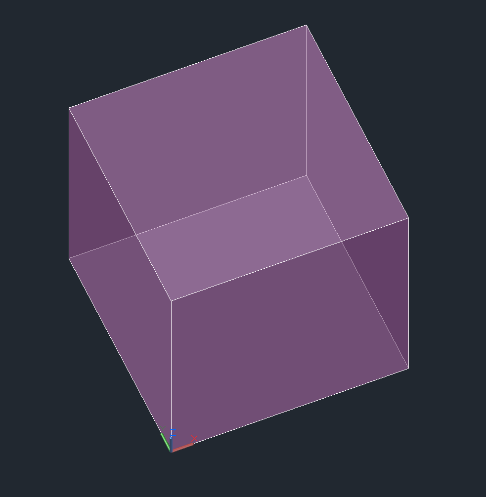
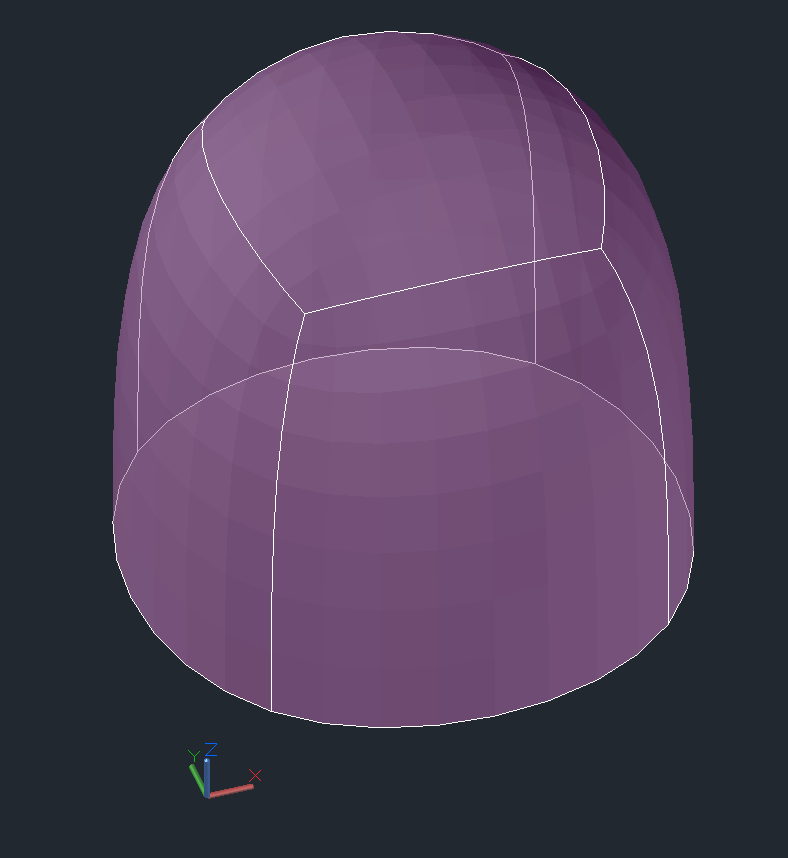
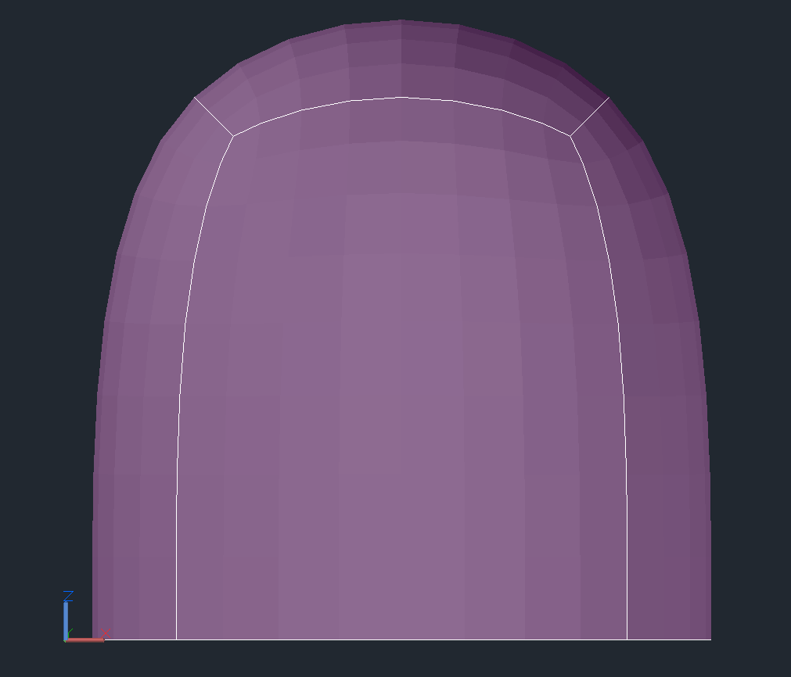
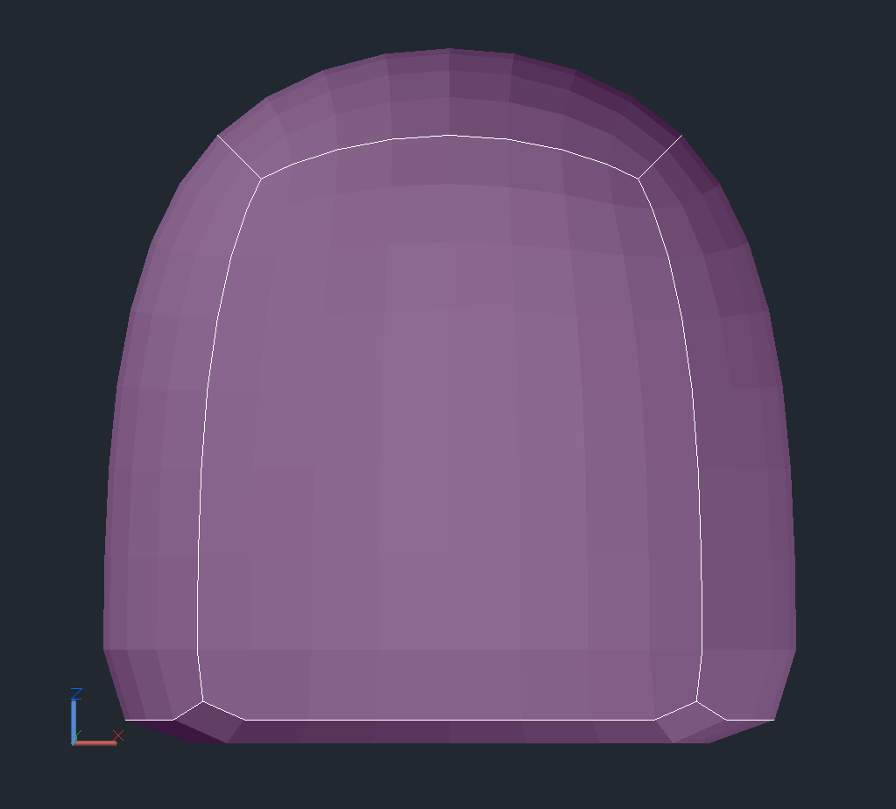
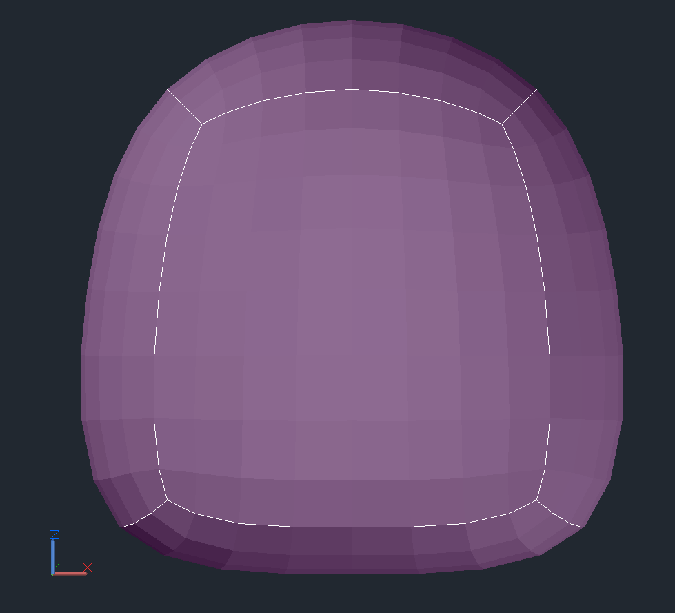

.. _MESH Internals:

MESH Internals
==============

The MESH entity is the compact version of the PolyFaceMesh implemented by the
:class:`~ezdxf.entities.Polyline` entity . The entity stores the vertices, edges
and faces in a single entity and was introduced in DXF version R13/R14.
For more information about the top level stuff go to the
:class:`~ezdxf.entities.Mesh` class.

.. seealso::

    - DXF Reference: `MESH`_
    - :class:`ezdxf.entities.Mesh` class

The following DXF code represents this cube with subdivision level of 0:

.. code-block:: Text

    0
    MESH            <<< DXF type
    5               <<< entity handle
    2F
    330             <<< block record handle of owner layout
    17
    100
    AcDbEntity
    8
    0               <<< layer
    62
    6               <<< color
    100
    AcDbSubDMesh    <<< subclass marker
    71
    2               <<< version
    72
    1               <<< blend crease, 1 is "on", 0 is "off"
    91
    0               <<< subdivision level is 0
    92
    8               <<< vertex count, 8 cube corners
    10              <<< 1. vertex, x-axis
    0.0
    20              <<< y-axis
    0.0
    30              <<< z-axis
    0.0
    10              <<< 2. vertex
    1.0
    20
    0.0
    30
    0.0
    10              <<< 3. vertex
    1.0
    20
    1.0
    30
    0.0
    10              <<< 4. vertex
    0.0
    20
    1.0
    30
    0.0
    10              <<< 5. vertex
    0.0
    20
    0.0
    30
    1.0
    10              <<< 6. vertex
    1.0
    20
    0.0
    30
    1.0
    10              <<< 7. vertex
    1.0
    20
    1.0
    30
    1.0
    10              <<< 8. vertex
    0.0
    20
    1.0
    30
    1.0
    93              <<< size of face list
    30              <<< size  = count of group code 90 tags = 6 x 5
    90              <<< vertex count of face 1
    4               <<< MESH supports ngons, count = 3, 4, 5, 6 ...
    90
    0       <<< face 1, index of 1. vertex
    90
    3       <<< face 1, index of 2. vertex
    90
    2       <<< face 1, index of 3. vertex
    90
    1       <<< face 1, index of 4. vertex
    90
    4               <<< vertex count of face 2
    90
    4       <<< face 2, index of 1. vertex
    90
    5       <<< face 2, index of 2. vertex
    90
    6       <<< face 2, index of 3. vertex
    90
    7       <<< face 2, index of 4. vertex
    90
    4               <<< vertex count of face 3
    90
    0       <<< face 3, index of 1. vertex
    90
    1       <<< face 3, index of 2. vertex
    90
    5       <<< face 3, index of 3. vertex
    90
    4       <<< face 3, index of 4. vertex
    90
    4               <<< vertex count of face 4
    90
    1       <<< face 4, index of 1. vertex
    90
    2       <<< face 4, index of 2. vertex
    90
    6       <<< face 4, index of 3. vertex
    90
    5       <<< face 4, index of 4. vertex
    90
    4               <<< vertex count of face 5
    90
    3       <<< face 5, index of 1. vertex
    90
    7       <<< face 5, index of 2. vertex
    90
    6       <<< face 5, index of 3. vertex
    90
    2       <<< face 5, index of 4. vertex
    90
    4               <<< vertex count of face 6
    90
    0       <<< face 6, index of 1. vertex
    90
    4       <<< face 6, index of 2. vertex
    90
    7       <<< face 6, index of 3. vertex
    90
    3       <<< face 6, index of 4. vertex
    94          <<< edge count, each edge has exact two group code 90 tags
    4           <<< the real edge count not the group code 90 tags!
    90
    0       <<< edge 1, vertex 1
    90
    1       <<< edge 1, vertex 1
    90
    1       <<< edge 2, vertex 1
    90
    2       <<< edge 2, vertex 2
    90
    2       <<< edge 3, vertex 1
    90
    3       <<< edge 3, vertex 2
    90
    3       <<< edge 4, vertex 1
    90
    0       <<< edge 4, vertex 2
    95          <<< edge crease count, has to match edge count!
    4
    140
    3.0     <<< crease value for edge 1
    140
    3.0     <<< crease value for edge 2
    140
    3.0     <<< crease value for edge 3
    140
    3.0     <<< crease value for edge 4
    90          <<< property overwrite???
    0

The edge and crease data have only a meaning if subdividing is applied!
A crease value equal to the subdivision level prevents subdividing for the
edge completely, a value between 0.0 and the subdivision level applies
subdividing partially.

The cube with subdivision level of 3 and crease values of 3.0:

Front view for better details:

The cube with subdivision levels of 3 and crease values of 2.0:

The cube with subdivision level of 3 and crease values of 1.0:

The property overriding protocol is not documented in the DXF reference
and currently I have no access to a CAD application which can created
property overriding.

.. _MESH: https://help.autodesk.com/view/OARX/2018/ENU/?guid=GUID-4B9ADA67-87C8-4673-A579-6E4C76FF7025