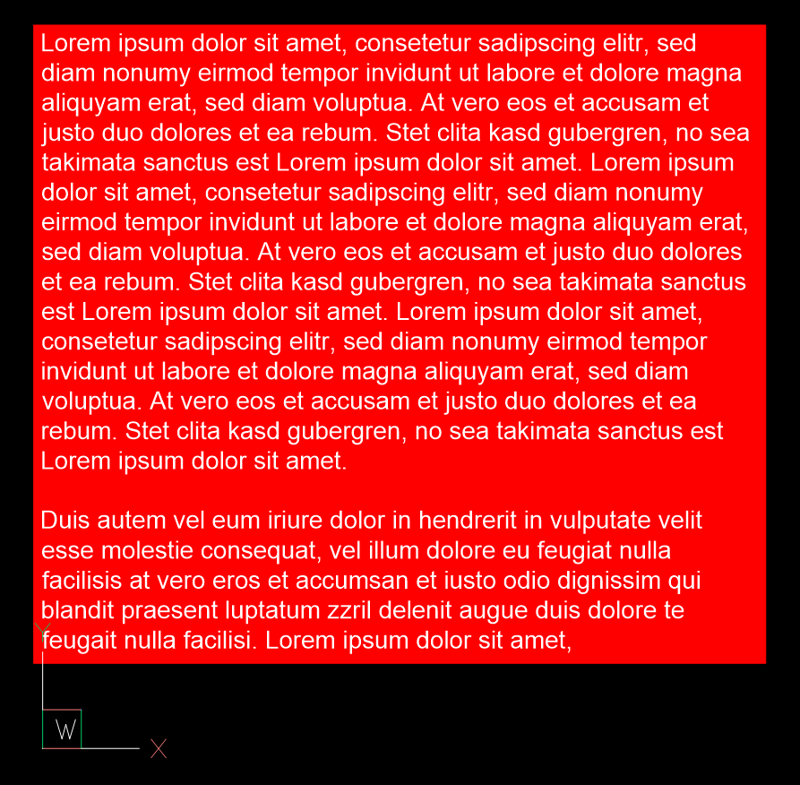
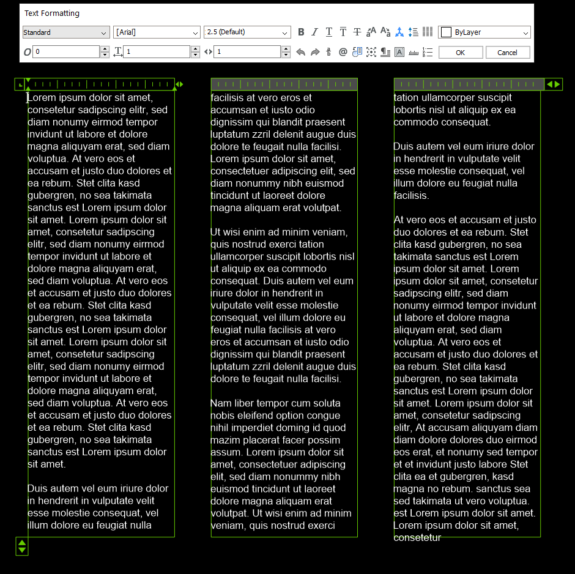
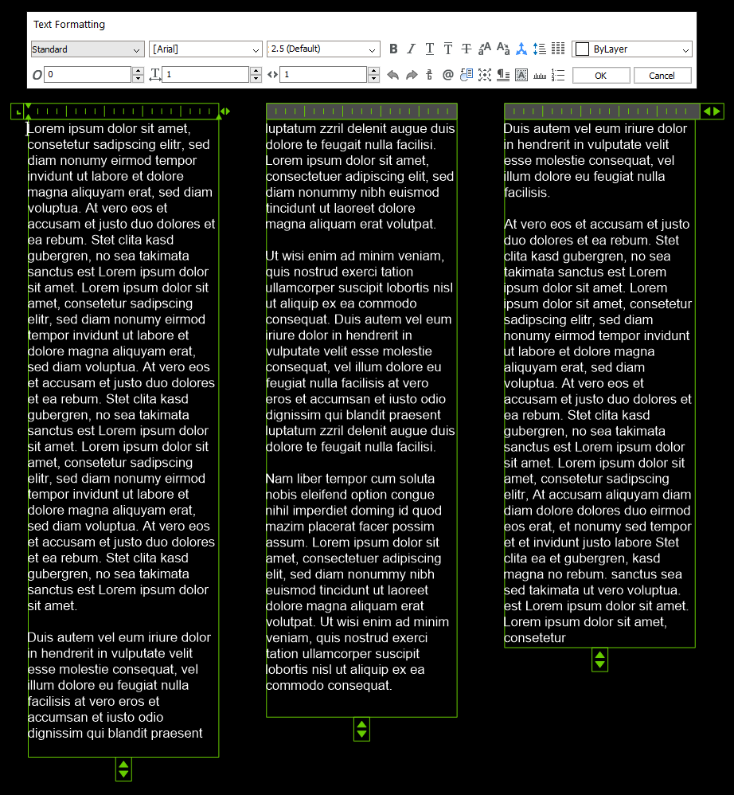

.. _MTEXT Internals:

MTEXT Internals
===============

The MTEXT entity stores multiline text in a single entity and was introduced
in DXF version R13/R14. For more information about the top level stuff go to
the :class:`~ezdxf.entities.MText` class.

.. seealso::

    - DXF Reference: `MTEXT`_
    - :class:`ezdxf.entities.MText` class

Orientation
-----------

The MTEXT entity does not establish an OCS. The entity has a :attr:`text_direction`
attribute, which defines the local x-axis, the :attr:`extrusion` attribute defines
the normal vector and the y-axis = extrusion cross x-axis.

The MTEXT entity can have also a :attr:`rotation` attribute (in degrees), the x-axis
attribute has higher priority than the :attr:`rotation` attribute, but it is not clear
how to convert the :attr:`rotation` attribute into a :attr:`text_direction` vector,
but for most common cases, where only the :attr:`rotation` attribute is present,
the :attr:`extrusion` is most likely the WCS z-axis and the :attr:`rotation` is
the direction in the xy-plane.

Text Content
------------

The content text is divided across multiple tags of group code 3 and 1, the last
line has the group code 1, each line can have a maximum line length of 255 bytes,
but BricsCAD (and AutoCAD?) store only 249 bytes in single line and one byte is
not always one char.

Inline Code Specials
--------------------

The text formatting is done by inline codes, see the
:class:`~ezdxf.entities.MText` class.

Information gathered by implementing the :class:`MTextEditor` and the
:class:`MTextParser` classes:

- caret encoded characters:
    - "^I" tabulator
    - "^J" (LF) is a valid line break like "\\P"
    - "^M" (CR) is ignored
    - other characters render as empty square "▯"
    - a space " " after the caret renders the caret glyph: "1^ 2" renders "1^2"

- special encoded characters:
    - "%%c" and "%%C" renders "Ø" (alt-0216)
    - "%%d" and "%%D" renders "°" (alt-0176)
    - "%%p" and "%%P" renders "±" (alt-0177)

- Alignment command "\\A": argument "0", "1" or "2" is expected
    - the terminator symbol ";" is optional
    - the arguments "3", "4", "5", "6", "7", "8", "9" and "-" default to 0
    - other characters terminate the command and will be printed: "\\AX", renders "X"

- ACI color command "\\C": int argument is expected
    - the terminator symbol ";" is optional
    - a leading "-" or "+" terminates the command, "\\C+5" renders "\\C+5"
    - arguments > 255, are ignored but consumed "\\C1000" renders nothing, not
      even a "0"
    - a trailing ";" after integers is always consumed, even for much to big
      values, "\\C10000;" renders nothing

- RGB color command "\\c": int argument is expected
    - the terminator symbol ";" is optional
    - a leading "-" or "+" terminates the command, "\\c+255" renders "\\c+255"
    - arguments >= 16777216 are masked by: value & 0xFFFFFF
    - a trailing ";" after integers is always consumed, even for much to big
      values, "\\c9999999999;" renders nothing and switches the color to
      yellow (255, 227, 11)

- Height command "\\H" and "\\H...x": float argument is expected
    - the terminator symbol ";" is optional
    - a leading "-" is valid, but negative values are ignored
    - a leading "+" is valid
    - a leading "." is valid like "\\H.5x" for height factor 0.5
    - exponential format is valid like "\\H1e2" for height factor 100 and
      "\\H1e-2" for 0.01
    - an invalid floating point value terminates the command,
      "\\H1..5" renders "\\H1..5"

- Other commands with floating point arguments like the height command:
    - Width commands "\\W" and "\\W...x"
    - Character tracking commands "\\T" and "\\T...x", negative values are used
    - Slanting (oblique) command "\\Q"

- Stacking command "\\S":
    - build fractions: "numerator (upr)" + "stacking type char (t)" + "denominator (lwr)" + ";"
    - divider chars: "^", "/" or "#"
    - a space " " after the divider char "^" is mandatory to avoid caret
      decoding: "\\S1^ 2;"
    - the terminator symbol ";" is mandatory to end the command, all
      chars beyond the "\\S" until the next ";" or the end of the string
      are part of the fraction
    - backslash escape "\\;" to render the terminator char
    - a space " " after the divider chars "/" and "#" is rendered as space " "
      in front of the denominator
    - the numerator and denominator can contain spaces
    - backslashes "\\" inside the stacking command are ignored (except "\\;")
      "\\S\\N^ \\P" render "N" over "P", therefore property changes (color, text
      height, ...) are not possible inside the stacking command
    - grouping chars "{" and "}" render as simple curly braces
    - caret encoded chars are decoded "^I", "^J", "^M", but render as a simple
      space " " or as the replacement char "▯" plus a space
    - a divider char after the first divider char, renders as the char itself:
      "\\S1/2/3" renders the horizontal fraction "1" / "2/3"

- Font command "\\f" and "\\F": export only "\\f", parse both, "\\F" ignores some arguments
    - the terminator symbol ";" is mandatory to end the command, all
      chars beyond the "\\f" until the next ";" or the end of the string
      are part of the command
    - the command arguments are separated by the pipe char "|"
    - arguments: "font family name" | "bold" | "italic" | "codepage" | "pitch";
      example "\\fArial|b0|i0|c0|p0;"
    - only the "font family name" argument is required, fonts which are not
      available on the system are replaced by the "TXT.SHX" shape font
    - the "font family name" is the font name shown in font selection widgets in
      desktop applications
    - "b1" to use the bold font style, any other second char is interpreted as "non bold"
    - "i1" to use an italic font style, any other second char is interpreted as "non italic"
    - "c???" change codepage, "c0" use the default codepage, because of the age
      of unicode no further investigations, also seems to be ignored by AutoCAD
      and BricsCAD
    - "p???" change pitch size, "p0" means don't change, ignored by AutoCAD and
      BricsCAD, to change the text height use the "\\H" command
    - the order is not important, but export always in the shown order:
      "\\fArial|b0|i0;" the arguments "c0" and "p0" are not required

- Paragraph properties command "\\p"
    - the terminator symbol ";" is mandatory to end the command, all
      chars beyond the "\\p" until the next ";" or the end of the string
      are part of the command
    - the command arguments are separated by commas ","
    - all values are factors for the initial char height of the MTEXT entity,
      example: char height = 2.5, "\\pl1;" set the left paragraph indentation
      to 1 x 2.5 = 2.5 drawing units.
    - all values are floating point values, see height command
    - arguments are "i", "l", "r", "q", "t"
    - a "\*" as argument value, resets the argument to the initial value: "i0",
      "l0", "r0", the "q" argument most likely depends on the text direction;
      I haven't seen "t\*". The sequence used by BricsCAD to reset all values
      is ``"\pi*,l*,r*,q*,t;"``
    - "i" indentation of the first line relative to the "l" argument as floating
      point value, "\\pi1.5"
    - "l" left paragraph indentation as floating point value, "\\pl1.5"
    - "r" right paragraph indentation as floating point value, "\\pr1.5"
    - "x" is required if a "q" or a "t" argument is present, the placement of
      the "x" has no obvious rules
    - "q" paragraph alignment

        - "ql" left paragraph alignment
        - "qr" right paragraph alignment
        - "qc" center paragraph alignment
        - "qj" justified paragraph alignment
        - "qd" distributed paragraph alignment

    - "t" tabulator stops as comma separated list, the default tabulator stops
      are located at 4, 8, 12, ..., by defining at least one tabulator stop,
      the default tabulator stops wil be ignored.
      There 3 kind of tabulator stops: left, right and center adjusted stops,
      e.g. "\pxt1,r5,c8":

        - a left adjusted stop has no leading char, two left adjusted stops "\\pxt1,2;"
        - a right adjusted stop has a preceding "r" char, "\\pxtr1,r2;"
        - a center adjusted stop has a preceding "c" char, "\\pxtc1,c2;"

      complex example to create a numbered list with two items:
      ``"pxi-3,l4t4;1.^Ifirst item\P2.^Isecond item"``
    - a parser should be very flexible, I have seen several different orders of
      the arguments and placing the sometimes required "x" has no obvious rules.
    - exporting seems to be safe to follow these three rules:

        1. the command starts with "\\px", the "x" does no harm, if not required
        2. argument order "i", "l", "r", "q", "t", any of the arguments can be left off
        3. terminate the command with a ";"

Height Calculation
------------------

There is no reliable way to calculate the MTEXT height from the existing DXF
attributes. The :attr:`rect_height` (group code 43) attribute is not required
and seldom present.
DXF R2007 introduced the :attr:`defined_height` attribute to store the defined
column height of the MTEXT entity but only in column mode. MTEXT entities without
columns, except MTEXT entities created with column type "No Columns",
store always 0.0 as defined column height. Which seems to mean: defined by the
rendered text content.

The only way to calculate the MTEXT height is to replicate the rendering
results of AutoCAD/BricsCAD by implementing a rendering engine for MTEXT.

In column mode the MTEXT height is stored for every column for DXF version
before R2018. In DXF R2018+ the column heights are only stored if
:attr:`MTextColumns.auto_height` is ``False``. If :attr:`MTextColumns.auto_height`
is ``True``. But DXF R2018+ stores the MTEXT total width and height
in explicit attributes.

Width Calculation
-----------------

The situation for width calculation is better than for the height calculation,
but the attributes :attr:`width` and :attr:`rect_width` are not mandatory.

There is a difference between MTEXT entities with and without columns:

Without columns the attribute :attr:`width` (reference column width) contains
the true entity width if present. A long word can overshoot this width!
The :attr:`rect_width` attribute is seldom present.

For MTEXT with columns, the :attr:`width` attribute is maybe wrong, the correct
width for a column is stored in the :attr:`column_width` attribute and the
:attr:`total_width` attribute stores the total width of the MTEXT entity
overall columns, see also following section "Column Support".

Background Filling
------------------

The background fill support is available for DXF R2007+.
The group code 90 defines the kind of background fill:

=== ================================
0   off
1   color defined by group code 63, 421 or 431
2   drawing window color
3   background (canvas) color
16  bit-flag text frame, see Open Design Alliance Specification 20.4.46
=== ================================

Group codes to define background fill attributes:

=== ===============================
45  scaling factor for the border around the text, the value should be in the
    range of [1, 5], where 1 fits exact the MText entity
63  set the background color by :term:`ACI`.
421 set the background color as :term:`true color` value.
431 set the background color by color name - no idea how this works
441 set the transparency of the background fill, not supported by AutoCAD or BricsCAD.
=== ===============================

Group codes 45, 90 and 63 are required together if one of them is used.
The group code 421 and 431 also requires the group code 63, even this value
is ignored.

.. code-block:: Text

    ... <snip>
    1 <str> eu feugiat nulla facilisis at vero eros et accumsan et iusto ...
    73 <int> 1
    44 <float> 1.0
    90 <int> 1, b00000001   <<< use a color
    63 <int> 1              <<< ACI color (red)
    45 <float> 1.5          <<< bg scaling factor, relative to the char height
    441 <int> 0             <<< ignored (optional)
    ... <snip>

The background scaling does not alter the :attr:`width`, :attr:`column_width`
or :attr:`total_width` attributes. The background acquires additional space
around the MTEXT entity.

Columns with background color:

Text Frame
----------

The MTEXT entity can have a text frame only, without a background filling,
group code 90 has value 16. In this case all other background related tags
are removed (45, 63, 421, 431, 441) and the scaling factor is 1.5 by default.

XDATA for Text Frame
++++++++++++++++++++

This XDATA exist only if the text frame flag in group code 90 is set and the
DXF versions < R2018!

.. code-block:: Text

    ...  <snip>
    1001 <ctrl> ACAD
    1000 <str> ACAD_MTEXT_TEXT_BORDERS_BEGIN
    1070 <int> 80       <<< group code for repeated flags
    1070 <int> 16       <<< repeated group code 90?
    1070 <int> 46       <<< group code for scaling factor, which is fixed?
    1040 <float> 1.5    <<< scaling factor
    1070 <int> 81       <<< group code for repeated flow direction?
    1070 <int> 1        <<< flow direction?
    1070 <int> 5        <<< group code for a handle, multiple entries possible
    1005 <hex> #A8      <<< handle to the LWPOLYLINE text frame
    1070 <int> 5        <<< group code for next handle
    1005 <hex> #A9      <<< next handle
    ...
    1000 <str> ACAD_MTEXT_TEXT_BORDERS_END

Extra LWPOLYLINE Entity as Text Frame
+++++++++++++++++++++++++++++++++++++

The newer versions of AutoCAD and BricsCAD get all the information they need
from the MTEXT entity, but it seems that older versions could not handle the
text frame property correct. Therefore AutoCAD and BricsCAD create a separated
LWPOLYLINE entity for the text frame for DXF versions < R2018.
The handle to this text frame entity is stored in the XDATA as group code 1005,
see section above.

Because this LWPOLYLINE is not required *ezdxf* does **not** create such a text
frame entity nor the associated XDATA and *ezdxf* also **removes** this data
from loaded DXF files at the second loading stage.

Column Support
--------------

CAD applications build multiple columns by linking 2 or more MTEXT entities
together. In this case each column is a self-sufficient entity in DXF version
R13 until R2013. The additional columns specifications are stored in the XDATA
if the MTEXT which represents the first column.

DXF R2018 changed the implementation into a single MTEXT entity which contains
all the content text at once and stores the column specification in an
embedded object.

.. hint::

    The :attr:`width` attribute for the linked MTEXT entities could be wrong.
    Always use the the :attr:`column_width` and the :attr:`total_width`
    attributes in column mode.

There are two column types, the **static** type has the same column height for
all columns, the **dynamic** type can have the same (auto) height or an
individual height for each column.

Common facts about columns for all column types:

    - all columns have the same column width
    - all columns have the same gutter width
    - the top of the column are at the same height

Column Type
+++++++++++

The column type defines how a CAD application should create the columns, this
is not important for the file format, because the result of this calculation,
the column count and the column height, is stored the DXF file.

======================= ========================================================
Column Type in BricsCAD Description
======================= ========================================================
Static                  All columns have the same height. The "auto height" flag
                        is 0.
Dynamic (auto height)   Same as the static type, all columns have the same
                        height. The "auto height" flag is 1. The difference to
                        the static type is only important for interactive CAD
                        applications.
Dynamic (manual height) same as the dynamic (auto height) type, but each column
                        can have an individual height.
No column               A regular MTEXT with "defined column height" attribute?
======================= ========================================================

=============== =============== =========== ===============
Column Type     Defined Height  Auto Height Column Heights
=============== =============== =========== ===============
Static          stored          False       not stored
Dynamic auto    stored          True        not stored
Dynamic manual  not stored      False       stored (last=0)
=============== =============== =========== ===============

Column Count
++++++++++++

For DXF versions < R2018 the column count is always given by the count of linked
MTEXT columns. In DXF R2018+ this property is not available, because there are
no linked MTEXT entities anymore.

R2018+: For the column types "static" and "dynamic manual" the correct column
count is stored as group code 72. For the column type "dynamic auto" the stored
*column count is 0*. It is possible to calculate the column count
from the total width and the column width if the total width is correct like in
AutoCAD and BricsCAD.

Static Columns R2000
++++++++++++++++++++

Example for a **static** column specification:

    - Column Type: Static
    - Number of Columns: 3
    - Height: 150.0, manual entered value and all columns have the same height
    - Width: 50.0
    - Gutter Width: 12.5

The column height is stored as the "defined column height" in XDATA (46) or the
embedded object (41).

DXF R2000 example with a static column specification stored in XDATA:

.. code-block:: Text

    0
    MTEXT
    5           <<< entity handle
    9D
    102
    {ACAD_XDICTIONARY
    360
    9F
    102
    }
    330         <<< block record handle of owner layout
    1F
    100
    AcDbEntity
    8           <<< layer
    0
    100         <<< begin of MTEXT specific data
    AcDbMText
    10          <<< (10, 20, 30) insert location in WCS
    285.917876152751
    20
    276.101821192053
    30
    0.0
    40          <<< character height in drawing units
    2.5
    41          <<< reference column width, if not in column mode
    62.694...   <<< in column mode: the real column is defined in XDATA (48)
    71          <<< attachment point
    1
    72          <<< text flow direction
    1
    3           <<< begin of text
    Lorem ipsum dolor sit amet, consetetur sadipscing elitr, sed diam ...
    3
    kimata sanctus est Lorem ipsum dolor sit amet. Lorem ipsum dolor sit ...
    3
    ea rebum. Stet clita kasd gubergren, no sea takimata sanctus est Lorem ...
    3
    At vero eos et accusam et justo duo dolores et ea rebum. Stet clita kasd ...
    3
    ore eu feugiat nulla facilisis at vero eros et accumsan et iusto odio ...
    1           <<< last text line and end of text
    euismod tincidunt ut laoreet dolore magna aliquam erat volutpat.
    73          <<< line spacing style
    1
    44          <<< line spacing factor
    1.0
    1001
    AcadAnnotative
    1000
    AnnotativeData
    1002
    {
    1070
    1
    1070
    0
    1002
    }
    1001        <<< AppID "ACAD" contains the column specification
    ACAD
    1000
    ACAD_MTEXT_COLUMN_INFO_BEGIN
    1070
    75          <<< group code column type
    1070
    1           <<< column type: 0=no column; 1=static columns; 2=dynamic columns
    1070
    79          <<< group code column auto height
    1070
    0           <<< flag column auto height
    1070
    76          <<< group code column count
    1070
    3           <<< column count
    1070
    78          <<< group code column flow reversed
    1070
    0           <<< flag column flow reversed
    1070
    48          <<< group code column width
    1040
    50.0        <<< column width in column mode
    1070
    49          <<< group code column gutter
    1040
    12.5        <<< column gutter width
    1000
    ACAD_MTEXT_COLUMN_INFO_END
    1000        <<< linked MTEXT entities specification
    ACAD_MTEXT_COLUMNS_BEGIN
    1070
    47          <<< group code for column count, incl. the 1st column - this entity
    1070
    3           <<< column count
    1005
    1B4         <<< handle to 2nd column as MTEXT entity
    1005
    1B5         <<< handle to 3rd column as MTEXT entity
    1000
    ACAD_MTEXT_COLUMNS_END
    1000
    ACAD_MTEXT_DEFINED_HEIGHT_BEGIN
    1070
    46          <<< group code for defined column height
    1040
    150.0       <<< defined column height
    1000
    ACAD_MTEXT_DEFINED_HEIGHT_END

The linked column MTEXT ``#1B4`` in a compressed representation:

.. code-block:: Text

    0 <ctrl> MTEXT
    ... <snip>
    100 <ctrl> AcDbMText
    10 <point> (348.417876152751, 276.101821192053, 0.0)
    40 <float> 2.5
    41 <float> 175.0        <<< invalid reference column width
    ... <snip>
    1001 <ctrl> ACAD
    1000 <str> ACAD_MTEXT_DEFINED_HEIGHT_BEGIN
    1070 <int> 46           <<< defined column height
    1040 <float> 150.0
    1000 <str> ACAD_MTEXT_DEFINED_HEIGHT_END

The linked MTEXT has no column specification except the "defined column height"
in the XDATA.
The reference column :attr:`width` is not the real value of 50.0, see XDATA group
code 48 in the main MTEXT ``#9D``, instead the total width of 175.0 is stored
at group code 41. This is problem if a renderer try to render this MTEXT as a
standalone entity. The renderer has to fit the content into the column width
by itself and without the correct column width, this will produce an incorrect
result.

There exist no back link to the main MTEXT  ``#9D``. The linked MTEXT entities
appear after the main MTEXT in the layout space, but there can be other entities
located between these linked MTEXT entities.

The linked column MTEXT ``#1B5``:

.. code-block:: Text

    0 <ctrl> MTEXT
    5 <hex> #1B5
    ... <snip>
    100 <ctrl> AcDbMText
    10 <point> (410.917876152751, 276.101821192053, 0.0)
    40 <float> 2.5
    41 <float> 175.0        <<< invalid reference column width
    ... <snip>
    1001 <ctrl> ACAD
    1000 <str> ACAD_MTEXT_DEFINED_HEIGHT_BEGIN
    1070 <int> 46           <<< defined column height
    1040 <float> 150.0
    1000 <str> ACAD_MTEXT_DEFINED_HEIGHT_END

Static Columns R2018
++++++++++++++++++++

The MTEXT entity in DXF R2018 contains all column information in a single
entity. The text content of all three columns are stored in a continuous text
string, the separation into columns has to be done by the renderer. The manual
column break ``\N`` is **not** used to indicate automatic column breaks.
The MTEXT renderer has to replicate the AutoCAD/BricsCAD rendering as exact as
possible to achieve the same results, which is very hard without rendering
guidelines or specifications.

The example from above in DXF R2018 with a static column specification stored
in an embedded object:

.. code-block:: Text

    0
    MTEXT
    5           <<< entity handle
    9D
    102
    {ACAD_XDICTIONARY
    360
    9F
    102
    }
    330         <<< block record handle of owner layout
    1F
    100
    AcDbEntity
    8           <<< layer
    0
    100
    AcDbMText
    10          <<< (10, 20, 30) insert location in WCS
    285.917876152751
    20
    276.101821192053
    30
    0.0
    40          <<< character height in drawing units
    2.5
    41          <<< reference column width, if not in column mode
    62.694536423841
    46          <<< defined column height
    150.0
    71          <<< attachment point
    1
    72          <<< text flow direction
    1
    3           <<< text content of all three columns
    Lorem ipsum dolor sit amet, consetetur sadipscing elitr, sed diam n...
    3
    imata sanctus est Lorem ipsum dolor sit amet. Lorem ipsum dolor sit...
    3
    a rebum. Stet clita kasd gubergren, no sea takimata sanctus est Lor...
    3
    vero eos et accusam et justo duo dolores et ea rebum. Stet clita ka...
    3
    eu feugiat nulla facilisis at vero eros et accumsan et iusto odio s...
    3
    od tincidunt ut laoreet dolore magna aliquam erat volutpat.   \P\PU...
    3
    e velit esse molestie consequat, vel illum dolore eu feugiat nulla ...
    3
    obis eleifend option congue nihil imperdiet doming id quod mazim pl...
    3
    m ad minim veniam, quis nostrud exerci tation ullamcorper suscipit ...
    3
    lisis.   \P\PAt vero eos et accusam et justo duo dolores et ea rebu...
    3
    t labore et dolore magna aliquyam erat, sed diam voluptua. At vero ...
    3
    litr, At accusam aliquyam diam diam dolore dolores duo eirmod eos e...
    1
    ipsum dolor sit amet, consetetur
    73          <<< line spacing style
    1
    44          <<< line spacing factor
    1.0
    101         <<< column specification as embedded object
    Embedded Object
    70          <<< ???
    1
    10          <<< (10, 20, 30) text direction vector (local x-axis)
    1.0
    20
    0.0
    30
    0.0
    11          <<< (11, 21, 31) repeated insert location of AcDbMText
    285.917876152751
    21
    276.101821192053
    31
    0.0
    40          <<< repeated reference column width
    62.694536423841
    41          <<< repeated defined column height
    150.0
    42          <<< extents (total) width
    175.0
    43          <<< extents (total) height, max. height if different column heights
    150.0
    71          <<< column type: 0=no column; 1=static columns; 2=dynamic columns
    1
    72          <<< column height count
    3
    44          <<< column width
    50.0
    45          <<< column gutter width
    12.5
    73          <<< flag column auto height
    0
    74          <<< flag reversed column flow
    0
    1001
    AcadAnnotative
    1000
    AnnotativeData
    1002
    {
    1070
    1
    1070
    0
    1002
    }

Dynamic (auto height) Columns R2000
+++++++++++++++++++++++++++++++++++

Example for a **dynamic** column specification:

- Column Type: Dynamic
- Number of Columns: 3
- Height: 158.189... adjusted by widget and all columns have the same height
- Width: 50.0
- Gutter Width: 12.5

.. code-block:: Text

    0 <ctrl> MTEXT
    5 <hex> #A2                 <<< entity handle
    ... <snip>
    330 <hex> #1F               <<< block record handle of owner layout
    100 <ctrl> AcDbEntity
    8 <str> 0                   <<< layer
    100 <ctrl> AcDbMText
    10 <point> (-133.714579865783, 276.101821192053, 0.0)   <<< insert location in WCS
    40 <float> 2.5              <<< character height in drawing units
    41 <float> 62.694536423841  <<< reference column width, if not in column mode
    71 <int> 1                  <<< attachment point
    72 <int> 1                  <<< flag text flow direction
    3 <str> Lorem ipsum dolor sit amet, consetetur sadipscing elitr, sed dia...
    ... <snip>
    73 <int> 1                  <<< line spacing style
    44 <float> 1.0              <<< line spacing factor
    1001 <ctrl> AcadAnnotative
    ... <snip>
    1001 <ctrl> ACAD
    1000 <str> ACAD_MTEXT_COLUMN_INFO_BEGIN
    1070 <int> 75               <<< column type: 2=dynamic columns
    1070 <int> 2
    1070 <int> 79               <<< flag column auto height
    1070 <int> 1
    1070 <int> 76               <<< column count
    1070 <int> 3
    1070 <int> 78               <<< flag column flow reversed
    1070 <int> 0
    1070 <int> 48               <<< column width in column mode
    1040 <float> 50.0
    1070 <int> 49               <<< column gutter width
    1040 <float> 12.5
    1000 <str> ACAD_MTEXT_COLUMN_INFO_END
    1000 <str> ACAD_MTEXT_COLUMNS_BEGIN
    1070 <int> 47               <<< column count
    1070 <int> 3
    1005 <hex> #1B6             <<< handle to 2. column as MTEXT entity
    1005 <hex> #1B7             <<< handle to 3. column as MTEXT entity
    1000 <str> ACAD_MTEXT_COLUMNS_END
    1000 <str> ACAD_MTEXT_DEFINED_HEIGHT_BEGIN
    1070 <int> 46               <<< defined column height
    1040 <float> 158.189308131867
    1000 <str> ACAD_MTEXT_DEFINED_HEIGHT_END

The linked column MTEXT ``#1B6``:

.. code-block:: Text

    0 <ctrl> MTEXT
    ... <snip>
    100 <ctrl> AcDbMText
    10 <point> (-71.214579865783, 276.101821192053, 0.0)
    40 <float> 2.5
    41 <float> 175.0    <<< invalid column width
    ... <snip>
    1001 <ctrl> ACAD
    1000 <str> ACAD_MTEXT_DEFINED_HEIGHT_BEGIN
    1070 <int> 46       <<< defined column height
    1040 <float> 158.189308131867
    1000 <str> ACAD_MTEXT_DEFINED_HEIGHT_END

The linked column MTEXT ``#1B7``:

.. code-block:: Text

    0 <ctrl> MTEXT
    ... <snip>
    100 <ctrl> AcDbMText
    10 <point> (-8.714579865783, 276.101821192053, 0.0)
    40 <float> 2.5
    41 <float> 175.0    <<< invalid column width
    ... <snip>
    1001 <ctrl> ACAD
    1000 <str> ACAD_MTEXT_DEFINED_HEIGHT_BEGIN
    1070 <int> 46       <<< defined column height
    1040 <float> 158.189308131867
    1000 <str> ACAD_MTEXT_DEFINED_HEIGHT_END

Dynamic (auto height) Columns R2018
+++++++++++++++++++++++++++++++++++

.. code-block:: Text

    0 <ctrl> MTEXT
    5 <hex> #A2                     <<< entity handle
    102 <ctrl> {ACAD_XDICTIONARY
    360 <hex> #A3
    102 <ctrl> }
    330 <hex> #1F                   <<< block record handle of owner layout
    100 <ctrl> AcDbEntity
    8 <str> 0                       <<< layer
    100 <ctrl> AcDbMText
    10 <point> (-133.714579865783, 276.101821192053, 0.0)   <<< insert location in WCS
    40 <float> 2.5                  <<< character height in drawing units
    41 <float> 62.694536423841      <<< reference column width, if not in column mode
    46 <float> 158.189308131867     <<< defined column height
    71 <int> 1                      <<< attachment point
    72 <int> 1                      <<< text flow direction
    3 <str> Lorem ipsum dolor sit amet, consetetur sadipscing elitr, sed diam...
    ... <snip> text content of all three columns
    73 <int> 1                      <<< line spacing style
    44 <float> 1.0                  <<< line spacing factor
    101 <ctrl> Embedded Object
    70 <int> 1, b00000001           <<< ???
    10 <point> (1.0, 0.0, 0.0)      <<< text direction vector (local x-axis)
    11 <point> (-133.714579865783, 276.101821192053, 0.0)   <<< repeated insert location
    40 <float> 62.694536423841      <<< repeated reference column width
    41 <float> 158.189308131867     <<< repeated defined column height
    42 <float> 175.0                <<< extents (total) width
    43 <float> 158.189308131867     <<< extents (total) height, max. height if different column heights
    71 <int> 2                      <<< column type: 2=dynamic columns
    72 <int> 0                      <<< column height count
    44 <float> 50.0                 <<< column width
    45 <float> 12.5                 <<< column gutter width
    73 <int> 1                      <<< flag column auto height
    74 <int> 0                      <<< flag reversed column flow
    1001 <ctrl> AcadAnnotative
    1000 <str> AnnotativeData
    1002 <str> {
    1070 <int> 1
    1070 <int> 0
    1002 <str> }

Dynamic (manual height) Columns R2000
+++++++++++++++++++++++++++++++++++++

Example for a **dynamic** column specification with manual height definition
for three columns with different column heights. None of the (linked) MTEXT
entities does contain XDATA for the defined column height.

.. hint::

    If "content type" is 2 and flag "column auto height" is 0,
    no defined height in XDATA.

- Column Type: Dynamic
- Number of Columns: 3
- Height: 164.802450331126, max. column height
- Width: 50.0
- Gutter Width: 12.5

.. code-block:: Text

    0 <ctrl> MTEXT
    5 <hex> #9C                     <<< entity handle
    330 <hex> #1F                   <<< block record handle of owner layout
    100 <ctrl> AcDbEntity
    8 <str> 0                       <<< layer
    100 <ctrl> AcDbMText
    10 <point> (69.806121185863, 276.101821192053, 0.0)     <<< insert location in WCS
    40 <float> 2.5                  <<< character height in drawing units
    41 <float> 62.694536423841      <<< reference column width, if not in column mode
    71 <int> 1                      <<< attachment point
    72 <int> 1                      <<< flag text flow direction
    3 <str> Lorem ipsum dolor sit amet, consetetur sadipscing elitr, ...
    ... <snip>
    73 <int> 1                      <<< line spacing style
    44 <float> 1.0                  <<< line spacing factor
    1001 <ctrl> ACAD
    1000 <str> ACAD_MTEXT_COLUMN_INFO_BEGIN
    1070 <int> 75                   <<< column type: 2=dynamic columns
    1070 <int> 2
    1070 <int> 79                   <<< flag column auto height
    1070 <int> 0
    1070 <int> 76                   <<< column count
    1070 <int> 3
    1070 <int> 78                   <<< flag column flow reversed
    1070 <int> 0
    1070 <int> 48                   <<< column width in column mode
    1040 <float> 50.0
    1070 <int> 49                   <<< column gutter width
    1040 <float> 12.5
    1070 <int> 50                   <<< column height count
    1070 <int> 3
    1040 <float> 164.802450331126   <<< column height 1. column
    1040 <float> 154.311699779249   <<< column height 2. column
    1040 <float> 0.0                <<< column height 3. column, takes the rest?
    1000 <str> ACAD_MTEXT_COLUMN_INFO_END
    1000 <str> ACAD_MTEXT_COLUMNS_BEGIN
    1070 <int> 47                   <<< column count
    1070 <int> 3
    1005 <hex> #1B2                 <<< handle to 2. column as MTEXT entity
    1005 <hex> #1B3                 <<< handle to 3. column as MTEXT entity
    1000 <str> ACAD_MTEXT_COLUMNS_END

The linked column MTEXT ``#1B2``:

.. code-block:: Text

    0 <ctrl> MTEXT
    ... <snip>
    100 <ctrl> AcDbMText
    10 <point> (132.306121185863, 276.101821192053, 0.0)
    40 <float> 2.5
    41 <float> 175.0            <<< invalid reference column width
    ... <snip>
    73 <int> 1
    44 <float> 1.0

The linked column MTEXT ``#1B3``:

.. code-block:: Text

    0 <ctrl> MTEXT
    ... <snip>
    100 <ctrl> AcDbMText
    10 <point> (194.806121185863, 276.101821192053, 0.0)
    40 <float> 2.5
    41 <float> 175.0            <<< invalid reference column width
    ... <snip>
    73 <int> 1
    44 <float> 1.0

Dynamic (manual height) Columns R2018
+++++++++++++++++++++++++++++++++++++

.. hint::

    If "content type" is 2 and flag "column auto height" is 0,
    the "defined column height" is 0.0.

.. code-block:: Text

    0 <ctrl> MTEXT
    5 <hex> #9C                     <<< entity handle
    330 <hex> #1F
    100 <ctrl> AcDbEntity
    8 <str> 0                       <<< block record handle of owner layout
    100 <ctrl> AcDbMText
    10 <point> (69.806121185863, 276.101821192053, 0.0)     <<< insert location in WCS
    40 <float> 2.5                  <<< character height in drawing units
    41 <float> 62.694536423841      <<< reference column width, if not in column mode
    46 <float> 0.0                  <<< defined column height
    71 <int> 1                      <<< attachment point
    72 <int> 1                      <<< text flow direction
    3 <str> Lorem ipsum dolor sit amet, consetetur sadipscing elitr, sed diam...
    ... <snip> text content of all three columns
    73 <int> 1                      <<< line spacing style
    44 <float> 1.0                  <<< line spacing factor
    101 <ctrl> Embedded Object
    70 <int> 1, b00000001           <<< ???
    10 <point> (1.0, 0.0, 0.0)      <<< text direction vector (local x-axis)
    11 <point> (69.806121185863, 276.101821192053, 0.0)     <<< repeated insert location
    40 <float> 62.694536423841      <<< repeated reference column width
    41 <float> 0.0                  <<< repeated defined column height
    42 <float> 175.0                <<< extents (total) width
    43 <float> 164.802450331126     <<< extents (total) height, max. height if different column heights
    71 <int> 2                      <<< column type: 2=dynamic columns
    72 <int> 3                      <<< column height count
    44 <float> 50.0                 <<< column width
    45 <float> 12.5                 <<< column gutter width
    73 <int> 0                      <<< flag column auto height
    74 <int> 0                      <<< flag reversed column flow
    46 <float> 164.802450331126     <<< column height 1. column
    46 <float> 154.311699779249     <<< column height 2. column
    46 <float> 0.0                  <<< column height 3. column, takes the rest?

No Columns R2000
++++++++++++++++

I have no idea why this column type exist, but at least provides a reliable
value for the MTEXT height by the "defined column height" attribute.
The column type is not stored in the MTEXT entity and is therefore not
detectable!

- Column Type: No columns
- Number of Columns: 1
- Height: 158.189308131867, defined column height
- Width: 175.0, reference column width

.. code-block:: Text

    0 <ctrl> MTEXT
    ... <snip>
    100 <ctrl> AcDbMText
    10 <point> (-344.497343455795, 276.101821192053, 0.0)   <<< insert location in WCS
    40 <float> 2.5          <<< character height in drawing units
    41 <float> 175.0        <<< reference column width
    71 <int> 1              <<< attachment point
    72 <int> 1              <<< flag text flow direction
    3 <str> Lorem ipsum dolor sit amet, consetetur sadipscing elitr, sed diam...
    ... <snip> text content of all three columns
    73 <int> 1              <<< line spacing style
    44 <float> 1.0          <<< line spacing factor
    ... <snip>
    1001 <ctrl> ACAD
    1000 <str> ACAD_MTEXT_DEFINED_HEIGHT_BEGIN
    1070 <int> 46           <<< defined column height
    1040 <float> 158.189308131867
    1000 <str> ACAD_MTEXT_DEFINED_HEIGHT_END

No Columns R2018
++++++++++++++++

Does not contain an embedded object.

.. code-block:: Text

    0 <ctrl> MTEXT
    ... <snip>
    100 <ctrl> AcDbMText
    10 <point> (-334.691900433414, 276.101821192053, 0.0)   <<< insert location in WCS
    40 <float> 2.5                  <<< character height in drawing units
    41 <float> 175.0                <<< reference column width
    46 <float> 158.189308131867     <<< defined column height
    71 <int> 1                      <<< attachment point
    72 <int> 1                      <<< flag text flow direction
    3 <str> Lorem ipsum dolor sit amet, consetetur sadipscing elitr, ...
    ... <snip>
    73 <int> 1                      <<< line spacing style
    44 <float> 1.0                  <<< line spacing factor
    1001 <ctrl> AcadAnnotative
    ... <snip>

.. _MTEXT: https://help.autodesk.com/view/OARX/2018/ENU/?guid=GUID-5E5DB93B-F8D3-4433-ADF7-E92E250D2BAB