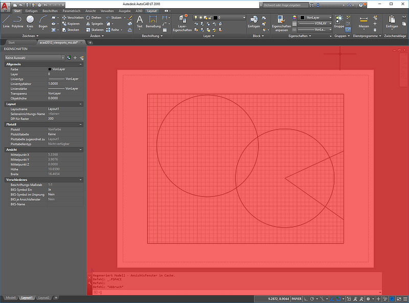

.. _Layout Management Structures:

Layout Management Structures
============================

Layouts are separated entity spaces, there are three different Layout types:

    1. Model space contains the 'real' world representation of the drawing subject in real world units.
    2. Paper space are used to create different drawing sheets of the subject for printing or PDF export
    3. Blocks are reusable sets of graphical entities, inserted by the INSERT entity.

All layouts have at least a BLOCK definition in the BLOCKS section and since DXF R13 exists the BLOCK_RECORD table with
an entry for every BLOCK in the BLOCKS section.

.. seealso::

    Information about :ref:`Block Management Structures`

The name of the model space BLOCK is ``*Model_Space`` (DXF R12: ``$MODEL_SPACE``) and the name of the `active` paper
space BLOCK is ``*Paper_Space`` (DXF R12: ``$PAPER_SPACE``), the entities of these two layouts are
stored in the ENTITIES section, DXF R12 supports just one paper space layout.

DXF R13 and later supports multiple paper space layouts, the `active` layout is still called ``*Paper_Space``, the
additional `inactive` paper space layouts are named by the scheme ``*Paper_Spacennnn``, where the first inactive paper
space is called ``*Paper_Space0``, the second ``*Paper_Space1`` and so on.
A none consecutive numbering is tolerated by AutoCAD. The content of the inactive paper space layouts are stored
as BLOCK content in the BLOCKS section. These names are just the DXF internal layout names, each layout has an
additional layout name which is displayed to the user by the CAD application.

A BLOCK definition and a BLOCK_RECORD is not enough for a proper layout setup, an LAYOUT entity in the OBJECTS section
is also required. All LAYOUT entities are managed by a DICTIONARY entity, which is referenced as ``ACAD_LAYOUT`` entity
in the root DICTIONARY of the DXF file.

.. note::

    All floating point values are rounded to 2 decimal places for better readability.

LAYOUT Entiy
------------

Since DXF R2000 model space and paper space layouts require the DXF
`LAYOUT <http://help.autodesk.com/view/OARX/2018/ENU/?guid=GUID-433D25BF-655D-4697-834E-C666EDFD956D>`_ entity.

.. code-block:: none

    0
    LAYOUT
    5       <<< handle
    59
    102     <<< extension dictionary (ignore)
    {ACAD_XDICTIONARY
    360
    1C3
    102
    }
    102     <<< reactor (required?)
    {ACAD_REACTORS
    330
    1A      <<< pointer to "ACAD_LAYOUT" DICTIONARY (layout management table)
    102
    }
    330     <<< owner handle
    1A      <<< pointer to "ACAD_LAYOUT" DICTIONARY (same as reactor pointer)
    100     <<< PLOTSETTINGS
    AcDbPlotSettings
    1       <<< page setup name

    2       <<< name of system printer or plot configuration file
    none_device
    4       <<< paper size, part in braces should follow the schema (width_x_height_unit) unit is 'Inches' or 'MM'
    Letter_(8.50_x_11.00_Inches)  # the part in front of the braces is ignored by AutoCAD
    6       <<< plot view name

    40      <<< size of unprintable margin on left side of paper in millimeters, defines also the plot origin-x
    6.35
    41      <<< size of unprintable margin on bottom of paper in millimeters, defines also the plot origin-y
    6.35
    42      <<< size of unprintable margin on right side of paper in millimeters
    6.35
    43      <<< size of unprintable margin on top of paper in millimeters
    6.35
    44      <<< plot paper size: physical paper width in millimeters
    215.90
    45      <<< plot paper size: physical paper height in millimeters
    279.40
    46      <<< X value of plot origin offset in millimeters, moves the plot origin-x
    0.0
    47      <<< Y value of plot origin offset in millimeters, moves the plot origin-y
    0.0
    48      <<< plot window area: X value of lower-left window corner
    0.0
    49      <<< plot window area: Y value of lower-left window corner
    0.0
    140     <<< plot window area: X value of upper-right window corner
    0.0
    141     <<< plot window area: Y value of upper-right window corner
    0.0
    142     <<< numerator of custom print scale: real world (paper) units, 1.0 for scale 1:50
    1.0
    143     <<< denominator of custom print scale: drawing units, 50.0 for scale 1:50
    1.0
    70      <<< plot layout flags, bit-coded (... too many options)
    688     <<< b1010110000 = UseStandardScale(16)/PlotPlotStyle(32)/PrintLineweights(128)/DrawViewportsFirst(512)
    72      <<< plot paper units (0/1/2 for inches/millimeters/pixels), are pixels really supported?
    0
    73      <<< plot rotation (0/1/2/3 for 0deg/90deg counter-cw/upside-down/90deg cw)
    1       <<< 90deg clockwise
    74      <<< plot type 0-5 (... too many options)
    5       <<< 5 = layout information
    7       <<< current plot style name, e.g. 'acad.ctb' or 'acadlt.ctb'

    75      <<< standard scale type 0-31 (... too many options)
    16      <<< 16 = 1:1, also 16 if user scale type is used
    147     <<< unit conversion factor
    1.0     <<< for plot paper units in mm, else  0.03937... (1/25.4) for inches as plot paper units
    76      <<< shade plot mode (0/1/2/3 for as displayed/wireframe/hidden/rendered)
    0       <<< as displayed
    77      <<< shade plot resolution level 1-5 (... too many options)
    2       <<< normal
    78      <<< shade plot custom DPI: 100-32767, Only applied when shade plot resolution level is set to 5 (Custom)
    300
    148     <<< paper image origin: X value
    0.0
    149     <<< paper image origin: Y value
    0.0
    100     <<< LAYOUT settings
    AcDbLayout
    1       <<< layout name
    Layout1
    70      <<< flags bit-coded
    1       <<< 1 = Indicates the PSLTSCALE value for this layout when this layout is current
    71      <<< Tab order ("Model" tab always appears as the first tab regardless of its tab order)
    1
    10      <<< minimum limits for this layout (defined by LIMMIN while this layout is current)
    -0.25   <<<     x value, distance of the left paper margin from the plot origin-x, in plot paper units and by scale (e.g. x50 for 1:50)
    20      <<<     group code for y value
    -0.25   <<<     y value, distance of the bottom paper margin from the plot origin-y, in plot paper units and by scale (e.g. x50 for 1:50)
    11      <<< maximum limits for this layout (defined by LIMMAX while this layout is current)
    10.75   <<<     x value, distance of the right paper margin from the plot origin-x, in plot paper units and by scale (e.g. x50 for 1:50)
    21      <<<     group code for y value
    8.25    <<<     y value, distance of the top paper margin from the plot origin-y, in plot paper units and by scale (e.g. x50 for 1:50)
    12      <<< insertion base point for this layout (defined by INSBASE while this layout is current)
    0.0     <<<     x value
    22      <<<     group code for y value
    0.0     <<<     y value
    32      <<<     group code for z value
    0.0     <<<     z value
    14      <<< minimum extents for this layout (defined by EXTMIN while this layout is current), AutoCAD default is (1e20, 1e20, 1e20)
    1.05    <<<     x value
    24      <<<     group code for y value
    0.80    <<<     y value
    34      <<<     group code for z value
    0.0     <<<     z value
    15      <<< maximum extents for this layout (defined by EXTMAX while this layout is current), AutoCAD default is (-1e20, -1e20, -1e20)
    9.45    <<<     x value
    25      <<<     group code for y value
    7.20    <<<     y value
    35      <<<     group code for z value
    0.0     <<<     z value
    146     <<< elevation ???
    0.0
    13      <<< UCS origin (3D Point)
    0.0     <<<     x value
    23      <<<     group code for y value
    0.0     <<<     y value
    33      <<<     group code for z value
    0.0     <<<     z value
    16      <<< UCS X-axis (3D vector)
    1.0     <<<     x value
    26      <<<     group code for y value
    0.0     <<<     y value
    36      <<<     group code for z value
    0.0     <<<     z value
    17      <<< UCS Y-axis (3D vector)
    0.0     <<<     x value
    27      <<<     group code for y value
    1.0     <<<     y value
    37      <<<     group code for z value
    0.0     <<<     z value
    76      <<< orthographic type of UCS 0-6 (... too many options)
    0       <<< 0 = UCS is not orthographic ???
    330     <<< ID/handle of required block table record
    58
    331     <<< ID/handle to the viewport that was last active in this layout when the layout was current
    1B9
    1001    <<< extended data (ignore)
    ...

And as it seems this is also not enough for a well defined LAYOUT, at least a "main" VIEWPORT entity with ID=1 is
required for paper space layouts, located in the entity space of the layout.

The model space layout requires (?) a VPORT entity in the VPORT table (group code 331 in the AcDbLayout subclass).

Main VIEWPORT Entity for LAYOUT
-------------------------------

The "main" viewport for layout ``Layout1`` shown above. This viewport is located in the associated BLOCK definition called
``*Paper_Space0``. Group code 330 in subclass AcDbLayout points to the BLOCK_RECORD of ``*Paper_Space0``.
Remember: the entities of the `active` paper space layout are located in the ENTITIES section, therefor ``Layout1`` is not
the active paper space layout.

The "main" VIEWPORT describes, how the application shows the paper space layout on the screen, and I guess only AutoCAD
needs this values. And the most values

.. code-block:: none

    0
    VIEWPORT
    5       <<< handle
    1B4
    102     <<< extension dictionary (ignore)
    {ACAD_XDICTIONARY
    360
    1B5
    102
    }
    330     <<< owner handle
    58      <<< points to BLOCK_RECORD (same as group code 330 in AcDbLayout of "Layout1")
    100
    AcDbEntity
    67      <<< paper space flag
    1       <<< 0 = model space; 1 = paper space
    8       <<< layer,
    0
    100
    AcDbViewport
    10      <<< Center point (in WCS)
    5.25    <<<     x value
    20      <<<     group code for y value
    4.00    <<<     y value
    30      <<<     group code for z value
    0.0     <<<     z value
    40      <<< width in paper space units
    23.55   <<< VIEW size in AutoCAD, depends on the workstation configuration
    41      <<< height in paper space units
    9.00    <<< VIEW size in AutoCAD, depends on the workstation configuration
    68      <<< viewport status field -1/0/n
    2       <<< >0  On and active. The value indicates the order of stacking for the viewports, where 1 is the active viewport, 2 is the next, and so forth
    69      <<< viewport ID
    1       <<< "main" viewport has always ID=1
    12      <<< view center point in Drawing Coordinate System (DCS), defines the center point of the VIEW in relation to the LAYOUT origin
    5.25    <<<     x value
    22      <<<     group code for y value
    4.00    <<<     y value
    13      <<< snap base point in model space
    0.0     <<<     x value
    23      <<<     group code for y value
    0.0     <<<     y value
    14      <<< snap spacing in model space units
    0.5     <<<     x value
    24      <<<     group code for y value
    0.5     <<<     y value
    15      <<< grid spacing in model space units
    0.5     <<<     x value
    25      <<<     group code for y value
    0.5     <<<     y value
    16      <<< view direction vector from target (in WCS)
    0.0     <<<     x value
    26      <<<     group code for y value
    0.0     <<<     y value
    36      <<<     group code for z value
    1.0     <<<     z value
    17      <<< view target point
    0.0     <<<     x value
    27      <<<     group code for y value
    0.0     <<<     y value
    37      <<<     group code for z value
    0.0     <<<     z value
    42      <<<     perspective lens length, focal length?
    50.0    <<<     50mm
    43      <<<     front clip plane z value
    0.0     <<<     z value
    44      <<<     back clip plane z value
    0.0     <<<     z value
    45      <<<     view height (in model space units)
    9.00
    50      <<< snap angle
    0.0
    51      <<< view twist angle
    0.0
    72      <<< circle zoom percent
    1000
    90      <<< Viewport status bit-coded flags (... too many options)
    819232  <<< b11001000000000100000
    1       <<< plot style sheet name assigned to this viewport

    281     <<< render mode (... too many options)
    0       <<< 0 = 2D optimized (classic 2D)
    71      <<< UCS per viewport flag
    1       <<< 1 = This viewport stores its own UCS which will become the current UCS whenever the viewport is activated
    74      <<< Display UCS icon at UCS origin flag
    0       <<< this field is currently being ignored and the icon always represents the viewport UCS
    110     <<< UCS origin (3D point)
    0.0     <<<     x value
    120     <<<     group code for y value
    0.0     <<<     y value
    130     <<<     group code for z value
    0.0     <<<     z value
    111     <<< UCS X-axis (3D vector)
    1.0     <<<     x value
    121     <<<     group code for y value
    0.0     <<<     y value
    131     <<<     group code for z value
    0.0     <<<     z value
    112     <<< UCS Y-axis (3D vector)
    0.0     <<<     x value
    122     <<<     group code for y value
    1.0     <<<     y value
    132     <<<     group code for z value
    0.0     <<<     z value
    79      <<< Orthographic type of UCS (... too many options)
    0       <<< 0 = UCS is not orthographic
    146     <<< elevation
    0.0
    170     <<< shade plot mode (0/1/2/3 for as displayed/wireframe/hidden/rendered)
    0       <<< as displayed
    61      <<< frequency of major grid lines compared to minor grid lines
    5       <<< major grid subdivided by 5
    348     <<< visual style ID/handle (optional)
    9F
    292     <<< default lighting flag, on when no user lights are specified.
    1
    282     <<< Default lighting type (0/1 = one distant light/two distant lights)
    1       <<< one distant light
    141     <<< view brightness
    0.0
    142     <<< view contrast
    0.0
    63      <<< ambient light color (ACI), write only if not black color
    250
    421     <<< ambient light color (RGB), write only if not black color
    3355443
