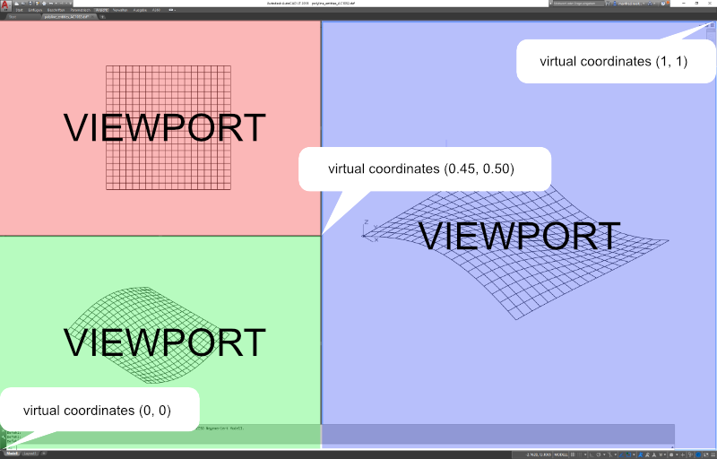

.. _vport_table_internals:

VPORT Configuration Table
=========================

The `VPORT`_ table stores the modelspace viewport configurations. A viewport configuration is a tiled view of multiple
viewports or just one viewport.

In contrast to other tables the VPORT table can have multiple entries with the same name, because all VPORT entries
of a multi-viewport configuration are having the same name - the viewport configuration name. The name of the actual
displayed viewport configuration is ``'*ACTIVE'``, as always table entry names are case insensitive
(:code:`'*ACTIVE' == '*Active'`).

The available display area in AutoCAD has normalized coordinates, the lower-left corner is (0, 0) and the
upper-right corner is (1, 1) regardless of the true aspect ratio and available display area in pixels.
A single viewport configuration has one VPORT entry ``'*ACTIVE'`` with the lower-left corner (0, 0) and the upper-right
corner (1, 1).

The following statements refer to a 2D plan view: the view-target-point defines the origin of the DCS
(Display Coordinate system), the view-direction vector defines the z-axis of the :ref:`DCS`, the
view-center-point (in DCS) defines the point in modelspace translated to the center point of the viewport,
the view height and the aspect-ratio defines how much of the modelspace is displayed. AutoCAD tries to fit
the modelspace area into the available viewport space e.g. view height is 15 units and aspect-ratio is 2.0
the modelspace to display is 30 units wide and 15 units high, if the viewport has an aspect ratio of 1.0,
AutoCAD displays 30x30 units of the modelspace in the viewport. If the modelspace aspect-ratio is 1.0 the
modelspace to display is 15x15 units and fits properly into the viewport area.

But tests show that the translation of the view-center-point to the middle of the viewport not always work as I
expected. (still digging...)

.. note::

    All floating point values are rounded to 2 decimal places for better readability.

DXF R12
-------

Multi-viewport configuration with three viewports.

.. code-block:: none

    0       <<< table start
    TABLE
    2       <<< table type
    VPORT
    70      <<< VPORT table (max.) count, not reliable (ignore)
    3
    0       <<< first VPORT entry
    VPORT
    2       <<< VPORT (configuration) name
    *ACTIVE
    70      <<< standard flags, bit-coded
    0
    10      <<< lower-left corner of viewport
    0.45    <<<     x value, virtual coordinates in range [0 - 1]
    20      <<<     group code for y value
    0.0     <<<     y value, virtual coordinates in range [0 - 1]
    11      <<< upper-right corner of viewport
    1.0     <<<     x value, virtual coordinates in range [0 - 1]
    21      <<<     group code for y value
    1.0     <<<     y value, virtual coordinates in range [0 - 1]
    12      <<< view center point (in DCS), ???
    13.71   <<<     x value
    22      <<<     group code for y value
    0.02    <<<     y value
    13      <<< snap base point (in DCS)
    0.0     <<<     x value
    23      <<<     group code for y value
    0.0     <<<     y value
    14      <<< snap spacing X and Y
    1.0     <<<     x value
    24      <<<     group code for y value
    1.0     <<<     y value
    15      <<< grid spacing X and Y
    0.0     <<<     x value
    25      <<<     group code for y value
    0.0     <<<     y value
    16      <<< view direction from target point (in WCS), defines the z-axis of the DCS
    1.0     <<<     x value
    26      <<<     group code for y value
    -1.0    <<<     y value
    36      <<<     group code for z value
    1.0     <<<     z value
    17      <<< view target point (in WCS), defines the origin of the DCS
    0.0     <<<     x value
    27      <<<     group code for y value
    0.0     <<<     y value
    37      <<<     group code for z value
    0.0     <<<     z value
    40      <<< view height
    35.22
    41      <<< viewport aspect ratio
    0.99
    42      <<< lens (focal) length
    50.0    <<< 50mm
    43      <<< front clipping planes, offsets from target point
    0.0
    44      <<< back clipping planes, offsets from target point
    0.0
    50      <<< snap rotation angle
    0.0
    51      <<< view twist angle
    0.0
    71      <<< view mode
    0
    72      <<< circle zoom percent
    1000
    73      <<< fast zoom setting
    1
    74      <<< UCSICON setting
    3
    75      <<< snap on/off
    0
    76      <<< grid on/off
    0
    77      <<< snap style
    0
    78      <<< snap isopair
    0
    0       <<< next VPORT entry
    VPORT
    2       <<< VPORT (configuration) name
    *ACTIVE <<< same as first VPORT entry
    70
    0
    10
    0.0
    20
    0.5
    11
    0.45
    21
    1.0
    12
    8.21
    22
    9.41
    ...
    ...
    0       <<< next VPORT entry
    VPORT
    2       <<< VPORT (configuration) name
    *ACTIVE <<< same as first VPORT entry
    70
    0
    10
    0.0
    20
    0.0
    11
    0.45
    21
    0.5
    12
    2.01
    22
    -9.33
    ...
    ...
    0
    ENDTAB

DXF R2000+
----------

Mostly the same structure as DXF R12, but with handle, owner tag and subclass markers.

.. code-block:: none

    0       <<< table start
    TABLE
    2       <<< table type
    VPORT
    5       <<< table handle
    151F
    330     <<< owner, table has no owner - always #0
    0
    100     <<< subclass marker
    AcDbSymbolTable
    70      <<< VPORT table (max.) count, not reliable (ignore)
    3
    0       <<< first VPORT entry
    VPORT
    5       <<< entry handle
    158B
    330     <<< owner, VPORT table is owner of VPORT entry
    151F
    100     <<< subclass marker
    AcDbSymbolTableRecord
    100     <<< subclass marker
    AcDbViewportTableRecord
    2       <<< VPORT (configuration) name
    *ACTIVE
    70      <<< standard flags, bit-coded
    0
    10      <<< lower-left corner of viewport
    0.45    <<<     x value, virtual coordinates in range [0 - 1]
    20      <<<     group code for y value
    0.0     <<<     y value, virtual coordinates in range [0 - 1]
    11      <<< upper-right corner of viewport
    1.0     <<<     x value, virtual coordinates in range [0 - 1]
    21      <<<     group code for y value
    1.0     <<<     y value, virtual coordinates in range [0 - 1]
    12      <<< view center point (in DCS)
    13.71   <<<     x value
    22      <<<     group code for y value
    0.38    <<<     y value
    13      <<< snap base point (in DCS)
    0.0     <<<     x value
    23      <<<     group code for y value
    0.0     <<<     y value
    14      <<< snap spacing X and Y
    1.0     <<<     x value
    24      <<<     group code for y value
    1.0     <<<     y value
    15      <<< grid spacing X and Y
    0.0     <<<     x value
    25      <<<     group code for y value
    0.0     <<<     y value
    16      <<< view direction from target point (in WCS)
    1.0     <<<     x value
    26      <<<     group code for y value
    -1.0    <<<     y value
    36      <<<     group code for z value
    1.0     <<<     z value
    17      <<< view target point (in WCS)
    0.0     <<<     x value
    27      <<<     group code for y value
    0.0     <<<     y value
    37      <<<     group code for z value
    0.0     <<<     z value
    40      <<< view height
    35.22
    41      <<< viewport aspect ratio
    0.99
    42      <<< lens (focal) length
    50.0    <<< 50mm
    43      <<< front clipping planes, offsets from target point
    0.0
    44      <<< back clipping planes, offsets from target point
    0.0
    50      <<< snap rotation angle
    0.0
    51      <<< view twist angle
    0.0
    71      <<< view mode
    0
    72      <<< circle zoom percent
    1000
    73      <<< fast zoom setting
    1
    74      <<< UCSICON setting
    3
    75      <<< snap on/off
    0
    76      <<< grid on/off
    0
    77      <<< snap style
    0
    78      <<< snap isopair
    0
    281     <<< render mode 1-6 (... too many options)
    0       <<< 0 = 2D optimized (classic 2D)
    65      <<< Value of UCSVP for this viewport. (0 = UCS will not change when this viewport is activated)
    1       <<< 1 = then viewport stores its own UCS which will become the current UCS whenever the viewport is activated.
    110     <<< UCS origin (3D point)
    0.0     <<<     x value
    120     <<<     group code for y value
    0.0     <<<     y value
    130     <<<     group code for z value
    0.0     <<<     z value
    111     <<< UCS X-axis (3D vector)
    1.0     <<<     x value
    121     <<<     group code for y value
    0.0     <<<     y value
    131     <<<     group code for z value
    0.0     <<<     z value
    112     <<< UCS Y-axis (3D vector)
    0.0     <<<     x value
    122     <<<     group code for y value
    1.0     <<<     y value
    132     <<<     group code for z value
    0.0     <<<     z value
    79      <<< Orthographic type of UCS 0-6 (... too many options)
    0       <<< 0 = UCS is not orthographic
    146     <<< elevation
    0.0
    1001    <<< extended data - undocumented
    ACAD_NAV_VCDISPLAY
    1070
    3
    0       <<< next VPORT entry
    VPORT
    5
    158C
    330
    151F
    100
    AcDbSymbolTableRecord
    100
    AcDbViewportTableRecord
    2       <<< VPORT (configuration) name
    *ACTIVE <<< same as first VPORT entry
    70
    0
    10
    0.0
    20
    0.5
    11
    0.45
    21
    1.0
    12
    8.21
    22
    9.72
    ...
    ...
    0       <<< next VPORT entry
    VPORT
    5
    158D
    330
    151F
    100
    AcDbSymbolTableRecord
    100
    AcDbViewportTableRecord
    2       <<< VPORT (configuration) name
    *ACTIVE <<< same as first VPORT entry
    70
    0
    10
    0.0
    20
    0.0
    11
    0.45
    21
    0.5
    12
    2.01
    22
    -8.97
    ...
    ...
    0
    ENDTAB

.. _VPORT: http://help.autodesk.com/view/OARX/2018/ENU/?guid=GUID-8CE7CC87-27BD-4490-89DA-C21F516415A9
