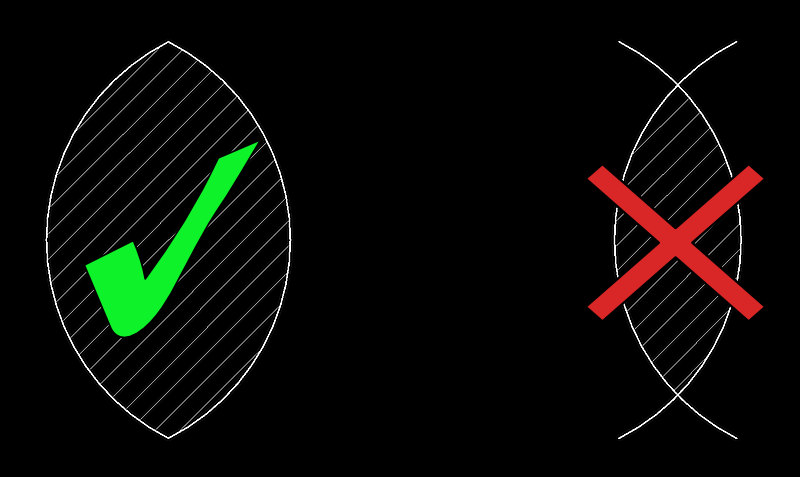
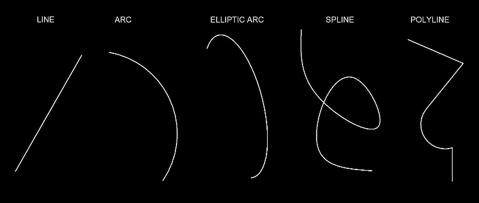
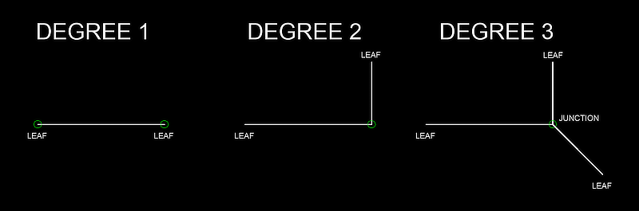
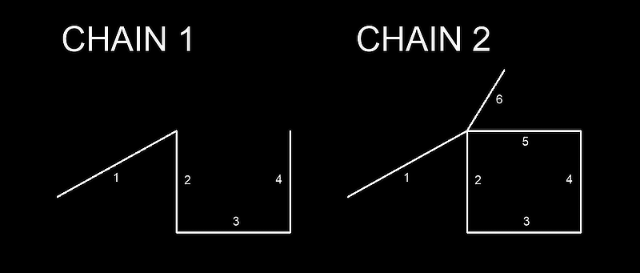
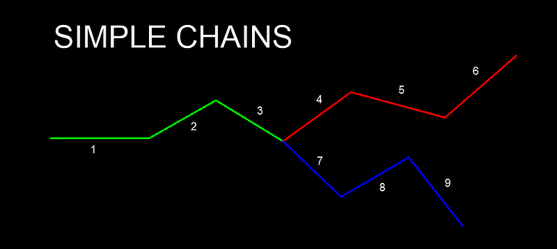

EdgeMiner
=========

.. module:: ezdxf.edgeminer

.. versionadded:: 1.4

Purpose of this Module
----------------------

This is a helper tool to:

    - build polylines from DXF primitives like LINE, ARC, ELLIPSE, SPLINE
    - build hatch boundary paths from DXF primitives
    - find open chains or closed loops in an unordered heap of DXF primitives (edges)
    - in general: find connections between edges

What are Edges?
---------------

An edge is a linear structure with an start- and end point and an optional length.

This module is not limited to DXF primitives. Anything that can be represented by an
start- and end point can be processed. This makes this module to a versatile tool with
the disadvantage that intersections between edges are not known and cannot be calculated.

e.g. When each arc is represented by an edge, the HATCH boundary path on the left can be
found because the arcs are connected by their end points. Finding the HATCH boundary
path on the right is not possible because the intersections points of the arcs (edges)
are not known:

How to Create Edges?
--------------------

The process of creating edges is separated from this module and is done in the
companion module :mod:`ezdxf.edgesmith`.  The :mod:`edgeminer` module doesn't really
know what an edge represents or what it looks like.

Terminology
-----------

I try to use the terminology of `Graph Theory`_ but there are differences where I think
a different term is better suited for this module like loop for cycle.

Edge
    A linear connection between two points. The shape of an edge is not known.
    Intersection points between edges are not known and cannot be calculated.

Vertex
    A connection point of two or more edges.

Degree
    The degree of a vertex is the number of connected edges.

Leaf
    A leaf is a vertex of degree 1.
    A leaf is a loose end of an edge, which is not connected to other edges.

Junction
    A junction is a vertex of degree greater 2.
    A junction has more than two adjacent edges.
    A junction is an ambiguity when searching for open chains or closed loops.
    Graph Theory: multiple adjacency

Chain
    A chain has sequential connected edges.
    The end point of an edge is connected to the start point of the following edge.
    A chain has unique edges, each edge appears only once in the chain.
    A chain can contain vertices of degree greater 2.
    A solitary edge is also a chain.
    Graph Theory: Trail - no edge is repeated, vertex is repeated

Simple Chain (special to this module)
    A simple chain contains only vertices of degree 2, except the start- and end vertex.
    The start- and end vertices are leafs (degree of 1) or junctions (degree greater 2).
    The following image shows 3 simple chains: [1-2-3], [4-5-6] and [7-8-9].
    Simple chains are easy to detect and can be replaced by a single edge and reduces so
    the search space.

Open Chain
    An open chain is a chain which starts and ends with at leaf.
    A solitary edge is also an open chain.
    Graph Theory: Path - no edge is repeated, no vertex is repeated, endings not connected

Loop
    A loop is a simple chain with connected start- and end vertices.
    A loop has two or more edges.
    A loop contains only vertices of degree 2.
    Graph Theory: Cycle - no edge is repeated, no vertex is repeated, endings connected;
    a loop in Graph Theory is something different!

Network
    A network has two or more edges that are directly and indirectly connected.
    The edges in a network have no order.
    A network can contain vertices of degree greater 2 (junctions).
    A solitary edge is not a network.
    A chain with two or more edges is a network.
    Graph Theory: multigraph; a network in Graph Theory is something different!

Gap Tolerance
    Maximum vertex distance to consider two edges as connected

Forward Connection
    An edge is forward connected when the end point of the edge is connected to the
    start point of the following edge.

.. seealso::

    - :ref:`tut_edges`
    - :mod:`ezdxf.edgesmith` module

.. important::

    This is the reference documentation and not a tutorial how to use this module.

High Level Functions
--------------------

.. autofunction:: find_sequential_chain

.. autofunction:: find_all_sequential_chains

.. autofunction:: find_simple_chain

.. autofunction:: find_all_simple_chains

.. autofunction:: find_all_open_chains

.. autofunction:: find_loop

.. autofunction:: find_loop_by_edge

.. autofunction:: find_all_loops

Low Level Functions
-------------------

.. autofunction:: flatten

.. autofunction:: is_chain

.. autofunction:: is_forward_connected

.. autofunction:: is_loop

.. autofunction:: is_wrapped_chain

.. autofunction:: isclose

.. autofunction:: length

.. autofunction:: longest_chain

.. autofunction:: make_edge

.. autofunction:: shortest_chain

.. autofunction:: subtract_edges

.. autofunction:: unwrap_simple_chain

.. autofunction:: wrap_simple_chain

Classes
-------

.. autoclass:: Edge

    .. automethod:: __eq__

    .. automethod:: reversed

.. autoclass:: Deposit

    .. autoproperty:: edges

    .. autoproperty:: max_degree

    .. automethod:: degree_counter

    .. automethod:: degree

    .. automethod:: degrees

    .. automethod:: edges_linked_to

    .. automethod:: find_all_networks

    .. automethod:: find_leafs

    .. automethod:: find_nearest_edge

    .. automethod:: find_network

    .. automethod:: unique_vertices

.. autoclass:: TimeoutError

.. _Graph Theory: https://en.wikipedia.org/wiki/Glossary_of_graph_theory
.. _GeeksForGeeks: https://www.geeksforgeeks.org/graph-data-structure-and-algorithms/?ref=shm
