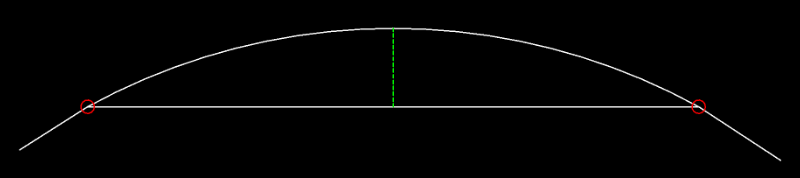

EdgeSmith
=========

.. module:: ezdxf.edgesmith

.. versionadded:: 1.4

Purpose of this Module
----------------------

This is a companion module to the :mod:`ezdxf.edgeminer` module:

    - create :class:`~ezdxf.edgeminer.Edge` instances from DXF primitives for processing
      by the :mod:`~ezdxf.edgeminer` module:

        - :class:`~ezdxf.entities.Line`
        - :class:`~ezdxf.entities.Arc`
        - :class:`~ezdxf.entities.Ellipse`
        - :class:`~ezdxf.entities.Spline`
        - :class:`~ezdxf.entities.LWPolyline`
        - :class:`~ezdxf.entities.Polyline`

    - create :class:`~ezdxf.entities.LWPolyline` and :class:`~ezdxf.entities.Polyline`
      entities from a sequence of :class:`~ezdxf.edgeminer.Edge` objects.
    - create :class:`~ezdxf.entities.Hatch` boundary paths from a sequence of
      :class:`~ezdxf.edgeminer.Edge` objects.
    - create :class:`ezdxf.path.Path` objects from a sequence of :class:`~ezdxf.edgeminer.Edge`
      objects.

.. seealso::

    - :ref:`tut_edges`
    - :mod:`ezdxf.edgeminer` module

.. important::

    This is the reference documentation and not a tutorial how to use this module.

Make Edges
----------

This functions convert open shapes into 2D edges, closed shapes as circles, closed
arcs, closed ellipses, closed splines and closed polylines are ignored or return
``None``.

.. autofunction:: make_edge_2d

.. autofunction:: edges_from_entities_2d

Build From Edges
----------------

ARC, LWPOLYLINE, POLYLINE and ELLIPSE entities must have an extrusion vector
of (0, 0, 1) (WCS Z-Axis). Entities with an inverted extrusion vector (0, 0, -1) will be
treated as a 3D curve and approximated by a polyline projected onto the xy-plane.
The :mod:`ezdxf.upright` module can convert such inverted extrusion vectors to (0, 0, 1).

Curve Approximation
~~~~~~~~~~~~~~~~~~~

For some target entities curves have to be approximated by polylines.
This process is also called flattening and is controlled by the parameter
:attr:`max_sagitta`.

The :attr:`max_sagitta` argument defines the maximum distance from the center of the
curve segment to the center of the line segment between two approximation points to
determine if a segment should be subdivided. The default value is -1 and uses a 1/100
of the approximated length of the curve as :attr:`max_sagitta`.

The good choice for a :attr:`max_sagitta` depends on the output resolution and is maybe
not known at the time of processing the data. E.g. for a printer/plotter a
:attr:`max_sagitta` of around 1/300 inch (300 dpi) is maybe a good choice.
The convertion from output units to drawing units depends on the scale and is the task
of the package user.

All flattened curves will be projected onto the xy-plane.

.. autofunction:: lwpolyline_from_chain

.. autofunction:: polyline2d_from_chain

.. autofunction:: edge_path_from_chain

.. autofunction:: polyline_path_from_chain

.. autofunction:: path2d_from_chain

Global Constants
----------------

.. code-block:: Python

    GAP_TOL = 1e-9
    LEN_TOL = 1e-9  # length and distance
    DEG_TOL = 1e-9  # angles in degree
    RAD_TOL = 1e-7  # angles in radians
