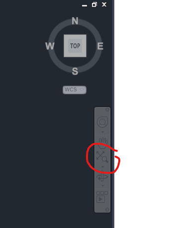

DXF Viewer
==========

A360 Viewer Problems
--------------------

AutoDesk web service A360_ seems to be more picky than the AutoCAD desktop applications, may be it helps to use the
latest DXF version supported by ezdxf, which is DXF R2018 (AC1032) in the year of writing this lines (2018).

DXF Entities Are Not Displayed in the Viewer
--------------------------------------------

`ezdxf` does not automatically locate the main viewport of the modelspace at the entities, you have to perform the
"Zoom to Extends" command, here in TrueView 2020:

And here in the Autodesk Online Viewer:

.. image:: gfx/autodesk_online_viewer_zoom_to_extends.png
    :align: center

Add this line to your code to relocate the main viewport, adjust the `center` (in modelspace coordinates) and
the `height` (in drawing units) arguments to your needs::

    doc.set_modelspace_vport(height=10, center=(0, 0))

Show IMAGES/XREFS on Loading in AutoCAD
---------------------------------------

If you are adding XREFS and IMAGES with relative paths to existing drawings and they do not show up in AutoCAD
immediately, change the HEADER variable :code:`$PROJECTNAME=''` to *(not really)* solve this problem.
The ezdxf templates for DXF R2004 and later have :code:`$PROJECTNAME=''` as default value.

Thanks to `David Booth <https://github.com/worlds6440>`_:

    If the filename in the IMAGEDEF contains the full path (absolute in AutoCAD) then it
    shows on loading, otherwise it won't display (reports as unreadable) until you
    manually reload using XREF manager.

    A workaround (to show IMAGES on loading) appears to be to save the full file path in
    the DXF or save it as a DWG.

Thanks to `Zac Luzader <https://github.com/luzader>`_:

    Has anyone else noticed that very short simple image file names seem to avoid this
    problem? Once I ensured that the image file's name was short and had no special
    characters (letters, numbers and underscores only) the problem seemed to go away.
    I didn't rigorously analyze the behavior as its very time consuming.

    Also: You can safely put the image in a subdirectory and use a relative path. The
    name of the subdirectory does not seem to trigger this problem, provided that the
    image file name itself is very short and simple.

    Also pro tip: The XRef manager exists in DWG TrueView 2023, but access to it is only
    possible if you have a completely broken reference. Create a DXF with a reference
    to a non-existent file, then the error dialog will let you open the XRef Manager.
    Once it is open you can pin it and it will be open next time, even if you have no
    broken references.

.. seealso::

    Discussion on github:
    `Images don't show in AutoCAD until ... <https://github.com/mozman/ezdxf/discussions/845>`_

Set Initial View/Zoom for the Modelspace
----------------------------------------

See section "General Document": :ref:`set msp initial view`

Show Lineweights in DXF Viewers
-------------------------------

By default lines and curves are shown without lineweights in DXF viewers.
By setting the header variable $LWDISPLAY to 1 the DXF viewer should display
lineweights, if supported by the viewer.

.. code-block:: Python

    doc.header["$LWDISPLAY"] = 1

.. _A360: https://a360.autodesk.com/viewer/
