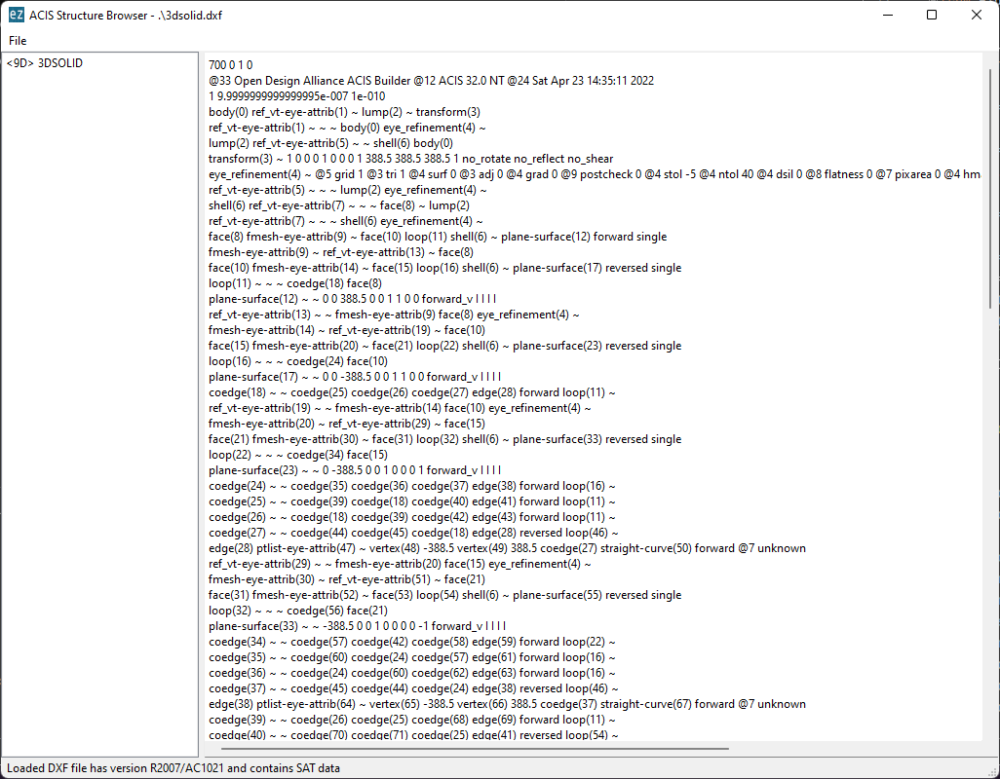

Launcher
========

The command line script `ezdxf` launches various sub-commands:

=============== ====================================================================
``audit``       Audit and repair DXF files
``draw``        Draw and convert DXF files by the Matplotlib backend
``view``        PyQt DXF file viewer
``browse``      PyQt DXF structure browser for DXF debugging and curious people
``browse-acis`` PyQt ACIS entity content browser for SAT/SAB debugging
``strip``       Strip comments and THUMBNAILIMAGE section from DXF files
``config``      Manage config files
``info``        Show information and optional stats of DXF files as loaded by ezdxf
``hpgl``        View and/or convert HPGL/2 plot files to DXF, SVG or PDF
=============== ====================================================================

The help option ``-h`` is supported by the main script and all sub-commands:

.. code-block:: Text

    C:\> ezdxf -h
    usage: ezdxf [-h] [-V] [-v] [--config CONFIG] [--log LOG]
                 {pp,audit,draw,view,browse,browse-acis,strip,config} ...

    Command launcher for the Python package "ezdxf":
    https://pypi.org/project/ezdxf/

    positional arguments:
      {audit,draw,view,browse,strip}
        audit               audit and repair DXF files
        draw                draw and convert DXF files by Matplotlib
        view                view DXF files by the PyQt viewer
        browse              browse DXF file structure
        browse-acis         browse ACIS structures in DXF files
        strip               strip comments from DXF files
        config              manage config files
        info                show information and optional stats of DXF files loaded by ezdxf,
                            this may not represent the original content of the file, use the
                            browse command to see the original content

    optional arguments:
      -h, --help            show this help message and exit
      -V, --version         show version and exit
      -f, --fonts           rebuild system font cache and print all fonts found
      -v, --verbose         give more output
      --config CONFIG       path to a config file
      --log LOG             path to a verbose appending log

.. note::

    The ``ezdxf`` script  is the only executable script installed on the
    user system.

System
------

:code:`ezdxf -V` shows the `ezdxf` and `Python` version your are running and if the
C-extensions are used.

.. code-block:: Text

    ezdxf 1.1.0b1 from c:\source\ezdxf.git\src\ezdxf
    Python version: 3.11.2 (tags/v3.11.2:878ead1, Feb  7 2023, 16:38:35) [MSC v.1934 64 bit (AMD64)]
    using C-extensions: yes

:code:`ezdxf -f` rebuilds the system font cache and shows all fonts found.

.. _audit_command:

Audit
-----

Audit and recover the DXF file "gear.dxf" and save the recovered version
as "gear.rec.dxf":

.. code-block:: Text

    C:\> ezdxf audit -s gear.dxf

    auditing file: gear.dxf
    No errors found.
    Saved recovered file as: gear.rec.dxf

Print help:

.. code-block:: Text

    C:\> ezdxf audit -h
    usage: ezdxf audit [-h] [-s] FILE [FILE ...]

    positional arguments:
      FILE        audit DXF files

    optional arguments:
      -h, --help  show this help message and exit
      -s, --save  save recovered files with extension ".rec.dxf"

.. _draw_command:

Draw
----

Convert the DXF file "gear.dxf" into a SVG file by the *Matplotlib* backend:

.. versionadded:: 1.2.0
  
  support for more backends

.. code-block:: Text

    C:\> ezdxf draw -o gear.svg gear.dxf

The "gear.svg" created by the *Matplotlib* backend:

.. image:: gfx/gear.svg
   :align: center

Show all output formats supported by the *Matplotlib* backend
on your system. This output may vary:

.. code-block:: Text

    C:\> ezdxf draw --formats
    eps: Encapsulated Postscript
    jpg: Joint Photographic Experts Group
    jpeg: Joint Photographic Experts Group
    pdf: Portable Document Format
    pgf: PGF code for LaTeX
    png: Portable Network Graphics
    ps: Postscript
    raw: Raw RGBA bitmap
    rgba: Raw RGBA bitmap
    svg: Scalable Vector Graphics
    svgz: Scalable Vector Graphics
    tif: Tagged Image File Format
    tiff: Tagged Image File Format

Print help:

.. code-block:: Text

  C:\> ezdxf draw -h
  usage: ezdxf draw [-h] [--backend {matplotlib,qt,mupdf,custom_svg}] [--formats]
                    [-l LAYOUT]
                    [--background {DEFAULT,WHITE,BLACK,PAPERSPACE,MODELSPACE,OFF,CUSTOM}]
                    [--all-layers-visible] [--all-entities-visible] [-o OUT]
                    [--dpi DPI] [-f] [-v]
                    [FILE]

  positional arguments:
    FILE                  DXF file to view or convert

  options:
    -h, --help            show this help message and exit
    --backend {matplotlib,qt,mupdf,custom_svg}
                          choose the backend to use for rendering
    --formats             show all supported export formats and exit
    -l LAYOUT, --layout LAYOUT
                          select the layout to draw, default is "Model"
    --background {DEFAULT,WHITE,BLACK,PAPERSPACE,MODELSPACE,OFF,CUSTOM}
                          choose the background color to use
    --all-layers-visible  draw all layers including the ones marked as invisible
    --all-entities-visible
                          draw all entities including the ones marked as invisible
                          (some entities are individually marked as invisible even if
                          the layer is visible)
    -o OUT, --out OUT     output filename for export
    --dpi DPI             target render resolution, default is 300
    -f, --force           overwrite the destination if it already exists
    -v, --verbose         give more output

.. _view_command:

View
----

View the DXF file "gear.dxf" by the *PyQt* backend:

.. code-block:: Text

    C:\> ezdxf view gear.dxf

.. image:: gfx/gear-qt-backend.png
   :align: center

Print help:

.. code-block:: Text

    C:\> ezdxf view -h
    usage: ezdxf view [-h] [-l LAYOUT] [--lwscale LWSCALE] [FILE]

    positional arguments:
      FILE                  DXF file to view

    optional arguments:
      -h, --help            show this help message and exit
      -l LAYOUT, --layout LAYOUT
                            select the layout to draw, default is "Model"
      --lwscale LWSCALE     set custom line weight scaling, default is 0 to
                            disable line weights at all

.. _browse_command:

Browse
------

Browse the internal structure of a DXF file like a file system:

.. code-block:: Text

    C:\> ezdxf browse gear.dxf

.. image:: gfx/gear-browse.png
   :align: center

.. code-block:: Text

    C:\> ezdxf browse -h
    usage: ezdxf browse [-h] [-l LINE] [-g HANDLE] [FILE]

    positional arguments:
      FILE                  DXF file to browse

    optional arguments:
      -h, --help            show this help message and exit
      -l LINE, --line LINE  go to line number
      -g HANDLE, --handle HANDLE
                            go to entity by HANDLE, HANDLE has to be a hex value without
                            any prefix like 'fefe'

The `browse` command stores options in the config file,
e.g. for the `Notepad++` on Windows:

.. code-block:: ini

    [browse-command]

    text_editor = "C:\Program Files\Notepad++\notepad++.exe" "{filename}" -n{num}
    icon_size = 32

``text_editor`` is a simple format string:
:code:`text_editor.format(filename="test.dxf", num=100)`

Quote commands including spaces and always quote the filename argument!

For `xed` on Linux Mint use (note: absolute path to executable):

.. code-block:: ini

    [browse-command]

    text_editor = /usr/bin/xed "{filename}" +{num}
    icon_size = 32

For `gedit` on Linux use (untested):

.. code-block:: ini

    [browse-command]

    text_editor = /usr/bin/gedit +{num} "{filename}"
    icon_size = 32

The *browse* command opens a DXF structure browser to investigate the
internals of a DXF file without interpreting the content. The intended usage is 
debugging invalid DXF files, which can not be loaded by the :func:`ezdxf.readfile()` or
the :func:`ezdxf.recover.readfile()` functions.

Line Numbers
~~~~~~~~~~~~

The low level tag loader ignores DXF comments (group code 999). If there are
comments in the DXF file the line numbers displayed in the DXF browser are
not synchronized, use the `strip`_ command beforehand to remove all comments
from the DXF file in order to keep the line numbers synchronized.

GUI Features
~~~~~~~~~~~~

The tree view on the left shows the outline of the DXF file. The number in round
brackets on the right side of each item shows the count of structure entities
within the structure layer, the value in angle brackets on the left side is
the entity handle.

The right list view shows the entity content as DXF tags.
Structure tags (data type <ctrl>) are shown in blue, a double click on a reference
handle (datatype <ref>) jumps to the referenced entity, reference handles of
non-existent targets are shown in red.

Clicking on the first structure tag in the list opens the DXF reference provided
by Autodesk in the standard web browser.

Auto Reload
~~~~~~~~~~~

The browser automatically displays a dialog for reloading DXF files if they have
been modified by an external application.

Menus and Shortcuts
~~~~~~~~~~~~~~~~~~~

- File Menu
    - **Open DXF file...** *Ctrl+O*
    - **Reload DXF file** *Ctrl+R*
    - **Open in Text Editor** *Ctrl+T*, open the DXF file in the associated text
      editor at the current location
    - **Export DXF Entity...** *Ctrl+E*, export the current DXF entity shown in the
      list view as text file
    - **Copy selected DXF Tags to Clipboard** *Ctrl+C*, copy the current
      selected DXF tags into the clipboard
    - **Copy DXF Entity to Clipboard** *Ctrl+Shift+C*, copy all DXF tags of the
      current DXF entity shown in the list view into the clipboard
    - **Quit** *Ctrl+Q*

- Navigate Menu
    - **Go to Handle...** *Ctrl+G*
    - **Go to Line...** *Ctrl+L*
    - **Find Text...** *Ctrl+F*, opens the find text dialog
    - **Next Entity** *Ctrl+Right*, go to the next entity in the DXF structure
    - **Previous Entity** *Ctrl+Right*, go to the previous entity in the DXF structure
    - **Show Entity in TreeView** *Ctrl+Down*, expand the left tree view to the
      currently displayed entity in the list view - this does not happen
      automatically for performance reasons
    - **Entity History Back** *Alt+Left*
    - **Entity History Forward** *Alt+Right*
    - **Go to HEADERS Section** *Shift+H*
    - **Go to BLOCKS Section** *Shift+B*
    - **Go to ENTITIES Section** *Shift+E*
    - **Go to OBJECTS Section** *Shift+O*

- Bookmarks Menu
    - **Store Bookmark...** *Ctrl+Shift+B*, store current location as named bookmark
    - **Go to Bookmark...** *Ctrl+B*, go to stored location

.. _browse_acis__command:

Browse-ACIS
-----------

Show and export the :term:`SAT` or :term:`SAB` content of :term:`ACIS` entities:

.. code-block:: Text

    C:\> ezdxf browse-acis 3dsolid.dxf

The DXF format stores modern solid geometry as :term:`SAT` data for DXF R2000 -
R2010 and as :term:`SAB` data for DXF R2013 and later. This command shows the
content of this entities and also let you export the raw data for further
processing.

Entity View
~~~~~~~~~~~

The entity view is a read-only text editor, it's possible to select and copy
parts of the text into the clipboard.
To improve the readability all ACIS entities get automatically an id because
AutoCAD and BricsCAD use relative references for ACIS data export and do not
assign entity ids.
The id is shown as decimal number in parenthesis after the entity
name. The ``~`` character is a shortcut for a null-pointer.

.. code-block:: Text

    C:\>ezdxf browse-acis -h
    usage: ezdxf browse-acis [-h] [-g HANDLE] [FILE]

    positional arguments:
      FILE                  DXF file to browse

    options:
      -h, --help            show this help message and exit
      -g HANDLE, --handle HANDLE
                            go to entity by HANDLE, HANDLE has to be a hex value
                            without any prefix like 'fefe'

Menus and Shortcuts
~~~~~~~~~~~~~~~~~~~

- File Menu
    - **Open DXF file...** *Ctrl+O*
    - **Reload DXF file** *Ctrl+R*
    - **Export Current Entity View...** *Ctrl+E*, Export the parsed content of
      the entity view as text file
    - **Export Raw SAT/SAB Data...** *Ctrl+W*, export the raw SAT data as text
      file and the raw SAB data as a binary file for further processing
    - **Quit** *Ctrl+Q*

.. _strip_command:

Strip
-----

Strip comment tags (group code 999) from ASCII DXF files and can remove the
THUMBNAILIMAGE section. Binary DXF files are not supported.

.. versionadded:: 1.1.3
  
    remove handles from DXF R12 and older

.. code-block:: Text

  C:\> ezdxf strip -h
  usage: ezdxf strip [-h] [-b] [-t] [--handles] [-v] FILE [FILE ...]

  positional arguments:
    FILE             DXF file to process, wildcards "*" and "?" are supported

  options:
    -h, --help       show this help message and exit
    -b, --backup     make a backup copy with extension ".bak" from the DXF file,
                    overwrites existing backup files
    -t, --thumbnail  strip THUMBNAILIMAGE section
    --handles        remove handles from DXF R12 or older files
    -v, --verbose    give more output

.. _config_command:

Config
------

Manage config files.

.. code-block:: Text

    C:\> ezdxf config -h
    usage: ezdxf config [-h] [-p] [-w FILE] [--home] [--reset]

    optional arguments:
      -h, --help   show this help message and exit
      -p, --print  print configuration
      -w FILE, --write FILE
                   write configuration
      --home       create config file 'ezdxf.ini' in the user home directory
                   '~/.config/ezdxf', $XDG_CONFIG_HOME is supported if set

      --reset      factory reset, delete default config files 'ezdxf.ini'

.. _Info_command:

Info
----

Show information and optional stats of DXF files as loaded by `ezdxf`, this may
not represent the original content of the file, use the `browse`_ command to see
the original content. The upgrade is necessary for very old DXF versions
prior to R12 and for the "special" versions R13 and R14. The `-s` option shows
some statistics about the DXF content like entity count or table count. Use the
`-v` option show more of everything.

.. code-block:: Text

    C:\> ezdxf info -h
    usage: ezdxf info [-h] [-v] [-s] FILE [FILE ...]

    positional arguments:
      FILE           DXF file to process, wildcards "*" and "?" are supported

    options:
      -h, --help     show this help message and exit
      -v, --verbose  give more output
      -s, --stats    show content stats

This is the verbose output for an old DXF R10 file and shows that the loading
process created some required structures which do not exist in DXF R10 files,
like the BLOCK_RECORD table or the OBJECTS section:

.. code-block:: Text

    C:\> ezdxf info -v -s test_R10.dxf

    Filename: "test_R10.dxf"
    Loaded content was upgraded from DXF Version AC1006 (R10)
    Release: R12
    DXF Version: AC1009
    Maintenance Version: <undefined>
    Codepage: ANSI_1252
    Encoding: cp1252
    Unit system: Imperial
    Modelspace units: Unitless
    $LASTSAVEDBY: <undefined>
    $HANDSEED: 0
    $FINGERPRINTGUID: {9EADDC7C-5982-4C68-B770-8A62378C2B90}
    $VERSIONGUID: {49336E63-D99B-45EC-803C-4D2BD03A7DE0}
    $USERI1=0
    $USERI2=0
    $USERI3=0
    $USERI4=0
    $USERI5=0
    $USERR1=0.0
    $USERR2=0.0
    $USERR3=0.0
    $USERR4=0.0
    $USERR5=0.0
    File was not created by ezdxf >= 0.16.4
    File was not written by ezdxf >= 0.16.4
    Content stats:
    LAYER table entries: 18
      0
      Defpoints
      LYR_00
      LYR_01
      LYR_02
      LYR_03
      LYR_04
      LYR_05
      LYR_06
      LYR_07
      LYR_08
      LYR_09
      LYR_10
      LYR_11
      LYR_12
      LYR_13
      LYR_14
      LYR_15
    LTYPE table entries: 13
      BORDER
      ByBlock
      ByLayer
      CENTER
      CONTINUOUS
      CUTTING
      DASHDOT
      DASHED
      DIVIDE
      DOT
      HIDDEN
      PHANTOM
      STITCH
    STYLE table entries: 1
      STANDARD
    DIMSTYLE table entries: 1
      Standard
    APPID table entries: 1
      ACAD
    UCS table entries: 0
    VIEW table entries: 0
    VPORT table entries: 1
      *Active
    BLOCK_RECORD table entries: 2
      *Model_Space
      *Paper_Space
    Entities in modelspace: 78
      ARC (2)
      CIRCLE (2)
      LINE (74)
    Entities in OBJECTS section: 20
      ACDBDICTIONARYWDFLT (1)
      ACDBPLACEHOLDER (1)
      DICTIONARY (11)
      LAYOUT (2)
      MATERIAL (3)
      MLEADERSTYLE (1)
      MLINESTYLE (1)

Show Version & Configuration
----------------------------

Show the *ezdxf* version and configuration:

.. code-block:: Text

    C:\> ezdxf -Vv

    ezdxf v0.16.5b0 @ d:\source\ezdxf.git\src\ezdxf
    Python version: 3.9.6 (tags/v3.9.6:db3ff76, Jun 28 2021, 15:26:21) [MSC v.1929 64 bit (AMD64)]
    using C-extensions: yes
    using Matplotlib: yes

    Configuration:
    [core]
    default_dimension_text_style = OpenSansCondensed-Light
    test_files = D:\Source\dxftest
    font_cache_directory =
    load_proxy_graphics = true
    store_proxy_graphics = true
    log_unprocessed_tags = false
    filter_invalid_xdata_group_codes = true
    write_fixed_meta_data_for_testing = false
    disable_c_ext = false

    [browse-command]
    text_editor = "C:\Program Files\Notepad++\notepad++.exe" "{filename}" -n{num}

    Environment Variables:
    EZDXF_DISABLE_C_EXT=
    EZDXF_TEST_FILES=D:\Source\dxftest
    EZDXF_CONFIG_FILE=

    Existing Configuration Files:
    C:\Users\manfred\.config\ezdxf\ezdxf.ini

.. seealso::

    Documentation of the :mod:`ezdxf.options` module and the
    :ref:`environment_variables`.

.. _hpgl_command:

HPGL/2 Viewer/Converter
-----------------------

.. versionadded:: 1.1

The ``hpgl`` command shows and/or converts `HPGL/2`_ plot files to DXF, SVG or PDF.

DXF
~~~

The page content is created at the origin of the modelspace and 1 drawing unit is 1
plot unit (1 plu = 0.025mm) unless scaling values are provided.

The content of HPGL files is intended to be plotted on white paper, so the appearance on
a dark background in modelspace is not very clear. To fix this, the ``--map_black_to_white``
option maps black fillings and lines to white.

All entities are mapped to a layer named  ``COLOR_<#>`` according to the pen number.
In order to process the content better, it is also possible to assign the DXF elements an
ACI color value according to the pen number through the ``--aci`` option, but then the
RGB color is lost because the RGB color always has the higher priority over the
:term:`ACI` value.

The first paperspace layout "Layout0" is set up to print the entire modelspace on one
sheet, the size of the page is the size of the original plot file in millimeters.

SVG
~~~

The plot units are mapped 1:1 to ``viewBox`` units and the size of image is the size of
the original plot file in millimeters.

PDF
~~~

The plot units are converted to PDF units (1/72 inch) so the size of image is the
size of the original plot file in millimeters.

All Formats
~~~~~~~~~~~

HPGL/2's merge control works at the pixel level and cannot be replicated by DXF,
but to prevent fillings from obscuring text, the filled polygons are
sorted by luminance - this can be forced or disabled by the ``--merge_control`` option.

Some plot files that contain pure HPGL/2 code do not contain the escape sequence
"Enter HPGL/2 mode", without this sequence the HPGL/2 parser cannot recognize the
beginning of the HPGL/2 code. The ``--force`` option inserts the "Enter HPGL/2 mode"
escape sequence into the data stream, regardless of whether the file is an HPGL/2 plot
file or not, so be careful.

.. code-block:: Text

    C:\> ezdxf hpgl -h
    usage: ezdxf hpgl [-h] [-e FORMAT] [-r {0,90,180,270}] [-x SX] [-y SY] [-m {0,1,2}]
                      [-f] [--aci] [--map_black_to_white]
                      [FILE]

    positional arguments:
      FILE                  view and/or convert HPGL/2 plot files, wildcards (*, ?)
                            supported in command line mode

    options:
      -h, --help            show this help message and exit
      -e FORMAT, --export FORMAT
                            convert HPGL/2 plot file to SVG, PDF or DXF from the
                            command line (no gui)
      -r {0,90,180,270}, --rotate {0,90,180,270}
                            rotate page about 90, 180 or 270 degrees (no gui)
      -x SX, --scale_x SX   scale page in x-axis direction, use negative values to
                            mirror page, (no gui)
      -y SY, --scale_y SY   scale page in y-axis direction, use negative values to
                            mirror page (no gui)
      -m {0,1,2}, --merge_control {0,1,2}
                            provides control over the order of filled polygons, 0=off
                            (print order), 1=luminance (order by luminance), 2=auto
                            (default)
      -f, --force           inserts the mandatory 'enter HPGL/2 mode' escape sequence
                            into the data stream; use this flag when no HPGL/2 data was
                            found and you are sure the file is a HPGL/2 plot file
      --aci                 use pen numbers as ACI colors (DXF only)
      --map_black_to_white  map black RGB plot colors to white RGB, does not affect ACI
                            colors (DXF only)

    Note that plot files are intended to be plotted on white paper.

.. _PyMuPDF: https://pypi.org/project/PyMuPDF/
.. _HPGL/2: https://en.wikipedia.org/wiki/HP-GL
.. _SVG: https://en.wikipedia.org/wiki/SVG
.. _PDF: https://en.wikipedia.org/wiki/PDF
