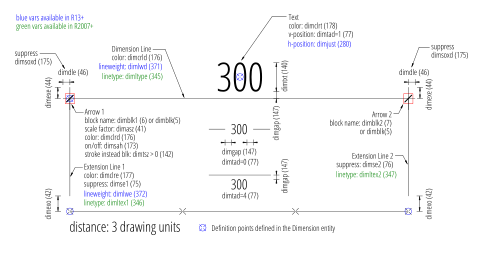

DimStyle
========

.. module:: ezdxf.entities
    :noindex:

.. image:: ../dxfinternals/tables/gfx/dimvars2.svg
    :align: center
    :width: 800px

DIMSTYLE (`DXF Reference`_) defines the appearance of :class:`Dimension` entities. Each of this dimension variables
starting with ``dim...`` can be overridden for any :class:`Dimension` entity individually.

======================== ==========================================
Subclass of              :class:`ezdxf.entities.DXFEntity`
DXF type                 ``'DIMSTYLE'``
Factory function         :meth:`Drawing.dimstyles.new`
======================== ==========================================

.. class:: DimStyle

    .. attribute:: dxf.owner

        Handle to owner (:class:`~ezdxf.sections.table.Table`).

    .. attribute:: dxf.name

        Dimension style name.

    .. attribute:: dxf.flags

        Standard flag values (bit-coded values):

        ======= ==============================================================================================
        16      If set, table entry is externally dependent on an xref
        32      If both this bit and bit 16 are set, the externally dependent xref has been successfully resolved
        64      If set, the table entry was referenced by at least one entity in the drawing the last time the drawing
                was edited. (This flag is only for the benefit of AutoCAD)
        ======= ==============================================================================================

    .. attribute:: dxf.dimpost

        Prefix/suffix for primary units dimension values.

    .. attribute:: dxf.dimapost

        Prefix/suffix for alternate units dimensions.

    .. attribute:: dxf.dimblk

        Block type to use for both arrowheads as name string.

    .. attribute:: dxf.dimblk1

        Block type to use for first arrowhead as name string.

    .. attribute:: dxf.dimblk2

        Block type to use for second arrowhead as name string.

    .. attribute:: dxf.dimscale

        Global dimension feature scale factor. (default=1)

    .. attribute:: dxf.dimasz

        Dimension line and arrowhead size. (default=0.25)

    .. attribute:: dxf.dimexo

        Distance from origin points to extension lines. (default imperial=0.0625, default metric=0.625)

    .. attribute:: dxf.dimdli

        Incremental spacing between baseline dimensions. (default imperial=0.38, default metric=3.75)

    .. attribute:: dxf.dimexe

        Extension line distance beyond dimension line. (default imperial=0.28, default metric=2.25)

    .. attribute:: dxf.dimrnd

        Rounding value for decimal dimensions. (default=0)

        Rounds all dimensioning distances to the specified value, for instance, if DIMRND is set to 0.25,
        all distances round to the nearest 0.25 unit. If you set DIMRND to 1.0, all distances round to
        the nearest integer.

    .. attribute:: dxf.dimdle

        Dimension line extension beyond extension lines. (default=0)

    .. attribute:: dxf.dimtp

        Upper tolerance value for tolerance dimensions. (default=0)

    .. attribute:: dxf.dimtm

        Lower tolerance value for tolerance dimensions. (default=0)

    .. attribute:: dxf.dimtxt

        Size of dimension text. (default imperial=0.28, default metric=2.5)

    .. attribute:: dxf.dimcen

        Controls placement of center marks or centerlines. (default imperial=0.09, default metric=2.5)

    .. attribute:: dxf.dimtsz

        Controls size of dimension line tick marks drawn instead of arrowheads. (default=0)

    .. attribute:: dxf.dimaltf

        Alternate units dimension scale factor. (default=25.4)

    .. attribute:: dxf.dimlfac

        Scale factor for linear dimension values. (default=1)

    .. attribute:: dxf.dimtvp

        Vertical position of text above or below dimension line if :attr:`~DimStyle.dxf.dimtad` is 0. (default=0)

    .. attribute:: dxf.dimtfac

        Scale factor for fractional or tolerance text size. (default=1)

    .. attribute:: dxf.dimgap

        Gap size between dimension line and dimension text. (default imperial=0.09, default metric=0.625)

    .. attribute:: dxf.dimaltrnd

        Rounding value for alternate dimension units. (default=0)

    .. attribute:: dxf.dimtol

        Toggles creation of appended tolerance dimensions. (default imperial=1, default metric=0)

    .. attribute:: dxf.dimlim

        Toggles creation of limits-style dimension text. (default=0)

    .. attribute:: dxf.dimtih

        Orientation of text inside extension lines. (default imperial=1, default metric=0)

    .. attribute:: dxf.dimtoh

        Orientation of text outside extension lines. (default imperial=1, default metric=0)

    .. attribute:: dxf.dimse1

        Toggles suppression of first extension line. (default=0)

    .. attribute:: dxf.dimse2

        Toggles suppression of second extension line. (default=0)

    .. attribute:: dxf.dimtad

        Sets vertical text placement relative to dimension line. (default imperial=0, default metric=1)

        === =====
        0   center
        1   above
        2   outside, handled like above by `ezdxf`
        3   JIS, handled like above by `ezdxf`
        4   below
        === =====

    .. attribute:: dxf.dimzin

        Zero suppression for primary units dimensions. (default imperial=0, default metric=8) ???

    .. attribute:: dxf.dimazin

        Controls zero suppression for angular dimensions. (default=0)

    .. attribute:: dxf.dimalt

        Enables or disables alternate units dimensioning. (default=0)

    .. attribute:: dxf.dimaltd

        Controls decimal places for alternate units dimensions. (default imperial=2, default metric=3)

    .. attribute:: dxf.dimtofl

        Toggles forced dimension line creation. (default imperial=0, default metric=1)

    .. attribute:: dxf.dimsah

        Toggles appearance of arrowhead blocks. (default=0)

    .. attribute:: dxf.dimtix

        Toggles forced placement of text between extension lines. (default=0)

    .. attribute:: dxf.dimsoxd

        Suppresses dimension lines outside extension lines. (default=0)

    .. attribute:: dxf.dimclrd

        Dimension line, arrowhead, and leader line color. (default=0)

    .. attribute:: dxf.dimclre

        Dimension extension line color. (default=0)

    .. attribute:: dxf.dimclrt

        Dimension text color. (default=0)

    .. attribute:: dxf.dimadec

        Controls the number of decimal places for angular dimensions.

    .. attribute:: dxf.dimunit

        Obsolete, now use DIMLUNIT AND DIMFRAC

    .. attribute:: dxf.dimdec

        Decimal places for dimension values. (default imperial=4, default metric=2)

    .. attribute:: dxf.dimtdec

        Decimal places for primary units tolerance values. (default imperial=4, default metric=2)

    .. attribute:: dxf.dimaltu

        Units format for alternate units dimensions. (default=2)

    .. attribute:: dxf.dimalttd

        Decimal places for alternate units tolerance values. (default imperial=4, default metric=2)

    .. attribute:: dxf.dimaunit

        Unit format for angular dimension values. (default=0)

    .. attribute:: dxf.dimfrac

        Controls the fraction format used for architectural and fractional dimensions. (default=0)

    .. attribute:: dxf.dimlunit

        Specifies units for all nonangular dimensions. (default=2)

    .. attribute:: dxf.dimdsep

        Specifies a single character to use as a decimal separator. (default imperial = ``'.'``, default metric = ``','``)
        This is an integer value, use :code:`ord('.')` to write value.

    .. attribute:: dxf.dimtmove

        Controls the format of dimension text when it is moved. (default=0)

        === =====
        0   Moves the dimension line with dimension text
        1   Adds a leader when dimension text is moved
        2   Allows text to be moved freely without a leader
        === =====

    .. attribute:: dxf.dimjust

        Horizontal justification of dimension text. (default=0)

        === =====
        0   Center of dimension line
        1   Left side of the dimension line, near first extension line
        2   Right side of the dimension line, near second extension line
        3   Over first extension line
        4   Over second extension line
        === =====

    .. attribute:: dxf.dimsd1

        Toggles suppression of first dimension line. (default=0)

    .. attribute:: dxf.dimsd2

        Toggles suppression of second dimension line. (default=0)

    .. attribute:: dxf.dimtolj

        Vertical justification for dimension tolerance text. (default=1)

    .. attribute:: dxf.dimaltz

        Zero suppression for alternate units dimension values. (default=0)

    .. attribute:: dxf.dimalttz

        Zero suppression for alternate units tolerance values. (default=0)

    .. attribute:: dxf.dimfit

        Obsolete, now use DIMATFIT and DIMTMOVE

    .. attribute:: dxf.dimupt

        Controls user placement of dimension line and text. (default=0)

    .. attribute:: dxf.dimatfit

        Controls placement of text and arrowheads when there is insufficient space between the extension lines. (default=3)

    .. attribute:: dxf.dimtxsty

        Text style used for dimension text by name.

    .. attribute:: dxf.dimtxsty_handle

        Text style used for dimension text by handle of STYLE entry.
        (use :attr:`DimStyle.dxf.dimtxsty` to get/set text style by name)

    .. attribute:: dxf.dimldrblk

        Specify arrowhead used for leaders by name.

    .. attribute:: dxf.dimldrblk_handle

        Specify arrowhead used for leaders by handle of referenced block.
        (use :attr:`DimStyle.dxf.dimldrblk` to get/set arrowhead by name)

    .. attribute:: dxf.dimblk_handle

        Block type to use for both arrowheads, handle of referenced block.
        (use :attr:`DimStyle.dxf.dimblk` to get/set arrowheads by name)

    .. attribute:: dxf.dimblk1_handle

        Block type to use for first arrowhead, handle of referenced block.
        (use :attr:`DimStyle.dxf.dimblk1` to get/set arrowhead by name)

    .. attribute:: dxf.dimblk2_handle

        Block type to use for second arrowhead, handle of referenced block.
        (use :attr:`DimStyle.dxf.dimblk2` to get/set arrowhead by name)

    .. attribute:: dxf.dimlwd

        Lineweight value for dimension lines. (default=-2, BYBLOCK)

    .. attribute:: dxf.dimlwe

        Lineweight value for extension lines. (default=-2, BYBLOCK)

    .. attribute:: dxf.dimltype

        Specifies the linetype used for the dimension line as linetype name, requires DXF R2007+

    .. attribute:: dxf.dimltype_handle

        Specifies the linetype used for the dimension line as handle to LTYPE entry, requires DXF R2007+
        (use :attr:`DimStyle.dxf.dimltype` to get/set linetype by name)

    .. attribute:: dxf.dimltex1

        Specifies the linetype used for the extension line 1 as linetype name, requires DXF R2007+

    .. attribute:: dxf.dimlex1_handle

        Specifies the linetype used for the extension line 1 as handle to LTYPE entry, requires DXF R2007+
        (use :attr:`DimStyle.dxf.dimltex1` to get/set linetype by name)

    .. attribute:: dxf.dimltex2

        Specifies the linetype used for the extension line 2 as linetype name, requires DXF R2007+

    .. attribute:: dxf.dimlex2_handle

        Specifies the linetype used for the extension line 2 as handle to LTYPE entry, requires DXF R2007+
        (use :attr:`DimStyle.dxf.dimltex2` to get/set linetype by name)

    .. attribute:: dxf.dimfxlon

        Extension line has fixed length if set to 1, requires DXF R2007+

    .. attribute:: dxf.dimfxl

        Length of extension line below dimension line if fixed (:attr:`DimStyle.dxf.dimtfxlon` == 1),
        :attr:`DimStyle.dxf.dimexen` defines the the length above the dimension line, requires DXF R2007+

    .. attribute:: dxf.dimtfill

        Text fill 0=off; 1=background color; 2=custom color (see :attr:`DimStyle.dxf.dimtfillclr`), requires DXF R2007+

    .. attribute:: dxf.dimtfillclr

        Text fill custom color as color index (1-255), requires DXF R2007+

    .. automethod:: copy_to_header(dwg: Drawing) -> None

    .. automethod:: set_arrows

    .. automethod:: set_tick

    .. automethod:: set_text_align

    .. automethod:: set_text_format

    .. automethod:: set_dimline_format

    .. automethod:: set_extline_format

    .. automethod:: set_extline1

    .. automethod:: set_extline2

    .. automethod:: set_tolerance

    .. automethod:: set_limits

.. _DXF Reference: http://help.autodesk.com/view/OARX/2018/ENU/?guid=GUID-F2FAD36F-0CE3-4943-9DAD-A9BCD2AE81DA