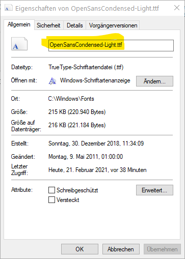

Style
=====

.. module:: ezdxf.entities
    :noindex:

.. important::

    DXF is not a layout preserving data format like PDF. It is more similar to
    the MS Word format. Many applications can open MS Word documents, but the
    displayed or printed document does not look perfect like the result of
    MS Word.

    The final rendering of DXF files is highly dependent on the interpretation
    of DXF entities by the rendering engine, and the DXF reference does not
    provide any guidelines for rendering entities. The biggest visual
    differences of CAD applications are the text renderings, therefore
    the only way to get the exact same result is to use the same CAD
    application.

    The DXF format does not and **can not** embed TTF fonts like the PDF format!

The :class:`Textstyle` entity defines a text style (`DXF Reference`_), and can
be used by the entities: :class:`Text`, :class:`Attrib`, :class:`Attdef`,
:class:`MText`, :class:`Dimension`, :class:`Leader` and :class:`MultiLeader`.

Example to create a new text style "Arial" and to apply this text style:

.. code-block:: Python

    doc.styles.add("Arial", font="Arial.ttf")
    msp = doc.modelspace()
    msp.add_text("my text", dxfattribs={"style": "Arial"})

The settings stored in the :class:`Textstyle` entity are the default
text style values used by CAD applications if the text settings are not
stored in the text entity itself.
But not all setting are substituted by the default value.
The :attr:`height` or :attr:`width` attribute must be stored in the
text entities itself in order to influence the appearance of the text.
It is `recommended` that you do not rely on the default settings in the
:class:`Textstyle` entity, set all attributes in the text entity itself if
supported.

Font Settings
-------------

Just a few settings are available exclusive by the :class:`Textstyle` entity:

The most important setting is the :attr:`font` attribute, this attribute
defines the rendering font as raw TTF file name, e.g. "Arial.ttf" or
"OpenSansCondensed-Light.ttf", this file name is often **not** the name
displayed in GUI application and you have to digg down into the fonts folder
e.g. ("C:\\Windows\\Fonts") to get the the real file name for the TTF font.
Do not include the path!

AutoCAD supports beyond the legacy SHX fonts **only** TTF fonts.
The SHX font format is not documented and only available in some CAD
applications. The `ezdxf` :mod:`~ezdxf.addons.drawing` add-on replaces the
SHX fonts by TTF fonts, which look similar to the SHX fonts, unfortunately the
license of these fonts is unclear, therefore they can not be packaged with `ezdxf`.
They are installed automatically if you use an Autodesk product like `TrueView`_,
or search the internet at you own risk for these TTF fonts.

The extended font data can provide extra information for the font, it is stored
in the XDATA section, not well documented and not widely supported.

.. important::

    The DXF format does not and **can not** embed TTF fonts like the PDF format!

    You need to make sure that the CAD application is properly configured to
    have access to the system fonts. The DXF format has no setting where the CAD
    application should search for fonts, and does not guarantee that the text
    rendering on other computers or operating systems looks the same as on your
    current system on which you created the DXF.

The second exclusive setting is the vertical text flag in :attr:`Textstyle.flags`.
The vertical text style is enabled for `all` entities using the text style.
Vertical text works only for SHX fonts and is not supported for TTF fonts
(in AutoCAD) and is works only for the single line entities :class:`Text`
and :class:`Attrib`.
Most CAD applications beside AutoCAD and BricsCAD do not support vertical text
rendering and even AutoCAD and BricsCAD have problems with vertical text
rendering in some circumstances. Using the vertical text feature is not
recommended.

======================== ==========================================
Subclass of              :class:`ezdxf.entities.DXFEntity`
DXF type                 ``'STYLE'``
Factory function         :meth:`Drawing.styles.new`
======================== ==========================================

.. seealso::

    :ref:`tut_text` and DXF internals for :ref:`dimstyle_table_internals`.

.. class:: Textstyle

    .. autoproperty:: is_backward

    .. autoproperty:: is_upside_down

    .. autoproperty:: is_vertical_stacked

    .. attribute:: dxf.handle

        DXF handle (feature for experts).

    .. attribute:: dxf.owner

        Handle to owner (:class:`~ezdxf.sections.table.StyleTable`).

    .. attribute:: dxf.name

        Style name (str)

    .. attribute:: dxf.flags

        Style flags (feature for experts).

        === =======================================================
        1   If set, this entry describes a shape
        4   Vertical text
        16  If set, table entry is externally dependent on an xref
        32  If both this bit and bit 16 are set, the externally dependent xref
            has been successfully resolved
        64  If set, the table entry was referenced by at least one entity in the
            drawing the last time the drawing was edited. (This flag is only for
            the benefit of AutoCAD)commands. It can be ignored by most programs
            that read DXF files and need not be set by programs that write DXF
            files)
        === =======================================================

    .. attribute:: dxf.height

        Fixed height in drawing units as float value, 0 for not fixed.

    .. attribute:: dxf.width

        Width factor as float value, default value is 1.

    .. attribute:: dxf.oblique

        Oblique (slanting) angle in degrees as float value, default value is 0
        for no slanting.

    .. attribute:: dxf.generation_flags

        Text generations flags as int value.

        === ===================================
        2   text is backward (mirrored along the x-axis)
        4   text is upside down (mirrored about the base line)
        === ===================================

    .. attribute:: dxf.last_height

        Last height used in drawing units as float value.

    .. attribute:: dxf.font

        Raw font file name as string without leading path, e.g.
        "Arial.ttf" for TTF fonts or the SHX font name like
        "TXT" or "TXT.SHX".

    .. attribute:: dxf.bigfont

        Big font name as string, blank if none. No documentation how to use
        this feature, maybe just a legacy artifact.

    .. autoproperty:: has_extended_font_data

    .. automethod:: get_extended_font_data

    .. automethod:: set_extended_font_data

    .. automethod:: discard_extended_font_data

.. _DXF Reference: http://help.autodesk.com/view/OARX/2018/ENU/?guid=GUID-EF68AF7C-13EF-45A1-8175-ED6CE66C8FC9

.. _TrueView: https://www.autodesk.com/products/dwg/viewers#