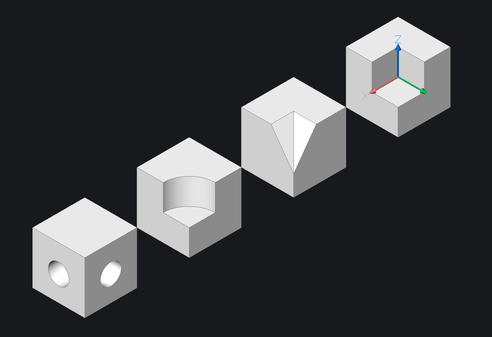

.. module:: ezdxf.acis

.. ACIS_Tools

ACIS Tools
==========

.. versionadded:: 0.18

The :mod:`ezdxf.acis` sub-package provides some :term:`ACIS` data management
tools. The main goals of this tools are:

    1. load and parse simple and known :term:`ACIS` data structures
    2. create and export simple and known :term:`ACIS` data structures

It is NOT a goal to load and edit arbitrary existing :term:`ACIS` structures.

    Don't even try it!

These tools cannot replace the official :term:`ACIS` SDK due to the complexity of
the data structures and the absence of an :term:`ACIS` kernel. Without access to
the full documentation it is very cumbersome to reverse-engineer entities and
their properties, therefore the analysis of the :term:`ACIS` data structures is
limited to the use as embedded data in DXF and DWG files.

The `ezdxf` library does not provide an :term:`ACIS` kernel and there are no
plans for implementing one because this is far beyond my capabilities, but it
is possible to extract geometries made up only by flat polygonal faces (polyhedron)
and maybe in the future it is also possible to create ACIS bodies from such
polyhedrons.

Implementation status for exporting polyhedrons as ACIS data and loading
the DXF file by Autodesk products or BricsCAD:

=========== === =========== ==========
DXF Version FMT Autodesk    BricsCAD
=========== === =========== ==========
R2000       SAT **Yes**     **Yes**
R2004       SAT **Yes**     **Yes**
R2007       SAT **Yes**     **Yes**
R2010       SAT **Yes**     **Yes**
R2013       SAT **Yes**     **Yes**
R2018       SAT **Yes**     **Yes**
=========== === =========== ==========

.. module:: ezdxf.acis.api

.. important::

    Always import from the public interface module :mod:`ezdxf.acis.api`,
    the internal package and module structure may change in the future and
    imports from other modules than :mod:`api` will break.

Functions
~~~~~~~~~

.. autofunction:: load_dxf

Example:

.. code-block:: Python

    import ezdxf
    from ezdxf.acis import api as acis

    doc = ezdxf.readfile("your.dxf")
    msp = doc.modelspace()

    for e in msp.query("3DSOLID"):
        bodies = acis.load_dxf(e)
        ...

.. autofunction:: export_dxf

Example:

.. code-block:: Python

    import ezdxf
    from ezdxf.render import forms
    from ezdxf.acis import api as acis

    doc = ezdxf.new("R2000")
    msp = doc.modelspace()

    # create an ACIS body from a simple cube-mesh
    body = acis.body_from_mesh(forms.cube())
    solid3d = msp.add_3dsolid()
    acis.export_dxf(solid3d, [body])
    doc.saveas("cube.dxf")

.. autofunction:: load

.. autofunction:: export_sat

.. autofunction:: export_sab

.. autofunction:: mesh_from_body

The following images show the limitations of the :func:`mesh_from_body`
function. The first image shows the source ``3DSOLID`` entities with
subtraction of entities with flat and curved faces:

Example script to extracts all flat polygonal faces as meshes:

.. code-block:: Python

    import ezdxf
    from ezdxf.acis import api as acis

    doc = ezdxf.readfile("3dsolids.dxf")
    msp = doc.modelspace()

    doc_out = ezdxf.new()
    msp_out = doc_out.modelspace()

    for e in msp.query("3DSOLID"):
        for body in acis.load_dxf(data):
            for mesh in acis.mesh_from_body(body):
                mesh.render_mesh(msp_out)
    doc_out.saveas("meshes.dxf")

The second image shows the flat faces extracted from the ``3DSOLID`` entities
and exported as :class:`~ezdxf.entities.Mesh` entities:

.. image:: gfx/solids-mesh.png

As you can see all faces which do not have straight lines as boundaries are
lost.

.. autofunction:: body_from_mesh

Exceptions
~~~~~~~~~~

.. class:: AcisException

    Base exception of the :mod:`ezdxf.acis` package.

.. class:: ParsingError

    Exception raised when loading invalid or unknown :term:`ACIS` structures.

.. class:: ExportError

    Exception raised when exporting invalid or unknown :term:`ACIS` structures.

.. class:: InvalidLinkStructure

    Exception raised when the internal link structure is damaged.

.. module:: ezdxf.acis.entities

Entities
~~~~~~~~

A document (`sat.pdf`_) about the basic ACIS 7.0 file format is floating in the
internet.

This section contains the additional information about the entities,
I got from analyzing the SAT data extracted from DXF files exported
by BricsCAD.

This documentation ignores the differences to the ACIS format prior to version
7.0 and all this differences are handled internally.

Writing support for ACIS version < 7.0 is not required because all CAD
applications should be able to process version 7.0, even if embedded in a very
old DXF R2000 format (tested with Autodesk TrueView, BricsCAD and Nemetschek
Allplan).

The first goal is to document the entities which are required to represent
a geometry as flat polygonal faces (polyhedron), which can be converted into
a :class:`~ezdxf.render.MeshBuilder` object.

Topology Entities:

    - :class:`Body`
    - :class:`Lump`
    - :class:`Shell`
    - :class:`Face`
    - :class:`Loop`
    - :class:`Coedge`
    - :class:`Edge`
    - :class:`Vertex`

Geometry Entities:

    - :class:`Transform`
    - :class:`Surface`
    - :class:`Plane`
    - :class:`Curve`
    - :class:`StraightCurve`
    - :class:`Point`

.. attribute:: NONE_REF

    Special sentinel entity which supports the :attr:`type` attribute and the
    :attr:`is_none` property. Represents all unset entities.
    Use this idiom on any entity type to check if an entity is unset::

        if entity.is_none:
            ...

AcisEntity
----------

.. class:: AcisEntity

    Base class for all ACIS entities.

    .. attribute:: type

        Name of the type as str.

    .. attribute:: id

        Unique id as int or -1 if not set.

    .. attribute:: attributes

        Reference to the first :class:`Attribute` entity (not supported).

    .. attribute:: is_none

        ``True`` for unset entities represented by the :attr:`NONE_REF`
        instance.

Transform
---------

.. class:: Transform(AcisEntity)

    Represents an affine transformation operation which transform the
    :class:`body` to the final location, size and rotation.

    .. attribute:: matrix

        Transformation matrix of type :class:`ezdxf.math.Matrix44`.

Body
----

.. class:: Body(AcisEntity)

    Represents a solid geometry, which can consist of multiple :class:`Lump`
    entities.

    .. attribute:: pattern

        Reference to the :class:`Pattern` entity.

    .. attribute:: lump

        Reference to the first :class:`Lump` entity

    .. attribute:: wire

        Reference to the first :class:`Wire` entity

    .. attribute:: transform

        Reference to the :class:`Transform` entity (optional)

    .. automethod:: lumps

    .. automethod:: append_lump

Pattern
-------

.. class:: Pattern(AcisEntity)

    Not implemented.

Lump
----

.. class:: Lump(AcisEntity)

    The lump represents a connected entity and there can be multiple lumps in a
    :class:`Body`. Multiple lumps are linked together by the :attr:`next_lump`
    attribute which points to the next lump entity the last lump has a ``NONE_REF``
    as next lump. The :attr:`body` attribute references to the parent :class:`Body`
    entity.

    .. attribute:: next_lump

        Reference to the next :class:`Lump` entity, the last lump references
        :attr:`NONE_REF`.

    .. attribute:: shell

        Reference to the :class:`Shell` entity.

    .. attribute:: body

        Reference to the parent :class:`Body` entity.

    .. automethod:: shells

    .. automethod:: append_shell

Wire
----

.. class:: Wire(AcisEntity)

    Not implemented.

Shell
-----

.. class:: Shell(AcisEntity)

    A shell defines the boundary of a solid object or a void (subtraction object).
    A shell references a list of :class:`Face` and :class:`Wire` entities.
    All linked :class:`Shell` entities are disconnected.

    .. attribute:: next_shell

        Reference to the next :class:`Shell` entity, the last shell references
        :attr:`NONE_REF`.

    .. attribute:: subshell

        Reference to the first :class:`Subshell` entity.

    .. attribute:: face

        Reference to the first :class:`Face` entity.

    .. attribute:: wire

        Reference to the first :class:`Wire` entity.

    .. attribute:: lump

        Reference to the parent :class:`Lump` entity.

    .. automethod:: faces

    .. automethod:: append_face

Subshell
--------

.. class:: Subshell(AcisEntity)

    Not implemented.

Face
----

.. class:: Face(AcisEntity)

    A face is the building block for :class:`Shell` entities.
    The boundary of a face is represented by one or more :class:`Loop` entities.

    .. attribute:: next_face

        Reference to the next :class:`Face` entity, the last face references
        :attr:`NONE_REF`.

    .. attribute:: loop

        Reference to the first :class:`Loop` entity.

    .. attribute:: shell

        Reference to the parent :class:`Shell` entity.

    .. attribute:: subshell

        Reference to the parent :class:`Subshell` entity.

    .. attribute:: surface

        Reference to the parametric :class:`Surface` geometry.

    .. attribute:: sense

        Boolean value of direction of the face normal with respect to the
        :class:`Surface` entity:

            - ``True``: "reversed" direction of the face normal
            - ``False``: "forward" for same direction of the face normal

    .. attribute:: double_sided

        Boolean value which indicates the sides of the face:

            - ``True``: the face is part of a hollow object and has two sides.
            - ``False``: the face is part of a solid object and has only one
              side which points away from the "material".

    .. attribute:: containment

        Unknown meaning.

        If :attr:`double_sided` is ``True``:

            - ``True`` is "in"
            - ``False`` is "out"

    .. automethod:: loops

    .. automethod:: append_loop

Loop
-----

.. class:: Loop(AcisEntity)

Coedge
------

.. class:: Coedge(AcisEntity)

    The coedges are a double linked list where :attr:`next_coedge` points to the
    next coedge and :attr:`prev_codege` to the previous coedge.
    The :attr:`partner` field points to the partner coedge of the adjacent face.

    In a closed surface each edge is part of two adjacent faces with opposite
    orientations. The :attr:`edge` attribute references the geometric :class:`Edge`
    of the face and the :attr:`loop` attribute references to the parent :class:`Loop`
    entity.

Edge
----

.. class:: Edge(AcisEntity)

Vertex
------

.. class:: Vertex(AcisEntity)

    Represents a vertex of an :class:`Edge` entity and references a :class:`Point`
    entity. Multiple :class:`Vertex` entities can reference the same :class:`Point`
    entity.

Surface
--------

.. class:: Surface(AcisEntity)

Plane
-----

.. class:: Plane(Surface)

Curve
-----

.. class:: Curve(AcisEntity)

StraightCurve
-------------

.. class:: StraightCurve(AcisEntity)

Point
-----

.. class:: Point(AcisEntity)

    Represents a point in space where the :attr:`location` attribute represents
    the cartesian coordinates.

    .. attribute:: location

        Cartesian coordinates of type :class:`~ezdxf.math.Vec3`.

.. _sat.pdf: https://duckduckgo.com/?q=acis%2Bsat.pdf
