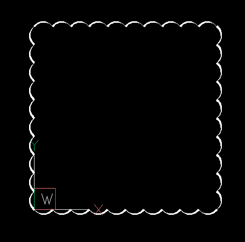

.. module:: ezdxf.revcloud

Revision Cloud
==============

The module :mod:`ezdxf.revcloud` provides functions to render revision clouds 
similar to the REVCLOUD command in CAD applications.

.. versionadded:: 1.3.0

..  autofunction:: points

..  autofunction:: add_entity

..  autofunction:: is_revcloud

Usage:

.. code-block::

    import ezdxf
    from ezdxf.render import revcloud

    doc = ezdxf.new()
    msp = doc.modelspace()
    revcloud.add_entity(msp, [(0, 0), (1, 0), (1, 1), (0, 1)], segment_length=0.1)
    doc.saveas("revcloud.dxf")

