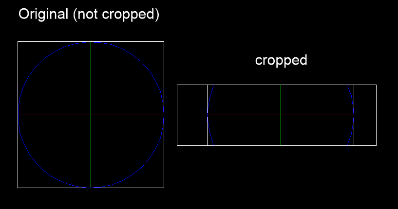

.. _xclip_module:

.. module:: ezdxf.xclip

XClip Module
============

.. versionadded:: 1.2

The :class:`XClip` class can set or remove the clipping path of external references or 
block references.

The clipping boundary determines the portion of an XREF or block instance that is hidden, 
either outside or inside the boundary (inside = inverted clipping path).  The visibility 
of the clipping boundary is controlled by the $XCLIPFRAME header variable.

The :class:`XClip` class supports only 2D clippings path and cannot create inverted 
clipping paths.

There exist two coordinate systems for the clipping path polygon:

    - BLOCK coordinate system: the BLOCK coordinates are relative to the BLOCK origin
    - WCS coordinate system: the WCS coordinates are relative to the origin of the of 
      the coodintate system where the block reference (INSERT entity) is inserted

The :class:`XClip` class provides methods to set and get the 
clipping path for both variants and returns a :class:`ClippingPath` object.

The clipping polygon can be set visible/invisible when the header variable 
$XCLIPFRAME is not 0, otherwise the clipping polygon is always invisible.

Remove the clipping path by the :meth:`XClip.discard_clipping_path` method, does not 
raise an exception when no clipping path exist.

.. seealso::

    example script: `clipping_insert.py`_ in the ``/examples/blocks`` folder

.. autoclass:: XClip

    .. autoproperty:: has_clipping_path

    .. autoproperty:: is_clipping_path_visible

    .. autoproperty:: is_inverted_clip

    .. automethod:: get_spatial_filter

    .. automethod:: get_xclip_frame_policy

    .. automethod:: show_clipping_path

    .. automethod:: hide_clipping_path

    .. automethod:: get_block_clipping_path

    .. automethod:: get_wcs_clipping_path

    .. automethod:: set_block_clipping_path

    .. automethod:: set_wcs_clipping_path

    .. automethod:: discard_clipping_path

.. autoclass:: ClippingPath

.. _clipping_insert.py: https://github.com/mozman/ezdxf/blob/master/examples/blocks/clipping_insert.py