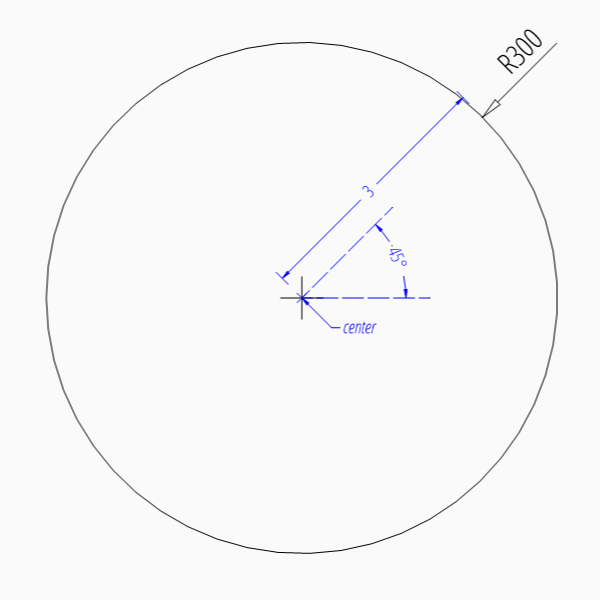
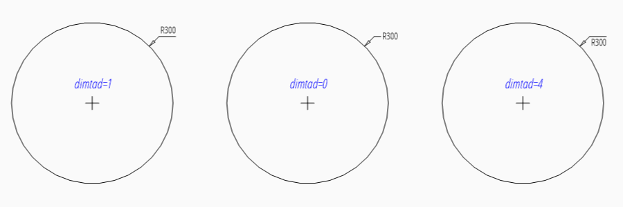
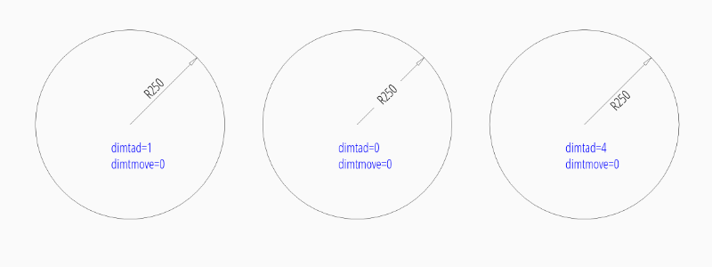
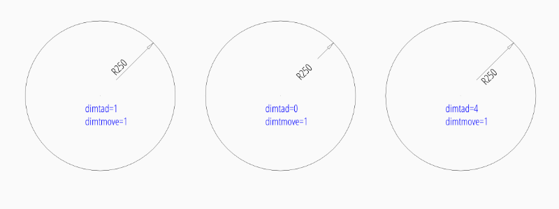
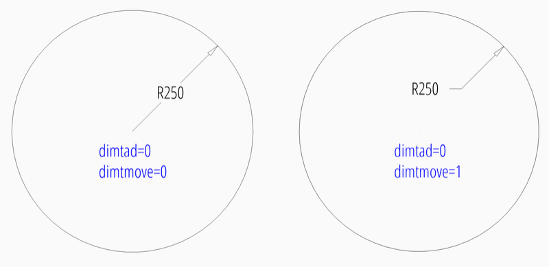
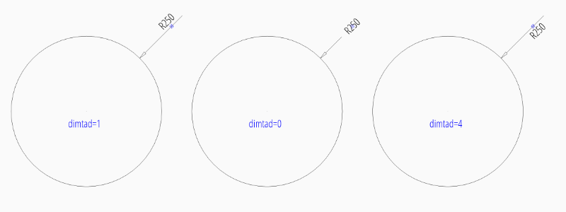
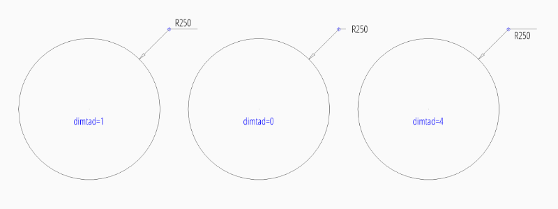
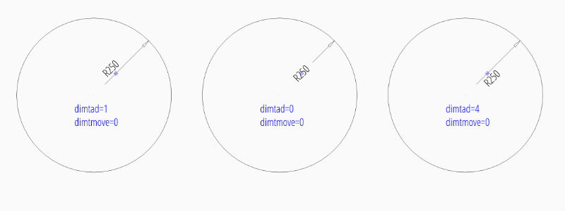
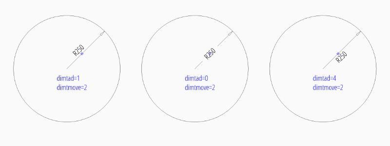
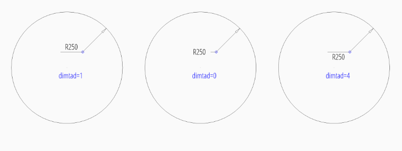

.. _tut_angular_dimension:

Tutorial for Angular Dimensions (work in progress)
==================================================

Please read the :ref:`tut_linear_dimension` before, if you haven't.

.. note::

    `Ezdxf` does not consider all DIMSTYLE variables, so the
    rendering results are different from CAD applications.

The first example shows an angular dimension for an angle defined by two lines:

.. code-block:: Python

    import ezdxf

    # Create a DXF R2010 document:
    # Use argument setup=True to setup the default dimension styles.
    doc = ezdxf.new("R2010", setup=True)

    # Add new entities to the modelspace:
    msp = doc.modelspace()

    # Setup the geometric parameters for the DIMENSION entity:
    base = (5.8833, -6.3408)  # location of the dimension line
    p1 = (2.0101, -7.5156)  # start point of 1st leg
    p2 = (2.7865, -10.4133)  # end point of 1st leg
    p3 = (6.7054, -7.5156)  # start point of 2nd leg
    p4 = (5.9289, -10.4133)  # end point of 2nd leg

    # Draw the lines for visualization, not required to create the
    # DIMENSION entity:
    msp.add_line(p1, p2)
    msp.add_line(p3, p4)

    # Add an angular DIMENSION from two lines, the measurement text is placed
    # at the default location above the dimension line:
    dim = msp.add_angular_dim_2l(
        base=base,  # defines the location of the dimension line
        line1=(p1, p2),  # start leg of the angle
        line2=(p3, p4),  # end leg of the angle
        dimstyle="EZ_CURVED",  # default angular dimension style
    )

    # Necessary second step to create the BLOCK entity with the dimension geometry.
    # Additional processing of the DIMENSION entity could happen between adding
    # the entity and the rendering call.
    dim.render()
    doc.saveas("angular_dimension.dxf")

The example above creates an angular :class:`~ezdxf.entities.Dimension` entity
to measures the angle between two lines (`line1` and `line2`).
The default dimension style "EZ_ANGULAR" is defined as:

- angle unit is decimal degrees
- measurement text height = 0.25 (drawing scale = 1:100)
- measurement text location is above the dimension line
- closed filled arrow and arrow size :attr:`dimasz` = 0.25

Every dimension style which does not exist will be replaced by the dimension
style "Standard" at DXF export by :meth:`save` or :meth:`saveas`
(e.g. dimension style setup was not initiated).

The `base` point defines the location of the dimension line (arc), any point on
the dimension line is valid. The points `p1` and `p2` define the first leg of
the angle, `p1` also defines the start point of the first extension line.
The points `p3` and `p4` define the second leg of the angle and point `p3` also
defines the start point of the second extension line.

The measurement of the DIMENSION entity is the angle enclosed by the first and
the second leg and where the dimension line passes the `base` point.

The return value `dim` is **not** a dimension entity, instead a
:class:`~ezdxf.entities.DimStyleOverride` object is
returned, the dimension entity is stored as :attr:`dim.dimension`.

TODO ...

Placing Measurement Text
------------------------

There are different predefined DIMSTYLES to achieve various text placing
locations.

The basic DIMSTYLE "EZ_RADIUS" settings are:

- 1 drawing unit = 1m
- scale 1:100
- the length factor :attr:`dimlfac` = 100, which creates a measurement text in cm.
- uses a closed filled arrow, arrow size :attr:`dimasz` = 0.25

.. note::

    Not all possibles features of DIMSTYLE are supported by the `ezdxf` rendering
    procedure and especially for the radial dimension there are less features
    implemented than for the linear dimension because of the lack of good
    documentation.

.. seealso::

    - Graphical reference of many DIMVARS and some advanced information:
      :ref:`dimstyle_table_internals`
    - Source code file `standards.py`_ shows how to create your own DIMSTYLES.
    - The Script `dimension_angular.py`_ shows examples for radius dimensions.

Default Text Locations Outside
~~~~~~~~~~~~~~~~~~~~~~~~~~~~~~

Advanced "EZ_RADIUS" settings for placing the text outside of the circle:

=========== ====================================================================
tmove       1 = add a leader when dimension text is moved, this is the best
            setting for text outside to preserve the appearance of the DIMENSION
            entity, if editing afterwards in a CAD application.
dimtad      1 = place the text vertical above the dimension line
=========== ====================================================================

.. code-block:: python

    dim = msp.add_radius_dim(
        center=(0, 0),
        radius=2.5,
        angle=45,
        dimstyle="EZ_RADIUS"
    )
    dim.render()  # always required, but not shown in the following examples

To force text outside horizontal set :attr:`~ezdxf.entities.DimStyle.dxf.dimtoh`
to 1:

.. code-block:: python

    dim = msp.add_radius_dim(
        center=(0, 0),
        radius=2.5,
        angle=45,
        dimstyle="EZ_RADIUS",
        override={"dimtoh": 1}
    )

Default Text Locations Inside
~~~~~~~~~~~~~~~~~~~~~~~~~~~~~

DIMSTYLE "EZ_RADIUS_INSIDE" can be used to place the dimension text inside the
circle at a default location.

The basic DIMSTYLE "EZ_RADIUS_INSIDE" settings are:

- 1 drawing unit = 1m
- scale 1:100, length_factor is 100 which creates
- the length factor :attr:`dimlfac` = 100, which creates a measurement text in cm.
- uses a closed filled arrow, arrow size :attr:`dimasz` = 0.25

Advanced "EZ_RADIUS_INSIDE" settings to place (force) the text inside of the
circle:

=========== ====================================================================
tmove       0 = moves the dimension line with dimension text, this is the best
            setting for text inside to preserve the appearance of the DIMENSION
            entity, if editing afterwards in a CAD application.
dimtix      1 = force text inside
dimatfit    0 = force text inside, required by BricsCAD and AutoCAD
dimtad      0 = center text vertical, BricsCAD and AutoCAD always create a
            vertical centered text, `ezdxf` let you choose the vertical
            placement (above, below, center), but editing the DIMENSION in
            BricsCAD or AutoCAD will reset text to center placement.
=========== ====================================================================

.. code-block:: python

    dim = msp.add_radius_dim(
        center=(0, 0),
        radius=2.5,
        angle=45,
        dimstyle="EZ_RADIUS_INSIDE"
    )

To force text inside horizontal set :attr:`~ezdxf.entities.DimStyle.dxf.dimtih`
to 1:

.. code-block:: python

    dim = msp.add_radius_dim(
        center=(0, 0),
        radius=2.5,
        angle=45,
        dimstyle="EZ_RADIUS_INSIDE",
        override={"dimtih": 1}
    )

User Defined Text Locations
~~~~~~~~~~~~~~~~~~~~~~~~~~~

Beside the default location it is always possible to override the text location
by a user defined location. This location also determines the angle of the
dimension line and overrides the argument `angle`. For user defined locations
it is not necessary to force text inside (``dimtix=1``), because the location
of the text is explicit given, therefore the DIMSTYLE "EZ_RADIUS" can be used
for all this examples.

User defined location outside of the circle:

.. code-block:: python

    dim = msp.add_radius_dim(
        center=(0, 0),
        radius=2.5,
        location=(4, 4),
        dimstyle="EZ_RADIUS"
    )

User defined location outside of the circle and forced horizontal text:

.. code-block:: python

    dim = msp.add_radius_dim(
        center=(0, 0),
        radius=2.5,
        location=(4, 4),
        dimstyle="EZ_RADIUS",
        override={"dimtoh": 1}
    )

User defined location inside of the circle:

.. code-block:: python

    dim = msp.add_radius_dim(
        center=(0, 0),
        radius=2.5,
        location=(1, 1),
        dimstyle="EZ_RADIUS"
    )

User defined location inside of the circle and forced horizontal text:

.. code-block:: python

    dim = msp.add_radius_dim(
        center=(0, 0),
        radius=2.5,
        location=(1, 1),
        dimstyle="EZ_RADIUS",
        override={"dimtih": 1},
    )

Overriding Measurement Text
---------------------------

See Linear Dimension Tutorial: :ref:`tut_overriding_measurement_text`

Measurement Text Formatting and Styling
---------------------------------------

See Linear Dimension Tutorial: :ref:`tut_measurement_text_formatting_and_styling`

.. _dimension_angular.py:  https://github.com/mozman/ezdxf/blob/master/examples/render/dimension_angular.py
.. _standards.py: https://github.com/mozman/ezdxf/blob/master/src/ezdxf/tools/standards.py