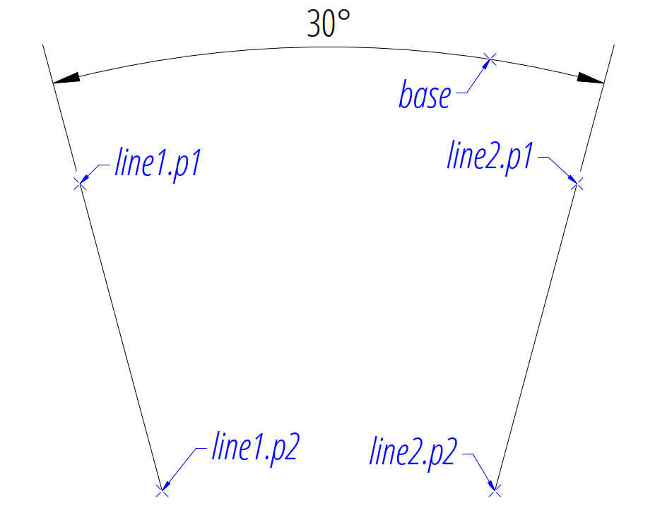
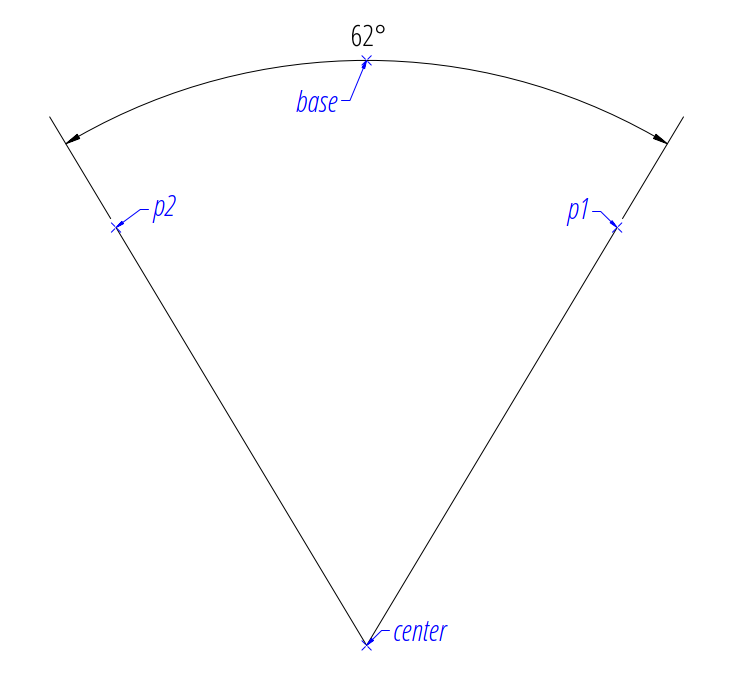
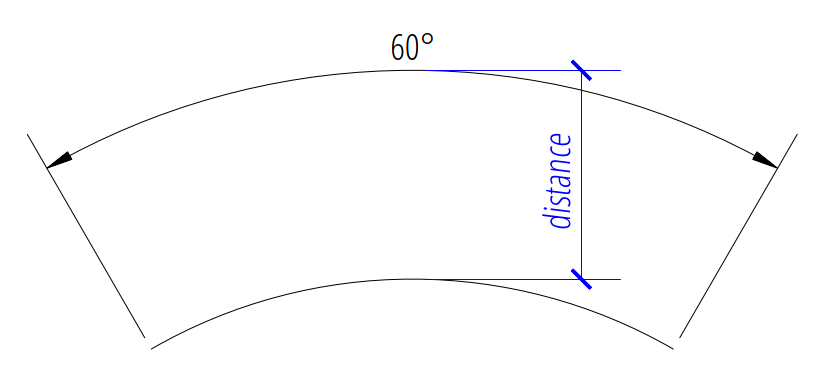
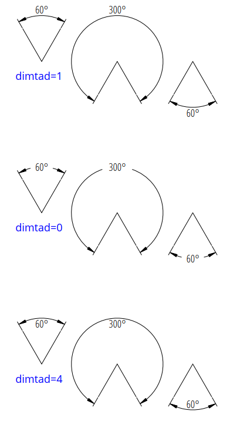
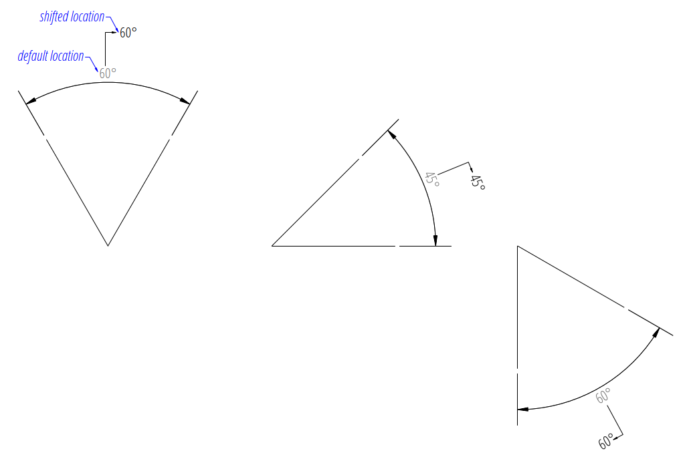
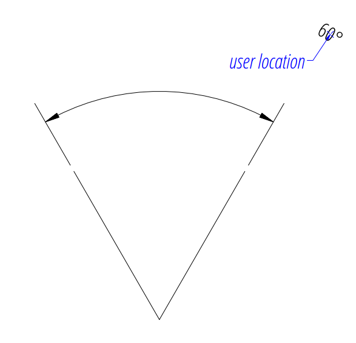
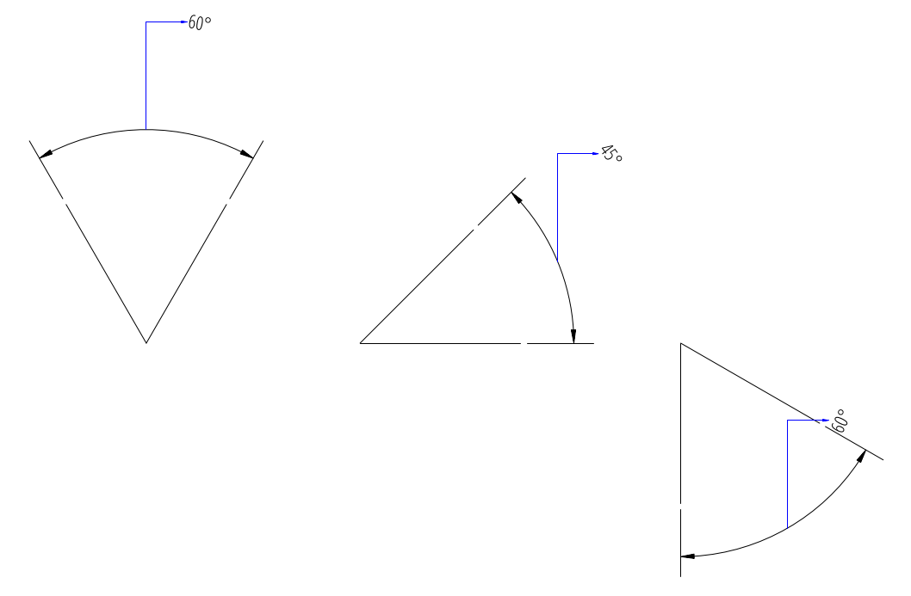
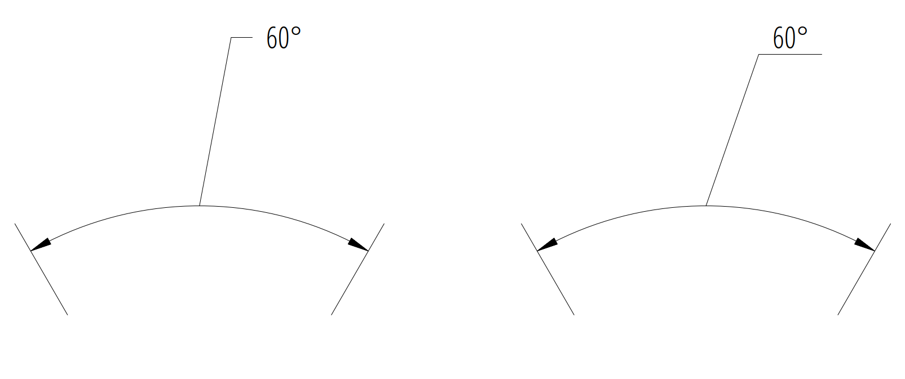
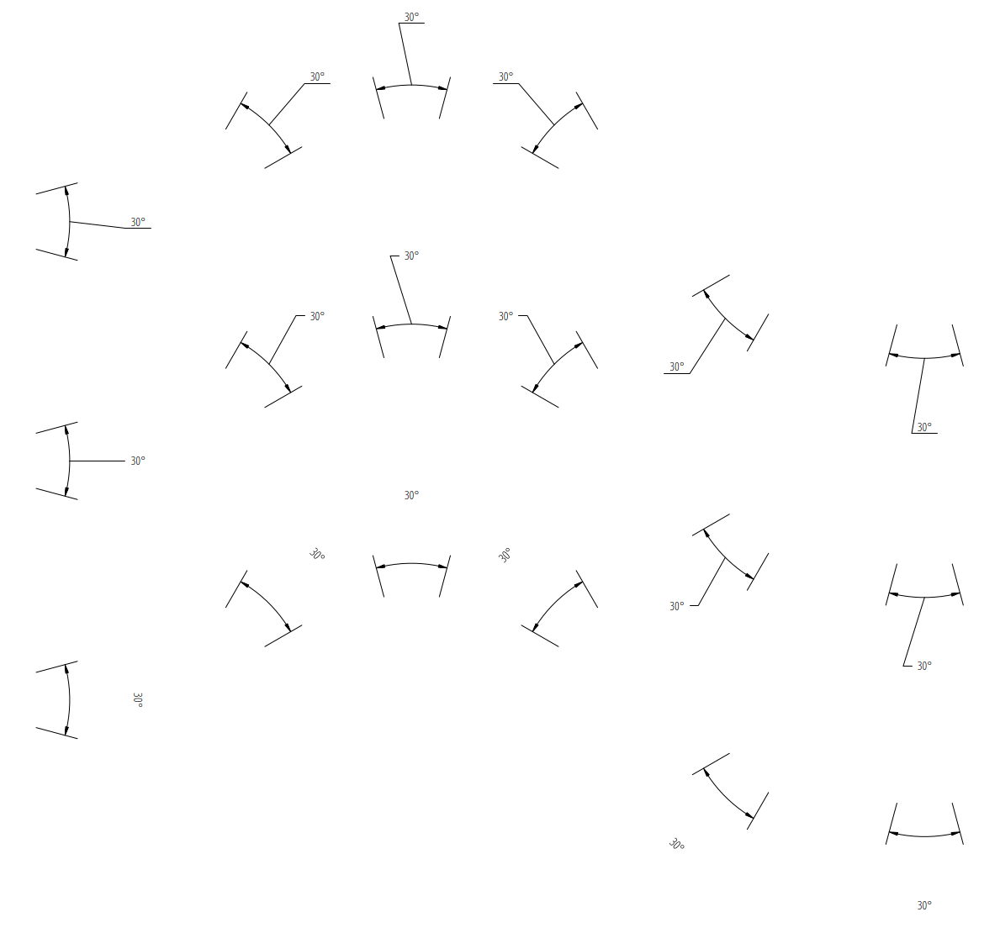

.. _tut_angular_dimension:

Tutorial for Angular Dimensions
===============================

Please read the :ref:`tut_linear_dimension` before, if you haven't.

.. note::

    `Ezdxf` does not consider all DIMSTYLE variables, so the
    rendering results are different from CAD applications.

Dimension Style "EZ_CURVED"
---------------------------

All factory methods to create angular dimensions uses the dimension style
"EZ_CURVED" for curved dimension lines which is defined as:

- angle unit is decimal degrees
- measurement text height = 0.25 (drawing scale = 1:100)
- measurement text location is above the dimension line
- closed filled arrow and arrow size :attr:`dimasz` = 0.25

This DIMENSION style only exist if the argument `setup` is ``True`` for creating
a new DXF document by :meth:`ezdxf.new`.
Every dimension style which does not exist will be replaced by the dimension
style "Standard" at DXF export by :meth:`save` or :meth:`saveas`
(e.g. dimension style setup was not initiated).

Add all `ezdxf` specific resources (line types, text- and dimension styles)
to an existing DXF document:

.. code-block:: Python

    import ezdxf
    from ezdxf.tools.standards import setup_drawing

    doc = ezdxf.readfile("your.dxf")
    setup_drawing(doc, topics="all")

Factory Methods to Create Angular Dimensions
--------------------------------------------

Defined by Center, Radius and Angles
~~~~~~~~~~~~~~~~~~~~~~~~~~~~~~~~~~~~

The first example shows an angular dimension defined by the center point, radius,
start- and end angles:

.. code-block:: Python

    import ezdxf

    # Create a DXF R2010 document:
    # Use argument setup=True to setup the default dimension styles.
    doc = ezdxf.new("R2010", setup=True)

    # Add new entities to the modelspace:
    msp = doc.modelspace()

    # Add an angular DIMENSION defined by the center point, start- and end angles,
    # the measurement text is placed at the default location above the dimension
    # line:
    dim = msp.add_angular_dim_cra(
        center=(5, 5),  # center point of the angle
        radius= 7,  # distance from center point to the start of the extension lines
        start_angle=60,  # start angle in degrees
        end_angle=120,  # end angle in degrees
        distance=3,  # distance from start of the extension lines to the dimension line
        dimstyle="EZ_CURVED",  # default angular dimension style
    )

    # Necessary second step to create the BLOCK entity with the dimension geometry.
    # Additional processing of the DIMENSION entity could happen between adding
    # the entity and the rendering call.
    dim.render()
    doc.saveas("angular_dimension_cra.dxf")

The return value `dim` is **not** a dimension entity, instead a
:class:`~ezdxf.entities.DimStyleOverride` object is
returned, the dimension entity is stored as :attr:`dim.dimension`.

.. image:: gfx/dim_angular_cra.png

Angle by 2 Lines
~~~~~~~~~~~~~~~~

The next example shows an angular dimension for an angle defined by two lines:

.. code-block:: Python

    import ezdxf

    doc = ezdxf.new(setup=True)
    msp = doc.modelspace()

    # Setup the geometric parameters for the DIMENSION entity:
    base = (5.8833, -6.3408)  # location of the dimension line
    p1 = (2.0101, -7.5156)  # start point of 1st leg
    p2 = (2.7865, -10.4133)  # end point of 1st leg
    p3 = (6.7054, -7.5156)  # start point of 2nd leg
    p4 = (5.9289, -10.4133)  # end point of 2nd leg

    # Draw the lines for visualization, not required to create the
    # DIMENSION entity:
    msp.add_line(p1, p2)
    msp.add_line(p3, p4)

    # Add an angular DIMENSION defined by two lines, the measurement text is
    # placed at the default location above the dimension line:
    dim = msp.add_angular_dim_2l(
        base=base,  # defines the location of the dimension line
        line1=(p1, p2),  # start leg of the angle
        line2=(p3, p4),  # end leg of the angle
        dimstyle="EZ_CURVED",  # default angular dimension style
    )

    # Necessary second step to create the dimension line geometry:
    dim.render()
    doc.saveas("angular_dimension_2l.dxf")

The example above creates an angular :class:`~ezdxf.entities.Dimension` entity
to measures the angle between two lines (`line1` and `line2`).

The `base` point defines the location of the dimension line (arc), any point on
the dimension line is valid. The points `p1` and `p2` define the first leg of
the angle, `p1` also defines the start point of the first extension line.
The points `p3` and `p4` define the second leg of the angle and point `p3` also
defines the start point of the second extension line.

The measurement of the DIMENSION entity is the angle enclosed by the first and
the second leg and where the dimension line passes the `base` point.

Angle by 3 Points
~~~~~~~~~~~~~~~~~

The next example shows an angular dimension defined by three points,
a center point and the two end points of the angle legs:

.. code-block:: Python

    import ezdxf

    doc = ezdxf.new(setup=True)
    msp = doc.modelspace()

    msp.add_angular_dim_3p(
        base=(0, 7),  # location of the dimension line
        center=(0, 0),  # center point
        p1=(-3, 5),  # end point of 1st leg = start angle
        p2=(3, 5),  # end point of 2nd leg = end angle
    ).render()

Angle from ConstructionArc
~~~~~~~~~~~~~~~~~~~~~~~~~~

The :class:`ezdxf.math.ConstructionArc` provides various class methods for
creating arcs and the construction tool can be created from an ARC entity.

Add an angular dimension to an ARC entity:

.. code-block:: Python

    import ezdxf

    doc = ezdxf.new(setup=True)
    msp = doc.modelspace()

    arc = msp.add_arc(
        center=(0, 0),
        radius=5,
        start_angle = 60,
        end_angle = 120,
    )
    msp.add_angular_dim_arc(
        arc.construction_tool(),
        distance=2,
    ).render()

Placing Measurement Text
------------------------

The default location of the measurement text depends on various
:class:`~ezdxf.entities.DimStyle` parameters and is applied if no user defined
text location is defined.

.. note::

    Not all possibles features of DIMSTYLE are supported by the `ezdxf` rendering
    procedure and especially for the angular dimension there are less features
    implemented than for the linear dimension because of the lack of good
    documentation.

.. seealso::

    - Graphical reference of many DIMVARS and some advanced information:
      :ref:`dimstyle_table_internals`
    - Source code file `standards.py`_ shows how to create your own DIMSTYLES.
    - The Script `dimension_angular.py`_ shows examples for angular dimensions.

Default Text Locations
~~~~~~~~~~~~~~~~~~~~~~

The DIMSTYLE "EZ_CURVED" places the measurement text in the center of the angle
above the dimension line. The first examples above show the measurement text at
the default text location.

The text direction angle is always perpendicular to the line from the text center
to the center point of the angle unless this angle is manually overridden.

The **"vertical"** location of the measurement text relative to the dimension
line is defined by :attr:`~ezdxf.entities.DimStyle.dxf.dimtad`:

=== =====
0   Center, it is possible to adjust the vertical location by
    :attr:`~ezdxf.entities.DimStyle.dxf.dimtvp`
1   Above
2   Outside, handled like `Above` by `ezdxf`
3   JIS, handled like `Above` by `ezdxf`
4   Below
=== =====

.. code-block:: Python

    msp.add_angular_dim_cra(
        center=(3, 3),
        radius=3,
        distance=1,
        start_angle=60,
        end_angle=120,
        override={
            "dimtad": 1,  # 0=center; 1=above; 4=below;
        },
    ).render()

Shift Text From Default Location
~~~~~~~~~~~~~~~~~~~~~~~~~~~~~~~~

The method :meth:`shift_text` shifts the measurement text away from the default
location. The shifting direction is aligned to the text rotation of the default
measurement text.

.. code-block:: Python

    dim = msp.add_angular_dim_cra(
        center=(3, 3),
        radius=3,
        distance=1,
        start_angle=60,
        end_angle=120,
    )
    # shift text from default text location:
    dim.shift_text(0.5, 1.0)
    dim.render()

This is just a rendering effect, editing the dimension line in a CAD application
resets the text to the default location.

User Defined Text Locations
~~~~~~~~~~~~~~~~~~~~~~~~~~~

Beside the default location it is always possible to override the text location
by a user defined location.

The coordinates of user locations are located in the rendering UCS and the
default rendering UCS is the :ref:`WCS`.

Absolute User Location
++++++++++++++++++++++

Absolute placing of the measurement text means relative to the origin of the
render UCS.
The user location is stored in the DIMENSION entity, which means editing the
dimension line in a CAD application does not alter the text location.
This location also determines the rotation of the measurement text.

.. code-block:: python

    dim = msp.add_angular_dim_cra(
        center=(3, 3),
        radius=3,
        distance=1,
        start_angle=60,
        end_angle=120,
        location=(5, 8),  # user defined measurement text location
    )
    dim.render()

Relative User Location
++++++++++++++++++++++

Relative placing of the measurement text means relative to the middle of the
dimension line. This is only possible by calling the :meth:`set_location`
method, and the argument `relative` has to be ``True``.
The user location is stored in the DIMENSION entity, which means editing the
dimension line in a CAD application does not alter the text location.
This location also determines the rotation of the measurement text.

.. code-block:: python

    dim = msp.add_angular_dim_cra(
        center=(3, 3),
        radius=3,
        distance=1,
        start_angle=60,
        end_angle=120,
    )
    dim.set_location((1, 2), relative=True)
    dim.render()

Adding a Leader
+++++++++++++++

The method :meth:`set_location` has the option to add a leader line to the
measurement text. This also aligns the text rotation to the render
UCS x-axis, this means in the default case the measurement text is horizontal.
The leader line can be "below" the text or start at the "left" or "right"
center of the text, this location is defined by the
:attr:`~ezdxf.entities.DimStyle.dxf.dimtad` attribute, 0 means "center" and
any value != 0 means "below".

.. code-block:: python

    for dimtad, x in [(0, 0), (4, 6)]:
        dim = msp.add_angular_dim_cra(
            center=(3 + x, 3),
            radius=3,
            distance=1,
            start_angle=60,
            end_angle=120,
            override={"dimtad": dimtad}  # "center" == 0; "below" != 0;
        )
        dim.set_location((1, 2), relative=True, leader=True)
        dim.render()

Advanced version which calculates the relative text location:
The user location vector has a length 2 and the orientation is defined by
`center_angle` pointing away from the center of the angle.

.. code-block:: python

    import ezdxf
    from ezdxf.math import Vec3

    doc = ezdxf.new(setup=True)
    msp = doc.modelspace()
    for dimtad, y, leader in [
        [0, 0, False],
        [0, 7, True],
        [4, 14, True],
    ]:
        for x, center_angle in [
            (0, 0), (7, 45), (14, 90), (21, 135), (26, 225), (29, 270)
        ]:
            dim = msp.add_angular_dim_cra(
                center=(x, y),
                radius=3.0,
                distance=1.0,
                start_angle=center_angle - 15.0,
                end_angle=center_angle + 15.0,
                override={"dimtad": dimtad},
            )
            # The user location is relative to the center of the dimension line:
            usr_location = Vec3.from_deg_angle(angle=center_angle, length=2.0)
            dim.set_location(usr_location, leader=leader, relative=True)
            dim.render()

Overriding Text Rotation
------------------------

All factory methods supporting the argument `text_rotation` can override the
measurement text rotation.
The user defined rotation is relative to the render UCS x-axis (default is WCS).

This example uses a relative text location without a leader and forces the text
rotation to 90 degrees.

.. code-block:: python

    for x, center_angle in [(7, 45), (14, 90), (21, 135)]:
        dim = msp.add_angular_dim_cra(
            center=(x, 0),
            radius=3.0,
            distance=1.0,
            start_angle=center_angle - 15.0,
            end_angle=center_angle + 15.0,
            text_rotation=90,  # vertical text
        )
        usr_location = Vec3.from_deg_angle(angle=center_angle, length=1.0)
        dim.set_location(usr_location, leader=False, relative=True)
        dim.render()

.. image:: gfx/dim_angular_user_location_5.png

Overriding Measurement Text
---------------------------

See Linear Dimension Tutorial: :ref:`tut_overriding_measurement_text`

Measurement Text Formatting and Styling
---------------------------------------

See Linear Dimension Tutorial: :ref:`tut_measurement_text_formatting_and_styling`

Tolerances and Limits
---------------------

See Linear Dimension Tutorial: :ref:`tut_tolerances_and_limits`

.. _dimension_angular.py:  https://github.com/mozman/ezdxf/blob/master/examples/render/dimension_angular.py
.. _standards.py: https://github.com/mozman/ezdxf/blob/master/src/ezdxf/tools/standards.py