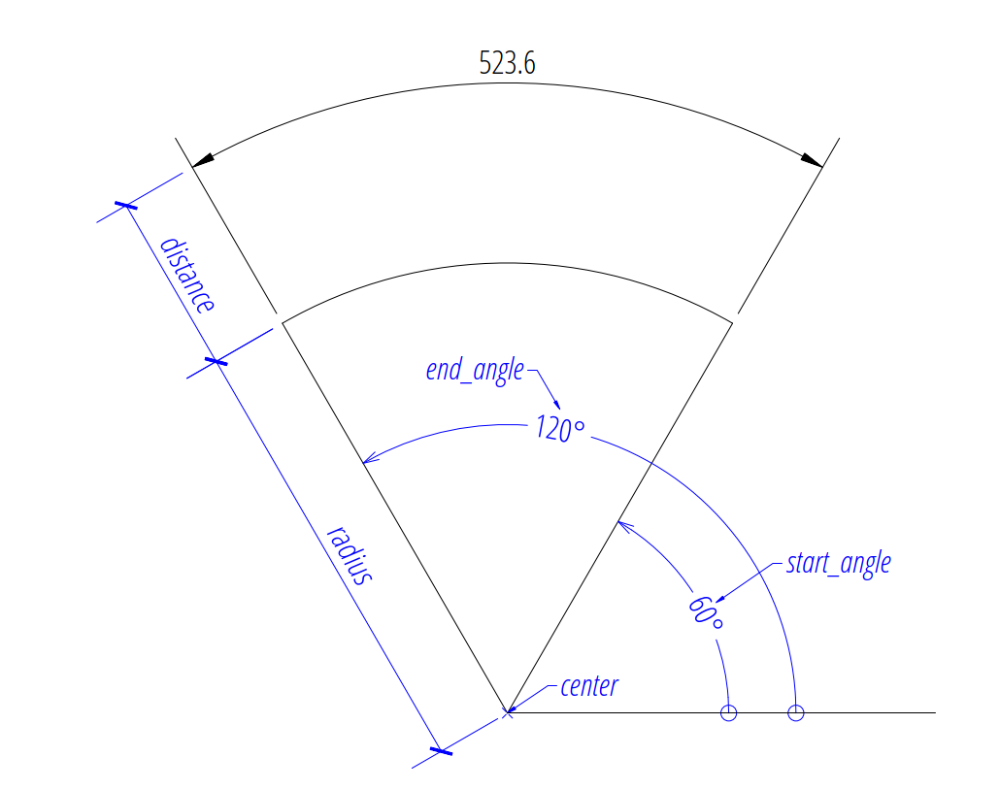
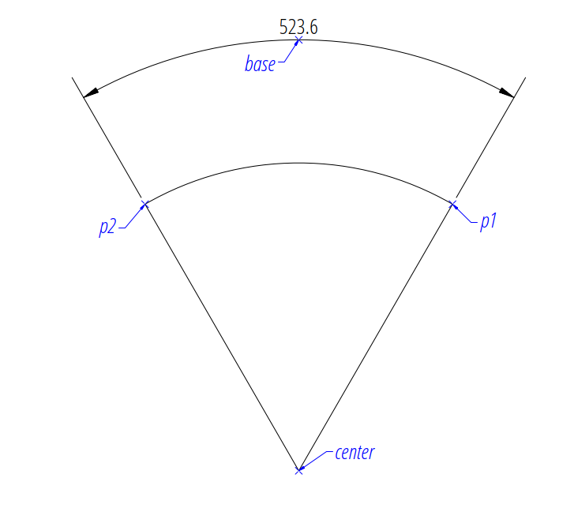

.. _tut_arc_dimension:

Tutorial for Arc Dimensions
===========================

Please read the :ref:`tut_linear_dimension` before, if you haven't. This is a
repetition of the :ref:`tut_angular_dimension`, because `ezdxf` reuses the
angular dimension to render arc dimensions. This approach is very different
to CAD applications, but also much less work.

.. note::

    `Ezdxf` does not render the arc dimension like CAD applications and does
    not consider all DIMSTYLE variables, so the rendering results are **very**
    different from CAD applications.

Dimension Style "EZ_CURVED"
---------------------------

All factory methods to create arc dimensions uses the dimension style
"EZ_CURVED" for curved dimension lines which is defined as:

- angle unit is decimal degrees, :attr:`dimaunit` = 0
- measurement text height = 0.25 (drawing scale = 1:100)
- measurement text location is above the dimension line
- closed filled arrow and arrow size :attr:`dimasz` = 0.25
- :attr:`dimzin` = 2, suppresses trailing zeros (e.g. 12.5000 becomes 12.5)
- :attr:`dimarcsym` = 2, disables the arc symbol, 0 renders only an open round
  bracket "(" in front of the text and 1 for arc symbol above the text is not
  supported, renders like disabled

For more information go to: :ref:`tut_angular_dim_style`

Factory Methods to Create Arc Dimensions
----------------------------------------

Defined by Center, Radius and Angles
~~~~~~~~~~~~~~~~~~~~~~~~~~~~~~~~~~~~

The first example shows an arc dimension defined by the center point, radius,
start- and end angles:

.. code-block:: Python

    import ezdxf

    # Use argument setup=True to setup the default dimension styles.
    doc = ezdxf.new(setup=True)

    # Add new entities to the modelspace:
    msp = doc.modelspace()

    # Add an arc DIMENSION defined by the center point, start- and end angles,
    # the measurement text is placed at the default location above the dimension
    # line:
    dim = msp.add_arc_dim_cra(
        center=(5, 5),  # center point of the angle
        radius=5,  # distance from center point to the start of the extension lines
        start_angle=60,  # start angle in degrees
        end_angle=120,  # end angle in degrees
        distance=2,  # distance from start of the extension lines to the dimension line
        dimstyle="EZ_CURVED",  # default angular dimension style
    )

    # Necessary second step to create the BLOCK entity with the dimension geometry.
    # Additional processing of the DIMENSION entity could happen between adding
    # the entity and the rendering call.
    dim.render()
    doc.saveas("arc_dimension_cra.dxf")

The return value `dim` is **not** a dimension entity, instead a
:class:`~ezdxf.entities.DimStyleOverride` object is
returned, the dimension entity is stored as :attr:`dim.dimension`.

Arc by 3 Points
~~~~~~~~~~~~~~~

The next example shows an angular dimension defined by three points,
a center point and the two end points of the angle legs, the first point
defines the radius, the second point defines only the end angle, the distance
from the center point is not relevant:

.. code-block:: Python

    import ezdxf

    doc = ezdxf.new(setup=True)
    msp = doc.modelspace()

    msp.add_arc_dim_3p(
        base=(0, 7),  # location of the dimension line
        center=(0, 0),  # center point
        p1=(2.5, 4.330127018922193),  # 1st point of arc defines start angle and radius
        p2=(-2.5, 4.330127018922194),  # 2nd point defines the end angle
    ).render()

Angle from ConstructionArc
~~~~~~~~~~~~~~~~~~~~~~~~~~

The :class:`ezdxf.math.ConstructionArc` provides various class methods for
creating arcs and the construction tool can be created from an ARC entity.

Add an angular dimension to an ARC entity:

.. code-block:: Python

    import ezdxf

    doc = ezdxf.new(setup=True)
    msp = doc.modelspace()

    arc = msp.add_arc(
        center=(0, 0),
        radius=5,
        start_angle = 60,
        end_angle = 120,
    )
    msp.add_arc_dim_arc(
        arc.construction_tool(),
        distance=2,
    ).render()

Placing Measurement Text
------------------------

The default location of the measurement text depends on various
:class:`~ezdxf.entities.DimStyle` parameters and is applied if no user defined
text location is defined.

.. note::

    Not all possibles features of DIMSTYLE are supported by the `ezdxf` rendering
    procedure and especially for the arc dimension there are less features
    implemented than for the linear dimension because of the lack of good
    documentation. If the arc symbol is enabled (:attr:`dimarcsym` = 0) only an
    open round bracket "(" is rendered in front  of the measurement text!

.. seealso::

    - Graphical reference of many DIMVARS and some advanced information:
      :ref:`dimstyle_table_internals`
    - Source code file `standards.py`_ shows how to create your own DIMSTYLES.
    - The Script `dimension_arc.py`_ shows examples for angular dimensions.

Default Text Locations
~~~~~~~~~~~~~~~~~~~~~~

The DIMSTYLE "EZ_CURVED" places the measurement text in the center of the angle
above the dimension line. The first examples above show the measurement text at
the default text location.

The text direction angle is always perpendicular to the line from the text center
to the center point of the angle unless this angle is manually overridden.

Arrows and measurement text are placed "outside" automatically if the available
space between the extension lines isn't sufficient.

For more information go to: :ref:`tut_angular_dim_default_text_location`

Shift Text From Default Location
~~~~~~~~~~~~~~~~~~~~~~~~~~~~~~~~

The method :meth:`shift_text` shifts the measurement text away from the default
location. The shifting direction is aligned to the text rotation of the default
measurement text.

For more information go to: :ref:`tut_angular_dim_shift_default_text_location`

User Defined Text Locations
~~~~~~~~~~~~~~~~~~~~~~~~~~~

Beside the default location it is always possible to override the text location
by a user defined location.

The coordinates of user locations are located in the rendering UCS and the
default rendering UCS is the :ref:`WCS`.

For more information go to: :ref:`tut_angular_dim_user_text_location`

Absolute User Location
++++++++++++++++++++++

Absolute placing of the measurement text means relative to the origin of the
render UCS.

For more information go to: :ref:`tut_angular_dim_user_text_location`

Relative User Location
++++++++++++++++++++++

Relative placing of the measurement text means relative to the middle of the
dimension line.

For more information go to: :ref:`tut_angular_dim_user_text_location`

Adding a Leader
+++++++++++++++

Add a leader line to the measurement text and set the text rotation to
"horizontal".

For more information go to: :ref:`tut_angular_dim_user_text_location`

Overriding Text Rotation
------------------------

All factory methods supporting the argument `text_rotation` can override the
measurement text rotation.
The user defined rotation is relative to the render UCS x-axis (default is WCS).

For more information go to: :ref:`tut_angular_dim_user_text_location`

Overriding Measurement Text
---------------------------

See Linear Dimension Tutorial: :ref:`tut_angular_dim_overriding_text_rotation`

Measurement Text Formatting and Styling
---------------------------------------

See Linear Dimension Tutorial: :ref:`tut_measurement_text_formatting_and_styling`

Tolerances and Limits
---------------------

See Linear Dimension Tutorial: :ref:`tut_tolerances_and_limits`

.. _dimension_arc.py:  https://github.com/mozman/ezdxf/blob/master/examples/render/dimension_arc.py
.. _standards.py: https://github.com/mozman/ezdxf/blob/master/src/ezdxf/tools/standards.py