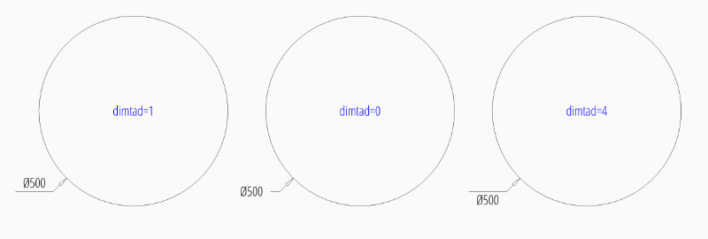
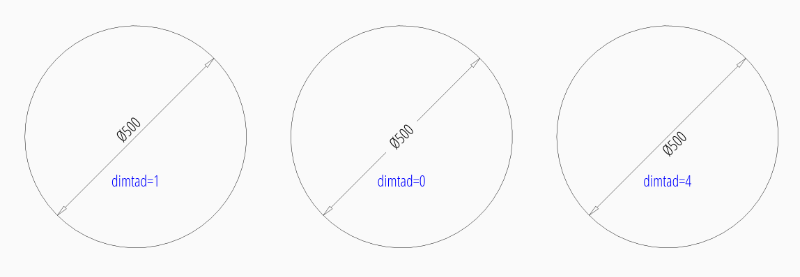
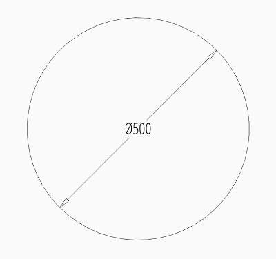
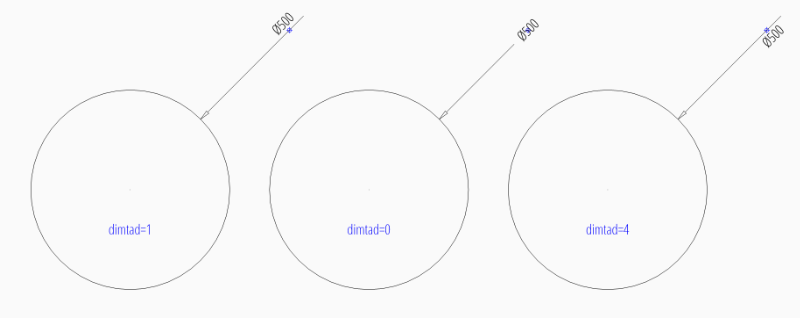
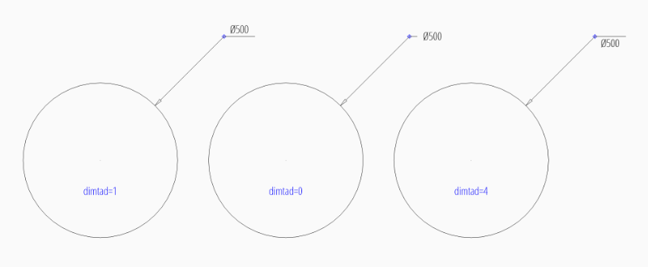
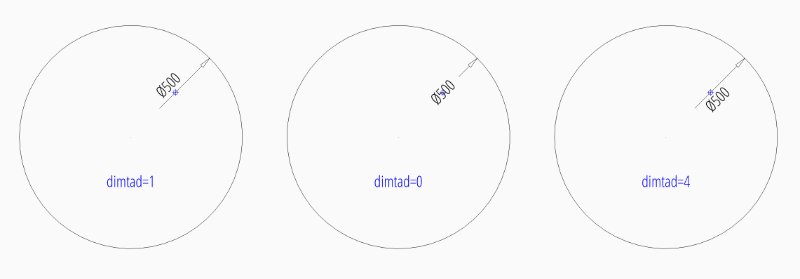
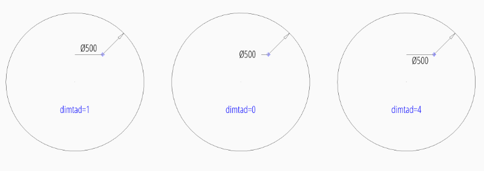

.. _tut_diameter_dimension:

Tutorial for Diameter Dimensions
================================

Please read the :ref:`tut_radius_dimension` before, if you haven't.

This is a repetition of the radius tutorial, just with diameter dimensions.

.. code-block:: Python

    import ezdxf

    # setup=True setups the default dimension styles
    doc = ezdxf.new("R2010", setup=True)

    msp = doc.modelspace()  # add new dimension entities to the modelspace
    msp.add_circle((0, 0), radius=3)  # add a CIRCLE entity, not required
    # add default diameter dimension, measurement text is located outside
    dim = msp.add_diameter_dim(
        center=(0, 0),
        radius=3,
        angle=45,
        dimstyle="EZ_RADIUS"
    )
    dim.render()
    doc.saveas("diameter_dimension.dxf")

The example above creates a 45 degrees slanted diameter :class:`~ezdxf.entities.Dimension`
entity, the default dimension style "EZ_RADIUS" (same as for radius dimensions)
is defined as 1 drawing unit = 1m, drawing scale = 1:100 and the length
factor = 100, which creates a measurement text in cm, the default
location for the measurement text is outside of the circle.

The `center` point defines the the center of the circle but there doesn't have
to exist a circle entity, `radius` defines the circle radius and `angle` defines
the slope of the dimension line, it is also possible to define the circle by a
measurement point `mpoint` on the circle.

The return value `dim` is **not** a dimension entity, instead a
:class:`~ezdxf.entities.DimStyleOverride` object is returned, the dimension
entity is stored as `dim.dimension`.

Placing Measurement Text
------------------------

There are different predefined DIMSTYLES to achieve various text placing locations.

The basic DIMSTYLE "EZ_RADIUS" settings are:

- 1 drawing unit = 1m
- scale 1:100
- the length factor :attr:`dimlfac` = 100, which creates a measurement text in cm.
- uses a closed filled arrow, arrow size :attr:`dimasz` = 0.25

.. note::

    Not all possibles features of DIMSTYLE are supported by the `ezdxf` rendering
    procedure and especially for the diameter dimension there are less features
    implemented than for the linear dimension because of the lack of good
    documentation.

.. seealso::

    - Graphical reference of many DIMVARS and some advanced information:
      :ref:`dimstyle_table_internals`
    - Source code file `standards.py`_ shows how to create your own DIMSTYLES.
    - The Script `dimension_diameter.py`_ shows examples for radius dimensions.

Default Text Locations Outside
~~~~~~~~~~~~~~~~~~~~~~~~~~~~~~

"EZ_RADIUS" default settings for to place text outside:

=========== ====================================================================
tmove       1 = add a leader when dimension text is moved, this is the best
            setting for text outside to preserve the appearance of the DIMENSION
            entity, if editing afterwards in a CAD application.
dimtad      1 = place the text vertical above the dimension line
=========== ====================================================================

.. code-block:: python

    dim = msp.add_diameter_dim(
        center=(0, 0),
        radius=2.5,
        angle=45,
        dimstyle="EZ_RADIUS"
    )
    dim.render()  # always required, but not shown in the following examples

.. image:: gfx/dim_diameter_outside.png

To force text outside horizontal set :attr:`~ezdxf.entities.DimStyle.dxf.dimtoh`
to 1:

.. code-block:: python

    dim = msp.add_diameter_dim(
        center=(0, 0),
        radius=2.5,
        angle=45,
        dimstyle="EZ_RADIUS",
        override={"dimtoh": 1}
    )

Default Text Locations Inside
~~~~~~~~~~~~~~~~~~~~~~~~~~~~~

DIMSTYLE "EZ_RADIUS_INSIDE" can be used to place the dimension text inside
the circle at a default location.

The basic DIMSTYLE settings are:

- 1 drawing unit = 1m
- scale 1:100, length_factor is 100 which creates
- the length factor :attr:`dimlfac` = 100, which creates a measurement text in cm.
- uses a closed filled arrow, arrow size :attr:`dimasz` = 0.25

Advanced "EZ_RADIUS_INSIDE" settings to place (force) the text inside of the
circle:

=========== ====================================================================
tmove       0 = moves the dimension line with dimension text, this is the best
            setting for text inside to preserve the appearance of the DIMENSION
            entity, if editing afterwards in a CAD application.
dimtix      1 = force text inside
dimatfit    0 = force text inside, required by BricsCAD and AutoCAD
dimtad      0 = center text vertical, BricsCAD and AutoCAD always create a
            vertical centered text, `ezdxf` let you choose the vertical
            placement (above, below, center), but editing the DIMENSION in
            BricsCAD or AutoCAD will reset text to center placement.
=========== ====================================================================

.. code-block:: python

    dim = msp.add_diameter_dim(
        center=(0, 0),
        radius=2.5,
        angle=45,
        dimstyle="EZ_RADIUS_INSIDE"
    )

To force text inside horizontal set :attr:`~ezdxf.entities.DimStyle.dxf.dimtih`
to 1:

.. code-block:: python

    dim = msp.add_diameter_dim(
        center=(0, 0),
        radius=2.5,
        angle=45,
        dimstyle="EZ_RADIUS_INSIDE",
        override={"dimtih": 1}
    )

User Defined Text Locations
~~~~~~~~~~~~~~~~~~~~~~~~~~~

Beside the default location it is always possible to override the text location
by a user defined location. This location also determines the angle of the
dimension line and overrides the argument `angle`. For user defined locations
it is not necessary to force text inside (``dimtix=1``), because the location of
the text is explicit given, therefore the DIMSTYLE "EZ_RADIUS" can be used
for all this examples.

User defined location outside of the circle:

.. code-block:: python

    dim = msp.add_diameter_dim(
        center=(0, 0),
        radius=2.5,
        location=(4, 4),
        dimstyle="EZ_RADIUS"
    )

User defined location outside of the circle and forced horizontal text:

.. code-block:: python

    dim = msp.add_diameter_dim(
        center=(0, 0),
        radius=2.5,
        location=(4, 4),
        dimstyle="EZ_RADIUS",
        override={"dimtoh": 1}
    )

User defined location inside of the circle:

.. code-block:: python

    dim = msp.add_diameter_dim(
        center=(0, 0),
        radius=2.5,
        location=(1, 1),
        dimstyle="EZ_RADIUS"
    )

User defined location inside of the circle and forced horizontal text:

.. code-block:: python

    dim = msp.add_diameter_dim(
        center=(0, 0),
        radius=2.5,
        location=(1, 1),
        dimstyle="EZ_RADIUS",
        override={"dimtih": 1},
    )

Center Mark/Lines
-----------------

See Radius Dimension Tutorial: :ref:`tut_center_mark`

Overriding Measurement Text
---------------------------

See Linear Dimension Tutorial: :ref:`tut_overriding_measurement_text`

Measurement Text Formatting and Styling
---------------------------------------

See Linear Dimension Tutorial: :ref:`tut_measurement_text_formatting_and_styling`

.. _dimension_diameter.py:  https://github.com/mozman/ezdxf/blob/master/examples/render/dimension_diameter.py
.. _standards.py: https://github.com/mozman/ezdxf/blob/master/src/ezdxf/tools/standards.py