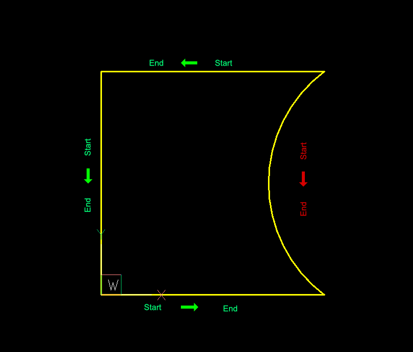
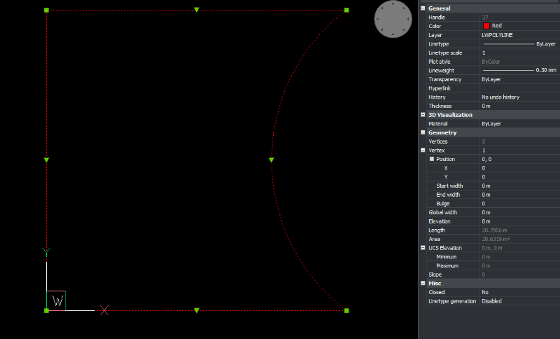
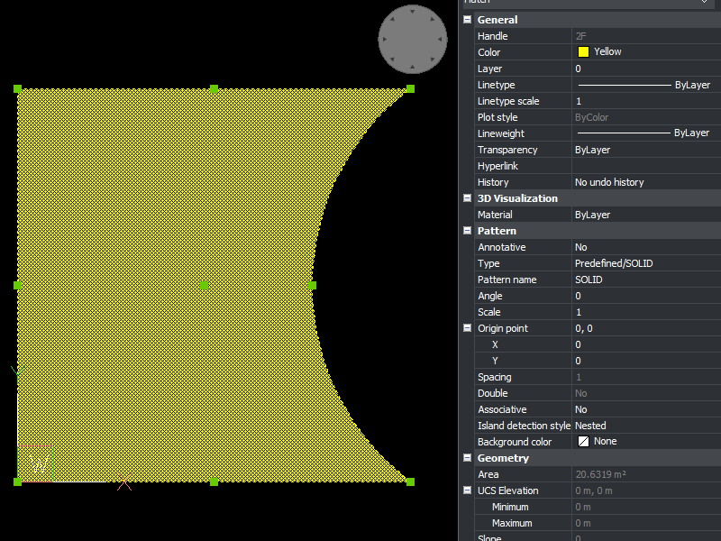
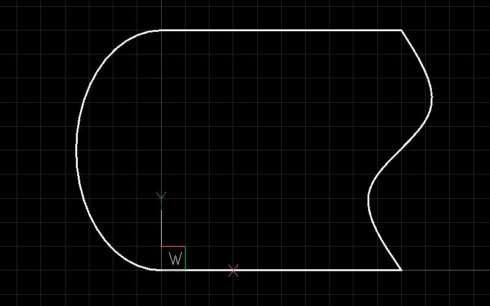
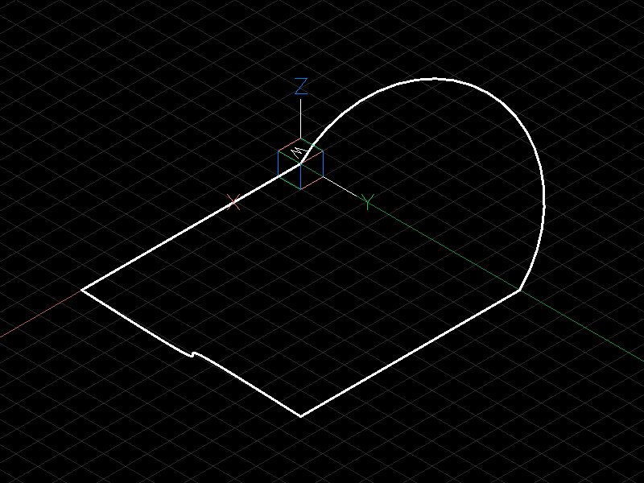
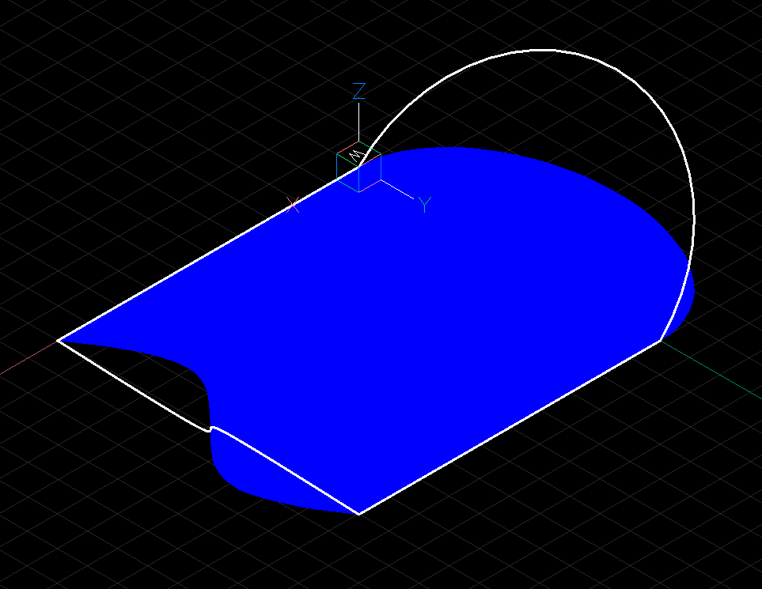

.. _tut_edges:

Tutorial for Finding Geometries
===============================

Introduction
------------

The main goal of the :mod:`ezdxf.edgeminer` module is to find connected edges in a heap
of unordered edges.

The module is designed to work with anything that has a start- and end point and knows
nothing about the edge itself except for the optional length. Therefore intersection
points between edges are not known.

1. Step: Create Edges
~~~~~~~~~~~~~~~~~~~~~

The companion module :mod:`ezdxf.edgesmith` creates the required edges from DXF
primitives like LINE, ARC, ELLIPSE, SPLINE and POLYLINE.

- :func:`ezdxf.edgesmith.make_edge_2d`
- :func:`ezdxf.edgesmith.edges_from_entities_2d`

The current implementation of the :mod:`~ezdxf.edgesmith` module is restricted to work
with 2D structures. Every edge is projected onto the xy-plane of the :ref:`WCS`.

2. Step: Find Chains and Loops
~~~~~~~~~~~~~~~~~~~~~~~~~~~~~~

The :mod:`~ezdxf.edgeminer` module provides functions to search for open chains and
closed loops:

- :func:`ezdxf.edgeminer.find_sequential_chain`
- :func:`ezdxf.edgeminer.find_all_sequential_chains`
- :func:`ezdxf.edgeminer.find_simple_chain`
- :func:`ezdxf.edgeminer.find_all_simple_chains`
- :func:`ezdxf.edgeminer.find_all_open_chains`
- :func:`ezdxf.edgeminer.find_loop`
- :func:`ezdxf.edgeminer.find_loop_by_edge`
- :func:`ezdxf.edgeminer.find_all_loops`

3. Step: Build Polylines and Paths
~~~~~~~~~~~~~~~~~~~~~~~~~~~~~~~~~~

From the chains and loops found, you can build new polylines and boundary paths for
hatches:

- :func:`ezdxf.edgesmith.lwpolyline_from_chain`
- :func:`ezdxf.edgesmith.polyline2d_from_chain`
- :func:`ezdxf.edgesmith.polyline_path_from_chain`
- :func:`ezdxf.edgesmith.edge_path_from_chain`
- :func:`ezdxf.edgesmith.path2d_from_chain`

Terminology
-----------

This is a short summary, for more information see: :mod:`ezdxf.edgeminer`

Edge
    A linear connection between two points.

Leaf
    A leaf is a loose end of an edge, which is not connected to other edges.

Junction
    A junction has more than two adjacent edges.

Chain
    A chain has sequential connected edges.
    The end point of an edge is connected to the start point of the following edge.

Simple Chain
    A simple chain starts and ends with a leaf or a junction.

Open Chain
    An open chain starts and ends with a leaf.

Loop
    A loop is a simple chain with connected start- and end vertices.

.. _tut_join_to_polylines:

Join Ordered Entities to Polylines
----------------------------------

The first example uses an exploded polyline to show how to search for connected edges,
when the edges are ordered.

.. code-block:: Python

    import random
    import ezdxf
    from ezdxf import edgeminer, edgesmith

    doc = ezdxf.new()
    doc.header["$LWDISPLAY"] = 1
    msp = doc.modelspace()

    lwp = msp.add_lwpolyline(
        [(0, 0), (5, 0, -0.5), (5, 5), (0, 5)],
        format="xyb",
        close=True,
        dxfattribs={"layer": "SOURCE", "color": 2, "lineweight": 30},
    )
    # create lines and arcs from LWPOLYLINE
    entities = lwp.explode()

The orientation of the entities looks like this:

ARC entities are always counter-clockwise oriented, so the start- and end points
of the adjacent lines are not connected in start/end order.

The :func:`ezdxf.edgeminer.find_sequential_chain` function is the right tool for this
task. It searches sequential ordered edges and reverses those, where the start- and end
point doesn't match. The search stops at the first edge that doesn't have a matching
start- or end point or a closed loop was found.

    1. create edges from DXF entities
    2. find connected edges
    3. create LWPOLYLINE from connected edges

.. code-block:: Python

    # 1. create edges from DXF entities
    edges = list(edgesmith.edges_from_entities_2d(entities))
    # 2. search for connected edges
    chain = edgeminer.find_sequential_chain(edges)
    # 3. create a LWPOLYLINE from connected edges
    lwp2 = edgesmith.lwpolyline_from_chain(
        chain, dxfattribs={"layer": "LWPOLYLINE", "color": 1, "lineweight": 30}
    )
    msp.add_entity(lwp2)
    doc.saveas("result1.dxf")

The new created LWPOLYLINE in BricsCAD:

Join Unordered Entities to Polylines
------------------------------------

For the search in a heap of unordered edges is an additional object required.
A :class:`ezdxf.edgeminer.Deposit` has a spatial search tree to optimize the
search for unordered edges.

The :func:`ezdxf.edgeminer.find_simple_chain` function starts at an edge and searches in
both directions via the spatial search tree for connected edges. The search stops at a
leaf, a junction or when a closed loop was found.

.. code-block:: Python

    # create a new doc
    doc = ezdxf.new()
    doc.header["$LWDISPLAY"] = 1
    msp = doc.modelspace()

    # reuse same entities from previous example
    edges = list(edgesmith.edges_from_entities_2d(entities))

    # shuffle the ordered edges
    random.shuffle(edges)

    # a deposit optimizes the search for unordered edges
    deposit = edgeminer.Deposit(edges)

    # start the search at an arbitrary edge
    start = edges[0]
    chain = edgeminer.find_simple_chain(deposit, start)
    lwp3 = edgesmith.lwpolyline_from_chain(
        chain, dxfattribs={"color": 1, "lineweight": 30}
    )
    msp.add_entity(lwp3)
    doc.saveas("result2.dxf")

The result is the same as in "result1.dxf".

The following functions are for situations when you don't know where to start.

    - :func:`ezdxf.edgeminer.find_all_simple_chains`: returns all chains that start
      and end with a leaf or a junction
    - :func:`ezdxf.edgeminer.find_all_open_chains`: returns all chains from the deposit
      that start and end with a leaf. Warning: recursive backtracking!
    - :func:`ezdxf.edgeminer.find_loop`: returns the first loop found in the deposit.
      Warning: recursive backtracking!
    - :func:`ezdxf.edgeminer.find_all_loops`: returns all possible loops found in the
      deposit. Warning: recursive backtracking!

.. _tut_join_to_hatches:

Join Entities to Hatches
------------------------

Creating hatches from edges is similar to creating polylines.

    1. create a :class:`~ezdxf.entities.Hatch`
    2. find connected edges
    3. create boundary paths from connected edges
    4. add boundary paths to :class:`~ezdxf.entities.Hatch`

.. code-block:: Python

    # create a new doc
    doc = ezdxf.new()
    doc.header["$LWDISPLAY"] = 1
    msp = doc.modelspace()

    # 1. create a HATCH
    hatch = msp.add_hatch(color=2)

    # reuse same entities from previous example
    edges = list(edgesmith.edges_from_entities_2d(entities))

    # shuffle the ordered edges
    random.shuffle(edges)

    # a deposit optimizes the search for unordered edges
    deposit = edgeminer.Deposit(edges)

    # start the search at an arbitrary edge
    start = edges[0]

    # 2. find edges
    chain = edgeminer.find_simple_chain(deposit, start)

    # 3. create a polyline boundary path from edges
    boundary_path = edgesmith.polyline_path_from_chain(chain)

    # 4.add boundary path to HATCH
    hatch.paths.append(boundary_path)
    doc.saveas("hatch1.dxf")

The new created HATCH in BricsCAD:

How Are 3D Entities Handled?
----------------------------

The :mod:`ezdxf.edgeminer` module is designed to be as versatile as possible and uses
3D coordinates for all vertices. So edges are only connected when the x-, y- and
z-coordinates of their vertices are close together.

The :mod:`ezdxf.edgesmith` module is designed to avoid the complexity of 3D entities and
handles only 2D entities by setting all z-coordinates to 0.
Therefore all vertices are projected onto the xy-plane of the
WCS and if an entity can not represent such a projection the entity will be flattened
into line segments.

This example includes an ARC and a SPLINE in 3D space:

.. code-block:: Python

    doc = ezdxf.readfile("edges_3d.dxf")
    msp = doc.modelspace()

    # create edges and search index
    edges = list(edgesmith.edges_from_entities_2d(msp))
    deposit = edgeminer.Deposit(edges)
    # find a chain
    chain = edgeminer.find_simple_chain(deposit, edges[0])
    # add a hatch and add the boundary path
    hatch = msp.add_hatch(color=5)
    boundary_path = edgesmith.polyline_path_from_chain(chain, max_sagitta=0.01)
    hatch.paths.append(boundary_path)
    doc.saveas("flattened_hatch.dxf")

The hatch is projected onto the xy-plane of the WCS:

To process only 2D entities us the :func:`~ezdxf.edgesmith.filter_2d_entities`
function that returns only pure 2D entities and ignores all entities placed outside or
extending beyond the xy-plane.

TODO
----

    - Junctions
    - Coincident edges
    - Gaps and drawing imprecision

