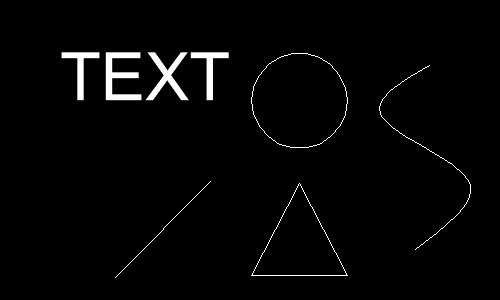
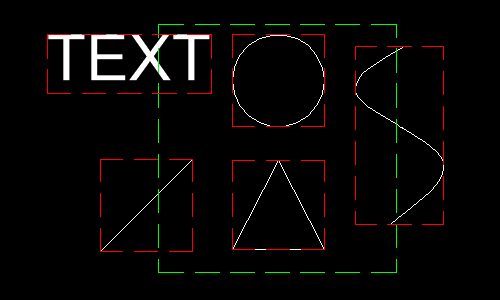
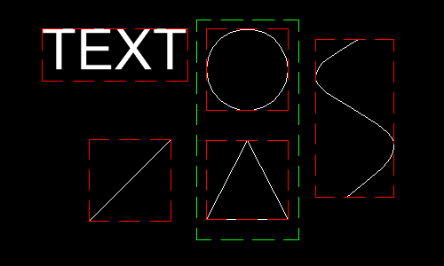
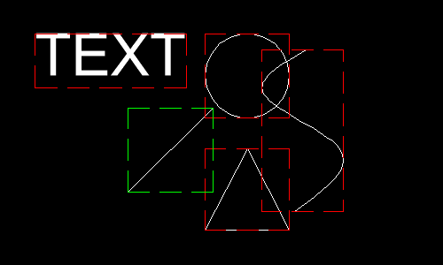
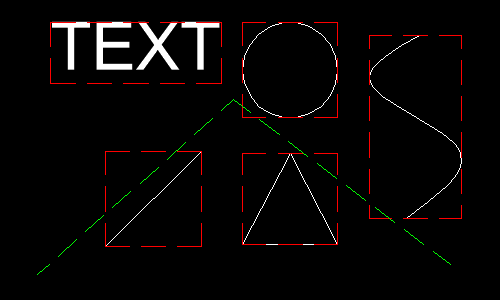
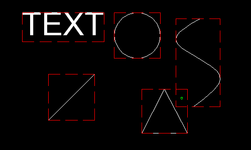
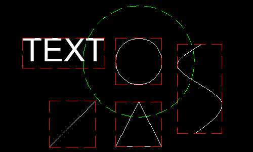
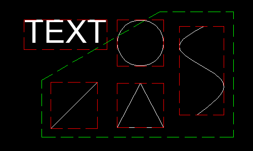

.. _tut_entity_selection:

Tutorial for Entity Selection
=============================

This tutorial shows how to use the :mod:`ezdxf.select` module, which provides functions 
to select entities based on various shapes.  These selection functions offer a way to 
filter entities based on their spatial location.

This is the base document for this tutorial:

Why Bounding Boxes?
-------------------

The :mod:`~ezdxf.select` module primarily relies on bounding boxes to perform selections. 
Bounding boxes offer a fast way to identify potential overlaps between entities and the 
selection shape. This approach prioritizes performance over absolute accuracy.

.. note::

    The bounding boxes for text-based entities and entities containing curves are not 
    accurate! For more information read the docs for the :mod:`ezdxf.bbox` module.

Source of Entities
------------------

The source of the selection can be any iterable of DXF entities, like the modelspace, 
any paperspace layout or a block layout, also the result of an entity query as an 
:class:`~ezdxf.query.EntityQuery` container, or any collection of DXF entities that 
implements the :meth:`__iter__` method.

Selection Shapes
----------------

- :class:`~ezdxf.select.Window`: Defines a rectangular selection area.
- :class:`~ezdxf.select.Circle`: Selects entities within a circular area.
- :class:`~ezdxf.select.Polygon`: Selects entities based on the shape of a closed polygon.

Using Selection Functions
-------------------------

These selection functions utilize the selection shapes:

- :func:`~ezdxf.select.bbox_inside`: Selects entities whose bounding box lies withing the selection shape.
- :func:`~ezdxf.select.bbox_outside`: Selects entities whose bounding box is completely outside the selection shape.
- :func:`~ezdxf.select.bbox_overlap`: Selects entities whose bounding box overlaps the selection shape.

Additional selection functions:

- :func:`~ezdxf.select.bbox_chained`: Selects entities that are linked together by overlapping bounding boxes.
- :func:`~ezdxf.select.bbox_crosses_fence`: Selects entities whose bounding box overlaps an open polyline.
- :func:`~ezdxf.select.point_in_bbox`: Selects entities where the selection point lies within the bounding box.

The functions return an :class:`~ezdxf.query.EntityQuery` object, which provides access 
to the selected entities. You can iterate over the :class:`EntityQuery` to access each 
selected entity.

Bounding Box Inside Selection
-----------------------------

Selects entities which bounding boxes are completely within the selection shape.

Example to select entities inside a window:

.. code-block:: Python

    import ezdxf
    from ezdxf import select

    doc = ezdxf.readfile("base.dxf")
    msp 0 doc.modelspace()

    window = select.Window((150, 105), (280, 240))
    for entity in select.bbox_inside(window, msp):
        print(str(entity))

output::

    CIRCLE(#9D)
    LWPOLYLINE(#9E)

Bounding Box Outside Selection
------------------------------

Selects entities whose bounding box is completely outside the selection shape.

.. code-block:: Python

    window = select.Window((185, 105), (245, 240))
    for entity in select.bbox_outside(window, msp):
        print(str(entity))

output::

    TEXT(#9F)
    SPLINE(#A0)
    LINE(#A1)

Bounding Box Overlap Selection
------------------------------

Selects entities whose bounding box overlaps the selection shape.

This function works similar to the crossing selection in CAD applications, but not 
exactly the same.  The function selects entities whose bounding boxes overlap the 
selection shape.  This will also select elements where all of the entity geometry is 
outside the selection shape, but the bounding box overlaps the selection shape, 
e.g. border polylines.

.. code-block:: Python

    window = select.Window((150, 105), (280, 240))
    for entity in select.bbox_overlap(window, msp):
        print(str(entity))

output::

    CIRCLE(#9D)
    LWPOLYLINE(#9E)
    TEXT(#9F)
    SPLINE(#A0)
    LINE(#A1)
    LWPOLYLINE(#A2)

Bounding Box Chained Selection
------------------------------

Selects elements that are directly or indirectly connected to each other by overlapping 
bounding boxes. The selection begins at the specified starting element.

.. code-block:: Python

    # choose entity for the beginning of the chain:
    line = msp.query("LINE").first
    for entity in select.bbox_chained(line, msp):
        print(str(entity))

output::

    LINE(#A1)
    CIRCLE(#9D)
    LWPOLYLINE(#9E)
    SPLINE(#A0)

Bounding Box Crosses Fence
--------------------------

Selects entities whose bounding box intersects an open polyline.

.. code-block:: Python

    for entity in select.bbox_crosses_fence([(83, 101), (186, 193), (300, 107)], msp):
        print(str(entity))

output::

    CIRCLE(#9D)
    LWPOLYLINE(#9E)
    SPLINE(#A0)
    LINE(#A1)

.. note::

    The polyline does not cross the entity geometry itself!

Point In Bounding Box Selection
-------------------------------

Selects entities where the selection point lies within the bounding box.

.. code-block:: Python

    for entity in select.bbox_point((264, 140), msp):
        print(str(entity))

output::

    LWPOLYLINE(#9E)
    SPLINE(#A0)

Circle Selection
----------------

For the circle shape, the selection tests are carried out on the real circlar area.

This example selects all entities around the CIRCLE entity within a 60 unit radius
whose bounding box overlaps the circle selection:

.. code-block:: Python

    entity = msp.query("CIRCLE").first
    circle = select.Circle(entity.dxf.center, radius=60)
    for entity in select.bbox_overlap(circle, msp):
        print(str(entity))

output::

    CIRCLE(#9D)
    LWPOLYLINE(#9E)
    TEXT(#9F)
    SPLINE(#A0)

Polygon Selection
-----------------

As for the circle shape, the polygon selection tests are carried out on the real polygon 
area. 

.. note::
    
    This may not work 100% correctly if the selection polygon has a complex concave shape!

This example selects all entities whose bounding box lies entirely within the selection 
polygon:

.. code-block:: Python

    
    polygon = select.Polygon([(110, 168), (110, 107), (316, 107), (316, 243), (236, 243)])
    for entity in select.bbox_inside(polygon, msp):
        print(str(entity))

output::

    LWPOLYLINE(#9E)
    SPLINE(#A0)
    LINE(#A1)

