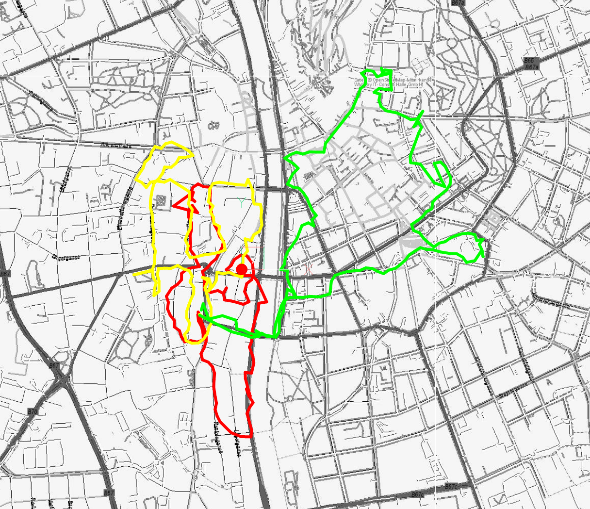

.. _tut_geo_addon:

Tutorial for the Geo Add-on
===========================

This tutorial shows how to load a GPS track into a geo located DXF file and
also the inverse operation, exporting geo located DXF entities as GeoJSON
files.

Please read the section :ref:`geo_intended_usage` in the documentation of the
:mod:`ezdxf.addons.geo` module first.

.. warning::

    TO ALL BEGINNERS!

    If you are just learning to work with geospatial data, using DXF files is
    not the way to go! DXF is not the first choice for storing data for
    spatial data analysts. If you run into problems I cannot help you as
    I am just learning myself.

The complete source code and test data for this tutorial are available in the
github repository:

https://github.com/mozman/ezdxf/tree/master/docs/source/tutorials/src/geo

Setup Geo Location Reference
----------------------------

The first step is setting up the geo location reference, which is **not** doable
with ezdxf yet - this feature may come in the future - but for now you have
to use a CAD application to do this. If the DXF file has no geo location
reference the projected 2D coordinates are most likely far away from the WCS
origin (0, 0), use the CAD command "ZOOM EXTENDS" to find the data.

Load GPX Data
-------------

The GPX format stores GPS data in a XML format, use the :class:`ElementTree`
class to load the data:

.. literalinclude:: src/geo/gpx.py
    :lines: 15-22

The loaded GPS data has a WSG84 EPSG:4326 projection as longitude and
latitude in decimal degrees. The next step is to create a :class:`GeoProxy`
object from this data, the :meth:`GeoProxy.parse` method accepts a
``__geo_interface__`` mapping or a Python object with a
:attr:`__geo_interface__` attribute/property. In this case as simple
"LineString" object for all GPS points is sufficient:

.. literalinclude:: src/geo/gpx.py
    :lines: 25-30

Transform the data from the polar representation EPSG:4326 into a 2D cartesian
map representation EPSG:3395 called "World Mercator", this is the only
projection supported by the add-on, without the need to write a custom
transformation function:

.. literalinclude:: src/geo/gpx.py
    :lines: 34

The data is now transformed into 2D cartesian coordinates in meters and most
likely far away from origin (0, 0), the data stored in the GEODATA entity helps
to transform the data into the DXF WCS in modelspace units, if the DXF file has
no geo location reference you have to stick with the large coordinates:

.. literalinclude:: src/geo/gpx.py
    :lines: 36-54

We are ready to save the final DXF file::

    doc.saveas(str(out_path))

In BricsCAD the result looks like this, the underlying images were added by
the BricsCAD command MAPCONNECT and such a feature is **not** planned for
the add-on:

Export DXF Entities as GeoJSON
------------------------------

This will only work with a proper geo location reference, the code shown accepts
also WCS data from DXF files without a GEODATA object, but the result is just
unusable - but in valid GeoJSON notation.

First get epsg code and the CRS transformation matrix:

.. literalinclude:: src/geo/gpx.py
    :lines: 82-89

Query the DXF entities to export:

.. literalinclude:: src/geo/gpx.py
    :lines: 90-91

Create a :class:`GeoProxy` object from the DXF entity:

.. literalinclude:: src/geo/gpx.py
    :lines: 57-59

Transform DXF WCS coordinates in modelspace units into the CRS coordinate system
by the transformation matrix `m`:

.. literalinclude:: src/geo/gpx.py
    :lines: 60-61

The next step assumes a EPSG:3395 projection, everything else needs a custom
transformation function:

.. literalinclude:: src/geo/gpx.py
    :lines: 62-64

Use the :mod:`json` module from the Python standard library to write the
GeoJSON data, provided by the :attr:`GeoProxy.__geo_interface__` property:

.. literalinclude:: src/geo/gpx.py
    :lines: 65-68

The content of the GeoJSON file looks like this:

.. code::

    {
      "type": "LineString",
      "coordinates": [
        [
          15.430999,
          47.06503
        ],
        [
          15.431039,
          47.064797
        ],
        [
          15.431206,
          47.064582
        ],
        [
          15.431283,
          47.064342
        ],
        ...
    }

Custom Transformation Function
------------------------------

This sections shows how to use the GDAL package to write a custom transformation
function. The example reimplements the builtin transformation from unprojected
WGS84 coordinates to 2D map coordinates EPSG:3395 "World Mercator":

.. code-block:: python

    from osgeo import osr
    from ezdxf.math import Vec3

    # GPS track in WGS84, load_gpx_track() code see above
    gpx_points = list(load_gpx_track('track1.gpx'))

    # Create source coordinate system:
    src_datum = osr.SpatialReference()
    src_datum.SetWellKnownGeoCS('WGS84')

    # Create target coordinate system:
    target_datum = osr.SpatialReference()
    target_datum.SetWellKnownGeoCS('EPSG:3395')

    # Create transformation object:
    ct = osr.CoordinateTransform(src_datum, target_datum)

    # Create GeoProxy() object:
    geo_proxy = GeoProxy.parse({
        'type': 'LineString',
        'coordinates': gpx_points
    })

    # Apply a custom transformation function to all coordinates:
    geo_proxy.apply(lambda v: Vec3(ct.TransformPoint(v.x, v.y)))

The same example with the pyproj package:

.. code-block:: python

    from pyproj import Transformer
    from ezdxf.math import Vec3

    # GPS track in WGS84, load_gpx_track() code see above
    gpx_points = list(load_gpx_track('track1.gpx'))

    # Create transformation object:
    ct = Transformer.from_crs('EPSG:4326', 'EPSG:3395)

    # Create GeoProxy() object:
    geo_proxy = GeoProxy.parse({
        'type': 'LineString',
        'coordinates': gpx_points
    })

    # Apply a custom transformation function to all coordinates:
    geo_proxy.apply(lambda v: Vec3(ct.transform(v.x, v.y)))

Polygon Validation by Shapely
-----------------------------

Ezdxf tries to avoid to create invalid polygons from HATCH entities like a hole
in another hole, but not all problems are detected by ezdxf, especially
overlapping polygons. For a reliable and robust result use the Shapely package
to check for valid polygons:

.. code-block:: python

    import ezdxf
    from ezdxf.addons import geo
    from shapley.geometry import shape

    # Load DXF document including HATCH entities.
    doc = ezdxf.readfile('hatch.dxf')
    msp = doc.modelspace()

    # Test a single entity
    # Get the first DXF hatch entity:
    hatch_entity = msp.query('HATCH').first

    # Create GeoProxy() object:
    hatch_proxy = geo.proxy(hatch_entity)

    # Shapely supports the __geo_interface__
    shapley_polygon = shape(hatch_proxy)

    if shapely_polygon.is_valid:
        ...
    else:
        print(f'Invalid Polygon from {str(hatch_entity)}.')

    # Remove invalid entities by a filter function
    def validate(geo_proxy: geo.GeoProxy) -> bool:
        # Multi-entities are divided into single entities:
        # e.g. MultiPolygon is verified as multiple single Polygon entities.
        if geo_proxy.geotype == 'Polygon':
            return shape(geo_proxy).is_valid
        return True

    # The gfilter() function let only pass compatible DXF entities
    msp_proxy = geo.GeoProxy.from_dxf_entities(geo.gfilter(msp))

    # remove all mappings for which validate() returns False
    msp_proxy.filter(validate)

Interface to GDAL/OGR
---------------------

The GDAL/OGR package has no direct support for the ``__geo_interface__``, but
has builtin support for the GeoJSON format:

.. code-block:: python

    from osgeo import ogr
    from ezdxf.addons import geo
    from ezdxf.render import random_2d_path
    import json

    p = geo.GeoProxy({'type': 'LineString', 'coordinates': list(random_2d_path(20))})
    # Create a GeoJSON string from the __geo_interface__ object by the json
    # module and feed the result into ogr:
    line_string = ogr.CreateGeometryFromJson(json.dumps(p.__geo_interface__))

    # Parse the GeoJSON string from ogr by the json module and feed the result
    # into a GeoProxy() object:
    p2 = geo.GeoProxy.parse(json.loads(line_string.ExportToJson()))