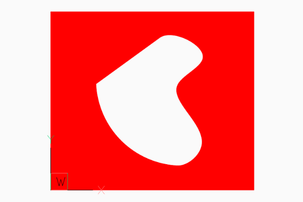
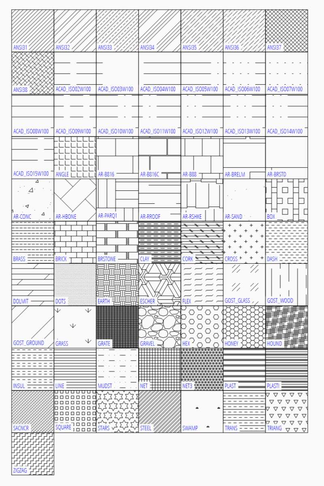

.. _tut_hatch:

Tutorial for Hatch
==================

Create hatches with one boundary path
-------------------------------------

The simplest form of the :class:`~ezdxf.entities.Hatch` entity has one polyline path with only straight lines as
boundary path:

.. literalinclude:: src/hatch/solid_hatch_polyline_path.py

But like all polyline entities the polyline path can also have bulge values:

.. literalinclude:: src/hatch/solid_hatch_polyline_path_with_bulge.py

The most flexible way to define a boundary path is the edge path. An edge path consist of a number of edges and
each edge can be one of the following elements:

    - line :meth:`EdgePath.add_line`
    - arc :meth:`EdgePath.add_arc`
    - ellipse :meth:`EdgePath.add_ellipse`
    - spline :meth:`EdgePath.add_spline`

Create a solid hatch with an edge path (ellipse) as boundary path:

.. literalinclude:: src/hatch/solid_hatch_ellipse.py

Create hatches with multiple boundary paths (islands)
-----------------------------------------------------

The DXF atribute :attr:`hatch_style` defines the island detection style:

=== ========================================================
0   nested - altering filled and unfilled areas
1   outer - area between `external` and `outermost` path is filled
2   ignore - `external` path is filled
=== ========================================================

.. literalinclude:: src/hatch/solid_hatch_islands.py
    :lines: 10-19

This is also the result for all 4 paths and :attr:`hatch_style` set to ``2`` (ignore).

.. image:: gfx/hatch-island-01.png
    :align: center

.. literalinclude:: src/hatch/solid_hatch_islands.py
    :lines: 23-24

This is also the result for all 4 paths and :attr:`hatch_style` set to ``1`` (outer).

.. image:: gfx/hatch-island-02.png
    :align: center

.. literalinclude:: src/hatch/solid_hatch_islands.py
    :lines: 28-29

.. image:: gfx/hatch-island-03.png
    :align: center

.. literalinclude:: src/hatch/solid_hatch_islands.py
    :lines: 33-34

.. image:: gfx/hatch-island-04.png
    :align: center

The expected result of combinations of various :attr:`hatch_style` values and paths `flags`, or the handling of
overlapping paths is not documented by the DXF reference, so don't ask me, ask Autodesk or just try it by yourself
and post your experience in the forum.

Example for Edge Path Boundary
------------------------------

.. literalinclude:: src/hatch/edge_path.py
    :lines: 8-47

Associative Boundary Paths
--------------------------

A HATCH entity can be associative to a base geometry, which means if the base geometry is edited in a CAD
application the HATCH get the same modification. Because `ezdxf` is **not** a CAD application, this association
is **not** maintained nor verified by `ezdxf`, so if you modify the base geometry afterwards the geometry
of the boundary path is not updated and no verification is done to check if the associated geometry matches
the boundary path, this opens many possibilities to create invalid DXF files: USE WITH CARE.

This example associates a LWPOLYLINE entity to the hatch created from the LWPOLYLINE vertices:

.. literalinclude:: src/hatch/assoc_hatch.py
    :lines: 8-24

An :class:`EdgePath` needs associations to all geometry entities forming the boundary path.

Predefined Hatch Pattern
------------------------

Use predefined hatch pattern by name:

.. code-block:: Python

    hatch.set_pattern_fill('ANSI31', scale=0.5)

Create hatches with gradient fill
---------------------------------

TODO