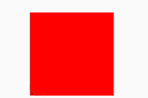
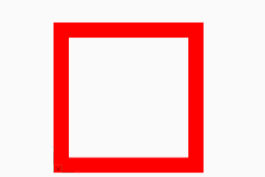
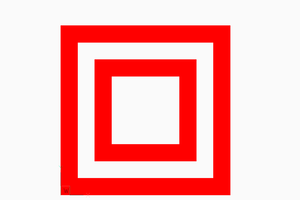

.. _tut_hatch:

Tutorial for Hatch
==================

Create hatches with one boundary path
-------------------------------------

The simplest form of a hatch has one polyline path with only straight lines as boundary path:

.. literalinclude:: src/hatch/solid_hatch_polyline_path.py

But like all polyline entities the polyline path can also have bulge values:

.. literalinclude:: src/hatch/solid_hatch_polyline_path_with_bulge.py

The most flexible way to define a boundary path is the edge path. An edge path consist of a number of edges and
each edge can be one of the following elements:

    - line :meth:`EdgePath.add_line`
    - arc :meth:`EdgePath.add_arc`
    - ellipse :meth:`EdgePath.add_ellipse`
    - spline :meth:`EdgePath.add_spline`

Create a solid hatch with an edge path (ellipse) as boundary path:

.. literalinclude:: src/hatch/solid_hatch_ellipse.py

Create hatches with multiple boundary paths (islands)
-----------------------------------------------------

The DXF atribute :attr:`hatch_style` defines the island detection style:

=== ========================================================
0   nested - altering filled and unfilled areas
1   outer - area between `external` and `outermost` path is filled
2   ignore - `external` path is filled
=== ========================================================

.. literalinclude:: src/hatch/solid_hatch_islands.py
    :lines: 10-19

This is also the result for all 4 paths and :attr:`hatch_style` set to ``2`` (ignore).

.. literalinclude:: src/hatch/solid_hatch_islands.py
    :lines: 23-24

This is also the result for all 4 paths and :attr:`hatch_style` set to ``1`` (outer).

.. literalinclude:: src/hatch/solid_hatch_islands.py
    :lines: 28-29

.. literalinclude:: src/hatch/solid_hatch_islands.py
    :lines: 33-34

The expected result of combinations of various :attr:`hatch_style` values and paths `flags`, or the handling of
overlapping paths is not documented by the DXF reference, so don't ask me, ask Autodesk or just try it by yourself
and post your experience in the forum.

Create hatches with with pattern fill
-------------------------------------

TODO

Create hatches with gradient fill
---------------------------------

TODO