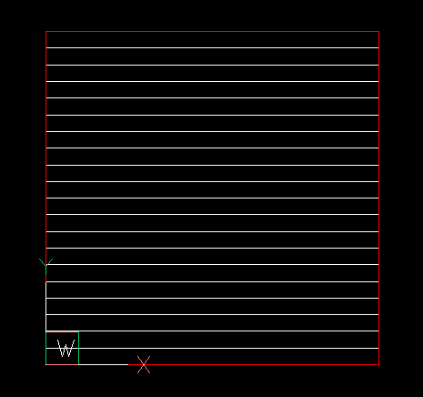
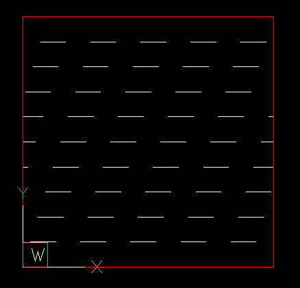
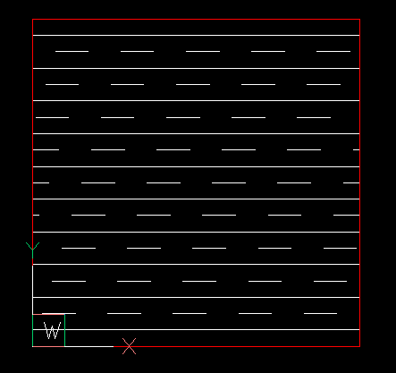
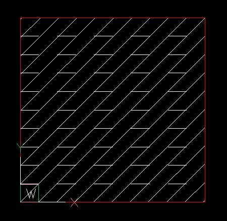

.. _tut_hatch_pattern:

Tutorial for Hatch Pattern Definition
=====================================

A hatch pattern consist of one or more hatch lines. A hatch line defines a set
of lines which have the same orientation an the same line pattern. All the
lines defined by a hatch line are parallel and have a constant distance to each
other. The `origin` defines the start point of the hatch line and also the
starting point of the line pattern. The `direction` defines the angle between
the :ref:`WCS` x-axis and the hatch line. The `offset` is a 2D vector which will
be added consecutively the the origin for each new hatch line. The line pattern
has the same format as as the simple linetype pattern (:ref:`tut_linetypes`).

.. important::

    The hatch pattern must be defined for a hatch scaling factor of 1.0 and a
    hatch rotation angle of 0 degrees!

The first example creates a simple pattern of horizontal solid lines with a
vertical distance of 0.5 drawing units.

.. code-block:: Python

    import ezdxf

    doc = ezdxf.new("R2010")
    msp = doc.modelspace()
    hatch = msp.add_hatch()
    hatch.set_pattern_fill(
        "MyPattern",
        color=7,
        angle=0,
        scale=1.0,
        style=0,  # normal hatching style
        pattern_type=0,  # user-defined
        # pattern definition as list of:
        # [angle in degree, origin as 2d vector, offset as 2d vector, line pattern]
        # line pattern is a solid line
        definition=[[0, (0, 0), (0, 0.5), []]],

    )
    points = [(0, 0), (10, 0), (10, 10), (0, 10)]
    hatch.paths.add_polyline_path(points)
    msp.add_lwpolyline(points, close=True, dxfattribs={"color": 1})
    doc.saveas("user_defined_hatch_pattern.dxf")

The next example shows how the `offset` value works:

.. code-block:: Python

    # -x-x-x- snip -x-x-x-
    hatch = msp.add_hatch()
    hatch.set_pattern_fill(
        "MyPattern",
        color=7,
        angle=0,
        scale=1.0,
        style=0,  # normal hatching style
        pattern_type=0,  # user-defined
        # the line pattern is a dashed line:  - - - -
        # the offset is 1 unit vertical and 0.3 units horizontal
        # [angle in degree, origin as 2d vector, offset as 2d vector, line pattern]
        definition=[[0, (0, 0), (0.3, 1), [1, -1]]],

    )
    # -x-x-x- snip -x-x-x-

The next example combines two parallel hatch lines, the origin defines how
the hatch lines are offset from each other:

.. code-block:: Python

    # -x-x-x- snip -x-x-x-
    hatch = msp.add_hatch()
    hatch.set_pattern_fill(
        "MyPattern",
        color=7,
        angle=0,
        scale=1.0,
        style=0,  # normal hatching style
        pattern_type=0,  # user-defined
        # [angle in degree, origin as 2d vector, offset as 2d vector, line pattern]
        definition=[
            [0, (0, 0), (0.3, 1), [1, -1]],  # dashed line
            [0, (0, 0.5), (0, 1), []],  # solid line
        ],
    )
    # -x-x-x- snip -x-x-x-

The next example combines two hatch lines with different angles.
The origins can be the same for this example. The :class:`Vec2` class is used to
calculate the offset value for a normal distance of 0.7 drawing units between
the slanted lines:

.. code-block:: Python

    from ezdxf.math import Vec2

    # -x-x-x- snip -x-x-x-
    hatch = msp.add_hatch()
    # offset vector for a normal distance of 0.7 for a 45 deg slanted hatch line
    offset = Vec2.from_deg_angle(45 + 90, length=0.7)
    hatch.set_pattern_fill(
        "MyPattern",
        color=7,
        angle=0,
        scale=1.0,
        style=0,  # normal hatching style
        pattern_type=0,  # user-defined
        # [angle in degree, origin as 2d vector, offset as 2d vector, line pattern]
        definition=[
            [0, (0, 0), (0, 1), [1, -1]],  # horizontal dashed line
            [45, (0, 0), offset, []],  # slanted solid line
        ],
    )
    # -x-x-x- snip -x-x-x-

