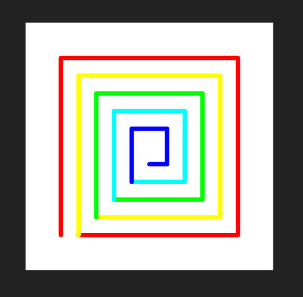
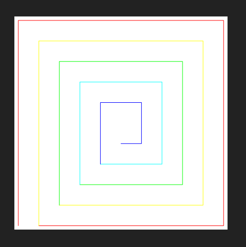
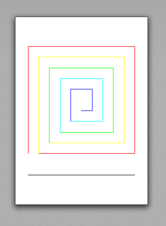
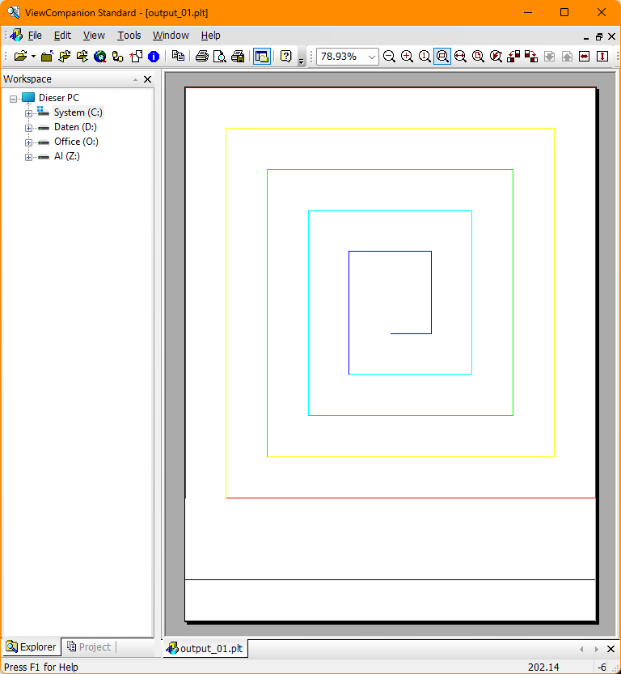

.. _tut_image_export:

Tutorial for Image Export
=========================

.. contents::
    :local:

Introduction
------------

This tutorial shows how to export DXF content of the modelspace or a paperspace as
images by the :mod:`~ezdxf.addons.drawing` add-on.

The tutorial covers the new added backends in `ezdxf` version 1.1:

- :class:`ezdxf.addons.drawing.svg.SVGBackend` class for SVG export
- :class:`ezdxf.addons.drawing.pymupdf.PyMuPdfBackend` class for PDF and PNG export
- :class:`ezdxf.addons.drawing.hpgl2.PlotterBackend` class for PLT/HPGL2 export
- :class:`ezdxf.addons.drawing.dxf.DXFBackend` class for flattened DXF export

The tutorial **does not cover** the :class:`~ezdxf.addons.drawing.matplotlib.MatplotlibBackend`
and :class:`~ezdxf.addons.drawing.pyqt.PyQtBackend`, for information about these
backends see:

- Howtos for the :ref:`how_to_drawing_addon`
- FAQs at github: https://github.com/mozman/ezdxf/discussions/550

Common Basics
-------------

The rendering process is divided into multiple steps. The frontend resolves the DXF
properties and breaks down complex DXF entities into simple drawing primitives which
are send to the backend that renders the output format.

.. literalinclude:: src/export/basic_svg.py
    :lines: 4-

The exported SVG shows a spiral centered on an A4 page with a margin of 20mm, notice
the background has a dark color like the usual background of the modelspace:

.. figure:: gfx/image_export_01.png

Frontend Configuration
~~~~~~~~~~~~~~~~~~~~~~

The :class:`~ezdxf.addons.drawing.config.Configuration` object configures the rendering
process. This example changes the background color from dark grey to white and renders
all lines black.

Add the :mod:`config` module to imports:

.. literalinclude:: src/export/change_bg_color.py
    :lines: 5

Create a new configuration and override the background and color policy between the
2nd and the 3rd step:

.. literalinclude:: src/export/change_bg_color.py
    :lines: 31-39

The new exported SVG has a white background and all lines are black:

.. figure:: gfx/image_export_02.png

There are many configuration options:

    - :class:`~ezdxf.addons.drawing.config.LineweightPolicy` - relative, absolute or relative fixed lineweight
    - :class:`~ezdxf.addons.drawing.config.LinePolicy` - solid or accurate linetypes
    - :class:`~ezdxf.addons.drawing.config.HatchPolicy` - normal, ignore, only outlines or always solid fill
    - :class:`~ezdxf.addons.drawing.config.ColorPolicy` - color, black, white, monochrome, ...
    - :class:`~ezdxf.addons.drawing.config.BackgroundPolicy` - default, black, white, off (transparent) and custom
    - :class:`~ezdxf.addons.drawing.config.TextPolicy` - filling, outline, ignore, ...
    - :class:`~ezdxf.addons.drawing.config.ProxyGraphicPolicy` - ignore, show, prefer
    - lineweight scaling factor
    - minimal lineweight
    - `max_flattening_distance` for curve approximation
    - and more ...

All configuration options are documented here: :class:`~ezdxf.addons.drawing.config.Configuration`.

Page Layout
~~~~~~~~~~~

The :class:`~ezdxf.addons.drawing.layout.Page` object defines the output page for some
backends (SVG, PDF, PNG, PLT).

A page is defined by width and height in a given length unit. The supported length
units are millimeters (mm), inch (in), point (1 pt is 1/72 in) and pixels (1 px is 1/96
in).

It's possible to autodetect the page size from the content or fit the content onto the
page. In both cases the margin values are used to create space between the content and
the page borders. The content is centered in the remaining space without margins.

.. important::

    None of the backends crop the content automatically, the margin values are just
    calculation values!

Autodetect Page Size
~~~~~~~~~~~~~~~~~~~~

The required page size is auto-detected by setting the width and/or height to 0.
By default the scaling factor is 1, so 1 drawing unit is 1 page unit.
The content is fit to page by default and the outcome is shown in the previous examples.

This example shows the output when the scale should be 1:1, 1 drawing unit is 1 page
unit (mm):

.. literalinclude:: src/export/page_auto_detect.py
    :lines: 44-49

The page has a size of 14x14mm, a content size of 10x10mm and 2mm margins on all sides.

Page Size From Paperspace
~~~~~~~~~~~~~~~~~~~~~~~~~

The page size stored in the LAYOUT entity of a paperspace layout can be readout by the 
classmethod :meth:`Page.from_dxf_layout`:

.. code-block::

    psp = doc.paperspace("Layout1")
    page = layout.Page.from_dxf_layout(psp)

Scaling Content
~~~~~~~~~~~~~~~

Scaling the content by factor 10 means, 10 page units represent 1 drawing unit, which is
a scale of 10:1 and only uniform scaling is supported.

.. literalinclude:: src/export/page_auto_detect.py
    :lines: 54-61

The page has a size of 104x104mm, a content size of 100x100mm and 2mm margins on all
sides.

Limit Page Size
~~~~~~~~~~~~~~~

The page arguments `max_width` and `max_height` can limit the page size in
auto-detection mode, e.g. most plotter devices can only print upto a width of 900mm.

.. seealso::

    - :class:`~ezdxf.addons.drawing.layout.Page` class
    - :class:`~ezdxf.addons.drawing.layout.Margins` class
    - :class:`~ezdxf.addons.drawing.layout.Settings` class

SVG Export
----------

The steps to export a SVG by the :class:`~ezdxf.addons.drawing.svg.SVGBackend` are show
in the first example, the configuration of the frontend and the page setup are shown in
the previous sections.

    1. Create the render context
    2. Create the backend
    3. Create and configure the frontend
    4. Draw the content
    5. Setup the page layout
    6. Create the SVG output string

This is the same code as for the first example:

.. literalinclude:: src/export/basic_svg.py
    :lines: 27-42

The SVG backend flips the coordinates along the y-axis and transforms the content into a
compact integer coordinate space and produces therefore a small file size but therefore
the output coordinates are different to the DXF coordinates.

PDF Export
----------

The PDF export requires the the `PyMuPdf`_ package to be installed.

The steps to export a PDF are very similar to SVG, except for the
:class:`~ezdxf.addons.drawing.pymupdf.PyMuPdfBackend` class and the backend returns bytes
and not a string:

    1. Create the render context
    2. Create the backend
    3. Create and configure the frontend
    4. Draw the content
    5. Setup the page layout
    6. Create the SVG output string

Import the :mod:`pymupdf` backend module:

.. literalinclude:: src/export/basic_pdf.py
    :lines: 5

The export function:

.. literalinclude:: src/export/basic_pdf.py
    :lines: 28-43

.. figure:: gfx/image_export_pdf_01.png

The PDF has is dark background for the modelspace by default and color index 7 is white.
Create a frontend configuration and override the :class:`BackgroundPolicy` to get a
white background:

.. literalinclude:: src/export/basic_pdf.py
    :lines: 52-54

Now the exported PDF has a white background and color index 7 is black:

PNG Export
----------

The PNG export is done by the :class:`~ezdxf.addons.drawing.pymupdf.PyMuPdfBackend`
class and differs only in the method to get the PNG data bytes:

.. literalinclude:: src/export/basic_png.py
    :lines: 59-62

The :mod:`pymupdf` backend supports multiple image formats:

=== =========================
png Portable Network Graphics
ppm Portable Pixmap (no alpha channel)
pbm Portable Bitmap (no alpha channel)
=== =========================

PLT/HPGL2 Export
----------------

The :class:`~ezdxf.addons.drawing.hpgl2.PlotterBackend` creates HPGL/2 plot files for
output on raster plotters. The :class:`PlotterBackend` is designed to print on white
paper, so the background color is always white and color index 7 is black by default.

.. warning::

    The plot files are only tested by the plot file viewer `ViewCompanion Standard`_
    but not on real hardware - please use with care and give feedback.

The PLT/HPGL2 export is very similar to the SVG export:

.. literalinclude:: src/export/basic_plt.py
    :lines: 5-7, 29-44

The HPGL/2 viewer does not show the margins around the content, but most construction
drawings draw the page borders around the content.

The :class:`PlotterBackend` has some quality preset methods to get the HPGL/2 data:

- :meth:`~ezdxf.addons.drawing.hpgl2.PlotterBackend.compatible`
- :meth:`~ezdxf.addons.drawing.hpgl2.PlotterBackend.low_quality`
- :meth:`~ezdxf.addons.drawing.hpgl2.PlotterBackend.normal_quality` (default)
- :meth:`~ezdxf.addons.drawing.hpgl2.PlotterBackend.high_quality`

The difference are mostly the floating point precision and the usage of Bézier curves,
but the Bézier curves are approximated by plotter drivers (even by HP drivers), so there
is no real quality improvement, but curves need less space than approximated polylines
so the file size is smaller.

Very old plotter may not support Bézier curves and floating point coordinates, for these
plotters the :meth:`compatible` method exports only polylines and integer coordinates.

Usage::

    # 6. get the HPGL2 rendering as bytes
    plt_bytes = backend.high_quality(page)

DXF Export
----------

The :class:`~ezdxf.addons.drawing.dxf.DXFBackend` exports the content as DXF primitives:
POINT, LINE, LWPOLYLINE, SPLINE and HATCH. All blocks are exploded, text is
rendered as filled polygons represented by the HATCH entity and arcs are represented by
SPLINE entities (internal Bèzier curve representation).

This backend was added to convert HPGL/2 files to DXF files, because the
:mod:`hpgl2` add-on reuses the backends of the :mod:`drawing` add-on for export.
Maybe it is useful for other tasks too.

This backend works different than the previous. There is no page setup and everything
is rendered into a given layout of a DXF document:

.. literalinclude:: src/export/basic_dxf.py
    :lines: 5-7, 28-40

Recorder Backend
----------------

The :class:`~ezdxf.addons.drawing.recorder.Recorder` backend is an intermediate layer to
record the drawing commands of the :class:`~ezdxf.addons.drawing.frontend.Frontend` class.
The :class:`~ezdxf.addons.drawing.recorder.Player` object can replay this records on any
other backend class but also provides some additional features like bounding box
detection, content transformation and cropping.

The SVG/PDF/PLT backends use this intermediate layer internally to transform and place
the content.

.. _PyMuPdf: https://pypi.org/project/PyMuPDF/
.. _ViewCompanion Standard: http://www.softwarecompanions.com/
