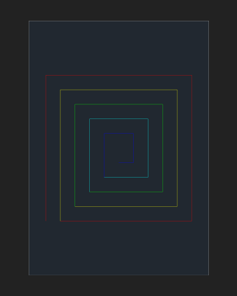
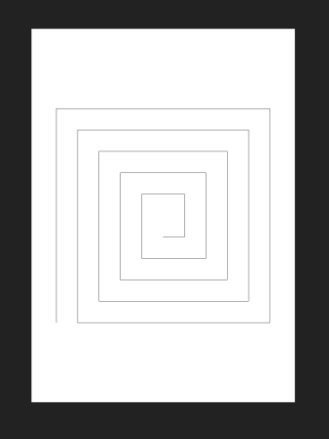

.. _tut_image_export:

Tutorial for Image Export
=========================

.. contents::
    :local:

Introduction
------------

This tutorial shows how to export DXF content of the modelspace or a paperspace as
images by the :mod:`~ezdxf.addons.drawing` add-on.

The tutorial covers the new added backends in `ezdxf` version 1.1:

- :class:`ezdxf.addons.drawing.svg.SVGBackend` class for SVG export
- :class:`ezdxf.addons.drawing.pymupdf.PyMuPdfBackend` class for PDF and PNG export
- :class:`ezdxf.addons.drawing.hpgl2.PlotterBackend` class for PLT/HPGL2 export
- :class:`ezdxf.addons.drawing.dxf.DXFBackend` class for flattened DXF export

The tutorial **does not cover** the :class:`~ezdxf.addons.drawing.matplotlib.MatplotlibBackend`
and :class:`~ezdxf.addons.drawing.pyqt.PyQtBackend`, for information about these
backends see:

- Howtos for the :ref:`how_to_drawing_addon`
- FAQs at github: https://github.com/mozman/ezdxf/discussions/550

Common Basics
-------------

The rendering process is divided into multiple steps. The frontend resolves the DXF
properties and breaks down complex DXF entities into simple drawing primitives which
are send to the backend that renders the output format.

.. literalinclude:: src/export/basic_svg.py
    :lines: 4-

The exported SVG shows a spiral centered on an A4 page with a margin of 20mm, notice
the background has a dark color like the usual background of the modelspace:

Frontend Configuration
~~~~~~~~~~~~~~~~~~~~~~

The :class:`~ezdxf.addons.drawing.config.Configuration` object configures the rendering
process. This example changes the background color from dark grey to white and renders
all lines black.

Add the :mod:`config` module to imports:

.. literalinclude:: src/export/change_bg_color.py
    :lines: 5

Create a new configuration and override the background and color policy between the
2nd and the 3rd step:

.. literalinclude:: src/export/change_bg_color.py
    :lines: 31-39

The new exported SVG has a white background and all lines are black:

There are many configuration options:

    - :class:`~ezdxf.addons.drawing.config.LineweightPolicy` - relative, absolute or relative fixed lineweight
    - :class:`~ezdxf.addons.drawing.config.LinePolicy` - solid or accurate linetypes
    - :class:`~ezdxf.addons.drawing.config.HatchPolicy` - normal, ignore, only outlines or always solid fill
    - :class:`~ezdxf.addons.drawing.config.ColorPolicy` - color, black, white, monochrome, ...
    - :class:`~ezdxf.addons.drawing.config.BackgroundPolicy` - default, black, white, off (transparent) and custom
    - :class:`~ezdxf.addons.drawing.config.TextPolicy` - filling, outline, ignore, ...
    - :class:`~ezdxf.addons.drawing.config.ProxyGraphicPolicy` - ignore, show, prefer
    - lineweight scaling factor
    - minimal lineweight
    - `max_flattening_distance` for curve approximation
    - and more ...

All configuration options are documented here: :class:`~ezdxf.addons.drawing.config.Configuration`.

Page Layout
~~~~~~~~~~~

The :class:`~ezdxf.addons.drawing.layout.Page` object defines the output page for some
backends (SVG, PDF, PNG, PLT).

SVG Export
----------

PDF Export
----------

PNG Export
----------

PLT/HPGL2 Export
----------------

DXF Export
----------
