.. _tut_linear_dimension:

Tutorial for Linear Dimensions
==============================

The :class:`~ezdxf.entities.Dimension` entity is the generic entity for all dimension types, but unfortunately
AutoCAD is **not willing** to show a dimension line defined only by this dimension entity, it also needs an
anonymous block which contains the dimension line shape constructed by basic DXF entities like LINE and TEXT
entities, this representation is called the dimension line `rendering` in this documentation, beside the fact
this is not a real graphical rendering. BricsCAD is a much more friendly CAD application, which do show the
dimension entity without the graphical rendering as block, which was very useful for testing, because there is no
documentation how to apply all the dimension style variables (more than 80).
This seems to be the reason why dimension lines are rendered so differently by many CAD application.

Don't expect to get the same rendering results by `ezdxf` as you get from AutoCAD, `ezdxf` tries
to be as close to the results rendered by BricsCAD, but it was not possible to implement all
the various combinations of dimension style parameters.

Text rendering is another problem, because `ezdxf` has no real rendering engine. Some font properties, like the real
text width, are not available to `ezdxf` and may also vary slightly for different CAD applications.
The text properties in `ezdxf` are based on the default monospaced standard font, but for TrueType fonts the space
around the text is much bigger than needed.

Not all DIMENSION and DIMSTYLE features are supported by all DXF versions, especially DXF R12 does not support many
features, but in this case the required rendering of dimension lines is an advantage, because if the application
just shows the rendered block, all features which can be used in DXF R12 are displayed like linetypes, but they
disappear if the dimension line is edited in the application. `ezdxf` writes only the supported DIMVARS of the
used DXF version to avoid invalid DXF files. So it is not that critical to know all the supported features of a
DXF version, except for limits and tolerances, `ezdxf` uses the advanced features of MTEXT to create limits
and tolerances and therefore they are not supported (displayed) in DXF R12 files.

.. seealso::

    Graphical reference of many DIMVARS and some advanced information: :ref:`dimstyle_table_internals`

Horizontal Dimension
--------------------

.. code-block:: Python

    import ezdxf

    # Argument setup=True setups the default dimension styles
    doc = ezdxf.new('R2010', setup=True)

    # Add new dimension entities to the modelspace
    msp = doc.modelspace()
    # Add a LINE entity, not required
    msp.add_line((0, 0), (3, 0))
    # Add a horizontal dimension, default dimension style is 'EZDXF'
    dim = msp.add_linear_dim(base=(3, 2), p1=(0, 0), p2=(3, 0))
    # Necessary second step, to create the BLOCK entity with the dimension geometry.
    # Additional processing of the dimension line could happen between adding and
    # rendering call.
    dim.render()
    doc.saveas('dim_linear_horiz.dxf')

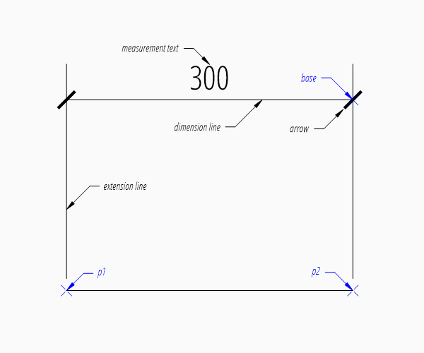

The example above creates a horizontal :class:`~ezdxf.entities.Dimension` entity, the default dimension style
``'EZDXF'`` and is defined as 1 drawing unit is 1m in reality, the drawing scale 1:100 and the length factor is 100,
which creates a measurement text in cm.

The `base` point defines the location of the dimension line, `ezdxf` accepts any point on the dimension line,
the point `p1` defines the start point of the first extension line, which also defines the first measurement point
and the point `p2` defines the start point of the second extension line, which also defines the second
measurement point.

The return value `dim` is **not** a dimension entity, instead a :class:`~ezdxf.entities.DimStyleOverride` object is
returned, the dimension entity is stored as `dim.dimension`.

Vertical and Rotated Dimension
------------------------------

Argument `angle` defines the angle of the dimension line in relation to the x-axis of the WCS or UCS, measurement
is the distance between first and second measurement point in direction of `angle`.

.. code-block:: Python

    # assignment to dim is not necessary, if no additional processing happens
    msp.add_linear_dim(base=(3, 2), p1=(0, 0), p2=(3, 0), angle=-30).render()
    doc.saveas('dim_linear_rotated.dxf')

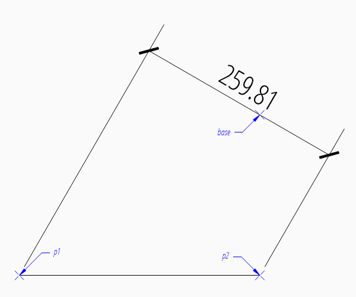

For a vertical dimension set argument `angle` to 90 degree, but in this example the vertical distance would be 0.

Aligned Dimension
-----------------

An aligned dimension line is parallel to the line defined by the definition points `p1` and `p2`. The placement of the
dimension line is defined by the argument `distance`, which is the distance between the definition line and the
dimension line. The `distance` of the dimension line is orthogonal to the base line in counter clockwise orientation.

.. code-block:: Python

    msp.add_line((0, 2), (3, 0))
    dim = msp.add_aligned_dim(p1=(0, 2), p2=(3, 0), distance=1)
    doc.saveas('dim_linear_aligned.dxf')

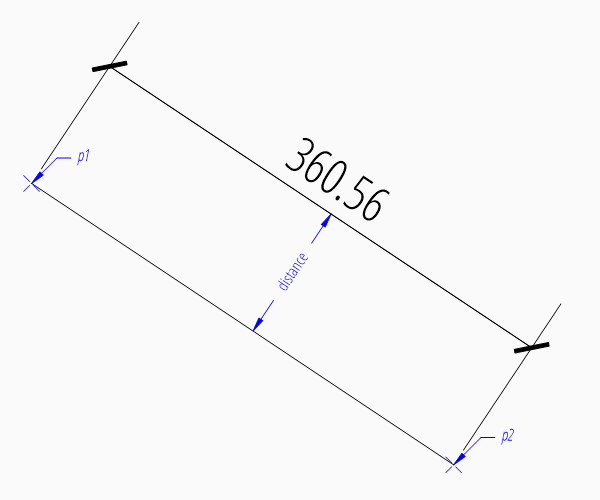

Dimension Style Override
------------------------

Many dimension styling options are defined by the associated :class:`~ezdxf.entities.DimStyle` entity.
But often you wanna change just a few settings without creating a new dimension style, therefore the
DXF format has a protocol to store this changed settings in the dimension entity itself.
This protocol is supported by `ezdxf` and every factory function which creates dimension
entities supports the `override` argument.
This `override` argument is a simple Python dictionary
(e.g. :code:`override = {'dimtad': 4}`, place measurement text below dimension line).

The overriding protocol is managed by the :class:`~ezdxf.entities.DimStyleOverride` object,
which is returned by the most dimension factory functions.

Placing Measurement Text
------------------------

The "default" location of the measurement text depends on various :class:`~ezdxf.entities.DimStyle` parameters and is
applied if no user defined text location is defined.

Default Text Locations
~~~~~~~~~~~~~~~~~~~~~~

"Horizontal direction" means in direction of the dimension line and "vertical direction" means perpendicular to the
dimension line direction.

The **"horizontal"** location of the measurement text is defined by :attr:`~ezdxf.entities.DimStyle.dxf.dimjust`:

=== =====
0   Center of dimension line
1   Left side of the dimension line, near first extension line
2   Right side of the dimension line, near second extension line
3   Over first extension line
4   Over second extension line
=== =====

.. code-block:: Python

    msp.add_linear_dim(base=(3, 2), p1=(0, 0), p2=(3, 0), override={'dimjust': 1}).render()

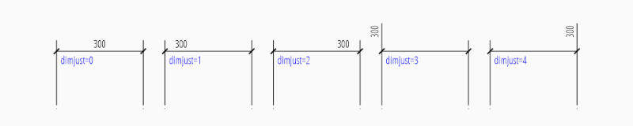

The **"vertical"** location of the measurement text relative to the dimension line is defined by
:attr:`~ezdxf.entities.DimStyle.dxf.dimtad`:

=== =====
0   Center, it is possible to adjust the vertical location by :attr:`~ezdxf.entities.DimStyle.dxf.dimtvp`
1   Above
2   Outside, handled like `Above` by `ezdxf`
3   JIS, handled like `Above` by `ezdxf`
4   Below
=== =====

.. code-block:: Python

    msp.add_linear_dim(base=(3, 2), p1=(0, 0), p2=(3, 0), override={'dimtad': 4}).render()

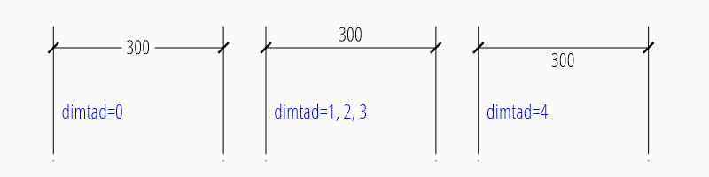

The distance between text and dimension line is defined by :attr:`~ezdxf.entities.DimStyle.dxf.dimgap`.

The :class:`~ezdxf.entities.DimStyleOverride` object has a method :meth:`~ezdxf.entities.DimStyleOverride.set_text_align`
to set the default text location in an easy way, this is also the reason for the 2 step creation process of
dimension entities:

.. code-block:: Python

    dim = msp.add_linear_dim(base=(3, 2), p1=(0, 0), p2=(3, 0))
    dim.set_text_align(halign='left', valign='center')
    dim.render()

====== =====
halign ``'left'``, ``'right'``, ``'center'``, ``'above1'``, ``'above2'``
valign ``'above'``, ``'center'``, ``'below'``
====== =====

Run function :func:`example_for_all_text_placings_R2007` in the example script `dimension_linear.py`_
to create a DXF file with all text placings supported by `ezdxf`.

User Defined Text Locations
~~~~~~~~~~~~~~~~~~~~~~~~~~~

Beside the default location, it is possible to locate the measurement text freely.

Location Relative to Origin
+++++++++++++++++++++++++++

The user defined text location can be set by the argument `location` in most dimension factory functions and
always references the midpoint of the measurement text:

.. code-block:: Python

    msp.add_linear_dim(base=(3, 2), p1=(3, 0), p2=(6, 0), location=(4, 4)).render()

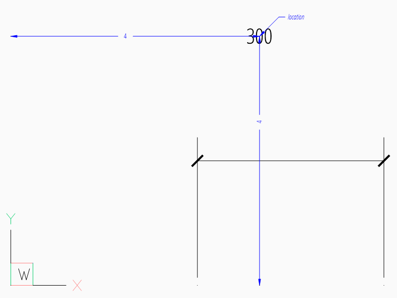

The `location` is relative to origin of the active coordinate system or WCS if no UCS is defined in the
:meth:`~ezdxf.entities.DimStyleOverride.render` method, the user defined `location` can also be set by
:meth:`~ezdxf.entities.DimStyleOverride.user_location_override`.

Location Relative to Center of Dimension Line
+++++++++++++++++++++++++++++++++++++++++++++

The method :meth:`~ezdxf.entities.DimStyleOverride.set_location` has additional features for linear dimensions.
Argument `leader` = ``True`` adds a simple leader from the measurement text to the center of the dimension line and
argument `relative` = ``True`` places the measurement text relative to the center of the dimension line.

.. code-block:: Python

    dim = msp.add_linear_dim(base=(3, 2), p1=(3, 0), p2=(6, 0))
    dim.set_location(location=(-1, 1), leader=True, relative=True)
    dim.render()

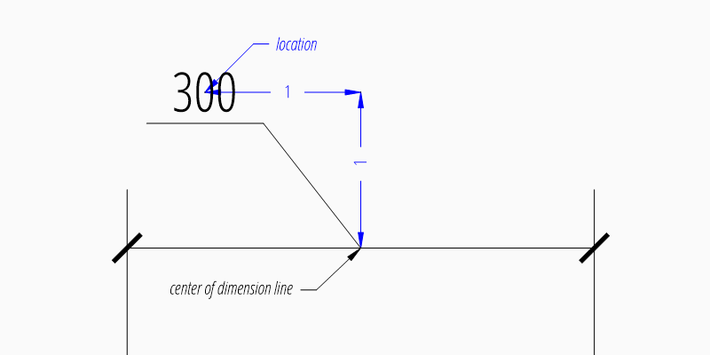

Location Relative to Default Location
+++++++++++++++++++++++++++++++++++++

The method :meth:`~ezdxf.entities.DimStyleOverride.shift_text` shifts the measurement text away from the default text
location. Shifting directions are aligned to the text direction, which is the direction of the dimension line in most
cases, `dh` (for delta horizontal) shifts the text parallel to the text direction, `dv` (for delta vertical) shifts the
text perpendicular to the text direction. This method does not support leaders.

.. code-block:: Python

    dim = msp.add_linear_dim(base=(3, 2), p1=(3, 0), p2=(6, 0))
    dim.shift_text(dh=1, dv=1)
    dim.render()

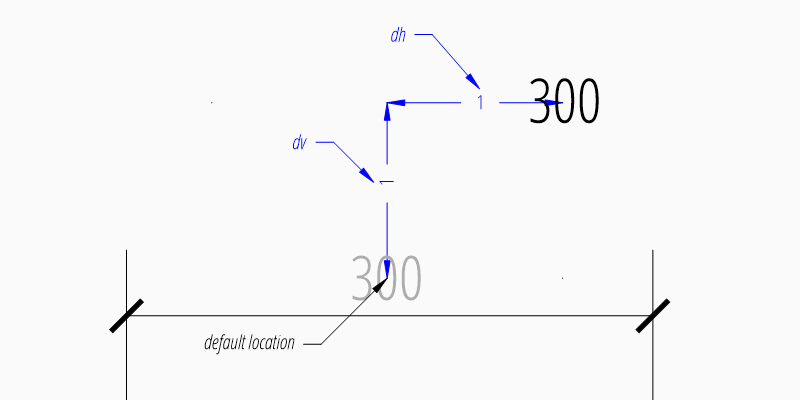

.. _tut_measurement_text_formatting_and_styling:

Measurement Text Formatting and Styling
---------------------------------------

Text Properties
~~~~~~~~~~~~~~~

=================== ===========================================
DIMVAR              Description
=================== ===========================================
:attr:`dimtxsty`    Specifies the text style of the dimension as :class:`~ezdxf.entities.Textstyle` name.
:attr:`dimtxt`      Text height in drawing units.
:attr:`dimclrt`     Measurement text color as :ref:`ACI`.
=================== ===========================================

.. code-block:: Python

    msp.add_linear_dim(
        base=(3, 2), p1=(3, 0), p2=(6, 0),
        override={
            'dimtxsty': 'Standard',
            'dimtxt': 0.35,
            'dimclrt': 1,
        }).render()

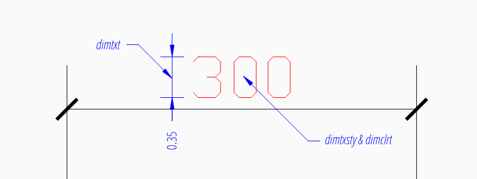

Background Filling
~~~~~~~~~~~~~~~~~~

Background fillings are supported since DXF R2007, and `ezdxf` uses the MTEXT entity to implement this
feature, so setting background filling in DXF R12 has no effect.

Set :attr:`~ezdxf.entities.DimStyle.dxf.dimtfill` to ``1`` to use the canvas color as background filling or set
:attr:`~ezdxf.entities.DimStyle.dxf.dimtfill` to ``2`` to use :attr:`~ezdxf.entities.DimStyle.dxf.dimtfillclr` as
background filling, color value as :ref:`ACI`. Set :attr:`~ezdxf.entities.DimStyle.dxf.dimtfill` to ``0`` to
disable background filling.

=================== ==============================================================================
DIMVAR              Description
=================== ==============================================================================
:attr:`dimtfill`    Enables background filling if bigger than ``0``
:attr:`dimtfillclr` Fill color as :ref:`ACI`, if :attr:`dimtfill` is ``2``
=================== ==============================================================================

=================== ====================================================
:attr:`dimtfill`    Description
=================== ====================================================
``0``               disabled
``1``               canvas color
``2``               color defined by :attr:`dimtfillclr`
=================== ====================================================

.. code-block:: Python

    msp.add_linear_dim(
        base=(3, 2), p1=(3, 0), p2=(6, 0),
        override={
            'dimtfill': 2,
            'dimtfillclr': 1,
        }).render()

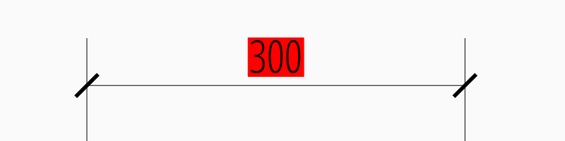

Text Formatting
~~~~~~~~~~~~~~~

- Set decimal places: :attr:`~ezdxf.entities.DimStyle.dxf.dimdec` defines the number of decimal places displayed for the
  primary units of a dimension. (DXF R2000)
- Set decimal point character: :attr:`~ezdxf.entities.DimStyle.dxf.dimdsep` defines the decimal point as ASCII code,
  use :code:`ord('.')`
- Set rounding: :attr:`~ezdxf.entities.DimStyle.dxf.dimrnd`, rounds all dimensioning distances to the specified
  value, for instance, if :attr:`dimrnd` is set to ``0.25``, all distances round to the nearest 0.25 unit.
  If :attr:`dimrnd` is set to ``1.0``, all distances round to the nearest integer. For more information look at
  the documentation of the :func:`ezdxf.math.xround` function.
- Set zero trimming: :attr:`~ezdxf.entities.DimStyle.dxf.dimzin`, `ezdxf` supports only: ``4`` suppress leading zeros
  and ``8``: suppress trailing zeros and both as ``12``.
- Set measurement factor: scale measurement by factor :attr:`~ezdxf.entities.DimStyle.dxf.dimlfac`, e.g. to get the
  dimensioning text in cm for a DXF file where 1 drawing unit represents 1m, set :attr:`dimlfac` to ``100``.
- Text template for measurement text is defined by :attr:`~ezdxf.entities.DimStyle.dxf.dimpost`, ``'<>'`` represents the
  measurement text, e.g. ``'~<>cm'`` produces ``'~300cm'`` for measurement in previous example.

To set this values the :meth:`ezdxf.entities.DimStyle.set_text_format` and
:meth:`ezdxf.entities.DimStyleOverride.set_text_format` methods are very recommended.

.. _tut_overriding_measurement_text:

Overriding Measurement Text
---------------------------

Measurement text overriding is stored in the :class:`~ezdxf.entities.Dimension` entity, the content of
to DXF attribute :class:`~ezdxf.entities.Dimension.dxf.text` represents the override value as string.
Special values are one space ``' '`` to just suppress the measurement text, an empty string ``''``  or ``'<>'``
to get the regular measurement.

All factory functions have an explicit `text` argument, which always replaces the `text` value in the
`dxfattribs` dict.

.. code-block:: Python

    msp.add_linear_dim(base=(3, 2), p1=(3, 0), p2=(6, 0), text='>1m').render()

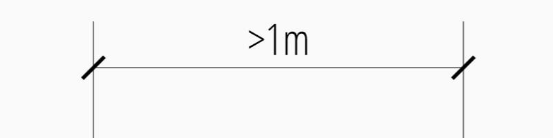

.. _tut_dimension_line_properties:

Dimension Line Properties
-------------------------

The dimension line color is defined by the DIMVAR :attr:`dimclrd` as :ref:`ACI`,
:attr:`dimclrd` also defines the color of the arrows. The linetype is defined by :attr:`dimltype`
but requires DXF R2007 for full support by CAD Applications and the line weight is defined by
:attr:`dimlwd` (DXF R2000), see also the :attr:`~ezdxf.entities.DXFGraphic.dxf.lineweight` reference
for valid values. The :attr:`dimdle` is the extension of the dimension line beyond the extension
lines, this dimension line extension is not supported for all arrows.

=================== ==============================================================================
DIMVAR              Description
=================== ==============================================================================
:attr:`dimclrd`     dimension line and arrows color as :ref:`ACI`
:attr:`dimltype`    linetype of dimension line
:attr:`dimlwd`      line weight of dimension line
:attr:`dimdle`      extension of dimension line in drawing units
=================== ==============================================================================

.. code-block:: Python

    msp.add_linear_dim(
        base=(3, 2), p1=(3, 0), p2=(6, 0),
        override={
            'dimclrd': 1,  # red
            'dimdle': 0.25,
            'dimltype': 'DASHED2',
            'dimlwd': 35,  # 0.35mm line weight
        }).render()

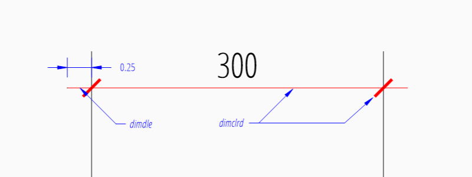

:meth:`~ezdxf.entities.DimStyleOverride` method:

.. code-block:: Python

    dim = msp.add_linear_dim(base=(3, 2), p1=(3, 0), p2=(6, 0))
    dim.set_dimline_format(color=1, linetype='DASHED2', lineweight=35, extension=0.25)
    dim.render()

.. _tut_extension_line_properties:

Extension Line Properties
-------------------------

The extension line color is defined by the DIMVAR :attr:`dimclre` as :ref:`ACI`.
The linetype for first and second extension line is defined by :attr:`dimltex1` and :attr:`dimltex2` but requires DXF
R2007 for full support by CAD Applications and the line weight is defined by :attr:`dimlwe` (DXF R2000), see also the
:attr:`~ezdxf.entities.DXFGraphic.dxf.lineweight` reference for valid values.

The :attr:`dimexe` is the extension of the extension line beyond the dimension line, and :attr:`dimexo` defines the
offset of the extension line from the measurement point.

=================== ================================================================================================
DIMVAR              Description
=================== ================================================================================================
:attr:`dimclre`     extension line color as :ref:`ACI`
:attr:`dimltex1`    linetype of first extension line
:attr:`dimltex2`    linetype of second extension line
:attr:`dimlwe`      line weight of extension line
:attr:`dimexe`      extension beyond dimension line in drawing units
:attr:`dimexo`      offset of extension line from measurement point
:attr:`dimfxlon`    set to ``1`` to enable fixed length extension line
:attr:`dimfxl`      length of fixed length extension line in drawing units
:attr:`dimse1`      suppress first extension line if ``1``
:attr:`dimse2`      suppress second extension line if ``1``
=================== ================================================================================================

.. code-block:: Python

    msp.add_linear_dim(
        base=(3, 2), p1=(3, 0), p2=(6, 0),
        override={
            'dimclre': 1,   # red
            'dimltex1': 'DASHED2',
            'dimltex2': 'CENTER2',
            'dimlwe': 35,   # 0.35mm line weight
            'dimexe': 0.3,  # length above dimension line
            'dimexo': 0.1,  # offset from measurement point
        }).render()

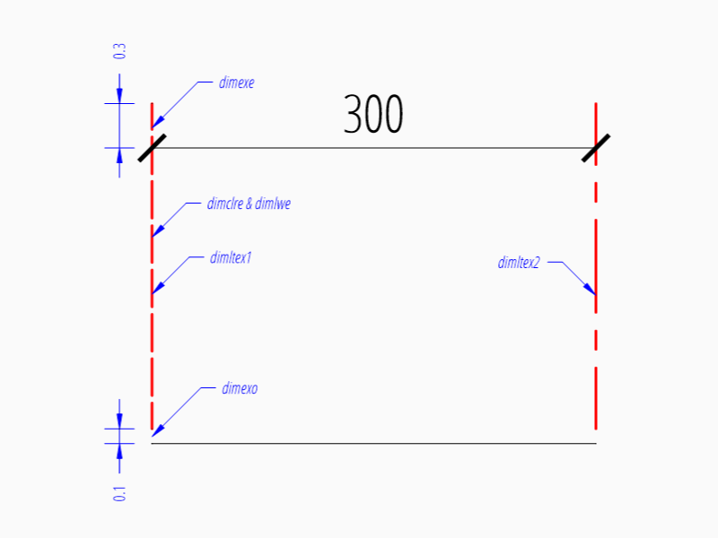

:meth:`~ezdxf.entities.DimStyleOverride` methods:

.. code-block:: Python

    dim = msp.add_linear_dim(base=(3, 2), p1=(3, 0), p2=(6, 0))
    dim.set_extline_format(color=1, lineweight=35, extension=0.3, offset=0.1)
    dim.set_extline1(linetype='DASHED2')
    dim.set_extline2(linetype='CENTER2')
    dim.render()

Fixed length extension lines are supported in DXF R2007+, set :attr:`dimfxlon` to ``1`` and :attr:`dimfxl` defines
the length of the extension line starting at the dimension line.

.. code-block:: Python

    msp.add_linear_dim(
        base=(3, 2), p1=(3, 0), p2=(6, 0),
        override={
            'dimfxlon': 1,  # fixed length extension lines
            'dimexe': 0.2,  # length above dimension line
            'dimfxl': 0.4,  # length below dimension line
        }).render()

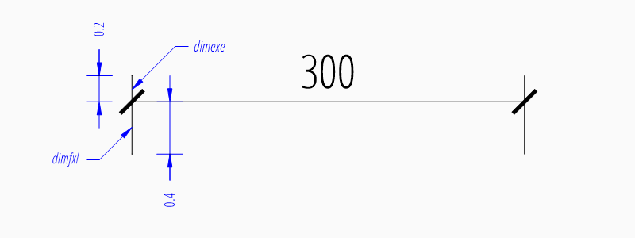

:meth:`~ezdxf.entities.DimStyleOverride` method:

.. code-block:: Python

    dim = msp.add_linear_dim(base=(3, 2), p1=(3, 0), p2=(6, 0))
    dim.set_extline_format(extension=0.2, fixed_length=0.4)
    dim.render()

To suppress extension lines set :attr:`dimse1` = ``1`` to suppress the first extension
line and :attr:`dimse2` = ``1`` to suppress the second extension line.

.. code-block:: Python

    msp.add_linear_dim(
        base=(3, 2), p1=(3, 0), p2=(6, 0),
        override={
            'dimse1': 1,  # suppress first extension line
            'dimse2': 1,  # suppress second extension line
            'dimblk': ezdxf.ARROWS.closed_filled,  # arrows just looks better
        }).render()

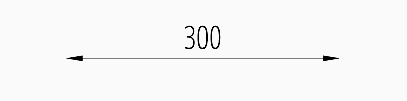

:meth:`~ezdxf.entities.DimStyleOverride` methods:

.. code-block:: Python

    dim = msp.add_linear_dim(base=(3, 2), p1=(3, 0), p2=(6, 0))
    dim.set_arrows(blk=ezdxf.ARROWS.closed_filled)
    dim.set_extline1(disable=True)
    dim.set_extline2(disable=True)
    dim.render()

.. _tut_arrows:

Arrows
------

"Arrows" mark then beginning and the end of a dimension line, and most of them do not look like arrows.

DXF distinguish between the simple tick and arrows as blocks.

Using the simple tick by setting tick size :attr:`~ezdxf.entities.DimStyle.dxf.dimtsz` != ``0``
also disables arrow blocks as side effect:

.. code-block:: Python

    dim = msp.add_linear_dim(base=(3, 2), p1=(3, 0), p2=(6, 0))
    dim.set_tick(size=0.25)
    dim.render()

`ezdxf` uses the ``"ARCHTICK"`` block at double size to render the tick (AutoCAD and BricsCad just
draw a simple line), so there is no advantage of using the tick instead of an arrow.

Using arrows:

.. code-block:: Python

    dim = msp.add_linear_dim(base=(3, 2), p1=(3, 0), p2=(6, 0))
    dim.set_arrow(blk="OPEN_30", size=0.25)
    dim.render()

=================== ====================================================================================
DIMVAR              Description
=================== ====================================================================================
:attr:`dimtsz`      tick size in drawing units, set to ``0`` to use arrows
:attr:`dimblk`      set both arrow block names at once
:attr:`dimblk1`     first arrow block name
:attr:`dimblk2`     second arrow block name
:attr:`dimasz`      arrow size in drawing units
=================== ====================================================================================

.. code-block:: Python

    msp.add_linear_dim(
        base=(3, 2), p1=(3, 0), p2=(6, 0),
        override={
            'dimtsz': 0,  # set tick size to 0 to enable arrow usage
            'dimasz': 0.25,  # arrow size in drawing units
            'dimblk': "OPEN_30",  # arrow block name
        }).render()

Dimension line extension (:attr:`dimdle`) works only for a few arrow blocks and the simple tick:

- ``"ARCHTICK"``
- ``"OBLIQUE"``
- ``"NONE"``
- ``"SMALL"``
- ``"DOTSMALL"``
- ``"INTEGRAL"``

Arrow Shapes
~~~~~~~~~~~~

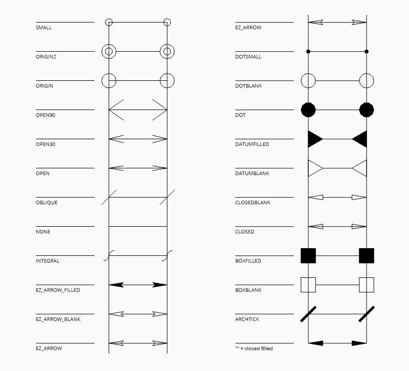

Arrow Names
~~~~~~~~~~~

The arrow names are stored as attributes in the :code:`ezdxf.ARROWS` object.

=========================== ========================
closed_filled               ``""`` (empty string)
dot                         ``"DOT"``
dot_small                   ``"DOTSMALL"``
dot_blank                   ``"DOTBLANK"``
origin_indicator            ``"ORIGIN"``
origin_indicator_2          ``"ORIGIN2"``
open                        ``"OPEN"``
right_angle                 ``"OPEN90"``
open_30                     ``"OPEN30"``
closed                      ``"CLOSED"``
dot_smallblank              ``"SMALL"``
none                        ``"NONE"``
oblique                     ``"OBLIQUE"``
box_filled                  ``"BOXFILLED"``
box                         ``"BOXBLANK"``
closed_blank                ``"CLOSEDBLANK"``
datum_triangle_filled       ``"DATUMFILLED"``
datum_triangle              ``"DATUMBLANK"``
integral                    ``"INTEGRAL"``
architectural_tick          ``"ARCHTICK"``
ez_arrow                    ``"EZ_ARROW"``
ez_arrow_blank              ``"EZ_ARROW_BLANK"``
ez_arrow_filled             ``"EZ_ARROW_FILLED"``
=========================== ========================

.. _tut_tolerances_and_limits:

Tolerances and Limits
---------------------

The tolerances ans limits features are implemented by using the :class:`~ezdxf.entities.MText` entity, therefore
DXF R2000+ is required to use these features. It is not possible to use both tolerances and limits at the same time.

Tolerances
~~~~~~~~~~

Geometrical tolerances are shown as additional text appended to the measurement text.
It is recommend to use :meth:`~ezdxf.entities.DimStyleOverride.set_tolerance` method in
:class:`~ezdxf.entities.DimStyleOverride` or :class:`~ezdxf.entities.DimStyle`.

The attribute :attr:`dimtp` defines the upper tolerance value, :attr:`dimtm` defines the lower tolerance value if
present, else the lower tolerance value is the same as the upper tolerance value.
Tolerance values are shown as given!

Same upper and lower tolerance value:

.. code-block:: python

    dim = msp.add_linear_dim(base=(0, 3), p1=(3, 0), p2=(6.5, 0))
    dim.set_tolerance(.1, hfactor=.4, align="top", dec=2)
    dim.render()

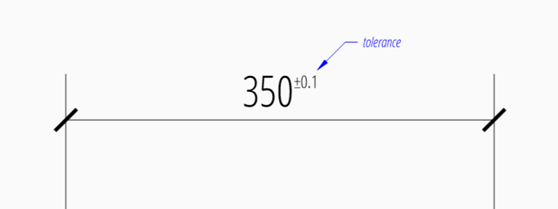

Different upper and lower tolerance values:

.. code-block:: python

    dim = msp.add_linear_dim(base=(0, 3), p1=(3, 0), p2=(6.5, 0))
    dim.set_tolerance(upper=.1, lower=.15, hfactor=.4, align="middle", dec=2)
    dim.render()

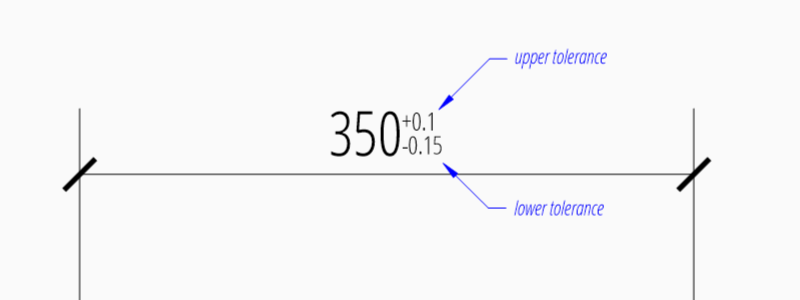

The attribute :attr:`dimtfac` specifies a scale factor for the text height of limits and tolerance values
relative to the dimension text height, as set by :attr:`dimtxt`. For example, if :attr:`dimtfac` is set to
``1.0``, the text height of fractions and tolerances is the same height as the dimension text.
If :attr:`dimtxt` is set to ``0.75``, the text height of limits and tolerances is three-quarters the
size of dimension text.

Vertical justification for tolerances is specified by :attr:`dimtolj`:

=================== ====================================================
:attr:`dimtolj`     Description
=================== ====================================================
``0``               Align with bottom line of dimension text
``1``               Align vertical centered to dimension text
``2``               Align with top line of dimension text
=================== ====================================================

=================== ====================================================================================
DIMVAR              Description
=================== ====================================================================================
:attr:`dimtol`      set to ``1`` to enable tolerances
:attr:`dimtp`       set the maximum (or upper) tolerance limit for dimension text
:attr:`dimtm`       set the minimum (or lower) tolerance limit for dimension text
:attr:`dimtfac`     specifies a scale factor for the text height of limits and tolerance values
                    relative to the dimension text height, as set by :attr:`dimtxt`.
:attr:`dimtzin`     ``4`` to suppress leading zeros, ``8`` to suppress trailing zeros or ``12`` to
                    suppress both, like :attr:`dimzin` for dimension text, see also `Text Formatting`_
:attr:`dimtolj`     set the vertical justification for tolerance values relative to the nominal
                    dimension text.
:attr:`dimtdec`     set the number of decimal places to display in tolerance values
=================== ====================================================================================

Limits
~~~~~~

The geometrical limits are shown as upper and lower measurement limit and replaces the usual
measurement text. It is recommend to use :meth:`~ezdxf.entities.DimStyleOverride.set_limits` method in
:class:`~ezdxf.entities.DimStyleOverride` or :class:`~ezdxf.entities.DimStyle`.

For limits the tolerance values are drawing units scaled by measurement factor :attr:`dimlfac`, the upper
limit is scaled measurement value + :attr:`dimtp` and the lower limit is scaled measurement value -
:attr:`dimtm`.

The attributes :attr:`dimtfac`, :attr:`dimtzin` and :attr:`dimtdec` have the same meaning for limits as
for tolerances.

.. code-block:: python

    dim = msp.add_linear_dim(base=(0, 3), p1=(3, 0), p2=(6.5, 0))
    dim.set_limits(upper=.1, lower=.15, hfactor=.4, dec=2)
    dim.render()

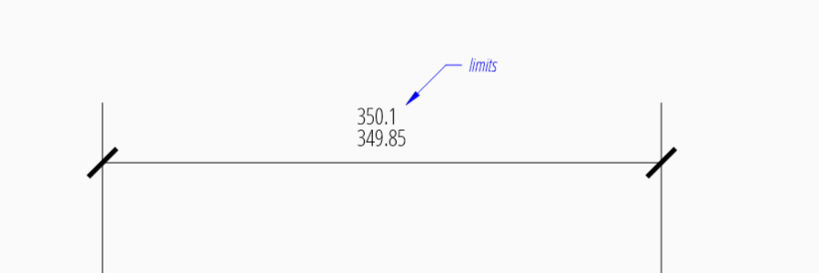

=================== ====================================================================================
DIMVAR              Description
=================== ====================================================================================
:attr:`dimlim`      set to ``1`` to enable limits
=================== ====================================================================================

Alternative Units
-----------------

Alternative units are not supported.

.. _dimension_linear.py:  https://github.com/mozman/ezdxf/blob/master/examples/render/dimension_linear.py