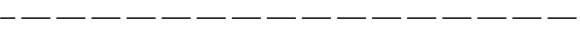
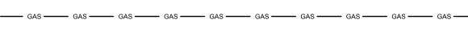
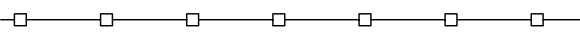

.. _tut_linetypes:

Tutorial for Linetypes
======================

Simple line type example:

You can define your own line types. A DXF linetype definition consists of name, description and elements::

    elements = [total_pattern_length, elem1, elem2, ...]

total_pattern_length
    Sum of all linetype elements (absolute vaues)

elem
    if elem > 0 it is a line, if elem < 0 it is gap, if elem == 0.0 it is a dot

Create a new linetype definition::

    import ezdxf
    from ezdxf.tools.standards import linetypes  # some predefined line types

    dwg = ezdxf.new()
    msp = modelspace()

    my_line_types = [
        ("DOTTED", "Dotted .  .  .  .  .  .  .  .  .  .  .  .  .  .  .  .", [0.2, 0.0, -0.2]),
        ("DOTTEDX2", "Dotted (2x) .    .    .    .    .    .    .    . ", [0.4, 0.0, -0.4]),
        ("DOTTED2", "Dotted (.5) . . . . . . . . . . . . . . . . . . . ", [0.1, 0.0, -0.1]),
    ]
    for name, desc, pattern in my_line_types:
        if name not in dwg.linetypes:
            dwg.linetypes.new(name=name, dxfattribs={'description': desc, 'pattern': pattern})

Setup some predefined linetypes::

    for name, desc, pattern in linetypes():
        if name not in dwg.linetypes:
            dwg.linetypes.new(name=name, dxfattribs={'description': desc, 'pattern': pattern})

Check Available Linetypes
-------------------------

The linetypes object supports some standard Python protocols::

    # iteration
    print('available line types:')
    for linetype in dwg.linetypes:
        print('{}: {}'.format(linetype.dxf.name, linetype.dxf.description))

    # check for existing line type
    if 'DOTTED' in dwg.linetypes:
        pass

    count = len(dwg.linetypes) # total count of linetypes

Removing Linetypes
------------------

.. warning::

    Deleting of linetypes still in use generates invalid DXF files.

You can delete a linetype::

    dwg.layers.remove('DASHED')

This just deletes the linetype definition, all DXF entity with the DXF attribute linetype set to ``DASHED`` still
refers to linetype ``DASHED`` and AutoCAD will not open DXF files with undefined line types.

Tutorial for Complex Linetypes
==============================

With DXF R13 Autodesk introduced complex line types, containing TEXT or SHAPES in line types. ezdxf v0.8.4 and later
supports complex line types.

Complex line type example with text:

Complex line type example with shapes:

For simplicity the pattern string for complex line types is mostly the same string as the pattern definition strings
in AutoCAD .lin files.

Example for complex line type TEXT::

    dwg = ezdxf.new('R2018')  # DXF R13 or later is required

    dwg.linetypes.new('GASLEITUNG2', dxfattribs={
        'description': 'Gasleitung2 ----GAS----GAS----GAS----GAS----GAS----GAS--',
        'length': 1,  # required for complex line types
        # line type definition in acadlt.lin:
        'pattern': 'A,.5,-.2,["GAS",STANDARD,S=.1,U=0.0,X=-0.1,Y=-.05],-.25',
    })

The pattern always starts with an ``A``, the following float values have the same meaning as for simple line types, a
value > 0 is a line, a value < 0 is a gap, and a 0 ist a point, the ``[`` starts the complex part of the line pattern.
A following text in quotes defines a TEXT type, a following text without quotes defines a SHAPE type, in .lin files the
shape type is a shape name, but ezdxf can not translate this name into the required shape file index, so *YOU* have to
translate this name into the shape file index (e.g. saving the file with AutoCAD as DXF and searching for the line type
definition, see also DXF Internals: :ref:`Linetype Table`).

The second parameter is the text style for a TEXT type and the shape file name for the SHAPE type, the shape file has to
be in the same directory as the DXF file. The following parameters in the scheme of ``S=1.0`` are:

 - S ... scaling factor, always > 0, if S=0 the TEXT or SHAPE is not visible
 - R or U ... rotation relative to the line direction
 - X ... x direction offset (along the line)
 - Y ... y direction offset (perpendicular to the line)

The parameters are case insensitive. ``]`` ends the complex part of the line pattern.

The fine tuning of this parameters is still a try an error process for me, for TEXT the scaling factor (STANDARD text
style) sets the text height (S=.1 the text is .1 units in height), by shifting in y direction by half of the scaling
factor, the center of the text is on the line. For the x direction it seems to be a good practice to place a gap in
front of the text and after the text, find x shifting value and gap sizes by try and error. The overall length is at
least the sum of all line and gap definitions (absolute values).

Example for complex line type SHAPE::

    dwg.linetypes.new('GRENZE2', dxfattribs={
        'description': 'Grenze eckig ----[]-----[]----[]-----[]----[]--',
        'length': 1.45,  # required for complex line types
        # line type definition in acadlt.lin:
        # A,.25,-.1,[BOX,ltypeshp.shx,x=-.1,s=.1],-.1,1
        # replacing BOX by shape index 132 (got index from an AutoCAD file),
        # ezdxf can't get shape index from ltypeshp.shx
        'pattern': 'A,.25,-.1,[132,ltypeshp.shx,x=-.1,s=.1],-.1,1',
    })

Complex line types with shapes only work if the associated shape file (ltypeshp.shx) and the DXF file are in the same
directory.

