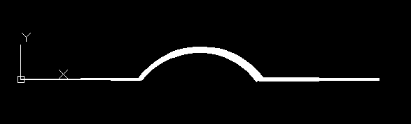

.. _tut_lwpolyline:

Tutorial for LWPolyline
=======================

A lightweight polyline is defined as a single graphic entity. The :class:`LWPolyline` differs from the old-style
:class:`Polyline`, which is defined as a group of subentities. :class:`LWPolyline` display faster (in AutoCAD) and consume
less disk space and RAM. LWPolylines are planar elements, therefore all coordinates have no value for the z axis.

Create a simple polyline::

    import ezdxf

    dwg = ezdxf.new('AC1015')
    msp = dwg.modelspace()

    points = [(0, 0), (3, 0), (6, 3), (6, 6)]
    msp.add_lwpolyline(points)

    dwg.saveas("lwpolyline1.dxf")

Append points to a polyline::

    dwg = ezdxf.readfile("lwpolyline1.dxf")
    msp = dwg.modelspace()

    line = msp.query('LWPOLYLINE')[0]  # take first LWPolyline
    line.append_points([(8, 7), (10, 7)])

    dwg.saveas("lwpolyline2.dxf")

Use context manager to edit polyline::

    dwg = ezdxf.readfile("lwpolyline2.dxf")
    msp = dwg.modelspace()

    line = msp.query('LWPOLYLINE')[0]  # take first LWPolyline

    with line.points() as points:  # points is a python standard list
        del points[-2:]  # delete last 2 points
        points.extend([(4, 7), (0, 7)])  # adding 2 other points
        # the same as one command
        # points[-2:] = [(4, 7), (0, 7)]
    # implicit call of line.set_points(points) at context manager exit

    dwg.saveas("lwpolyline3.dxf")

Each line segment can have a different start/end width, if omitted start/end width = 0::

    dwg = ezdxf.new('AC1015')
    msp = dwg.modelspace()

    # point format = (x, y, [start_width, [end_width, [bulge]]])

    points = [(0, 0, .1, .15), (3, 0, .2, .25), (6, 3, .3, .35), (6, 6)]
    msp.add_lwpolyline(points)

    dwg.saveas("lwpolyline4.dxf")

The first vertex (point) carries the start/end width of the first segment, the second vertex of the second segment and
so on, the start/end width value of the last vertex is ignored. Start/end width only works if the DXF attribute
`const_width` is unset, to be sure delete it::

    del line.dxf.const_width # no exception will be raised if const_width is already unset

LWPolyline can also have curved elements, they are defined by the `bulge` value::

    dwg = ezdxf.new('AC1015')
    msp = dwg.modelspace()

    # point format = (x, y, [start_width, [end_width, [bulge]]])

    points = [(0, 0, 0, .05), (3, 0, .1, .2, -.5), (6, 0, .1, .05), (9, 0)]
    msp.add_lwpolyline(points)

    dwg.saveas("lwpolyline5.dxf")

The curved segment is drawn from the vertex with the defined `bulge` value to the following vertex, the curved segment
is always a circle, the diameter is relative to the vertex distance, `bulge` = 1.0 means the diameter equals the vertex
distance, `bulge` = 0.5 means the diameter is the half of the vertex distance. `bulge` > 0 the curve is on the right
side of the vertex connection line, `bulge` < 0 the curve is on the left side.

