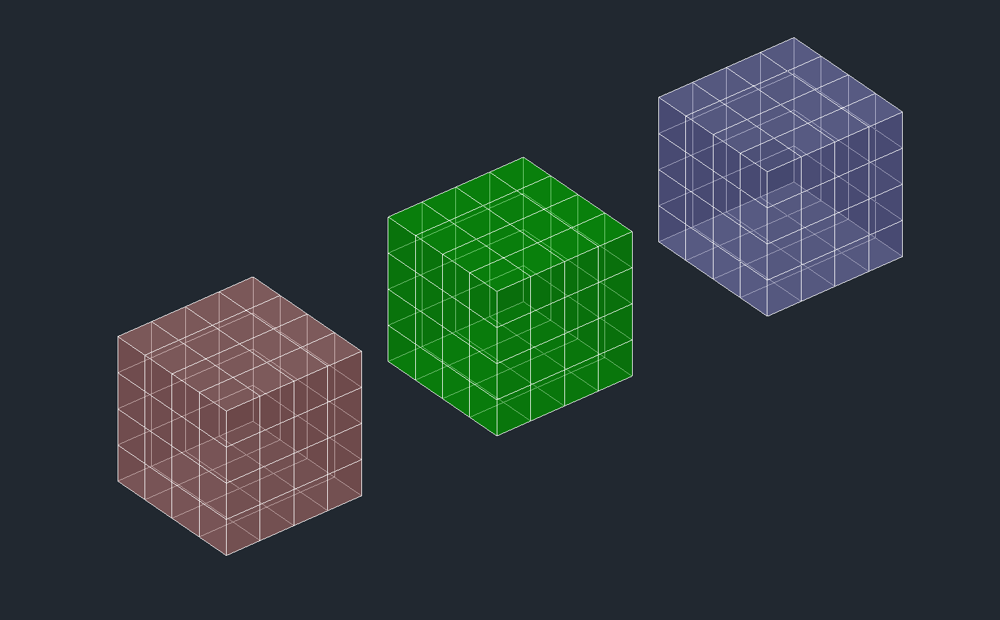
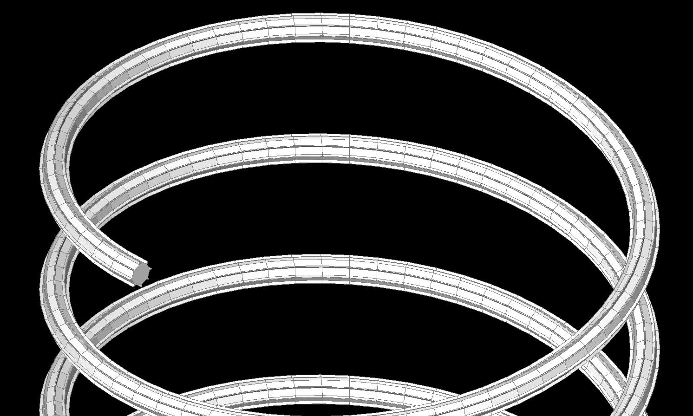

.. _tut_mesh:

Tutorial for Mesh
=================

The :class:`~ezdxf.entities.Mesh` entity is a 3D object in :ref:`WCS` build up
from vertices and faces.

Create a cube mesh by directly accessing the base data structures:

.. code-block:: python

    import ezdxf

    # 8 corner vertices
    cube_vertices = [
        (0, 0, 0),
        (1, 0, 0),
        (1, 1, 0),
        (0, 1, 0),
        (0, 0, 1),
        (1, 0, 1),
        (1, 1, 1),
        (0, 1, 1),
    ]

    # 6 cube faces
    cube_faces = [
        [0, 1, 2, 3],
        [4, 5, 6, 7],
        [0, 1, 5, 4],
        [1, 2, 6, 5],
        [3, 2, 6, 7],
        [0, 3, 7, 4]
    ]

    # MESH requires DXF R2000 or later
    doc = ezdxf.new("R2000")
    msp = doc.modelspace()
    mesh = msp.add_mesh()
    # do not subdivide cube, 0 is the default value
    mesh.dxf.subdivision_levels = 0
    with mesh.edit_data() as mesh_data:
        mesh_data.vertices = cube_vertices
        mesh_data.faces = cube_faces

    doc.saveas("cube_mesh_1.dxf")

Create a cube mesh by assembling single faces using the
:meth:`~ezdxf.entities.Mesh.edit_data()` context manager of the
:class:`~ezdxf.entities.Mesh` class and the helper class
:class:`~ezdxf.entities.MeshData`:

.. code-block:: python

    import ezdxf

    # 8 corner vertices
    p = [
        (0, 0, 0),
        (1, 0, 0),
        (1, 1, 0),
        (0, 1, 0),
        (0, 0, 1),
        (1, 0, 1),
        (1, 1, 1),
        (0, 1, 1),
    ]

    # MESH requires DXF R2000 or later
    doc = ezdxf.new("R2000")
    msp = doc.modelspace()
    mesh = msp.add_mesh()

    with mesh.edit_data() as mesh_data:
        mesh_data.add_face([p[0], p[1], p[2], p[3]])
        mesh_data.add_face([p[4], p[5], p[6], p[7]])
        mesh_data.add_face([p[0], p[1], p[5], p[4]])
        mesh_data.add_face([p[1], p[2], p[6], p[5]])
        mesh_data.add_face([p[3], p[2], p[6], p[7]])
        mesh_data.add_face([p[0], p[3], p[7], p[4]])
        # optional call optimize(): minimizes the vertex count
        mesh_data.optimize()

    doc.saveas("cube_mesh_2.dxf")

Its recommended to use the :class:`~ezdxf.render.MeshBuilder` objects to
create 3D meshes and render them as MESH entities by the
:meth:`~ezdxf.render.MeshBuilder.render_mesh` method into a layout:

.. code-block:: Python

        import ezdxf
        from ezdxf import colors
        from ezdxf.gfxattribs import GfxAttribs
        from ezdxf.render import forms

        cube = forms.cube().scale_uniform(10).subdivide(2)
        red = GfxAttribs(color=colors.RED)
        green = GfxAttribs(color=colors.GREEN)
        blue = GfxAttribs(color=colors.BLUE)

        doc = ezdxf.new()
        msp = doc.modelspace()

        # render as MESH entity
        cube.render_mesh(msp, dxfattribs=red)
        cube.translate(20)

        # render as POLYFACE a.k.a. POLYLINE entity
        cube.render_polyface(msp, dxfattribs=green)
        cube.translate(20)

        # render as a bunch of 3DFACE entities
        cube.render_3dfaces(msp, dxfattribs=blue)

        doc.saveas("meshes.dxf")

There exist some tools to manage meshes:

- :class:`ezdxf.render.MeshBuilder`: The :class:`~ezdxf.render.MeshBuilder`
  classes are helper tools to manage meshes buildup by vertices and faces.
- :class:`ezdxf.render.MeshTransformer`: Same functionality as :class:`~ezdxf.render.MeshBuilder`
  but supports inplace transformation.
- :class:`ezdxf.render.MeshDiagnose`: A diagnose tool which can be used to
  analyze and detect errors of :class:`~ezdxf.render.MeshBuilder` objects
  like topology errors for closed surfaces.
- :class:`ezdxf.render.FaceOrientationDetector`: A helper class for face
  orientation and face normal vector detection

The :mod:`ezdxf.render.forms` module provides function to create basic
geometries like cube, cone, sphere and so on and functions to create meshes
from profiles by extrusion, rotation or sweeping.

This example shows how to sweep a gear profile along a helix:

.. code-block:: Python

    import ezdxf
    from ezdxf.render import forms

    doc = ezdxf.new()
    doc.layers.add("MESH", color=ezdxf.colors.YELLOW)
    msp = doc.modelspace()
    # sweeping a gear-profile
    gear = forms.gear(
        8, top_width=0.01, bottom_width=0.02, height=0.02, outside_radius=0.1
    )
    helix = path.helix(radius=2, pitch=1, turns=6)
    # along a helix spine
    sweeping_path = helix.flattening(0.1)
    mesh = forms.sweep(gear, sweeping_path, close=True, caps=True)
    # and render as MESH entity
    mesh.render_mesh(msp, dxfattribs={"layer": "MESH"})
    doc.saveas("gear_along_helix.dxf")

