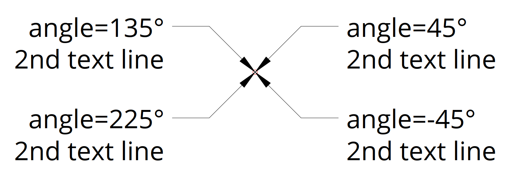
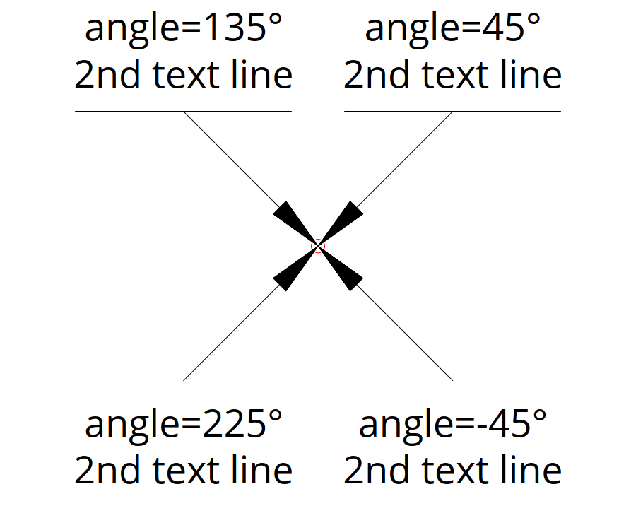
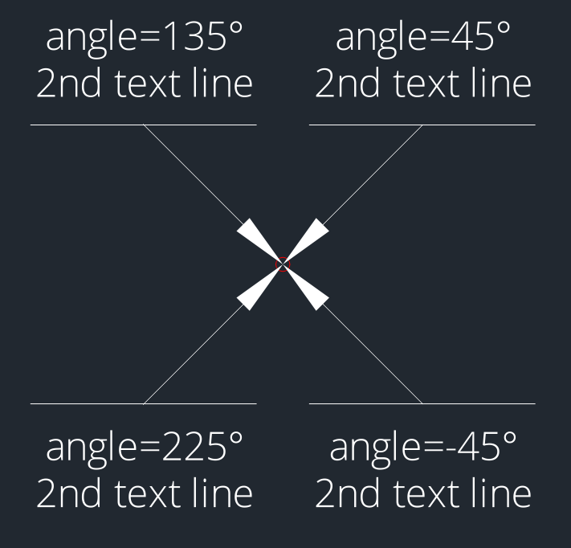
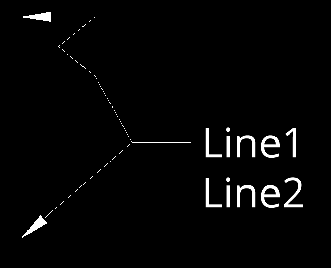
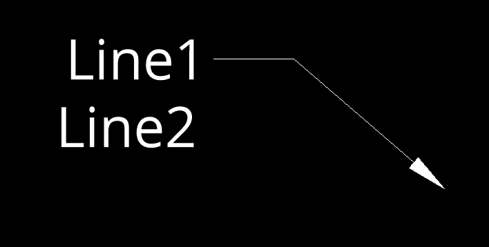
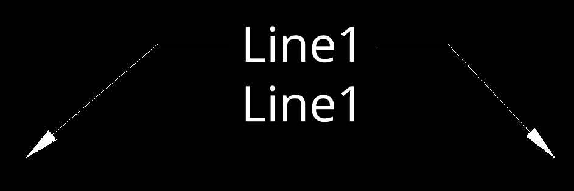
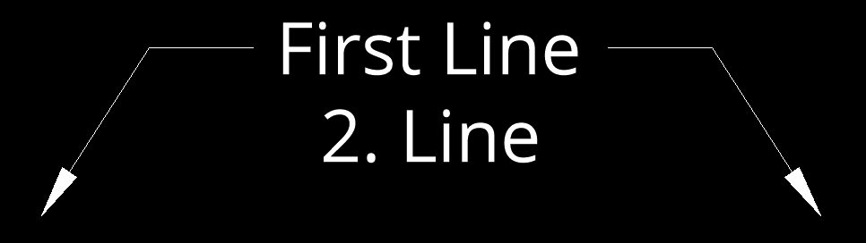
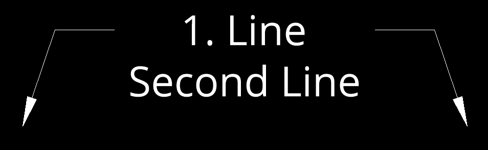
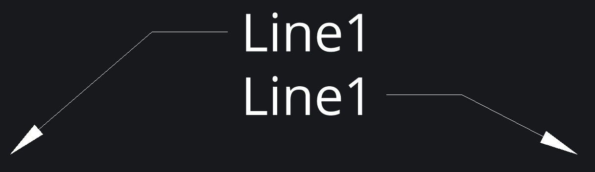

.. _tut_mleader:

Tutorial for MultiLeader
========================

.. versionadded:: 0.18

A multileader object typically consists of an arrowhead, a horizontal landing
(a.k.a. "dogleg"), a leader line or curve, and either a MTEXT object or a BLOCK.

Because of the complexity of the MULTILEADER entity, the factory method
:meth:`~ezdxf.layouts.BaseLayout.add_multileader_mtext` returns a
:class:`~ezdxf.render.MultiLeaderMTextBuilder` instance to build a new entity
and the factory method :meth:`~ezdxf.layouts.BaseLayout.add_multileader_block`
returns a :class:`~ezdxf.render.MultiLeaderBlockBuilder` instance.

Due of the lack of good documentation it's not possible to support all
combinations of MULTILEADER properties with decent quality, so stick to recipes
and hints shown in this tutorial to get usable results otherwise, you will enter
uncharted territory.

The rendering result of the MULTILEADER entity is highly dependent on the CAD
application. The MULTILEADER entity does not have a pre-rendered anonymous
block of DXF primitives like the DIMENSION entities, so results may vary
from CAD application to CAD application.

.. seealso::

    - :class:`ezdxf.render.MultiLeaderBuilder` classes
    - :class:`ezdxf.entities.MultiLeader` class
    - :class:`ezdxf.entities.MLeaderStyle` class
    - :class:`ezdxf.tools.text.MTextEditor` class
    - :ref:`mleader internals`

MTEXT Quick Draw
----------------

Full Python script: `mtext_quick_leader.py`_

The :meth:`quick_leader()` method of a MTEXT - MULTILEADER entity constructs the
geometry parameters in reverse manner, starting from a given target point:

DXF document setup:

.. literalinclude:: src/mleader/mtext_quick_leader.py
    :lines: 20-25

Draw a red circle to mark the target point:

.. literalinclude:: src/mleader/mtext_quick_leader.py
    :lines: 26-29

Create four horizontal placed MULTILEADER entities pointing at the target point,
the first segment of the leader line is determined by an angle in this example
pointing away from the target point:

.. literalinclude:: src/mleader/mtext_quick_leader.py
    :lines: 31-37

The content is automatically aligned to the end of the leader line. The first
segment is a relative vector to the target point and the optional second segment
vector is relative to the end of the first segment.
The default connection type is horizontal but can be changed to vertical:

A smaller text size is required:

.. literalinclude:: src/mleader/mtext_quick_leader.py
    :lines: 45-47

Adding vertical placed MULTILEADER entities:

.. literalinclude:: src/mleader/mtext_quick_leader.py
    :lines: 53-60

This example already shows the limitation caused by different text renderings in
various CAD applications. The `ezdxf` text measurement by `matplotlib` is
different to AutoCAD and BricsCAD and the result is a misalignment of the
overline and the leader line.

The DXF file shown in BricsCAD:

The same DXF file shown with the :code:`ezdxf view` command (drawing add-on):

My advice is to avoid vertical placed MULTILEADER entities at all and for
horizontal placed MULTILEADER entities avoid styles including an "underline" or
an "overline".

The :meth:`quick_leader` method is not very customizable for ease of use, but
follows the settings of the associated :class:`~ezdxf.entities.MLeaderStyle`.

The following sections show how to have more control when adding MULTILEADER
entities.

Create MTEXT Content
--------------------

Full Python script: `mtext_content.py`_

This section shows how to create a MULTILEADER entity with MTEXT content
the manual way with full control over all settings.

For good results the MTEXT alignment should match the leader connection side,
e.g. if you attach leaders to the left side also align the MTEXT to the left side,
for leaders attached at the right side, align the MTEXT to the right side
and if you attach leaders at both sides one side will fit better than the other
or maybe a center aligned MTEXT is a good solution, for further details see
section `MTEXT Alignment`_.

The first example uses the default connection type of the MLEADERSTYLE
"Standard" which is "middle of the top line" for left and right attached
leaders. The render UCS for this example is the WCS to keep things simple.

Create a new MULTILEADER entity.

.. literalinclude:: src/mleader/mtext_content.py
    :lines: 23

Set MTEXT content, text style and alignment.

.. literalinclude:: src/mleader/mtext_content.py
    :lines: 24-28

Add the first leader on the left side.
The leader points always to the first given vertex and all vertices are given
in render UCS coordinates (= WCS in this example).

.. literalinclude:: src/mleader/mtext_content.py
    :lines: 29

More than one vertex per leader can be used:

.. literalinclude:: src/mleader/mtext_content.py
    :lines: 30-33

The insert point of the :meth:`build` method is the alignment point for the
MTEXT content.

.. literalinclude:: src/mleader/mtext_content.py
    :lines: 34

The "dog leg" settings are defined by the MLEADERSTYLE "Standard".

This example shows a leader attached to the right side and the MTEXT aligned
to the right side.

.. literalinclude:: src/mleader/mtext_content.py
    :lines: 43-50

This example shows two leaders attached to both sides and the MTEXT aligned
to the left side, which shows that the right landing gap (space between text and
start of vertex) is bigger than the gap on the left size. This is due to the
different text size calculations from AutoCAD/BricsCAD and Matplotlib.
The longer the text, the greater the error.

.. literalinclude:: src/mleader/mtext_content.py
    :lines: 59-67

A centered MTEXT alignment gives a more even result.

.. literalinclude:: src/mleader/mtext_content.py
    :lines: 76-84

But even this has its disadvantages, the attachment calculation is always based
on the bounding box of the MTEXT content.

MTEXT Connection Types
~~~~~~~~~~~~~~~~~~~~~~

There are four connection sides defined by the enum
:class:`ezdxf.render.ConnectionSide`:

    - left
    - right
    - top
    - bottom

The MultiLeader entity supports as the name says multiple leader lines, but all
have to have a horizontal (left/right) connection side or a vertical (top/bottom)
connection side, it's not possible to mix left/right and top/bottom connection
sides. This is determined by the DXF format.

There are different connection types available for the horizontal and the
vertical connection sides. All leaders connecting to the same side have the
same connection type. The horizontal connection sides support following
connection types, defined by the enum :class:`ezdxf.render.HorizontalConnection`:

    - by_style
    - top_of_top_line
    - middle_of_top_line
    - middle_of_text
    - middle_of_bottom_line
    - bottom_of_bottom_line
    - bottom_of_bottom_line_underline (not recommended)
    - bottom_of_top_line_underline (not recommended)
    - bottom_of_top_line
    - bottom_of_top_line_underline_all (not recommended)

The vertical connection sides support following connection types, defined by the
enum :class:`ezdxf.render.VerticalConnection`:

    - by_style
    - center
    - center_overline (not recommended)

The connection type for each side can be set by the method
:meth:`~ezdxf.render.MultiLeaderBuilder.set_connection_types`, the default for all
sides is `by_style`:

.. literalinclude:: src/mleader/mtext_content.py
    :lines: 101-104

.. hint::

    As shown in the quick draw section using connection types including underlines
    or overlines do not render well in AutoCAD/BricsCAD because of the different
    text measurement of `matplotlib`, therefore it's not recommended to use any
    of these connection types when creating MULTILEADERS by `ezdxf`.

MTEXT Alignment
~~~~~~~~~~~~~~~

In contrast to the standalone MTEXT entity supports the MTEXT
content entity only three text alignments defined by the enum
:class:`ezdxf.render.TextAlignment`.

    - left
    - center
    - right

The MTEXT alignment is set as argument `alignment` of the
:meth:`~ezdxf.render.MultiLeaderBuilder.set_content` method and the alignment
point is the insert point of the :meth:`~ezdxf.render.MultiLeaderBuilder.build`
method.

Create BLOCK Content
--------------------

TODO

BLOCK Connection Types
~~~~~~~~~~~~~~~~~~~~~~

TODO

BLOCK Alignment
~~~~~~~~~~~~~~~

TODO

BLOCK Scaling
~~~~~~~~~~~~~

TODO

BLOCK Attributes
~~~~~~~~~~~~~~~~

TODO

Leader Properties
-----------------

TODO

Connection Properties
~~~~~~~~~~~~~~~~~~~~~

TODO

Polyline Leader
~~~~~~~~~~~~~~~

TODO

Spline Leader
~~~~~~~~~~~~~

TODO

Line Styling
~~~~~~~~~~~~

TODO

Arrowheads
~~~~~~~~~~

TODO

Overall Scaling
---------------

TODO

Setup MLEADERSTYLE
------------------

TODO

.. _mtext_quick_leader.py: https://github.com/mozman/ezdxf/blob/master/docs/source/tutorials/src/mleader/mtext_quick_leader.py
.. _mtext_content.py: https://github.com/mozman/ezdxf/blob/master/docs/source/tutorials/src/mleader/mtext_content.py