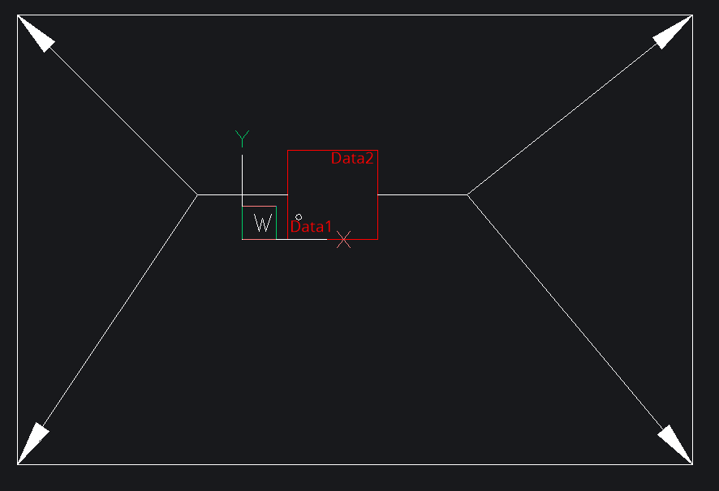
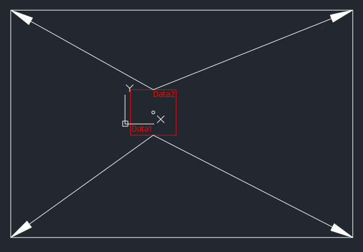
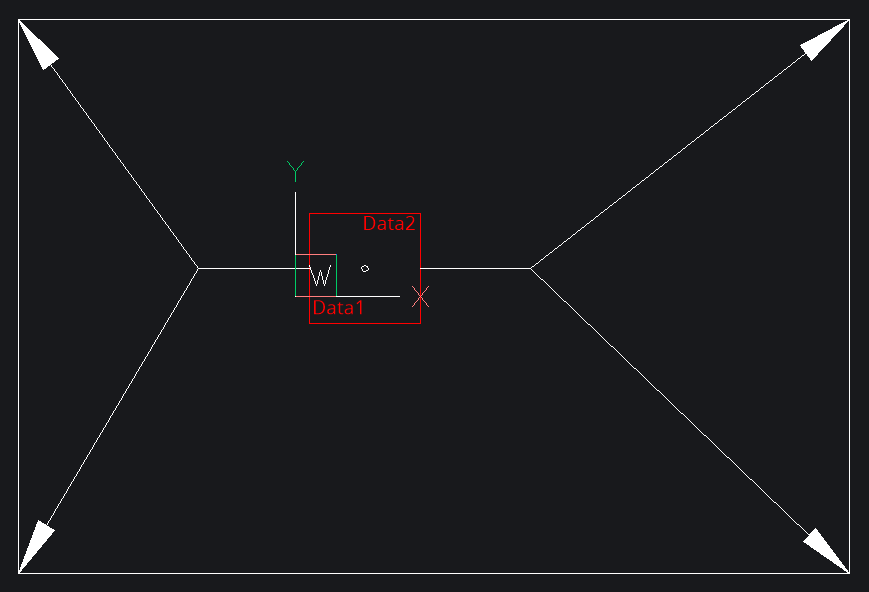
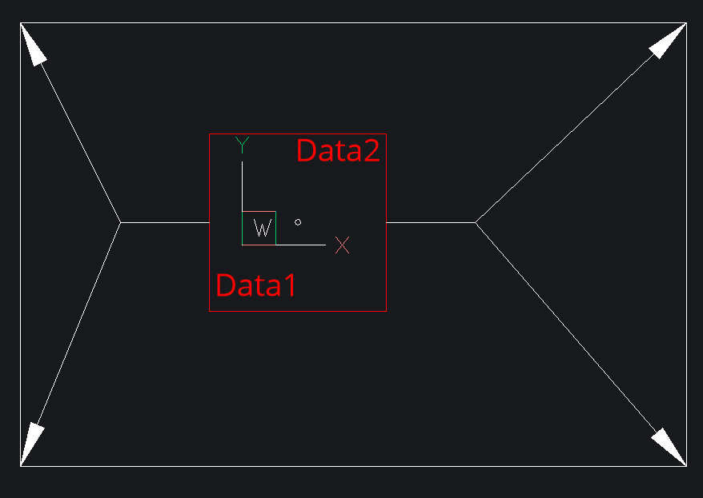
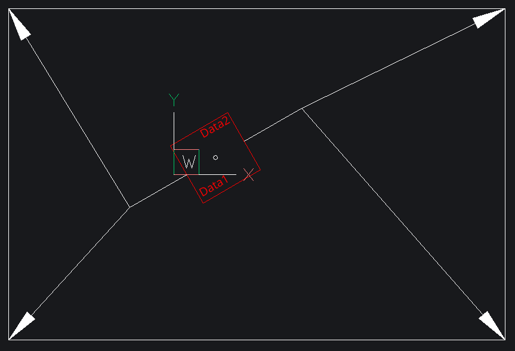
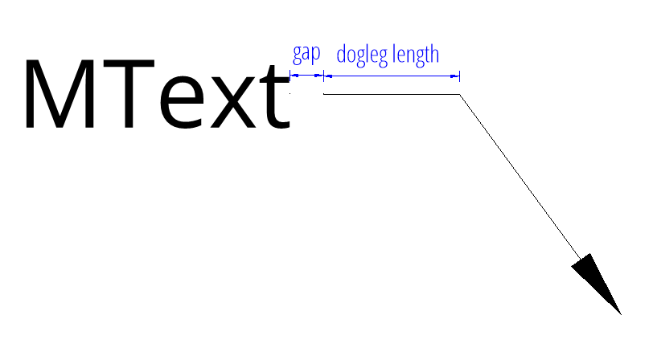
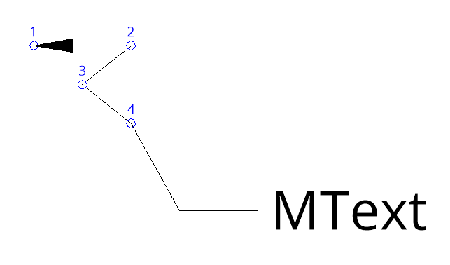
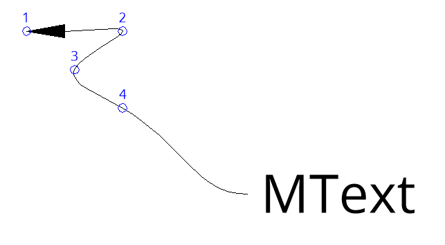
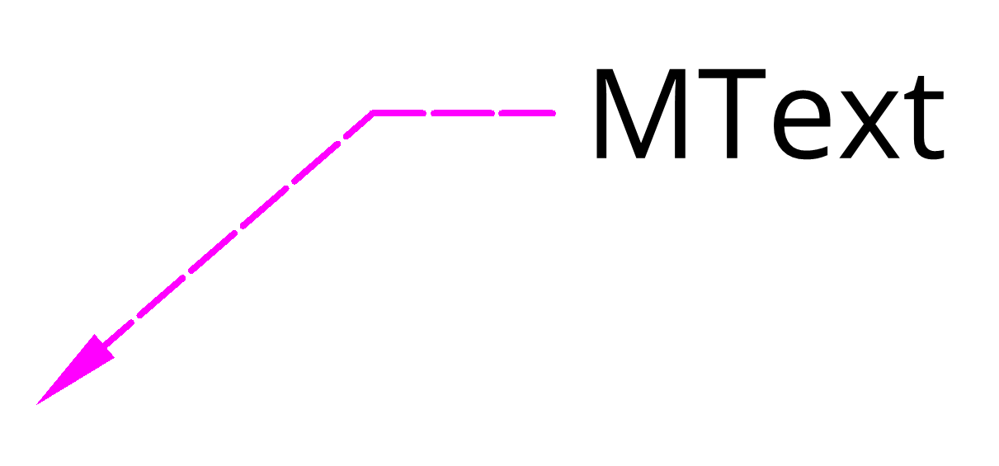
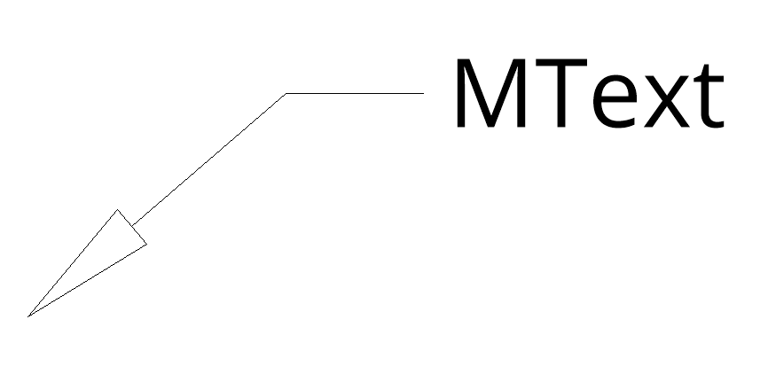

.. _tut_mleader:

Tutorial for MultiLeader
========================

.. versionadded:: 0.18

A multileader object typically consists of an arrowhead, a horizontal landing
(a.k.a. "dogleg"), a leader line or curve, and either a MTEXT object or a BLOCK.

Factory methods of the :class:`~ezdxf.layouts.BaseLayout` class to create new
:class:`~ezdxf.entities.MultiLeader` entities:

    - :meth:`~ezdxf.layouts.BaseLayout.add_multileader_mtext`
    - :meth:`~ezdxf.layouts.BaseLayout.add_multileader_block`

Because of the complexity of the MULTILEADER entity, the factory method
:meth:`~ezdxf.layouts.BaseLayout.add_multileader_mtext` returns a
:class:`~ezdxf.render.MultiLeaderMTextBuilder` instance to build a new entity
and the factory method :meth:`~ezdxf.layouts.BaseLayout.add_multileader_block`
returns a :class:`~ezdxf.render.MultiLeaderBlockBuilder` instance.

Due of the lack of good documentation it's not possible to support all
combinations of MULTILEADER properties with decent quality, so stick to recipes
and hints shown in this tutorial to get usable results otherwise, you will enter
uncharted territory.

The rendering result of the MULTILEADER entity is highly dependent on the CAD
application. The MULTILEADER entity does not have a pre-rendered anonymous
block of DXF primitives like all DIMENSION entities, so results may vary
from CAD application to CAD application. The general support for this entity is
only good in Autodesk products other CAD applications often struggle when
rendering MULTILEADERS, even my preferred testing application BricsCAD has
rendering issues.

.. important::

    MULTILEADER support has flaws in many CAD applications except Autodesk
    products!

.. seealso::

    - :class:`ezdxf.render.MultiLeaderBuilder` classes
    - :class:`ezdxf.entities.MultiLeader` class
    - :class:`ezdxf.entities.MLeaderStyle` class
    - :class:`ezdxf.tools.text.MTextEditor` class
    - :ref:`mleader internals`

MTEXT Quick Draw
----------------

Full Python script: `mtext_quick_leader.py`_

The :meth:`quick_leader()` method of a MTEXT - MULTILEADER entity constructs the
geometry parameters in reverse manner, starting from a given target point:

DXF document setup:

.. literalinclude:: src/mleader/mtext_quick_leader.py
    :lines: 20-25

Draw a red circle to mark the target point:

.. literalinclude:: src/mleader/mtext_quick_leader.py
    :lines: 26-29

Create four horizontal placed MULTILEADER entities pointing at the target point,
the first segment of the leader line is determined by an angle in this example
pointing away from the target point:

.. literalinclude:: src/mleader/mtext_quick_leader.py
    :lines: 31-37

.. image:: gfx/mleader_mtext_quick_leader_0.png

The content is automatically aligned to the end of the leader line. The first
segment is a relative vector to the target point and the optional second segment
vector is relative to the end of the first segment.
The default connection type is horizontal but can be changed to vertical:

A smaller text size is required:

.. literalinclude:: src/mleader/mtext_quick_leader.py
    :lines: 45-47

Adding vertical placed MULTILEADER entities:

.. literalinclude:: src/mleader/mtext_quick_leader.py
    :lines: 53-60

This example already shows the limitation caused by different text renderings in
various CAD applications. The `ezdxf` text measurement by `matplotlib` is
different to AutoCAD and BricsCAD and the result is a misalignment of the
overline and the leader line.

The DXF file shown in BricsCAD:

.. image:: gfx/mleader_mtext_quick_leader_1.png

The same DXF file shown with the :code:`ezdxf view` command (drawing add-on):

.. image:: gfx/mleader_mtext_quick_leader_2.png

My advice is to avoid vertical placed MULTILEADER entities at all and for
horizontal placed MULTILEADER entities avoid styles including an "underline" or
an "overline".

The :meth:`quick_leader` method is not very customizable for ease of use, but
follows the settings of the associated :class:`~ezdxf.entities.MLeaderStyle`.

The following sections show how to have more control when adding MULTILEADER
entities.

Create MTEXT Content
--------------------

Full Python script: `mtext_content.py`_

This section shows how to create a MULTILEADER entity with MTEXT content
the manual way with full control over all settings.

For good results the MTEXT alignment should match the leader connection side,
e.g. if you attach leaders to the left side also align the MTEXT to the left side,
for leaders attached at the right side, align the MTEXT to the right side
and if you attach leaders at both sides one side will fit better than the other
or maybe a center aligned MTEXT is a good solution, for further details see
section `MTEXT Alignment`_.

The first example uses the default connection type of the MLEADERSTYLE
"Standard" which is "middle of the top line" for left and right attached
leaders. The render UCS for this example is the WCS to keep things simple.

Create a new MULTILEADER entity.

.. literalinclude:: src/mleader/mtext_content.py
    :lines: 23

Set MTEXT content, text style and alignment.

.. literalinclude:: src/mleader/mtext_content.py
    :lines: 24-28

Add the first leader on the left side.
The leader points always to the first given vertex and all vertices are given
in render UCS coordinates (= WCS in this example).

.. literalinclude:: src/mleader/mtext_content.py
    :lines: 29

More than one vertex per leader can be used:

.. literalinclude:: src/mleader/mtext_content.py
    :lines: 30-33

The insert point of the :meth:`build` method is the alignment point for the
MTEXT content.

.. literalinclude:: src/mleader/mtext_content.py
    :lines: 34

The "dogleg" settings are defined by the MLEADERSTYLE "Standard".

.. image:: gfx/mleader_mtext_left.png

This example shows a leader attached to the right side and the MTEXT aligned
to the right side.

.. literalinclude:: src/mleader/mtext_content.py
    :lines: 43-50

.. image:: gfx/mleader_mtext_right.png

This example shows two leaders attached to both sides and the MTEXT aligned
to the left side, which shows that the right landing gap (space between text and
start of vertex) is bigger than the gap on the left size. This is due to the
different text size calculations from AutoCAD/BricsCAD and Matplotlib.
The longer the text, the greater the error.

.. literalinclude:: src/mleader/mtext_content.py
    :lines: 59-67

.. image:: gfx/mleader_mtext_left_right_1.png

A centered MTEXT alignment gives a more even result.

.. literalinclude:: src/mleader/mtext_content.py
    :lines: 76-84

.. image:: gfx/mleader_mtext_left_right_2.png

But even this has its disadvantages, the attachment calculation is always based
on the bounding box of the MTEXT content.

.. image:: gfx/mleader_mtext_left_right_3.png

MTEXT Connection Types
~~~~~~~~~~~~~~~~~~~~~~

There are four connection sides defined by the enum
:class:`ezdxf.render.ConnectionSide`:

    - left
    - right
    - top
    - bottom

The MultiLeader entity supports as the name says multiple leader lines, but all
have to have a horizontal (left/right) connection side or a vertical (top/bottom)
connection side, it's not possible to mix left/right and top/bottom connection
sides. This is determined by the DXF format.

There are different connection types available for the horizontal and the
vertical connection sides. All leaders connecting to the same side have the
same connection type. The horizontal connection sides support following
connection types, defined by the enum :class:`ezdxf.render.HorizontalConnection`:

    - by_style
    - top_of_top_line
    - middle_of_top_line
    - middle_of_text
    - middle_of_bottom_line
    - bottom_of_bottom_line
    - bottom_of_bottom_line_underline (not recommended)
    - bottom_of_top_line_underline (not recommended)
    - bottom_of_top_line
    - bottom_of_top_line_underline_all (not recommended)

The vertical connection sides support following connection types, defined by the
enum :class:`ezdxf.render.VerticalConnection`:

    - by_style
    - center
    - center_overline (not recommended)

The connection type for each side can be set by the method
:meth:`~ezdxf.render.MultiLeaderBuilder.set_connection_types`, the default for all
sides is `by_style`:

.. literalinclude:: src/mleader/mtext_content.py
    :lines: 101-104

.. image:: gfx/mleader_mtext_horiz_connection_types.png

.. hint::

    As shown in the quick draw section using connection types including underlines
    or overlines do not render well in AutoCAD/BricsCAD because of the different
    text measurement of `matplotlib`, therefore it's not recommended to use any
    of these connection types when creating MULTILEADERS by `ezdxf`.

MTEXT Alignment
~~~~~~~~~~~~~~~

In contrast to the standalone MTEXT entity supports the MTEXT
content entity only three text alignments defined by the enum
:class:`ezdxf.render.TextAlignment`.

    - left
    - center
    - right

The MTEXT alignment is set as argument `alignment` of the
:meth:`~ezdxf.render.MultiLeaderBuilder.set_content` method and the alignment
point is the insert point of the :meth:`~ezdxf.render.MultiLeaderBuilder.build`
method.

Create BLOCK Content
--------------------

Full Python script: `block_content.py`_

This section shows how to create a MULTILEADER entity with BLOCK content
the manual way with full control over all settings.

The BLOCK content consist of a BLOCK layout and optional ATTDEF entities which
defines the location and DXF attributes of dynamically created ATTRIB entities.

Create the BLOCK content, the full :func:`create_square_block` function
can be found in the `block_content.py`_ script.

.. literalinclude:: src/mleader/block_content.py
    :lines: 71-73

Create the MULTILEADER and set the content:

.. literalinclude:: src/mleader/block_content.py
    :lines: 74-77

Set the BLOCK attribute content as text:

.. literalinclude:: src/mleader/block_content.py
    :lines: 78-79

Add some leader lines to the left and right side of the BLOCK:

Construction plane of the entity is defined by a render UCS.
The leader lines vertices are expected in render UCS coordinates, which
means relative to the UCS origin and this example shows the simple case
where the UCS is the WCS which is also the default setting.

.. literalinclude:: src/mleader/block_content.py
    :lines: 81-84

Last step is to build the final MULTILEADER entity.
This example uses the alignment type `insertion_point` where the insert point of
the :meth:`build` method is the base point of the BLOCK:

.. literalinclude:: src/mleader/block_content.py
    :lines: 86

The result is shown in BricsCAD as expected, although BricsCAD shows
"Center extents" as attachment type in the properties dialog instead of the
correct attachment type "Insertion point".

BLOCK Connection Types
~~~~~~~~~~~~~~~~~~~~~~

There are four connection sides defined by the enum
:class:`ezdxf.render.ConnectionSide`:

    - left
    - right
    - top
    - bottom

The connection point for leader lines is always the center of the side of the
block bounding box the leader is connected to and has the same limitation as
for the MTEXT content, it's not possible to mix the connection sides left/right
and top/bottom.

The connection side is set when adding the leader line by the
:meth:`~ezdxf.render.MultiLeaderBuilder.add_leader_line` method.

Unfortunately BricsCAD has an error in version 22.2.03 and renders all connection
types as left/right, this is top/bottom connection shown in Autodesk TrueView 2022:

The top/bottom connection type does not support the "dogleg" feature.

BLOCK Alignment
~~~~~~~~~~~~~~~

There are two alignments types, defined by the enum :class:`ezdxf.render.BlockAlignment`

    - center_extents
    - insertion_point

The alignment is set by the :meth:`~ezdxf.render.MultiLeaderBlockBuilder.set_content` method.

The alignment type `center_extent` inserts the BLOCK with the center of the
bounding box at the insert point of the :meth:`~ezdxf.render.MultiLeaderBuilder.build`
method. The insert point is (5, 2) in this example:

The same MULTILEADER with alignment type `insert_point`:

BLOCK Scaling
~~~~~~~~~~~~~

The BLOCK content can be scaled independently from the overall scaling of the
MULTILEADER entity:

The block scaling factor is set by the :meth:`~ezdxf.render.MultiLeaderBlockBuilder.set_content` method::

    ml_builder.set_content(
        name=block.name, scale=2.0, alignment=mleader.BlockAlignment.center_extents
    )

This is the first example with a block scaling factor of 2. The BLOCK and the
attached ATTRIB entities are scaled but not the arrows.

BLOCK Rotation
~~~~~~~~~~~~~~

The rotation around the render UCS z-axis in degrees is applied by the
:meth:`~ezdxf.render.MultiLeaderBuilder.build` method::

    ml_builder.build(insert=Vec2(5, 2), rotation=30)

This is the first example with a rotation of 30 degrees. The BLOCK, the
attached ATTRIB entities and the last connection lines ("dogleg") are rotated.

BLOCK Attributes
~~~~~~~~~~~~~~~~

BLOCK attributes are defined as ATTDEF entities in the BLOCK layout. This
ATTDEF entities will be replaced by ATTRIB entities at the rendering process
of the CAD application.
Only the text content and the text width factor can be changed for each
MULTILEADER entity individually by the :meth:`~ezdxf.render.MultiLeaderBlockBuilder.set_attribute`
method. The ATTDEF is addressed by it's DXF `tag` attribute::

    ml_builder.set_attribute("ONE", "Data1")
    ml_builder.set_attribute("TWO", "Data2")

Leader Properties
-----------------

"Dogleg" Properties
~~~~~~~~~~~~~~~~~~~

The "dogleg" is the last line segment from the last leader vertex
to the MULTILEADER content for polyline leaders.

The length of the dogleg and the landing gap size is set by the
:meth:`~ezdxf.render.MultiLeaderBuilder.set_connection_properties`.

Polyline Leader
~~~~~~~~~~~~~~~

A polygon leader line has only straight line segments and is added by the
:meth:`~ezdxf.render.MultiLeaderBuilder.add_leader_line`::

    ml_builder.add_leader_line(
        mleader.ConnectionSide.left,
        [Vec2(-20, 15), Vec2(-10, 15), Vec2(-15, 11), Vec2(-10, 7)],
    )

All leader line vertices have render UCS coordinates and the start- and
end-vertex of the "dogleg" is calculated automatically.

Spline Leader
~~~~~~~~~~~~~

A spline leader line has a single curved line as leader line and is also
added by the :meth:`~ezdxf.render.MultiLeaderBuilder.add_leader_line`.
This is spline leader has the same vertices as the previous created polyline
leader::

    ml_builder.set_leader_properties(leader_type=mleader.LeaderType.splines)
    ml_builder.add_leader_line(
        mleader.ConnectionSide.left,
        [Vec2(-20, 15), Vec2(-10, 15), Vec2(-15, 11), Vec2(-10, 7)],
    )

Spline leader and polyline leader can not be mixed in a single MULTILEADER
entity.

The leader type is set by the :meth:`~ezdxf.render.MultiLeaderBuilder.set_leader_properties`
method.

The :class:`~ezdxf.render.LeaderType` enum:

    - none
    - straight_lines
    - splines

Line Styling
~~~~~~~~~~~~

The leader color linetype and lineweight is set by the
:meth:`~ezdxf.render.MultiLeaderBuilder.set_leader_properties` method::

    ml_builder.set_leader_properties(
        color=colors.MAGENTA,
        linetype="DASHEDX2",
        lineweight=70,
    )

All leader lines have the same properties.

Arrowheads
~~~~~~~~~~

The arrow head is set by the :meth:`~ezdxf.render.MultiLeaderBuilder.set_arrow_properties`
method::

    from ezdxf.render import ARROWS
    ml_builder.set_arrow_properties(name=ARROWS.closed_blank, size=8.0)

All leader lines have the same arrow head and size.
The available arrow heads are defined in the :attr:`~ezdxf.render.arrows.ARROWS`
object.

Overall Scaling
---------------

The overall scaling has to be applied by the
:meth:`~ezdxf.render.MultiLeaderBuilder.set_overall_scaling` method
and scales the MTEXT or BLOCK content **and** the arrows.

Setup MLEADERSTYLE
------------------

The :class:`~ezdxf.entities.MLeaderStyle` stores many of the MULTILEADER
settings but most of them are copied to the MULTILINE entity at initialization.
So changing the MLEADERSTYLE style afterwards has little to no effect for
existing MULTILEADER entities.

Create a new MLEADERSTYLE called "MY_STYLE" and set the MTEXT style to "OpenSans"::

    my_style = doc.mleader_styles.duplicate_entry("Standard", "MY_STYLE")
    my_style.set_mtext_style("OpenSans")

The style for a MULTILEADER is set at the :meth:`~ezdxf.layouts.BaseLayout.add_multileader_mtext`
and :meth:`~ezdxf.layouts.BaseLayout.add_multileader_block` factory methods.

.. _mtext_quick_leader.py: https://github.com/mozman/ezdxf/blob/master/docs/source/tutorials/src/mleader/mtext_quick_leader.py
.. _mtext_content.py: https://github.com/mozman/ezdxf/blob/master/docs/source/tutorials/src/mleader/mtext_content.py
.. _block_content.py: https://github.com/mozman/ezdxf/blob/master/docs/source/tutorials/src/mleader/block_content.py